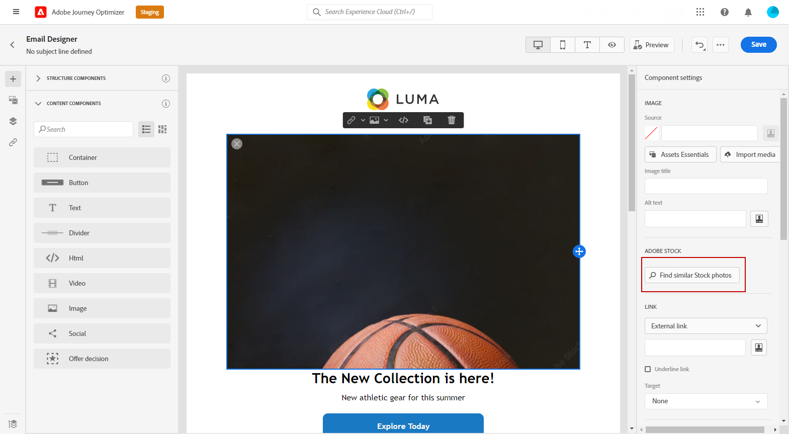
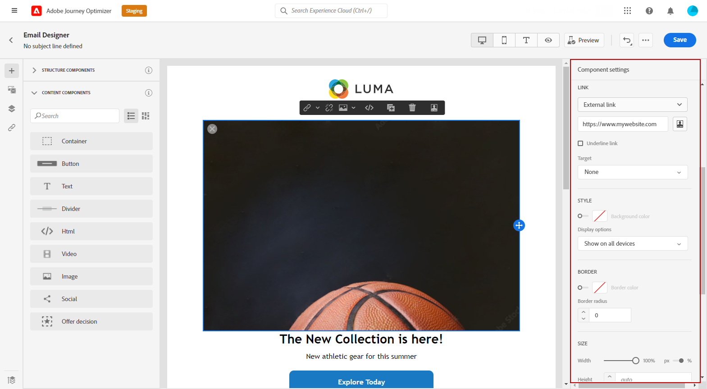

# Administrar [!DNL Adobe Stock] imágenes {#stock}

## Introducción a [!DNL Adobe Stock] {#get-started-stock}

[!DNL Adobe Stock] proporciona acceso a millones de fotos, vídeos, ilustraciones y gráficos vectoriales de alta calidad, depurados y libres de derechos de autor. Puede elegir adquirir un paquete de crédito para obtener la licencia de los activos o comprar una licencia Standard o Extended para el activo necesario. Adobe Stock también ofrece una recopilación gratuita de recursos.

Para obtener más información, consulte [!DNL Adobe Stock], consulte [Introducción a Adobe Stock](https://helpx.adobe.com/stock/get-started.html).

con [!DNL Adobe Journey Optimizer], puede cargar imágenes en los correos electrónicos directamente desde [!DNL Adobe Stock] y agréguelo a la carpeta Assets. La variable **[!UICONTROL Find Similar Image]** le ayudará a encontrar imágenes que coincidan con el contenido, el color y la composición del recurso utilizado en su envío.
[Más información sobre el diseño de correo electrónico](design-emails.md).

## Insertar e importar [!DNL Adobe Stock] imágenes {#add-stock-image}

>[!NOTE]
>
> La variable **[!UICONTROL Find Adobe Stock photos]** solo estará disponible para los usuarios con acceso a un perfil de producto de AEM Assets Essentials. Para obtener más información, consulte [Documentación esencial de Assets](https://experienceleague.adobe.com/docs/experience-manager-assets-essentials/help/get-started-admins/deploy-administer.html#add-users-to-essentials).

Después de editar y personalizar el correo electrónico, puede añadir imágenes desde [!DNL Adobe Stock] a la plantilla:

1. Arrastrar y soltar una imagen **[!UICONTROL Content components]** a su correo electrónico.

   

1. En el **[!UICONTROL Component settings]** seleccione **[!UICONTROL Find Adobe Stock photos]**.

   

1. Busque en la biblioteca o escriba el término de búsqueda en el campo . Seleccione la imagen elegida y haga clic en **[!UICONTROL Save]**.

   

1. Para obtener la licencia y descargar la imagen, seleccione la imagen **[!UICONTROL Content components]** y haga clic en **[!UICONTROL License Adobe Stock image]**. Se le redirigirá al [!DNL Adobe Stock] sitio web.

   >[!NOTE]
   > Si la imagen ya tiene licencia, estará representada por la variable  icono. En ese caso, puede pasar al paso 7.

   

1. En el [!DNL Adobe Stock] en el sitio web, deberá adquirir el recurso para poder descargar la imagen y eliminar la marca de agua.

   Esta compra dependerá de su plan o suscripción a Adobe Stock. Tenga en cuenta que si tiene varias cuentas de Adobe Stock, se le redirigirá al último ID de stock que usó. En este caso, asegúrese de haber iniciado sesión en la cuenta correcta antes de conceder licencias a su recurso.
Para obtener más información, consulte esta [página](https://stock.adobe.com/plans).

   >[!WARNING]
   > Si se envía un correo electrónico que incluye una imagen sin licencia, la imagen conservará su formulario sin licencia con la marca de agua.

   

1. Una vez finalizada la compra, ahora puede volver al correo electrónico en [!DNL Adobe Journey Optimizer] y seleccione **[!UICONTROL Import stock image]** para importar la imagen con licencia a los recursos.

   

1. Seleccione en qué carpeta se almacenará el recurso. Para obtener más información, consulte [!DNL Assets Essentials], consulte esta [página](assets-essentials.md#get-started-assets-essentials).

   

1. Después de seleccionar la imagen de [!DNL Adobe Stock], use el **[!UICONTROL Find similar Stock photos]** para localizar los recursos que coincidan con el contenido, el color y la composición de una imagen.

   Tenga en cuenta que esta opción está disponible para imágenes e imágenes de Stock con licencia/sin licencia de la carpeta Assets.

   

1. Personalice aún más la imagen con el **[!UICONTROL Components settings]** para abrir el Navegador. [Obtenga más información sobre la configuración de componentes](content-components.md)

   

Una vez creado y personalizado el mensaje, puede publicarlo para que esté disponible para la ejecución. [Más información](../messages/publish-manage-message.md)
