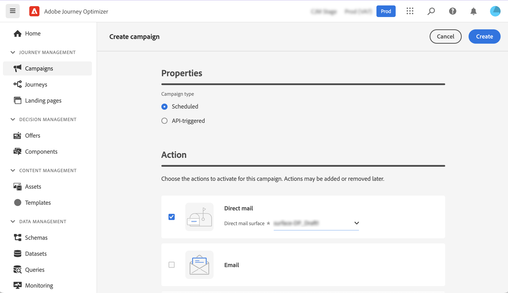
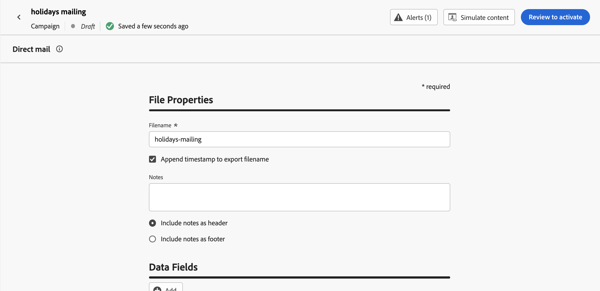

# Crear un mensaje de correo directo {#create-direct}

>[!CONTEXTUALHELP]
>id="ajo_direct_mail"
>title="Creación de correo directo"
>abstract="Cree mensajes de correo directo en campañas programadas y diseñe los archivos de extracción necesarios para que los proveedores de correo directo envíen correos a sus clientes."

Para crear mensajes de correo postal, cree una campaña programada y configure el archivo de extracción. Los proveedores de correo postal requieren este archivo para enviar correo a sus clientes.

>[!IMPORTANT]
>
>Antes de crear un mensaje de correo postal, asegúrese de haber configurado:
>
>1. Una [configuración de enrutamiento de archivos](../direct-mail/direct-mail-configuration.md#file-routing-configuration) que especifica el servidor donde se debe cargar y almacenar el archivo de extracción,
>1. Una [configuración de mensaje de correo postal](../direct-mail/direct-mail-configuration.md#direct-mail-surface) que hará referencia a la configuración de enrutamiento de archivos.

## Creación de una campaña de correo directo{#create-dm-campaign}

>[!AVAILABILITY]
>
>El correo postal admite la funcionalidad de Holdout, pero actualmente no admite Tratamientos.

Para crear una campaña de correo postal, siga estos pasos:

1. Acceda al menú **[!UICONTROL Campañas]** y haga clic en **[!UICONTROL Crear campaña]**.

1. Seleccione el tipo de campaña que desea ejecutar

   * **Programado - Marketing**: ejecute la campaña inmediatamente o en una fecha especificada. Las campañas programadas están destinadas a enviar mensajes de marketing. Se configuran y ejecutan desde la interfaz de usuario de.

   * **Activado por API - Marketing/Transaccional**: ejecute la campaña mediante una llamada de API. Las campañas activadas por API están destinadas a enviar mensajes de marketing o transaccionales, es decir, mensajes enviados después de una acción realizada por un individuo: restablecimiento de contraseña, compra en el carro de compras, etc.

1. En la sección **[!UICONTROL Propiedades]**, edite el **[!UICONTROL Título]** y la **[!UICONTROL Descripción]** de su campaña.

1. Para definir la audiencia de destino, haga clic en el botón **[!UICONTROL Seleccionar audiencia]** y elija entre las audiencias de Adobe Experience Platform disponibles. [Más información](../audience/about-audiences.md).

   >[!IMPORTANT]
   >
   >Por ahora, la selección de audiencias está restringida a 3 millones de perfiles. Esta limitación se puede eliminar si se lo solicita su representante de Adobe.

1. En el campo **[!UICONTROL Área de nombres de identidad]**, seleccione el área de nombres adecuada para identificar a los individuos dentro de la audiencia elegida. [Más información](../event/about-creating.md#select-the-namespace).

1. En la sección **[!UICONTROL Acciones]**, elija **[!UICONTROL Correo directo]**.

1. Seleccione o cree una **[!UICONTROL configuración de correo directo]** para usar. [Aprenda a crear una configuración de correo postal](direct-mail-configuration.md#direct-mail-surface).

   {width="800" align="center"}

1. Las campañas se pueden programar para una fecha específica o configurarse para que se repitan a intervalos regulares. Aprenda a configurar la **[!UICONTROL programación]** de su campaña en [esta sección](../campaigns/campaign-schedule.md).

Ahora puede empezar a configurar el archivo de extracción para enviarlo a su proveedor de correo postal.

## Configuración del archivo de extracción {#extraction-file}

>[!CONTEXTUALHELP]
>id="ajo_direct_mail_data_fields"
>title="Campos de datos"
>abstract="Añada y configure las columnas y la información que desea mostrar en el archivo de extracción requerido por los proveedores de correo directo para enviar correo a sus clientes. Se pueden agregar hasta 50 columnas."

>[!CONTEXTUALHELP]
>id="ajo_direct_mail_formatting"
>title="Formato del archivo de extracción"
>abstract="Para cada campo, especifique una etiqueta y la información que desea mostrar con el editor de personalización.    La opción <b>Ordenar por</b> permite utilizar el campo seleccionado para ordenar las columnas del archivo de extracción."

Los proveedores de correo postal requieren el archivo de extracción para enviar correo a sus clientes. Para definir la configuración del archivo de extracción, siga estos pasos:

1. En la pantalla de configuración de la campaña, haga clic en el botón **[!UICONTROL Editar contenido]** para configurar el contenido del archivo de extracción.

1. Ajuste las propiedades del archivo de extracción:

   1. En el campo **[!UICONTROL Nombre de archivo]**, especifique un nombre para el archivo de extracción.

      >[!NOTE]
      >
      >De forma predeterminada, el archivo se escribe en el directorio raíz del servidor. El campo **[!UICONTROL Filename]** también acepta el formato &quot;/your/path/here/Filename.csv&quot;, donde la ruta especificada es el directorio de destino en el servidor seleccionado. <!--TBC if for SFTP and Azure only, or for all servers including S3-->

   1. De manera opcional, habilite la opción **[!UICONTROL Anexar marca de tiempo para exportar el nombre de archivo]** si desea agregar una marca de tiempo automática al nombre de archivo especificado.

   1. A veces quizá deba añadir información al principio o al final del archivo de extracción. Para ello, use el campo **[!UICONTROL Notas]** y después especifique si desea incluir la nota como encabezado o pie de página.

      {width="800" align="center"}

1. Configure las columnas y la información que desea mostrar en el archivo de extracción:

   1. Haga clic en el botón **[!UICONTROL Agregar]** para crear una columna nueva.

   1. El panel **[!UICONTROL Formato]** se muestra en el lado derecho, lo que le permite configurar la columna seleccionada. Especifique una **[!UICONTROL Etiqueta]** para la columna.

   1. En el campo **[!UICONTROL Datos]**, seleccione los atributos de perfil que desea mostrar con el [editor de personalización](../personalization/personalization-build-expressions.md).

   1. Para ordenar el archivo de extracción mediante una columna, seleccione la columna y active la opción **[!UICONTROL Ordenar por]**. El icono **[!UICONTROL Ordenar por]** aparece junto a la etiqueta de la columna en la sección **[!UICONTROL Campos de datos]**.

      {width="800" align="center"}

   1. Repita estos pasos para agregar tantas columnas como sea necesario para el archivo de extracción. Tenga en cuenta que puede añadir hasta 50 columnas.

      Para cambiar la posición de una columna, arrástrela y suéltela en la ubicación deseada en la sección **[!UICONTROL Campo de datos]**. Para eliminar una columna, selecciónela y haga clic en el botón **[!UICONTROL Quitar]** en el panel **[!UICONTROL Formato]**.

Ahora puede probar el mensaje de correo postal y enviarlo a su audiencia. [Aprenda a probar y enviar mensajes de correo postal](test-send-direct-mail.md)

