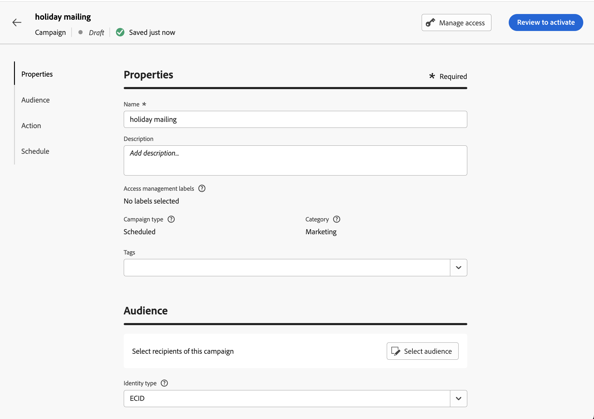

# Crear un mensaje de correo directo {#create-direct}

>[!CONTEXTUALHELP]
>id="ajo_direct_mail"
>title="Creación de correo directo"
>abstract="Cree mensajes de correo directo en campañas programadas y diseñe los archivos de extracción necesarios para que los proveedores de correo directo envíen correos a sus clientes."

Para crear mensajes de correo postal, cree una campaña programada y configure el archivo de extracción. Los proveedores de correo postal requieren este archivo para enviar correo a sus clientes.

>[!IMPORTANT]
>
>Antes de crear un mensaje de correo postal, asegúrese de haber configurado:
>
>1. A [configuración de enrutamiento de archivos](../direct-mail/direct-mail-configuration.md#file-routing-configuration) que especifica el servidor en el que se debe cargar y almacenar el archivo de extracción,
>1. A [superficie de mensaje de correo directo](../direct-mail/direct-mail-configuration.md#direct-mail-surface) que hará referencia a la configuración de enrutamiento de archivos.

## Creación de una campaña de correo directo{#create-dm-campaign}

Para crear una campaña de correo postal, siga estos pasos:

1. Cree una nueva campaña programada y elija **[!UICONTROL Correo directo]** como la acción.

1. Seleccione el **[!UICONTROL Superficie de correo directo]** para usar y haga clic en **[!UICONTROL Crear]**. [Obtenga información sobre cómo crear una superficie de correo postal](direct-mail-configuration.md#direct-mail-surface).

   {width="800" align="center"}

1. En el **[!UICONTROL Propiedades]** , edite el de la campaña **[!UICONTROL Título]** y **[!UICONTROL Descripción]**.

1. Para definir la audiencia de destino, haga clic en **[!UICONTROL Seleccionar audiencia]** y elija entre las audiencias de Adobe Experience Platform disponibles. [Más información](../audience/about-audiences.md).

   >[!IMPORTANT]
   >
   >Por ahora, la selección de audiencias está restringida a 3 millones de perfiles. Esta limitación puede levantarse si se solicita al representante del Adobe.

1. En el **[!UICONTROL Área de nombres de identidad]** , seleccione el área de nombres adecuada para identificar a los individuos dentro de la audiencia elegida. [Más información](../event/about-creating.md#select-the-namespace).

   {width="800" align="center"}

1. Las campañas se pueden programar para una fecha específica o configurarse para que se repitan a intervalos regulares. Obtenga información sobre cómo configurar el **[!UICONTROL Programación]** de la campaña en [esta sección](../campaigns/create-campaign.md#schedule).

Ahora puede empezar a configurar el archivo de extracción para enviarlo a su proveedor de correo postal.

## Configuración del archivo de extracción {#extraction-file}

>[!CONTEXTUALHELP]
>id="ajo_direct_mail_data_fields"
>title="Campos de datos"
>abstract="Añada y configure las columnas y la información que desea mostrar en el archivo de extracción requerido por los proveedores de correo postal para enviar correo a sus clientes. Se pueden agregar hasta 50 columnas."

>[!CONTEXTUALHELP]
>id="ajo_direct_mail_formatting"
>title="Formato del archivo de extracción"
>abstract="Para cada campo, especifique una etiqueta y la información que desea mostrar con el Editor de expresiones.    La opción <b>Ordenar por</b> permite utilizar el campo seleccionado para ordenar las columnas del archivo de extracción."

1. Configure las columnas y la información que desea mostrar en el archivo de extracción:

   1. Haga clic en **[!UICONTROL Añadir]** para crear una nueva columna.

   1. El **[!UICONTROL Formato]** Este panel se muestra en el lado derecho, lo que le permite configurar la columna seleccionada. Especifique un **[!UICONTROL Etiqueta]** para la columna.

   1. En el **[!UICONTROL Datos]** , seleccione los atributos de perfil que desea mostrar mediante el campo [Editor de expresiones](../personalization/personalization-build-expressions.md).

   1. Para ordenar el archivo de extracción mediante una columna, seleccione la columna y active la casilla de verificación **[!UICONTROL Ordenar por]** opción. El **[!UICONTROL Ordenar por]** aparece junto a la etiqueta de la columna en la **[!UICONTROL Campos de datos]** sección.

Los proveedores de correo postal requieren el archivo de extracción para enviar correo a sus clientes. Para definir la configuración del archivo de extracción, siga estos pasos:

1. En la pantalla de configuración de la campaña, haga clic en **[!UICONTROL Editar contenido]** para configurar el contenido del archivo de extracción.

1. Ajuste las propiedades del archivo de extracción:

   1. Especifique el **[!UICONTROL Nombre de archivo]** para el archivo de extracción.

   1. Si lo desea, habilite **[!UICONTROL Anexar marca de tiempo al nombre del archivo de exportación]** si desea agregar una marca de tiempo automática al nombre de archivo especificado.

   1. A veces quizá deba añadir información al principio o al final del archivo de extracción. Para ello, utilice el **[!UICONTROL Notas]** y especifique si desea incluir la nota como encabezado o pie de página.

      {width="800" align="center"}

1. Configure las columnas y la información que desea mostrar en el archivo de extracción:

   1. Haga clic en **[!UICONTROL Añadir]** para crear una nueva columna.

   1. El **[!UICONTROL Formato]** Este panel se muestra en el lado derecho, lo que le permite configurar la columna seleccionada. Especifique un **[!UICONTROL Etiqueta]** para la columna.

   1. En el **[!UICONTROL Datos]** , seleccione los atributos de perfil que desea mostrar mediante el campo [Editor de expresiones](../personalization/personalization-build-expressions.md).

   1. Para ordenar el archivo de extracción mediante una columna, seleccione la columna y active la casilla de verificación **[!UICONTROL Ordenar por]** opción. El **[!UICONTROL Ordenar por]** aparece junto a la etiqueta de la columna en la **[!UICONTROL Campos de datos]** sección.

      {width="800" align="center"}

   1. Repita estos pasos para agregar tantas columnas como sea necesario para el archivo de extracción. Tenga en cuenta que puede añadir hasta 50 columnas.

      Para cambiar la posición de una columna, arrástrela y suéltela en la ubicación deseada en la **[!UICONTROL Campo de datos]** sección. Para eliminar una columna, selecciónela y haga clic en **[!UICONTROL Eliminar]** botón en el **[!UICONTROL Formato]** panel.

Ahora puede probar el mensaje de correo postal y enviarlo a su audiencia. [Obtenga información sobre cómo probar y enviar mensajes de correo directo](test-send-direct-mail.md)
