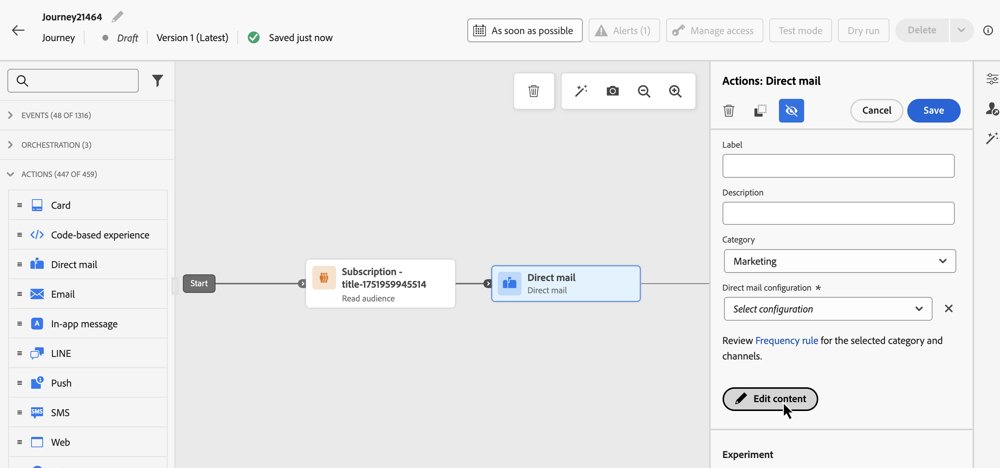
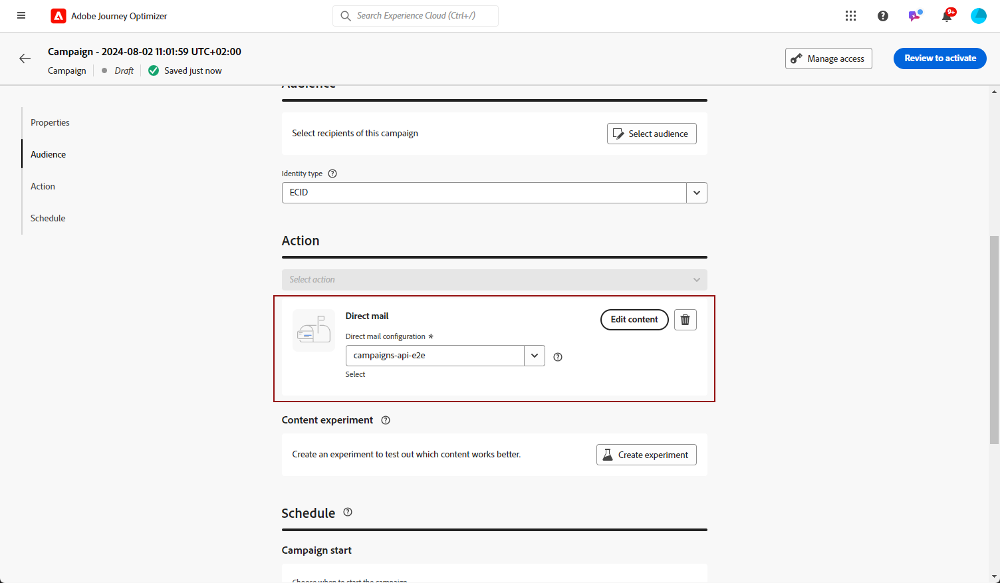

# Crear un mensaje de correo directo {#create-direct}

>[!CONTEXTUALHELP]
>id="ajo_direct_mail"
>title="Creación de correo directo"
>abstract="Cree mensajes de correo directo en campañas y recorridos programados y diseñe los archivos de extracción que necesitan los proveedores de correo directo para enviar correo a sus clientes."

>[!CONTEXTUALHELP]
>id="ajo_journey_direct_mail"
>title="Actividad Finalizar"
>abstract="El correo directo es un canal sin conexión que le permite personalizar y generar los archivos de extracción necesarios para que los proveedores de correo postal de terceros envíen correo a sus clientes."

Para crear mensajes de correo postal, cree una campaña programada o un recorrido y configure el archivo de extracción. Los proveedores de correo postal requieren este archivo para enviar correo a sus clientes.

>[!IMPORTANT]
>
>Antes de crear un mensaje de correo postal, asegúrese de haber configurado:
>
>1. Una [configuración de enrutamiento de archivos](../direct-mail/direct-mail-configuration.md#file-routing-configuration) que especifica el servidor donde se debe cargar y almacenar el archivo de extracción,
>1. Una [configuración de mensaje de correo postal](../direct-mail/direct-mail-configuration.md#direct-mail-surface) que hará referencia a la configuración de enrutamiento de archivos.

## Añadir un mensaje de correo directo {#create-dm-campaign}

Examine las pestañas siguientes para aprender a añadir un mensaje de correo postal en una campaña o un recorrido.

>[!BEGINTABS]

>[!TAB Agregar un mensaje de correo postal a un Recorrido]

1. Abra el recorrido y arrastre y suelte una actividad **[!UICONTROL Correo postal]** desde la sección **Acciones** de la paleta.

1. Proporcione información básica sobre el mensaje (etiqueta, descripción, categoría) y, a continuación, elija la configuración de mensaje que desea utilizar. El campo **[!UICONTROL configuration]** está rellenado previamente de forma predeterminada con la última configuración que el usuario usó para ese canal. Para obtener más información sobre cómo configurar un recorrido, consulte [esta página](../building-journeys/journey-gs.md).

1. Configure el archivo de extracción para enviarlo a su proveedor de correo postal. Para ello, haga clic en el botón **[!UICONTROL Editar contenido]**.

   

1. Ajuste las propiedades del archivo de extracción, como el nombre del archivo o las columnas que desea mostrar. Para obtener más información sobre cómo configurar las propiedades del archivo de extracción, consulte esta sección: [Crear un mensaje de correo postal](../direct-mail/create-direct-mail.md#extraction-file).

   

1. Una vez definido el contenido del archivo de extracción, previsualícelo con **[!UICONTROL Simular contenido]**. [Obtenga información sobre cómo obtener una vista previa y probar contenido](../content-management/preview-test.md)

   {width="800" align="center"}

Cuando el archivo de extracción esté listo, complete la configuración de su [recorrido](../building-journeys/journey-gs.md) para enviarlo.

>[!TAB Agregar un mensaje de correo directo a una campaña]

1. Acceda al menú **[!UICONTROL Campañas]** y haga clic en **[!UICONTROL Crear campaña]**.

1. Seleccione el tipo de campaña **Programada - Marketing**.

1. En la sección **[!UICONTROL Propiedades]**, edite el **[!UICONTROL Título]** y la **[!UICONTROL Descripción]** de su campaña.

1. Para definir la audiencia de destino, haga clic en el botón **[!UICONTROL Seleccionar audiencia]** y elija entre las audiencias de Adobe Experience Platform disponibles. [Más información](../audience/about-audiences.md).

   >[!IMPORTANT]
   >
   >Por ahora, la selección de audiencias está restringida a 3 millones de perfiles. Esta limitación se puede eliminar si se lo solicita su representante de Adobe.

1. En el campo **[!UICONTROL Área de nombres de identidad]**, seleccione el área de nombres adecuada para identificar a los individuos dentro de la audiencia elegida. [Más información](../event/about-creating.md#select-the-namespace).

1. En la sección **[!UICONTROL Acciones]**, elija **[!UICONTROL Correo directo]**.

1. Seleccione o cree una **[!UICONTROL configuración de correo directo]** para usar. [Aprenda a crear una configuración de correo postal](direct-mail-configuration.md#direct-mail-surface).

   {width="800" align="center"}

   >[!AVAILABILITY]
   >
   >El correo postal admite la funcionalidad **Holdout**, pero actualmente no admite **Tratamientos**. [Aprenda a trabajar con experimentos](../content-management/get-started-experiment.md)

1. Las campañas se pueden programar para una fecha específica o configurarse para que se repitan a intervalos regulares. Aprenda a configurar la **[!UICONTROL programación]** de su campaña en [esta sección](../campaigns/campaign-schedule.md).

Ahora puede empezar a configurar el archivo de extracción para enviarlo a su proveedor de correo postal.

>[!ENDTABS]

## Configuración del archivo de extracción {#extraction-file}

>[!CONTEXTUALHELP]
>id="ajo_direct_mail_data_fields"
>title="Campos de datos"
>abstract="Añada y configure las columnas y la información que desea mostrar en el archivo de extracción requerido por los proveedores de correo directo para enviar correo a sus clientes. Se pueden agregar hasta 50 columnas."

>[!CONTEXTUALHELP]
>id="ajo_direct_mail_formatting"
>title="Formato del archivo de extracción"
>abstract="Para cada campo, especifique una etiqueta y la información que desea mostrar con el editor de personalización.    La opción <b>Ordenar por</b> permite utilizar el campo seleccionado para ordenar las columnas del archivo de extracción."

Los proveedores de correo postal requieren el archivo de extracción para enviar correo a sus clientes. Para definir la configuración del archivo de extracción, siga estos pasos:

1. En la pantalla de configuración de la campaña o el recorrido, haga clic en el botón **[!UICONTROL Editar contenido]** para configurar el contenido del archivo de extracción.

1. Para agregar directivas de decisión al mensaje de correo postal, seleccione una columna en la sección **[!UICONTROL Campos de datos]** y abra el editor de personalización utilizando el icono . Vaya al menú **[!UICONTROL Políticas de decisión]** para crear e insertar una política de decisión. A continuación, puede utilizar atributos de elemento de decisión como datos de columna en el archivo de extracción.

   >[!AVAILABILITY]
   >
   >Experience Decisioning en correo postal es una nueva funcionalidad. Anteriormente, los archivos de extracción de correo postal no podían utilizar el motor de toma de decisiones; ahora puede agregar directivas de decisión e incluir atributos de elementos de decisión como datos de columna en la exportación.

   [Aprenda a agregar una directiva de decisión en el correo postal](../experience-decisioning/create-decision-policy.md#add). Para ver ejemplos y flujos de trabajo de toma de decisiones por lotes (correo postal personalizado o exportación a sistemas descendentes), consulte [Toma de decisiones por lotes en correo postal](../experience-decisioning/batch-decisioning-direct-mail.md).

1. Ajuste las propiedades del archivo de extracción:

   1. En el campo **[!UICONTROL Nombre de archivo]**, especifique un nombre para el archivo de extracción.

      >[!NOTE]
      >
      >De forma predeterminada, el archivo se escribe en el directorio raíz del servidor. El campo **[!UICONTROL Filename]** también acepta el formato &quot;/your/path/here/Filename.csv&quot;, donde la ruta especificada es el directorio de destino en el servidor seleccionado. <!--TBC if for SFTP and Azure only, or for all servers including S3-->

   1. De manera opcional, habilite la opción **[!UICONTROL Anexar marca de tiempo para exportar el nombre de archivo]** si desea agregar una marca de tiempo automática al nombre de archivo especificado.

   1. A veces quizá deba añadir información al principio o al final del archivo de extracción. Para ello, use el campo **[!UICONTROL Notas]** y después especifique si desea incluir la nota como encabezado o pie de página.

      {width="800" align="center"}

1. Configure las columnas y la información que desea mostrar en el archivo de extracción:

   1. Haga clic en el botón **[!UICONTROL Agregar]** para crear una columna nueva.

   1. El panel **[!UICONTROL Formato]** se muestra en el lado derecho, lo que le permite configurar la columna seleccionada. Especifique una **[!UICONTROL Etiqueta]** para la columna.

   1. En el campo **[!UICONTROL Datos]**, seleccione los atributos de perfil que desea mostrar con el [editor de personalización](../personalization/personalization-build-expressions.md).

   1. Para ordenar el archivo de extracción mediante una columna, seleccione la columna y active la opción **[!UICONTROL Ordenar por]**. El icono **[!UICONTROL Ordenar por]** aparece junto a la etiqueta de la columna en la sección **[!UICONTROL Campos de datos]**.

      {width="800" align="center"}

   1. Repita estos pasos para agregar tantas columnas como sea necesario para el archivo de extracción. Tenga en cuenta que puede añadir hasta 50 columnas.

      Para cambiar la posición de una columna, arrástrela y suéltela en la ubicación deseada en la sección **[!UICONTROL Campo de datos]**. Para eliminar una columna, selecciónela y haga clic en el botón **[!UICONTROL Quitar]** en el panel **[!UICONTROL Formato]**.

Ahora puede probar el mensaje de correo postal y enviarlo a su audiencia. [Aprenda a probar y enviar mensajes de correo postal](test-send-direct-mail.md)

## Temas relacionados {#related-topics}

* [Introducción al correo directo](get-started-direct-mail.md)
* [Configuración del canal de correo directo](direct-mail-configuration.md)
* [Prueba y envío de correo postal](test-send-direct-mail.md)
* [Previsualización y prueba de contenido](../content-management/preview-test.md)

Si tiene preguntas comunes acerca del correo postal, consulte [Introducción al correo postal](get-started-direct-mail.md).
