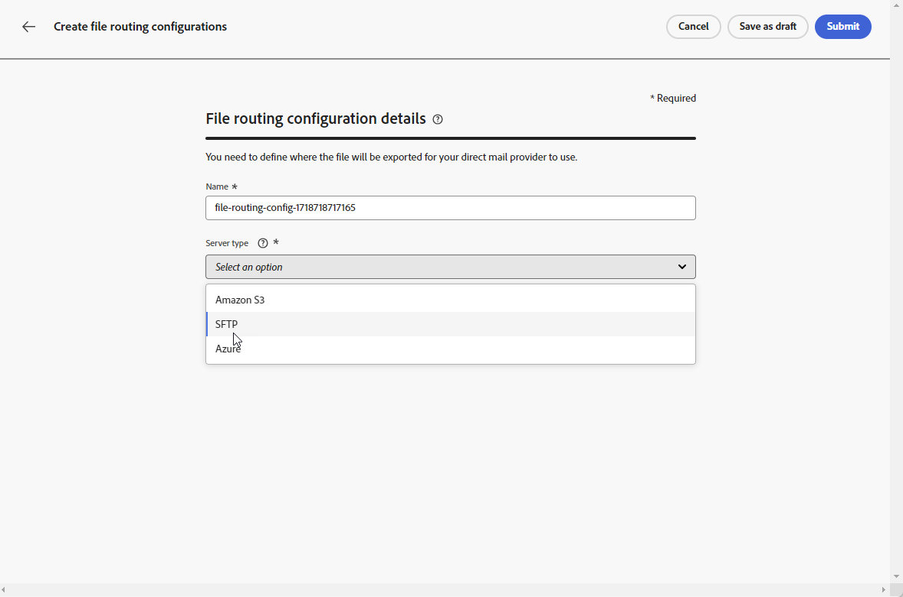
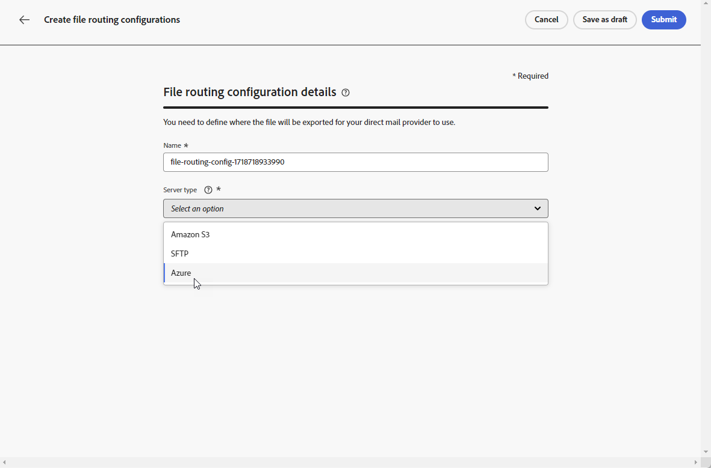

# Configuración de correo directo {#direct-mail-configuration}

[!DNL Journey Optimizer] le permite personalizar y generar los archivos necesarios para que los proveedores de correo postal envíen correo a sus clientes.

Al [crear un mensaje de correo postal](../direct-mail/create-direct-mail.md), usted define los datos de la audiencia de destino, incluida la información de contacto elegida (por ejemplo, la dirección postal). A continuación, se genera y exporta automáticamente un archivo que contiene estos datos a un servidor, donde su proveedor de correo postal podrá recuperarlo y encargarse del envío real.

Antes de poder generar este archivo, debe crear lo siguiente:

1. Una [configuración de enrutamiento de archivos](#file-routing-configuration) para especificar el servidor donde se exportará el archivo y cifrar el archivo, si es necesario.

   >[!CAUTION]
   >
   >Para crear una configuración de enrutamiento de archivos, necesita tener el permiso integrado **[!DNL Manage file routing]**. [Más información](../administration/ootb-product-profiles.md#content-library-manager).

1. Una [configuración de correo postal](#direct-mail-configuration) que hará referencia a la configuración de enrutamiento de archivos. Si no ha configurado ninguna opción de enrutamiento de archivos, no podrá crear una configuración de correo postal.

## Configurar el enrutamiento de archivos {#file-routing-configuration}

>[!CONTEXTUALHELP]
>id="ajo_dm_file_routing_details"
>title="Definir la configuración de enrutamiento de archivos"
>abstract="Después de crear un mensaje de correo directo, el archivo que contiene los datos de audiencia de destino se genera y exporta a un servidor. Debe especificar los detalles del servidor para que su proveedor de correo directo pueda acceder y utilizar ese archivo para enviar correo directo."
>additional-url="https://experienceleague.adobe.com/docs/journey-optimizer/using/direct-mail/create-direct-mail.html?lang=es" text="Crear un mensaje de correo directo"

>[!CONTEXTUALHELP]
>id="ajo_dm_file_routing_details_header"
>title="Definir la configuración de enrutamiento de archivos"
>abstract="Debe definir dónde se exportará el archivo para que lo utilice su proveedor de correo directo."

>[!CONTEXTUALHELP]
>id="ajo_dm_select_file_routing"
>title="Configuración de enrutamiento de archivos"
>abstract="Seleccione la configuración de enrutamiento de archivos que desee, que define dónde se exportará el archivo para que lo utilice su proveedor de correo directo."

>[!CONTEXTUALHELP]
>id="ajo_dm_file_routing_type"
>title="Seleccionar el tipo de servidor para el archivo"
>abstract="Elija qué tipo de servidor desea utilizar para exportar los archivos de correo directo. Actualmente, Journey Optimizer solo admite Amazon S3 y SFTP."

>[!CONTEXTUALHELP]
>id="ajo_dm_file_routing_aws_region"
>title="Elegir la región de AWS"
>abstract="Seleccione la región geográfica del servidor de AWS donde desea exportar los archivos de correo directo. Como práctica general, se prefiere elegir la región más cercana a la ubicación del proveedor de correo directo."

>[!NOTE]
>
>Actualmente, Amazon S3, SFTP y Azure son compatibles con [!DNL Journey Optimizer].

Para enviar un mensaje de correo postal, [!DNL Journey Optimizer] genera y exporta el archivo que contiene los datos de la audiencia de destino a un servidor.

Debe especificar los detalles del servidor para que su proveedor de correo postal pueda acceder a ese archivo y utilizarlo para enviar correo.

Para configurar el enrutamiento de archivos, siga los pasos a continuación.

>[!BEGINTABS]

>[!TAB Amazon S3]

1. Acceda al menú **[!UICONTROL Administración]** > **[!UICONTROL Canales]** > **[!UICONTROL Configuración de correo directo]** > **[!UICONTROL Enrutamiento de archivos]** y, a continuación, haga clic en **[!UICONTROL Crear configuración de enrutamiento]**.

   {width="800" align="center"}

1. Establezca un nombre para la configuración.

1. Seleccione **Amazon S3** como **[!UICONTROL tipo de servidor]** que se utilizará para exportar los archivos de correo postal.

   {width="800" align="center"}

1. Rellene los detalles y las credenciales del servidor

   * **Nombre del contenedor de AWS**:Para saber dónde encontrar el nombre del contenedor de AWS, consulte [esta página](https://docs.aws.amazon.com/AmazonS3/latest/userguide/UsingBucket.html).

   * **Clave de acceso de AWS**: Para saber dónde encontrar la clave de acceso de AWS, consulte [esta página](https://docs.aws.amazon.com/IAM/latest/UserGuide/security-creds.html#access-keys-and-secret-access-keys).

   * **clave secreta de AWS**: para saber dónde encontrar la clave secreta de AWS, consulte [esta página](https://aws.amazon.com/fr/blogs/security/wheres-my-secret-access-key/).

   * **Región de AWS**: elija la **[!UICONTROL Región de AWS]** donde se ubicará la infraestructura del servidor. Las regiones de AWS son áreas geográficas que AWS utiliza para alojar su infraestructura en la nube. Como práctica general, se prefiere elegir la región más cercana a la ubicación de su proveedor de correo postal.

   {width="800" align="center"}

1. Para cifrar el archivo, copie y pegue la clave de cifrado en el campo **[!UICONTROL Clave de cifrado PGP/GPG]**.

1. Seleccione **[!UICONTROL Enviar]**. La configuración de enrutamiento de archivos se creó con el estado **[!UICONTROL Activo]**. Ahora está listo para usarse en una [configuración de correo directo](#direct-mail-surface).

   También puede seleccionar **[!UICONTROL Guardar como borrador]** para crear la configuración de enrutamiento de archivos, pero no podrá seleccionarla en una configuración hasta que esté **[!UICONTROL Activo]**.

>[!TAB SFTP]

1. Acceda al menú **[!UICONTROL Administración]** > **[!UICONTROL Canales]** > **[!UICONTROL Configuración de correo directo]** > **[!UICONTROL Enrutamiento de archivos]** y, a continuación, haga clic en **[!UICONTROL Crear configuración de enrutamiento]**.

   {width="800" align="center"}

1. Establezca un nombre para la configuración.

1. Seleccione SFTP como **[!UICONTROL Tipo de servidor]** que se utilizará para exportar los archivos de correo postal.

   {width="800" align="center"}

1. Rellene los detalles y credenciales del servidor:

   * **Cuenta**: Nombre de cuenta utilizado para conectarse al servidor SFTP.

   * **Dirección del servidor**: &#x200B;URL del servidor SFTP.

   * **Puerto**: número de puerto de conexión FTP.

   * **Contraseña**:&#x200B; Contraseña utilizada para conectarse al servidor SFTP.

   

1. Para cifrar el archivo, copie y pegue la clave de cifrado en el campo **[!UICONTROL Clave de cifrado PGP/GPG]**.

1. Seleccione **[!UICONTROL Enviar]**. La configuración de enrutamiento de archivos se creó con el estado **[!UICONTROL Activo]**. Ahora está listo para usarse en una [configuración de correo directo](#direct-mail-surface).

   También puede seleccionar **[!UICONTROL Guardar como borrador]** para crear la configuración de enrutamiento de archivos, pero no podrá seleccionarla en una configuración hasta que esté **[!UICONTROL Activo]**.

>[!TAB Azure]

1. Acceda al menú **[!UICONTROL Administración]** > **[!UICONTROL Canales]** > **[!UICONTROL Configuración de correo directo]** > **[!UICONTROL Enrutamiento de archivos]** y, a continuación, haga clic en **[!UICONTROL Crear configuración de enrutamiento]**.

   {width="800" align="center"}

1. Establezca un nombre para la configuración.

1. Seleccione Azure **[!UICONTROL Server type]** para exportar los archivos de correo postal.

   {width="800" align="center"}

1. Rellene los detalles y credenciales del servidor:

   * **Cadena de conexión de Azure**: Para encontrar su **cadena de conexión de Azure**, consulte [esta página](https://learn.microsoft.com/en-us/azure/storage/common/storage-configure-connection-string#configure-a-connection-string-for-an-azure-storage-account).

     La **cadena de conexión de Azure** debe seguir el formato siguiente:

     `DefaultEndpointsProtocol=[http|https];AccountName=myAccountName;AccountKey=myAccountKey`

   * **Nombre de contenedor**: Para encontrar su **Nombre de contenedor**, consulte [esta página](https://learn.microsoft.com/en-us/azure/storage/blobs/blob-containers-portal).

     **Nombre de contenedor** debe contener solamente el nombre del contenedor sin barras oblicuas. Para especificar una ruta de acceso dentro del contenedor para guardar el archivo, actualice el nombre de archivo de la campaña de correo directo para incluir la ruta de acceso deseada.

1. Para cifrar el archivo, copie y pegue la clave de cifrado en el campo **[!UICONTROL Clave de cifrado PGP/GPG]**.

1. Seleccione **[!UICONTROL Enviar]**. La configuración de enrutamiento de archivos se creó con el estado **[!UICONTROL Activo]**. Ahora está listo para usarse en una [configuración de correo directo](#direct-mail-surface).

   También puede seleccionar **[!UICONTROL Guardar como borrador]** para crear la configuración de enrutamiento de archivos, pero no podrá seleccionarla en una configuración hasta que esté **[!UICONTROL Activo]**.

>[!ENDTABS]

## Crear una configuración de correo directo {#direct-mail-surface}

>[!CONTEXTUALHELP]
>id="ajo_dm_surface_settings"
>title="Definir la configuración del correo directo"
>abstract="Una configuración de correo directo dispone de la configuración para el formato del archivo que contiene los datos de la audiencia de destino y que utilizará el proveedor de correo. También debe definir dónde se exportará el archivo seleccionando la configuración de enrutamiento del archivo."
>additional-url="https://experienceleague.adobe.com/docs/journey-optimizer/using/direct-mail/direct-mail-configuration.html?lang=es#file-routing-configuration" text="Configurar el enrutamiento de archivos"

<!--
>[!CONTEXTUALHELP]
>id="ajo_dm_surface_sort"
>title="Define the sort order"
>abstract="If you select this option, the sort will be by profile ID, ascending or descending. If you unselect it, the sorting configuration defined when creating the direct mail message within a journey or a campaign."-->

>[!CONTEXTUALHELP]
>id="ajo_dm_surface_split"
>title="Definir el umbral de división del archivo"
>abstract="Debe establecer el número máximo de registros para cada archivo que contenga datos de audiencia. Puede seleccionar cualquier número entre 1 y 200 000 registros. Una vez alcanzado el umbral especificado, se creará otro archivo para los registros restantes."

Para poder enviar correo postal con [!DNL Journey Optimizer], debe crear una configuración de canal para definir la configuración del formato del archivo que utilizará el proveedor de correo.

Una configuración de correo postal también debe incluir la configuración de enrutamiento de archivos que define el servidor donde se exportará el archivo de correo postal.

1. En el carril izquierdo, vaya a **[!UICONTROL Administración]** > **[!UICONTROL Canales]** y seleccione **[!UICONTROL Configuración general]** > **[!UICONTROL Configuraciones de canal]**. Haga clic en el botón **[!UICONTROL Crear configuración de canal]**. [Más información](../configuration/channel-surfaces.md)

   

1. Introduzca un nombre y una descripción (opcional) para la configuración y, a continuación, seleccione el canal que desea configurar.

   >[!NOTE]
   >
   > Los nombres deben comenzar por una letra (A-Z). Solo puede contener caracteres alfanuméricos. También puede utilizar caracteres de guion bajo `_`, punto`.` y guión `-`.

1. Para asignar etiquetas de uso de datos principales o personalizadas a la configuración, puedes seleccionar **[!UICONTROL Administrar acceso]**. [Más información sobre el Control de acceso de nivel de objeto (OLAC)](../administration/object-based-access.md).

1. Seleccione el canal **[!UICONTROL Correo directo]**.

   

1. Seleccione **[!UICONTROL Acciones de marketing]** para asociar directivas de consentimiento a los mensajes que usan esta configuración. Todas las políticas de consentimiento asociadas con la acción de marketing se aprovechan para respetar las preferencias de los clientes. [Más información](../action/consent.md#surface-marketing-actions)

1. Defina la configuración de correo postal en la sección dedicada de la configuración de canal.

   {width="800" align="center"}

   <!---->

1. Seleccione el formato de archivo: **[!UICONTROL CSV]** o **[!UICONTROL Delimitado por texto]**.

1. Si selecciona **[!UICONTROL Delimitado por texto]**, defina el separador de columnas que desee: tabulación, punto y coma, barra vertical o signo ampersand.

   

1. Seleccione la **[!UICONTROL configuración de enrutamiento de archivos]** entre las que creó. Define dónde se exportará el archivo para que lo utilice su proveedor de correo postal.

   >[!CAUTION]
   >
   >Si no ha configurado ninguna opción de enrutamiento de archivos, no podrá crear una configuración de correo postal. [Más información](#file-routing-configuration)

   {width="800" align="center"}

   <!---->

1. Envíe la configuración de correo postal.

Ahora puede [crear un mensaje de correo postal](../direct-mail/create-direct-mail.md) dentro de una campaña. Una vez iniciada la campaña, el archivo que contiene los datos de la audiencia de destino se exporta automáticamente al servidor definido. El proveedor de correo postal podrá recuperar ese archivo y continuar con la entrega de correo postal.

>[!NOTE]
>
>Las filas duplicadas en las que todos los valores de la fila son iguales se eliminan automáticamente del archivo.

<!--
    In the **[!UICONTROL Insertion]** section, you can choose to automatically remove duplicate rows.

    Define the maximum number of records (i.e. rows) for each file containing profile data. After the specified threshold is reached, another file will be created for the remaining records.

    

    For example, if there are 100,000 records in the file and the threshold limit is set to 60,000, the records will be split into two files. The first file will contain 60,000 rows, and the second file will contain the remaining 40,000 rows.

    >[!NOTE]
    >
    >NOTE You can set any number between 1 and 200,000 records, meaning each file must contain at least 1 row and no more than 200,000 rows.

-->