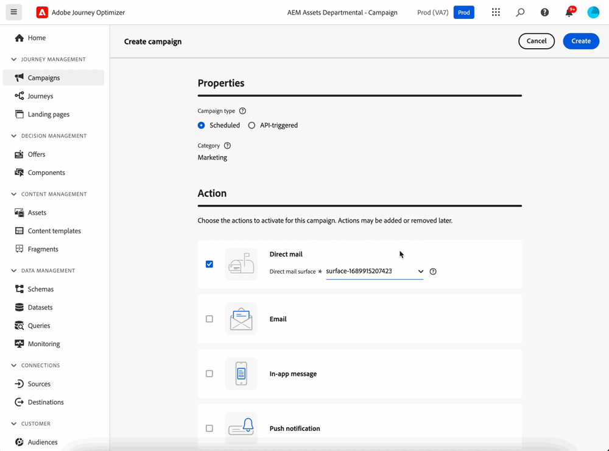

# Introducción al correo directo {#create-direct}

El correo directo es un canal sin conexión que le permite personalizar y generar los archivos de extracción necesarios para que los proveedores de correo postal de terceros envíen correo a sus clientes.

Al crear una campaña de correo directo, Journey Optimizer genera automáticamente un archivo que contiene todos los perfiles de destino y los datos seleccionados, como las direcciones postales y los atributos de perfil. Este archivo se envía al servidor de su elección para que el proveedor de correo directo de terceros elegido pueda acceder a él, quien se encargará del proceso de envío.

Deberá trabajar con el proveedor de correo directo de terceros que haya elegido para obtener el consentimiento necesario de sus clientes, si corresponde, para que estos puedan recibir correo de usted.

El uso de los servicios de correo está sujeto a términos y condiciones adicionales del proveedor de correo directo de terceros correspondiente.  Adobe no controla ni es responsable del uso que se haga de los productos de terceros. Para cualquier problema o solicitud de asistencia relacionada con el envío de correo de su campaña de correo directo, póngase en contacto con el proveedor de correo directo de terceros que haya elegido.

Los pasos principales para enviar mensajes de correo directo son los siguientes:

>[!AVAILABILITY]
>
>Los mensajes de correo directo solo se pueden crear en el contexto de campañas programadas. Estos no están disponibles para su uso en campañas orquestadas y activadas por API ni en recorridos.

## Recursos adicionales

* **[Cree correo postal](create-direct-mail.md)**: aprenda a crear envíos de correo postal y a configurar archivos de extracción para canales sin conexión.
* **[Configure el canal de correo postal](direct-mail-configuration.md)**: configure las superficies de correo postal y las configuraciones de enrutamiento de archivos.
* **[Pruebe y envíe correo postal](test-send-direct-mail.md)**: aprenda a probar, validar y publicar sus envíos de correo postal.
* **[Tutoriales de correo postal](https://experienceleague.adobe.com/es/docs/journey-optimizer-learn/tutorials/channels/direct-mail-channel/direct-mail){target="_blank"}**: explore tutoriales de vídeo paso a paso sobre las características del correo directo y las prácticas recomendadas.

