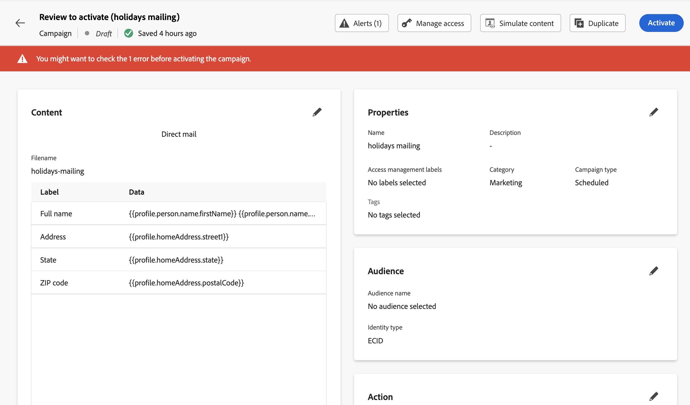

# Prueba y envío de un mensaje de correo directo {#direct-mail-test-send}

>[!BEGINSHADEBOX]

**En esta página:** Obtenga una vista previa del archivo de extracción, valide y active su campaña o recorrido, y administre el consentimiento postal para que el correo postal llegue a los destinatarios adecuados con precisión.

>[!ENDSHADEBOX]

Obtenga información sobre cómo obtener una vista previa del archivo de extracción, validar y activar la campaña de correo postal o el recorrido, y administrar el consentimiento de correo postal en Journey Optimizer.

## Antes de comenzar {#before-you-start}

Antes de probar y enviar un mensaje de correo postal, [cree el mensaje y configure el archivo de extracción](create-direct-mail.md). Asegúrese de haber completado también la [configuración del canal de correo postal](direct-mail-configuration.md).

## Previsualización del archivo de extracción {#preview-dm}

Una vez definido el contenido del archivo de extracción, previsualícelo mediante cualquiera de los métodos de simulación:

* Haga clic en **[!UICONTROL Simular contenido]** para probar las variaciones de contenido con datos de entrada de muestra o generación automática de IA. [Aprenda a simular variaciones de contenido](../test-approve/simulate-sample-input.md)
* Haga clic en **[!UICONTROL Simular contenido]** y, a continuación, seleccione **[!UICONTROL Simular contenido (perfiles de AEP)]** en el menú desplegable y agregue un perfil de prueba para comprobar cómo se representa el archivo de extracción.

Encontrará información detallada sobre cómo obtener una vista previa y probar contenido en la sección [Administración de contenido](../content-management/preview-test.md).

{width="800" align="center"}

Una vez que el contenido del archivo esté listo para enviarse, cierre la pantalla de simulación y haga clic en el botón **[!UICONTROL Revisar para activar]**.

## Validación y activación de la campaña de correo directo {#dm-validate}

>[!IMPORTANT]
>
> Si la campaña está sujeta a una directiva de aprobación, debe solicitar la aprobación para poder enviar la campaña de correo postal. [Más información](../test-approve/gs-approval.md)

Antes de activar la campaña de correo postal, asegúrese de que la campaña o el recorrido y el archivo de extracción estén correctamente configurados. Para ello, compruebe las alertas en la sección superior del editor. Algunas son simples advertencias, pero otras pueden impedir que envíe el mensaje. Pueden producirse dos tipos de alertas: advertencias y errores.

* **Advertencias** se refieren a recomendaciones y prácticas recomendadas. Por ejemplo, se muestra un mensaje de advertencia si el mensaje SMS está vacío.

* **Los errores** le impiden publicar la campaña, siempre y cuando no se resuelvan. Por ejemplo, un mensaje de error le advierte cuando falta la línea de asunto.

{width="800" align="center"}

Cuando tu campaña de correo postal esté lista, completa la configuración de tu [recorrido](../building-journeys/journey-gs.md) o [campaña](../campaigns/create-campaign.md) para enviarla.

>[!NOTE]
>
>El archivo exportado finaliza con una nueva línea de forma predeterminada. Esto garantiza la compatibilidad con las herramientas de procesamiento de datos estándar.

Una vez enviado, puede medir el impacto de su campaña de correo postal o su recorrido dentro de los informes. Para obtener más información sobre los informes de correo postal, consulte estas secciones:
* [Informe de campaña de correo directo](../reports/campaign-global-report-cja-direct.md)
* [Informe de recorrido de correo directo](../reports/journey-global-report-cja-direct.md)

## Comprender el tiempo de exportación y la generación de archivos {#dm-export-timing}

Las exportaciones de correo postal se ejecutan en ciclos fijos UTC de 4 horas en **02:01**, **06:01**, **10:01**, **14:01**, **18:01** y **22:01**.

Los perfiles se incluyen en el ciclo de exportación *next* una vez que llegan a la actividad de correo postal. Esto significa que la creación de archivos se basa en el momento en el que los perfiles llegan al nodo de correo postal, no en el momento en el que se activó la campaña o el recorrido por primera vez.

* **Por qué puede recibir varios archivos en un día**: si los perfiles llegan a la actividad de correo postal en diferentes ventanas de 4 horas, Journey Optimizer genera archivos de exportación independientes para cada ventana. Este es el comportamiento esperado.

  Por ejemplo:

   * Los perfiles que llegan antes de **14:01** se exportan a las **14:01**.
   * Los perfiles que llegan de **14:02** a **18:01** se exportan a las **18:01**.

  Esto no duplica perfiles, los agrupa por ventana de llegada.

* **Actualización del tiempo de actividad del perfil**: en recorrido, la actividad **[!UICONTROL Actualizar perfil]** se ejecuta inmediatamente durante el tiempo de ejecución del recorrido cuando un perfil alcanza esa actividad. No espera al ciclo de exportación de correo postal.

* **Recomendaciones para escenarios de un archivo por día** - Si necesita un archivo por día, considere las siguientes opciones:

   * **Frecuencia de enrutamiento de 24 horas**: garantiza un archivo por día, pero introduce latencia de envío.
   * **Esperar hasta la hora del día**: puede alinear perfiles en la misma ventana de exportación, pero los resultados dependen del tiempo de recorrido.
   * **Frecuencia de enrutamiento de 4 horas**: Proporciona la latencia más baja, pero puede generar varios archivos al día.

## Administración del consentimiento para correo postal {#dm-consent-management}

En [!DNL Journey Optimizer], el consentimiento se gestiona mediante el [Esquema de consentimiento](https://experienceleague.adobe.com/docs/experience-platform/xdm/field-groups/profile/consents.html?lang=es){target="_blank"} de Experience Platform. De forma predeterminada, el valor del campo de consentimiento está vacío y se trata como consentimiento para recibir sus comunicaciones.

Si un perfil se ha excluido de la recepción de correo postal, en los atributos de perfil de Experience Platform correspondientes, el valor de `consents.marketing.postalMail.val` será `n` y el perfil correspondiente se excluirá de las entregas posteriores.

Para volverlo a habilitar, el atributo de perfil debe cambiarse a `consents.marketing.postalMail.val` : `y`.

Para administrar los atributos de un perfil, vaya a Experience Platform y acceda al perfil seleccionando un área de nombres de identidad y un valor de identidad correspondiente. Obtenga más información en la [documentación de Experience Platform](https://experienceleague.adobe.com/docs/experience-platform/profile/ui/user-guide.html?lang=es#getting-started){target="_blank"}.

Obtenga más información acerca de la administración de la exclusión en Journey Optimizer en [esta sección](../privacy/opt-out.md).

## Temas relacionados {#related-topics}

* [Introducción al correo directo](get-started-direct-mail.md)
* [Crear un mensaje de correo directo](create-direct-mail.md)
* [Configuración del canal de correo directo](direct-mail-configuration.md)
* [Previsualización y prueba de contenido](../content-management/preview-test.md)

Si tiene preguntas comunes acerca del correo postal, consulte [Introducción al correo postal](get-started-direct-mail.md).
