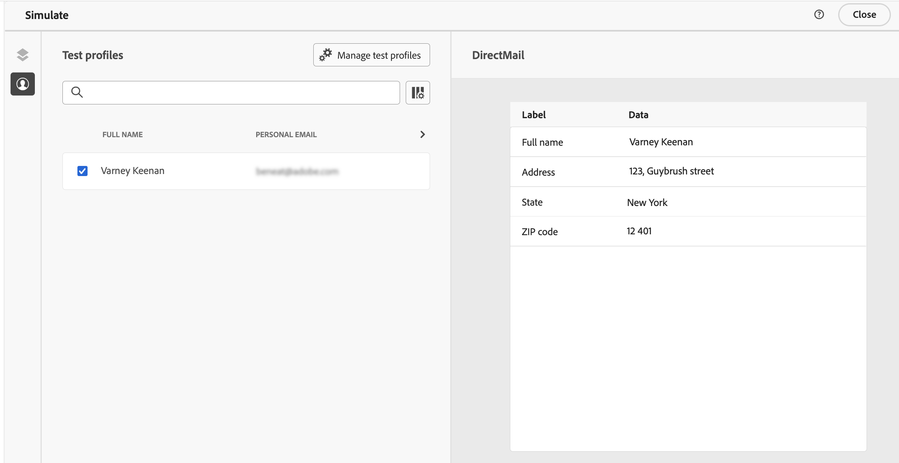

# Comprobación y envío de un mensaje de correo postal {#direct-mail-test-send}

## Previsualización del archivo de extracción {#preview-dm}

Una vez definido el contenido del archivo de extracción, puede utilizar perfiles de prueba para previsualizarlo. Si ha insertado contenido personalizado, puede comprobar cómo se muestra este en el mensaje con los datos del perfil de prueba.

Para ello, haga clic en **[!UICONTROL Simular contenido]** a continuación, añada un perfil de prueba para comprobar cómo se representa el archivo de extracción con los datos del perfil de prueba.

{width="800" align="center"}

Encontrará información detallada sobre cómo seleccionar perfiles de prueba y previsualizar el contenido en el [Gestión de contenido](../content-management/preview-test.md) sección.

Una vez que el contenido del archivo esté listo para enviarse, cierre la pantalla de simulación y haga clic en **[!UICONTROL Revisar para activar]** botón.

## Validación y activación de la campaña de correo directo {#dm-validate}

Antes de activar la campaña de correo postal, asegúrese de que la campaña y el archivo de extracción estén correctamente configurados. Para ello, compruebe las alertas en la sección superior del editor. Algunas son simples advertencias, pero otras pueden impedir que envíe el mensaje. Pueden producirse dos tipos de alertas: advertencias y errores.

* **Advertencias** consulte recomendaciones y prácticas recomendadas. Por ejemplo, se muestra un mensaje de advertencia si el mensaje SMS está vacío.

* **Errores** evite publicar la campaña, siempre y cuando no se resuelvan. Por ejemplo, un mensaje de error le advierte cuando falta la línea de asunto.

{width="800" align="center"}

Cuando la campaña de correo postal esté lista, haga clic en **[!UICONTROL Activar]** botón. Cuando se inicia la campaña, el archivo de extracción se genera automáticamente y se exporta al servidor especificado en [configuración de enrutamiento de archivos](../direct-mail/direct-mail-configuration.md).

Una vez enviada, puede medir el impacto de la campaña de correo postal dentro de los informes de campaña. Para obtener más información sobre los informes, consulte esta sección.

## Administración del consentimiento para correo postal {#dm-consent-management}

Entrada [!DNL Journey Optimizer], el Experience Platform gestiona el consentimiento [Esquema de consentimiento](https://experienceleague.adobe.com/docs/experience-platform/xdm/field-groups/profile/consents.html?lang=es){target="_blank"}. De forma predeterminada, el valor del campo de consentimiento está vacío y se trata como consentimiento para recibir sus comunicaciones.

Si un perfil se ha excluido de la recepción de correo postal, en los atributos de perfil del Experience Platform correspondientes, el valor de `consents.marketing.postalMail.val` será `n` y el perfil correspondiente se excluirá de las entregas posteriores.

Para volver a activarlo, el atributo de perfil debe cambiarse a `consents.marketing.postalMail.val` : `y`.

Para administrar los atributos de un perfil, vaya a Experience Platform y acceda al perfil seleccionando un área de nombres de identidad y un valor de identidad correspondiente. Obtenga más información en la [Documentación del Experience Platform](https://experienceleague.adobe.com/docs/experience-platform/profile/ui/user-guide.html?lang=es#getting-started){target="_blank"}.

Obtenga más información sobre la administración de la exclusión en Journey Optimizer en [esta sección](../privacy/opt-out.md).
