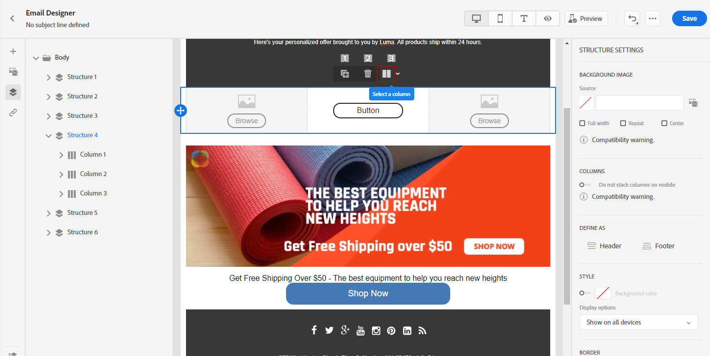
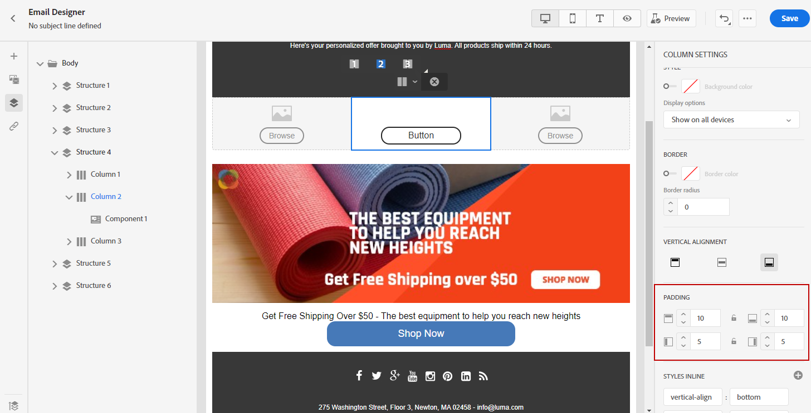

# Ajustar alineación vertical y relleno {#alignment-and-padding}

En este ejemplo, se ajusta el relleno y la alineación vertical dentro de un componente de estructura compuesto por tres columnas.

1. Seleccione el componente de estructura directamente en el correo electrónico o mediante el **[!UICONTROL árbol de navegación]** disponible en el menú de la izquierda.

1. En la barra de herramientas, haga clic en **[!UICONTROL Seleccionar una columna]** y elija la que desee editar. También puede seleccionarlo en el árbol de estructura.

   Los parámetros editables para esa columna se muestran en la ficha **[!UICONTROL Estilos]**.

   

1. En **[!UICONTROL Alineación]**, seleccione **[!UICONTROL Superior]**, **[!UICONTROL Medio]** o **[!UICONTROL Inferior]**.

   

1. En **[!UICONTROL Relleno]**, defina el relleno para todos los lados.

   Seleccione **[!UICONTROL relleno diferente para cada lado]** si desea ajustar el relleno. Haga clic en el icono de bloqueo para interrumpir la sincronización.

   

1. Proceda de forma similar para ajustar la alineación y el relleno de las demás columnas.

1. Guarde los cambios.

>[!TIP]
>
>Al diseñar contenido de correo electrónico para Gmail en dispositivos Android, asegúrese de que las imágenes y los divisores utilicen relleno de columna en lugar de márgenes fijos y grandes. Gmail en Android a menudo procesa imágenes y márgenes de gran tamaño incorrectamente, lo que provoca desbordamientos de diseño o líneas divisorias reducidas. Utilice un ancho de imagen menor o confíe en el relleno basado en columnas para lograr una visualización uniforme.

## Administrar el relleno de fragmento con navegación por rutas de exploración {#fragment-padding-breadcrumb}

Al trabajar con [fragmentos](../content-management/fragments.md) en el Designer de correo electrónico, es posible que encuentre un relleno oculto o residual que afecte al procesamiento móvil de forma diferente al escritorio. Esto es particularmente común cuando los fragmentos se han desbloqueado o cuando la herencia [se ha roto](use-visual-fragments.md#break-inheritance), ya que el estilo sobrante puede permanecer en la columna subyacente o en los componentes de texto.

Para identificar y editar el relleno sobrante en fragmentos:

1. Utilice **[!UICONTROL árbol de navegación]** o haga clic directamente en los elementos del editor para seleccionar cada estructura o columna principal dentro del fragmento. Esto le ayuda a localizar un margen o relleno oculto que puede ser específico de dispositivos móviles.

1. Después de seleccionar el elemento en la ruta de exploración, vaya a la ficha **[!UICONTROL Estilos]** de la derecha.

1. Revise la configuración de **[!UICONTROL Relleno]** y quite o reajuste el relleno según sea necesario para lograr la alineación móvil correcta.

1. Si los problemas de alineación persisten al reutilizar fragmentos, repita este proceso para otras columnas o componentes de texto dentro del fragmento.

>[!NOTE]
>
>Este comportamiento se espera cuando los fragmentos se insertan y eliminan repetidamente, ya que las reglas de estilo se pueden acumular. Compruebe siempre los valores de relleno con la navegación de ruta de exploración, especialmente cuando se segmentan en dispositivos móviles.