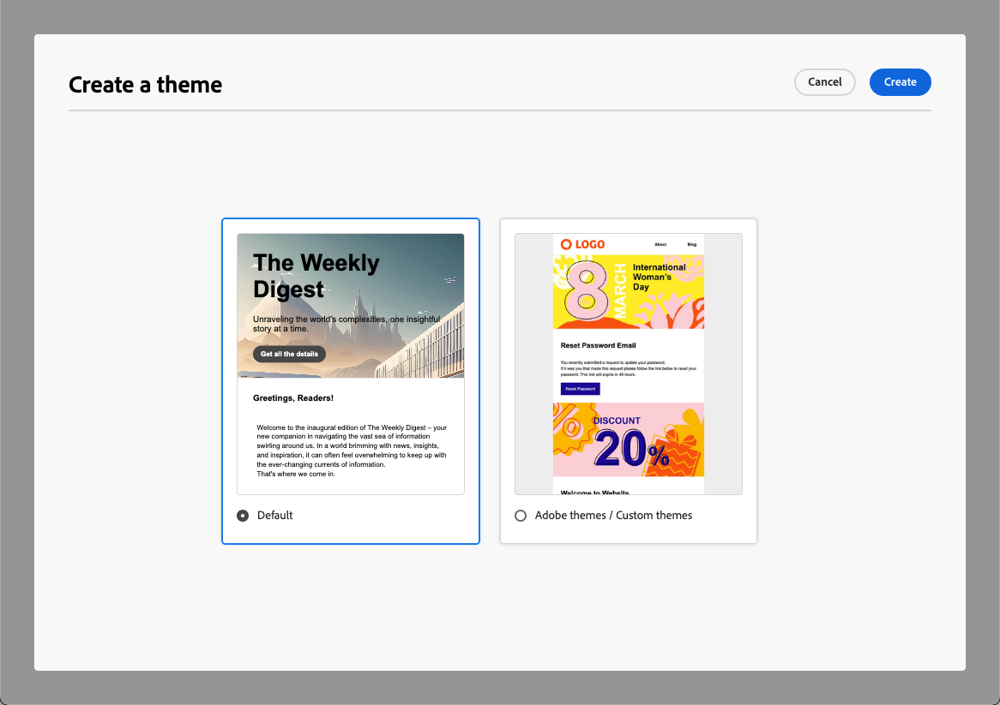
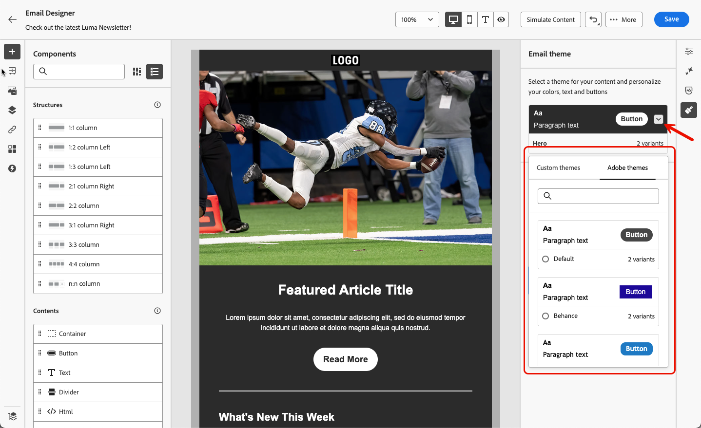
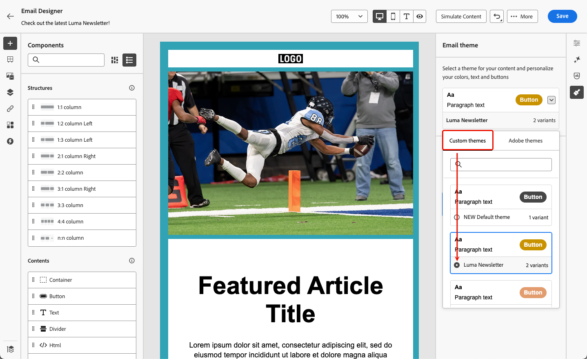

# Aplicar temáticas al contenido del correo electrónico {#apply-email-themes}

>[!CONTEXTUALHELP]
>id="ajo_use_theme"
>title="Aplique una temática al correo electrónico"
>abstract="Seleccione una temática para su correo electrónico para aplicar rápidamente un estilo específico que se ajuste a su marca y diseño."

>[!AVAILABILITY]
>
>Esta capacidad está en disponibilidad limitada. Póngase en contacto con su representante de Adobe para obtener acceso.

Con las temáticas, los usuarios no técnicos tienen la capacidad de crear contenido reutilizable que se ajuste a una marca y un idioma de diseño específicos agregando estilo personalizado sobre las plantillas estándar<!-- to achieve brand specific results-->.

Esta función permite a los especialistas en marketing aprovechar correos electrónicos visualmente atractivos y coherentes con la marca de forma más rápida y con menos esfuerzo, a la vez que proporciona opciones de personalización avanzadas para satisfacer necesidades de diseño únicas.

## Mecanismos de protección y limitaciones {#themes-guardrails}

* Al crear un correo electrónico desde cero, puede elegir empezar a crear el contenido con un tema para aplicar rápidamente un estilo específico que se ajuste a su marca y diseño.

  Si elige el modo de Estilo manual, no podrá aplicar ninguna temática a menos que restablezca el correo electrónico.

* [Los fragmentos](../content-management/fragments.md) no son compatibles entre los modos Usar temas y Estilo manual.

   * Para aprovechar un [fragmento](../content-management/fragments.md) en un contenido temático, este fragmento debe haberse creado a sí mismo usando temáticas. [Más información](#leverage-themes-fragment)

   * Cuando utilice un fragmento en el contenido del correo electrónico, asegúrese de aplicar una temática que haya definido para este fragmento. Si no se hace esto, pueden producirse problemas de visualización, especialmente en Outlook 2021 y versiones anteriores. [Más información](#leverage-themes-fragment)

* Si usa un contenido creado en HTML, estará en [modo de compatibilidad](existing-content.md) y no podrá aplicar temas directamente a este contenido.

   * Para aplicar temáticas, primero debe guardar el contenido importado [como una nueva plantilla](../content-management/create-content-templates.md#save-as-template) y, a continuación, convertir esta plantilla en un contenido compatible con temáticas. A continuación, puede utilizar esta plantilla para crear el contenido del correo electrónico. Aprenda a convertir una plantilla creada con estilo manual en [esta sección](#theme-convertor).

   * También puede convertir el contenido de HTML importado. [Más información](existing-content.md)

  <!--To fully leverage all the capabilities of the Email Designer, including themes, you must either create a new content in Use Themes mode, or convert your imported HTML content. [Learn more](existing-content.md)-->

<!--If you apply a theme to a content using a [fragment](../content-management/fragments.md) created with Manual Styling mode, the rendering may not be optimal.-->

## Crear una temática {#create-and-edit-themes}

Para definir una temática que pueda aprovechar en el contenido futuro del correo electrónico, siga los pasos a continuación.

1. Para empezar, cree una nueva [plantilla de contenido](../content-management/create-content-templates.md).

1. Seleccione la opción **[!UICONTROL Crear o editar temáticas]**.

   

1. Seleccione un tema de Adobe. En este ejemplo, seleccione el **[!UICONTROL tema predeterminado]** y haga clic en **[!UICONTROL Crear]**.

   

1. También puede seleccionar una plantilla personalizada de la ficha **[!UICONTROL Mis temas]** y hacer clic en **[!UICONTROL Editar]** para actualizarla.

   

1. En la ficha **[!UICONTROL Configuración general]**, empiece a definir el tema asignándole un nombre específico que se adapte a su marca. Puede ajustar la anchura predeterminada de la ventanilla móvil de los correos electrónicos y también exportar el tema actual a [compartirlo en zonas protegidas](../configuration/copy-objects-to-sandbox.md).

   <!---->

1. Utilice el carril de la derecha para navegar por las diferentes pestañas y actualizar la configuración de diseño.

   

1. Desde la ficha **[!UICONTROL Colores]**:

   * Use el botón **[!UICONTROL Editar]** para configurar una **[!UICONTROL paleta de colores]** con colores predeterminados para su marca. Seleccione un **[!UICONTROL ajuste preestablecido]** para crear rápidamente una combinación de colores o ajustar cada color de su tema individualmente. También puede utilizar una combinación de ambos.

     

   * Haga clic en **[!UICONTROL Agregar variante]** para crear varias variantes de color, como el modo claro y oscuro, en las que cada variante del tema tiene su propia paleta de colores y controles de matices.

     

   * Para cada variante, haga clic en el icono **[!UICONTROL Editar]** para editar cualquier elemento individual. Puede utilizar la paleta predeterminada que ha creado o cualquier color personalizado.

     

1. En la **[!UICONTROL configuración de texto]**, puede establecer la fuente global que desee usar para todo el tema. Para un control más granular, también puede editar cada título y tipo de párrafo para ajustar la fuente, el tamaño, el estilo, etc.

   

1. En la ficha **[!UICONTROL Espaciado]**, seleccione un elemento individual de la lista para espaciarlo correctamente entre los distintos componentes.

   <!---->

1. Con las otras pestañas de la derecha, puede administrar por separado cada elemento de botón, divisor, formato de imagen adicional y espaciado del diseño de cuadrícula para esta temática.

   

1. Haga clic en **[!UICONTROL Guardar]** para almacenar este tema para uso futuro. Ahora se muestra en la pestaña **[!UICONTROL Mis temas]**.

<!--A little strange upon hitting Save, because once the theme is created, you need to hit Close to go back to Design your template screen, then click Cancel if you don't want to proceed with template creation.-->

## Aplicar temáticas a un contenido de correo electrónico {#apply-themes-email}

Para aplicar temáticas de estilo predeterminadas o personalizadas a una plantilla de contenido o a un correo electrónico, siga los pasos a continuación.

1. En [!DNL Journey Optimizer], [agregue una acción de correo electrónico](create-email.md) a un recorrido o campaña, o cree una [plantilla de contenido](../content-management/create-content-templates.md#create-template-from-scratch) de correo electrónico y [edite el cuerpo del correo electrónico](get-started-email-design.md#key-steps).

1. Puede seleccionar una de las siguientes acciones:

   * Seleccione una [plantilla de correo electrónico](use-email-templates.md) integrada para abrir el Designer de correo electrónico. Se aplica automáticamente una temática predeterminada específica a cada plantilla.

   * Diseña [nuevo contenido desde cero](content-from-scratch.md) y selecciona **[!UICONTROL Usar temas]** para comenzar con un tema de estilo predefinido.

     

     >[!CAUTION]
     >
     >Si elige el modo Estilo manual, no podrá aplicar ninguna temática a menos que restablezca el diseño.
     >
     >Para aprovechar un [fragmento](../content-management/fragments.md) en un contenido temático, este fragmento debe haberse creado a sí mismo usando temáticas. [Más información](#leverage-themes-fragment)

1. Una vez que se encuentre en el Designer de correo electrónico, haga clic en el botón **[!UICONTROL Temas]** en el carril derecho. Se muestra el tema predeterminado o el tema de la plantilla. Puede cambiar entre las dos variantes de color para esta temática.

   

1. Haga clic en la flecha situada junto a la temática utilizada actualmente. Se muestra la lista de las temáticas personalizadas y de Adobe disponibles.

   

1. Haz clic en **[!UICONTROL Mis temas]** y selecciona un tema que hayas creado.

   

1. Haga clic fuera de la lista desplegable. La temática personalizada recién seleccionada aplica automáticamente sus estilos a todos los componentes del correo electrónico. Puede alternar entre las variantes de color, si las hay.

1. Cuando se selecciona un tema en una plantilla de contenido, puede hacer clic en el botón **[!UICONTROL Editar tema]** para actualizarlo. [Más información](#create-and-edit-themes)

   {width="40%"}

   >[!NOTE]
   >
   >Esta opción no está disponible al utilizar temáticas en el contenido del correo electrónico.

1. Si utiliza una temática con varias variantes de color, puede elegir una variante específica para un componente de estructura determinado. Esto le permite definir una variante de color para todo el contenido y utilizar una variante diferente para una estructura específica.

   >[!NOTE]
   >
   >No puede realizar esta acción en componentes de contenido.

   Para ello, seleccione un componente de estructura, haga clic en la opción **[!UICONTROL Usar variante de tema específico]** de la pestaña **[!UICONTROL Estilos]** de la derecha y aplique la variante que desee a esa estructura.

   

   En este ejemplo, la primera variante de color de la temática actual se aplica a todo el contenido del correo electrónico, pero la tercera variante de color se aplica a la estructura seleccionada. Se puede ver que los colores del cuerpo y del fondo de la ventanilla móvil de esa estructura específica son diferentes del resto del contenido.

Puede cambiar de tema en cualquier momento. El contenido del correo electrónico permanece sin cambios, pero los estilos se actualizan para reflejar la nueva temática.

### Desbloquear estilos {#unlocking-styles}

Cuando se selecciona un componente, puede desbloquear su estilo utilizando el icono dedicado de la pestaña **[!UICONTROL Styles]**.

{width="90%"}

La temática seleccionada se seguirá aplicando a ese componente, pero puede anular sus elementos de estilo. Si cambia los temas, el nuevo tema sólo se aplicará a los elementos de estilo que no se reemplazaron.<!--can you revert this action?-->

Por ejemplo, si desbloquea un componente de texto, puede cambiar <!--the font size from 11 to 14 and --> el color de la fuente de negro a rojo:

{width="80%" align="center" zoomable="yes"}

Si cambia de tema, <!--the font size is still 14 and -->el color de fuente sigue siendo rojo para ese componente, pero el color de fondo para este componente cambiará con el nuevo tema:

{width="80%"}

## Aprovechamiento de temas en un fragmento {#leverage-themes-fragment}

Para aprovechar un fragmento en una plantilla o correo electrónico con [temáticas aplicadas](#apply-themes-email), este fragmento debe haberse creado a sí mismo usando temáticas. De lo contrario, no podrá utilizar este fragmento en el contenido temático.

Para crear un fragmento compatible con temáticas, siga los pasos a continuación.

1. En [!DNL Journey Optimizer], cree un fragmento visual y haga clic en **[!UICONTROL Crear]** para diseñar el contenido del fragmento. [Descubra cómo](../content-management/create-fragments.md)

1. Seleccione **[!UICONTROL Usar temas]** para comenzar con un tema de estilo predefinido.

   {width="100%"}

   >[!CAUTION]
   >
   >Si elige el modo Estilo manual, no podrá aplicar ninguna temática a menos que restablezca el diseño de fragmento.

1. Una vez en el Designer de correo electrónico, puede empezar a crear el fragmento.

1. Haga clic en el botón **[!UICONTROL Temas]** en el carril derecho. Se muestra la temática predeterminada. Puede cambiar entre las diferentes variantes de color para esta temática.

   {width="100%" align="center" zoomable="yes"}

1. Puede seleccionar otras temáticas para previsualizar el contenido del fragmento. Para ello, seleccione la flecha junto al tema predeterminado y haga clic en **[!UICONTROL Seleccionar temas]**.

   {width="40%"}

1. Puede navegar entre las pestañas **[!UICONTROL Adobe themes]** y **[!UICONTROL Mis temáticas]**, y seleccionar hasta cinco temáticas compatibles (de ambas pestañas) para su fragmento.

   {width=70%}

   >[!CAUTION]
   >
   >Cuando use el fragmento en un contenido de correo electrónico, asegúrese de [aplicar un tema](#apply-themes-email) que haya definido para este fragmento. Si no se hace esto, pueden producirse problemas de visualización, especialmente en Outlook 2021 y versiones anteriores.

1. Haga clic en **[!UICONTROL Cerrar]**.

1. Seleccione de nuevo la flecha junto al **[!UICONTROL tema predeterminado]**. Ahora puede alternar entre los diferentes temas que acaba de seleccionar para previsualizar cada renderización de estilo.

   {width=90%}

1. Vuelva a hacer clic en **[!UICONTROL Seleccionar temas]** para agregar más temas o cambiar su selección.

## Hacer una plantilla compatible con las temáticas {#theme-convertor}

[!DNL Journey Optimizer] le permite convertir una plantilla creada con un estilo manual en contenido compatible con temas. Esto puede resultar especialmente útil si creó plantillas de contenido antes de que los temas se introdujeran en [!DNL Journey Optimizer] o si está importando contenido externo.

1. Abra una [plantilla de contenido](../content-management/create-content-templates.md) de correo electrónico y edite su contenido con el Designer de correo electrónico.

1. Seleccione el icono **[!UICONTROL Temas]** en el carril derecho y haga clic en el botón **[!UICONTROL Generar tema a partir del contenido]**.

   {width=100%}

1. Se abre la ventana **[!UICONTROL Crear un tema]**. [!DNL Journey Optimizer] detecta automáticamente los elementos de estilo y los consolida en un nuevo tema.

   {width=90%}

1. Asigne un nombre a la temática.

1. Realice sus propios ajustes según sea necesario, tal como lo hace al crear una temática desde cero, como añadir una variante de color, editar fuentes, etc. [Descubra cómo](#create-and-edit-themes)

   {width=90%}

1. Haga clic en **[!UICONTROL Guardar]** para almacenar este nuevo tema y reutilizarlo. Ahora puede aplicar esta temática a su contenido, como cualquier otra temática. [Descubra cómo](#leverage-themes-fragment)