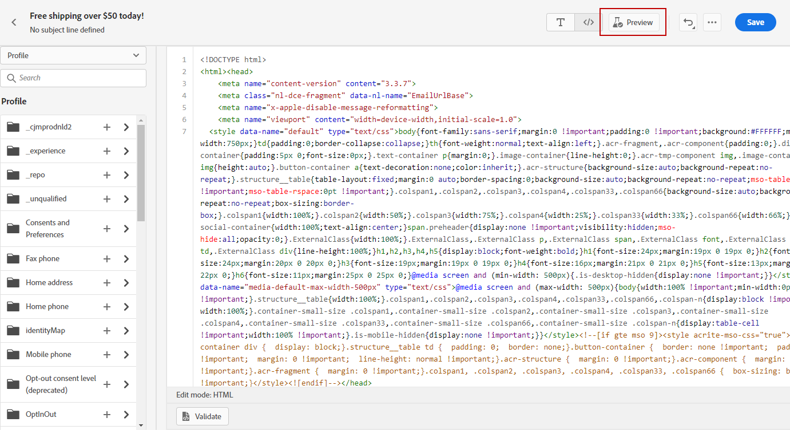

# Codifique su propio contenido {#code-content}

**[!UICONTROL Codifique su propio código]** le permite escribir o pegar HTML sin procesar para crear contenido de correo electrónico directamente en el Designer de correo electrónico de [!DNL Journey Optimizer]. Utilice este modo cuando necesite control total sobre el marcado o cuando importe HTML existente.

Debe tener habilidades con HTML y, una vez que elija este modo, permanecerá en el editor de código; no puede cambiar al editor visual.

➡️ [Descubra esta función en vídeo](#video)

>[!NOTE]
>
>**[!UICONTROL Codifique usted mismo]** no es lo mismo que el editor de HTML avanzado del Designer de correo electrónico. El editor avanzado de HTML permite alternar entre la vista de HTML y la vista visual (Escritorio) en cualquier momento, no el editor de código. [Más información sobre el editor de HTML avanzado](email-expert-mode.md).

## Utilizar el editor de código {#use-code-editor}

Para crear o editar contenido de correo electrónico con el editor de código, siga estos pasos.

1. En la página de inicio de [Enviar correo electrónico a Designer](get-started-email-design.md), seleccione **[!UICONTROL Codifique su propio código]**.

   

1. Introduzca o pegue el código de HTML sin procesar.

1. Utilice el panel izquierdo para aprovechar las capacidades de personalización de [!DNL Journey Optimizer]. [Más información](../personalization/personalize.md)

   

   >[!NOTE]
   >
   >El editor de personalización de Email Designer tiene algunas limitaciones de funciones en comparación con las expresiones de recorrido. [Más información sobre las limitaciones de funciones de fecha y hora](#date-time-limitations)

1. Si desea borrar el contenido y comenzar con un nuevo diseño de correo electrónico, seleccione **[!UICONTROL Cambiar el diseño]** en el menú de opciones.

   

   >[!NOTE]
   >
   >Esta acción abre la plantilla seleccionada en el Diseñador de correo electrónico. A partir de ahí, puede completar el diseño del correo electrónico o volver al editor de código utilizando la opción **[!UICONTROL Cambiar al editor de código]**.

1. Haga clic en el botón **[!UICONTROL Vista previa]** para comprobar el diseño y la personalización del mensaje con perfiles de prueba. [Más información](../content-management/preview-test.md)

   

1. Una vez que el código esté listo, haga clic en **[!UICONTROL Guardar]** y a continuación, vuelva a la pantalla de creación de mensajes para finalizar el mensaje.

   

>[!CAUTION]
>
>No se puede hacer referencia a las imágenes de [Adobe Experience Manager Assets](../integrations/assets.md) al usar el código con su propio método. Almacene las imágenes a las que se hace referencia en su código HTML en una ubicación pública.

## Limitaciones de funciones de fecha y hora {#date-time-limitations}

Al utilizar la personalización en el editor de código Designer de correo electrónico, la función `now()` no está disponible para los cálculos de fechas dinámicas.

>[!IMPORTANT]
>
>La función `now()` es **no compatible** en el idioma de expresión del Generador de correo electrónico. Aunque `now()` está disponible en condiciones de recorrido, no se puede usar en el contenido del correo electrónico ni en el editor de código.

**Alternativas disponibles:**

Utilice las siguientes funciones para trabajar con la fecha y la hora actuales en la personalización del correo electrónico:

* **`getCurrentZonedDateTime()`**: devuelve la fecha y la hora actuales con información de zona horaria. Esta es la alternativa recomendada a `now()`.

  Ejemplo: `` devuelve `2024-12-06T17:22:02.281067+05:30[Asia/Kolkata]`

* **`currentTimeInMillis()`**: devuelve el tiempo actual en milisegundos epoch.

  Ejemplo: ``

**Soluciones recomendadas:**

Si necesita realizar cálculos de fechas en el contenido del correo electrónico:

* **Campos de fecha precalculados**: calcule los valores de fecha requeridos en la canalización de datos o los atributos de perfil antes de enviar el correo electrónico y, a continuación, haga referencia a estos valores precalculados en la personalización.

  Ejemplo: ``

* **Usar funciones de manipulación de fechas** - Usar [funciones de fecha y hora](../personalization/functions/dates.md) como `dayOfYear()` o `diffInDays()` con valores de fecha de atributos de perfil.

  Ejemplo: ``

* **Use atributos calculados** - Cree [atributos calculados](../audience/computed-attributes.md) que realicen cálculos de fechas complejos, haciendo que los resultados estén disponibles como atributos de perfil.

Consulte [Funciones de fecha y hora](../personalization/functions/dates.md) para obtener una lista completa de las funciones compatibles.
