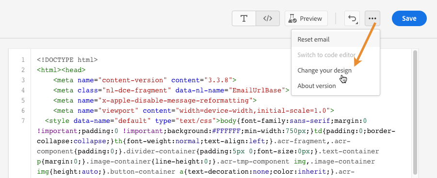

# Codifique su propio contenido {#code-content}

Utilice el modo **[!UICONTROL Codifique su propio contenido]** para importar el HTML sin procesar o codificar el contenido del correo electrónico. Este método requiere habilidades de HTML.

➡️ [Descubra esta funcionalidad en vídeo](#video)

>[!CAUTION]
>
> No se puede hacer referencia a las imágenes de [Adobe Experience Manager Assets](../integrations/assets.md) al utilizar este método. Las imágenes a las que se hace referencia en el código HTML deben almacenarse en una ubicación pública.

1. En la página de inicio de Designer de correo electrónico, seleccione **[!UICONTROL Codifique su propio código]**.

   

1. Introduzca o pegue el código de HTML sin procesar.

1. Utilice el panel izquierdo para aprovechar las capacidades de personalización de [!DNL Journey Optimizer]. [Más información](../personalization/personalize.md)

   

   >[!NOTE]
   >
   >El editor de personalización de Email Designer tiene algunas limitaciones de funciones en comparación con las expresiones de recorrido. [Más información sobre las limitaciones de funciones de fecha y hora](#date-time-limitations)

1. Si desea borrar el contenido y comenzar con un nuevo diseño de correo electrónico, seleccione **[!UICONTROL Cambiar el diseño]** en el menú de opciones.

   

   >[!NOTE]
   >
   >Esta acción abre la plantilla seleccionada en el Diseñador de correo electrónico. A partir de ahí, puede completar el diseño del correo electrónico o volver al editor de código utilizando la opción **[!UICONTROL Cambiar al editor de código]**.

1. Haga clic en el botón **[!UICONTROL Vista previa]** para comprobar el diseño y la personalización del mensaje con perfiles de prueba. [Más información](../content-management/preview-test.md)

   

1. Una vez que el código esté listo, haga clic en **[!UICONTROL Guardar]** y a continuación, vuelva a la pantalla de creación de mensajes para finalizar el mensaje.

   

## Limitaciones de funciones de fecha y hora {#date-time-limitations}

Al utilizar la personalización en el editor de código Designer de correo electrónico, la función `now()` no está disponible para los cálculos de fechas dinámicas.

>[!IMPORTANT]
>
>La función `now()` es **no compatible** en el idioma de expresión del Generador de correo electrónico. Aunque `now()` está disponible en condiciones de recorrido, no se puede usar en el contenido del correo electrónico ni en el editor de código.

**Alternativas disponibles:**

Utilice las siguientes funciones para trabajar con la fecha y la hora actuales en la personalización del correo electrónico:

* **`getCurrentZonedDateTime()`**: devuelve la fecha y la hora actuales con información de zona horaria. Esta es la alternativa recomendada a `now()`.

  Ejemplo: `` devuelve `2024-12-06T17:22:02.281067+05:30[Asia/Kolkata]`

* **`currentTimeInMillis()`**: devuelve el tiempo actual en milisegundos epoch.

  Ejemplo: ``

**Soluciones recomendadas:**

Si necesita realizar cálculos de fechas en el contenido del correo electrónico:

* **Campos de fecha precalculados**: calcule los valores de fecha requeridos en la canalización de datos o los atributos de perfil antes de enviar el correo electrónico y, a continuación, haga referencia a estos valores precalculados en la personalización.

  Ejemplo: ``

* **Usar funciones de manipulación de fechas** - Usar [funciones de fecha y hora](../personalization/functions/dates.md) como `dayOfYear()` o `diffInDays()` con valores de fecha de atributos de perfil.

  Ejemplo: ``

* **Use atributos calculados** - Cree [atributos calculados](../audience/computed-attributes.md) que realicen cálculos de fechas complejos, haciendo que los resultados estén disponibles como atributos de perfil.

Más información sobre [Funciones de fecha y hora en personalización](../personalization/functions/dates.md).
