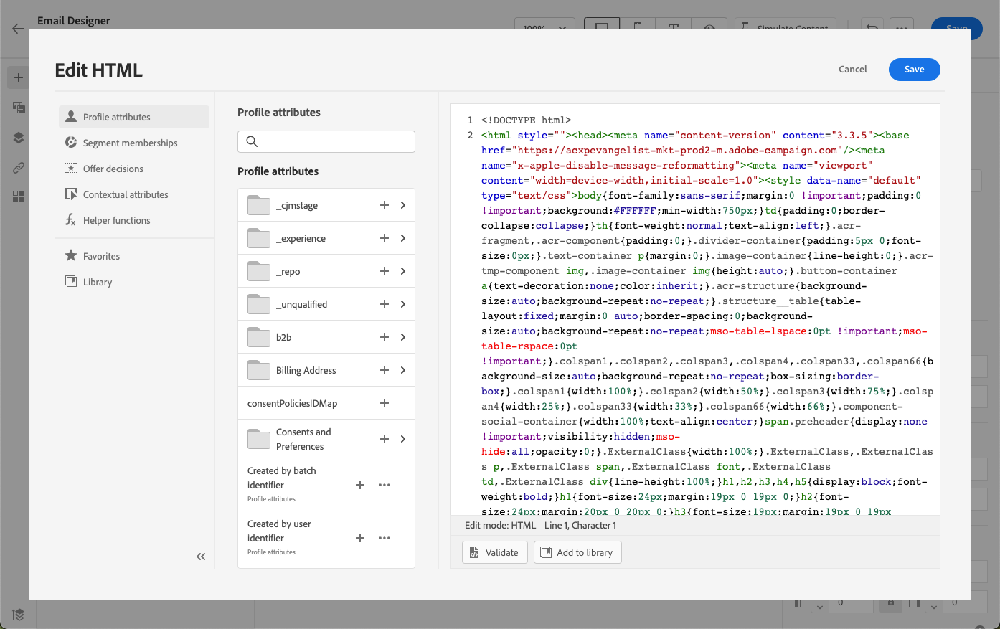

# Uso de los componentes de contenido del diseñador de correo electrónico {#content-components}

>[!CONTEXTUALHELP]
>id="ac_content_components_email"
>title="Acerca de los componentes de contenido"
>abstract="Los componentes de contenido son marcadores de posición de contenido vacíos que se pueden utilizar para crear el diseño de un correo electrónico."

>[!CONTEXTUALHELP]
>id="ac_content_components_landing_page"
>title="Acerca de los componentes de contenido"
>abstract="Los componentes de contenido son marcadores de posición de contenido vacíos que se pueden utilizar para crear el diseño de una página de destino."

>[!CONTEXTUALHELP]
>id="ac_content_components_fragment"
>title="Acerca de los componentes de contenido"
>abstract="Los componentes de contenido son marcadores de posición de contenido vacíos que se pueden utilizar para crear el diseño de un fragmento."

>[!CONTEXTUALHELP]
>id="ac_content_components_template"
>title="Acerca de los componentes de contenido"
>abstract="Los componentes de contenido son marcadores de posición de contenido vacíos que se pueden utilizar para crear el diseño de una plantilla."

Al crear el contenido del correo electrónico, **[!UICONTROL Componentes de contenido]** le permite personalizar aún más el correo electrónico con componentes sin procesar que puede editar una vez colocados en un correo electrónico.

Puede añadir tantos componentes de contenido como necesite dentro de uno o más componentes de estructura, que definen el diseño del correo electrónico.

## Añadir componentes de contenido {#add-content-components}

Para añadir componentes de contenido al correo electrónico y ajustarlos a sus necesidades, siga los pasos a continuación.

1. En el Diseñador de correo electrónico, utilice un contenido existente o arrastre y suelte **[!UICONTROL Componentes de estructura]** en el contenido vacío para definir el diseño del correo electrónico. [Descubra cómo](content-from-scratch.md)

1. Para acceder a la sección de **[!UICONTROL Componentes de contenido]**, seleccione el botón correspondiente en el panel izquierdo del Diseñador de correo electrónico.

   

1. Arrastre y suelte los componentes de contenido que desee dentro de los componentes de estructura relevantes.

   

   >[!NOTE]
   >
   >Puede añadir varios componentes en un único componente de estructura y en cada columna de un componente de estructura.

1. Ajuste los atributos y el estilo de cada componente mediante las fichas **[!UICONTROL Configuración]** y **[!UICONTROL Estilo]** de la derecha. Por ejemplo, puede cambiar el estilo, el relleno o el margen del texto de cada componente. [Obtenga más información sobre la alineación y el relleno](alignment-and-padding.md)

   

1. Desde el menú avanzado de su **[!UICONTROL componente de contenido]**, puede eliminar o duplicar fácilmente cualquier componente de contenido según sea necesario.

   

## Contenedor {#container}

Para aplicar un estilo específico a un grupo de componentes de contenido, puede agregar un componente **[!UICONTROL Contenedor]** y, a continuación, agregar los componentes de contenido que desee dentro de él. Esto permite aplicar un estilo distinto al contenedor, que será diferente del estilo aplicado a los componentes de contenido dentro de.

Por ejemplo, agregue el componente **[!UICONTROL Contenedor]** y el componente [Botón](#button) dentro de ese contenedor. Puede utilizar un fondo específico para el contenedor y otro para el botón.

## Botón {#button}

Utilice el componente **[!UICONTROL Botón]** para insertar uno o varios botones en el correo electrónico y redirigir el público de correo electrónico a otra página.

1. En **[!UICONTROL Componentes de contenido]**, arrastre y suelte el componente **[!UICONTROL Botón]** en un **[!UICONTROL Componente de estructura]**.

1. Haga clic en el botón recién agregado para personalizar el texto y tener acceso a las pestañas **[!UICONTROL Configuración]** y **[!UICONTROL Estilos]** del panel derecho de Designer de correo electrónico.

   

1. En el menú **[!UICONTROL Vínculo]**, agregue la dirección URL a la que desee redirigir al hacer clic en el botón.

1. Elige cómo se redirigirá tu audiencia con la lista desplegable **[!UICONTROL Target]**:

   * **[!UICONTROL Ninguna]**: abre el vínculo en el mismo marco en el que se hizo clic (predeterminado).
   * **[!UICONTROL En blanco]**: abre el vínculo en una nueva ventana o pestaña.
   * **[!UICONTROL Propio]**: abre el vínculo en el mismo marco en el que se hizo clic.
   * **[!UICONTROL Principal]**: abre el vínculo en el marco principal.
   * **[!UICONTROL Superior]**: abre el vínculo en todo el cuerpo de la ventana.

   

1. Puede personalizar aún más el botón cambiando atributos de estilo como **[!UICONTROL Borde]**, **[!UICONTROL Tamaño]**, **[!UICONTROL Margen]**, etc. del panel **[!UICONTROL Configuración de componentes]**.

## Texto {#text}

Use el componente **[!UICONTROL Texto]** para insertar texto en el correo electrónico y ajustar el estilo (borde, tamaño, relleno, etc.) con la ficha **[!UICONTROL Estilos]**.

1. Desde **[!UICONTROL Componentes de contenido]**, arrastre y suelte el componente **[!UICONTROL Texto]** en un **[!UICONTROL Componente de estructura]**.

1. Haga clic en el componente que acaba de agregar para personalizar el texto y tener acceso a las pestañas **[!UICONTROL Configuración]** y **[!UICONTROL Estilos]** en el panel derecho del Designer de correo electrónico.

1. Cambie el texto con las siguientes opciones disponibles en la barra de herramientas:

   

   * **[!UICONTROL Cambiar estilo de texto]**: aplicar negrita, cursiva, subrayado o tachado al texto.
   * **Cambiar alineación**: elegir entre alineación izquierda, derecha, centro o justificada para el texto.
   * **[!UICONTROL Crear lista]**: añadir viñetas o listas numéricas al texto.
   * **[!UICONTROL Definir encabezado]**: añadir hasta seis niveles de encabezado al texto.
   * **Tamaño de fuente**: seleccionar el tamaño de fuente del texto en píxeles.
   * **[!UICONTROL Cambiar color de fuente]**: elija el color de la fuente.
   * **[!UICONTROL Insertar vínculo]**: agregue cualquier tipo de vínculo al contenido.
   * **[!UICONTROL Editar imagen]**: agregue una imagen o un recurso al componente de texto. [Más información acerca de la administración de recursos](../integrations/assets.md)
   * **[!UICONTROL Cambiar color de fuente]**: elija el color de la fuente.
   * **[!UICONTROL Agregar personalización]**: agregue campos de personalización para personalizar el contenido de los datos de perfiles. [Más información sobre la personalización de contenido](../personalization/personalize.md)
   * **[!UICONTROL Mostrar el código fuente]**: mostrar el código fuente del texto. No se puede modificar.
   * **[!UICONTROL Habilitar contenido condicional]**: agregue contenido condicional para adaptar el contenido del componente a los perfiles de destino. [Más información sobre el contenido dinámico](../personalization/get-started-dynamic-content.md)
   * **[!UICONTROL Duplicar]**: añadir una copia del componente de texto.
   * **[!UICONTROL Eliminar]**: eliminar el componente de texto seleccionado del correo electrónico.

1. Ajuste los demás atributos de estilo, como el color del texto, la familia de fuentes, el borde, el relleno, el margen, etc. de la ficha **[!UICONTROL Estilos]**.

   

## Divisor {#divider}

Utilice el componente **[!UICONTROL Divisor]** para insertar una línea divisoria y organizar el diseño y el contenido del correo electrónico.

Puede ajustar los atributos de estilo, como el color de la línea, el estilo y la altura desde las pestañas **[!UICONTROL Configuración]** y **[!UICONTROL Estilos]**.

## HTML {#HTML}

Utilice el componente **[!UICONTROL HTML]** para copiar y pegar las diferentes partes del HTML existente. Esto le permite crear componentes de HTML modulares gratuitos para reutilizar contenido externo.

1. En **[!UICONTROL Componentes de contenido]**, arrastre y suelte el componente **[!UICONTROL HTML]** en un **[!UICONTROL Componente de estructura]**.

1. Haga clic en el componente recién agregado y, a continuación, seleccione **[!UICONTROL Mostrar el código fuente]** de la barra de herramientas contextual para añadir el HTML.

   

1. Copie y pegue el código de HTML que desee agregar a su correo electrónico y haga clic en **[!UICONTROL Guardar]**.

   

>[!NOTE]
>
>Para hacer que un contenido externo sea compatible con el Diseñador de correo electrónico, Adobe recomienda crear un mensaje desde cero y copiar el contenido del correo electrónico existente en los componentes.

## Imagen {#image}

Utilice el componente **[!UICONTROL Image]** para insertar un archivo de imagen del equipo en el contenido del correo electrónico.

1. Desde **[!UICONTROL Componentes de contenido]**, arrastre y suelte el componente **[!UICONTROL Imagen]** en un **[!UICONTROL Componente de estructura]**.

   

1. En la pestaña **[!UICONTROL Configuración]**, haga clic en **[!UICONTROL Examinar]** para elegir un archivo de imagen de sus recursos o en **[!UICONTROL Importar medios]** para cargar un recurso en Adobe Experience Manager Assets.

   Para obtener más información sobre [!DNL Adobe Experience Manager Assets], consulte [Documentación de Adobe Experience Manager Assets](https://experienceleague.adobe.com/docs/experience-manager-assets-essentials/help/introduction.html){target="_blank"}.

   >[!NOTE]
   >
   > Para garantizar que los vínculos permanezcan activos y evitar problemas de caducidad, se recomienda utilizar Adobe Assets en lugar de depender de una dirección URL de origen para las imágenes.

1. También puedes buscar directamente en Adobe Stock con la opción **[!UICONTROL Buscar fotos de Adobe Stock]**.

1. Haga clic en el componente recién agregado y configure las propiedades de la imagen:

   * **[!UICONTROL Título de la imagen]** permite definir un título para la imagen.
   * **[!UICONTROL Texto alternativo]** permite definir el pie de ilustración vinculado a la imagen. Esto corresponde al atributo HTML alt.

   

1. También puedes elegir **[!UICONTROL Buscar fotos similares de Stock]**. [Más información](../integrations/stock.md)

1. En la ficha **[!UICONTROL Estilos]**, ajuste los demás atributos de estilo como margen, borde, etc. o añada un enlace para redirigir a su público a otro contenido desde el panel **[!UICONTROL Configuración de componentes]**.

## Social {#social}

Utilice el componente **[!UICONTROL Social]** para insertar vínculos a páginas de redes sociales en el contenido del correo electrónico.

1. Desde **[!UICONTROL Componentes de contenido]**, arrastre y suelte el componente **[!UICONTROL Social]** en un **[!UICONTROL Componente de estructura]**.

1. Seleccione el componente recién agregado.

1. En el campo **[!UICONTROL Social]** de la pestaña **[!UICONTROL Configuración]**, elija los medios sociales que desea agregar o quitar.

   

1. Elija el tamaño de los iconos en el campo dedicado.

1. Haga clic en cada uno de los iconos de medios sociales para configurar la **[!UICONTROL URL]** a la que se redirigirá la audiencia.

   

1. También puede cambiar los iconos de cada uno de sus medios sociales si es necesario desde su Assets.

1. Ajuste los demás atributos de estilo como estilo, margen, borde, etc. de la ficha **[!UICONTROL Estilos]**.

## Decisión de oferta {#offer-decision}

Utilice el componente **[!UICONTROL Decisión de oferta]** para insertar ofertas en los mensajes. El motor [gestión de decisiones](../offers/get-started/starting-offer-decisioning.md) elegirá la mejor oferta para entregarla a tus clientes.

1. Desde **[!UICONTROL Componentes de contenido]**, arrastre y suelte el componente **[!UICONTROL Decisión de oferta]** en un **[!UICONTROL Componente de estructura]**.

1. Haga clic en **[!UICONTROL Agregar]** para seleccionar su **[!UICONTROL decisión de oferta]**.

   

1. En la lista desplegable, seleccione sus **[!UICONTROL ubicaciones]**.  A continuación, seleccione la **[!UICONTROL decisión de oferta]** que desee agregar al contenido y haga clic en **[!UICONTROL Agregar]**.

   

1. Desde la pestaña **[!UICONTROL Decisión de oferta]**, puede obtener una vista previa de la oferta insertada o cambiarla.

Aprenda a agregar ofertas personalizadas a un correo electrónico en [esta sección](add-offers-email.md).

>[!IMPORTANT]
>
>Si se realizan cambios en una decisión de oferta que se utiliza en el mensaje de un recorrido, se debe cancelar la publicación del recorrido y volver a publicarlo.  Esto garantizará que los cambios se incorporen al mensaje del recorrido y que el mensaje sea coherente con las últimas actualizaciones.
