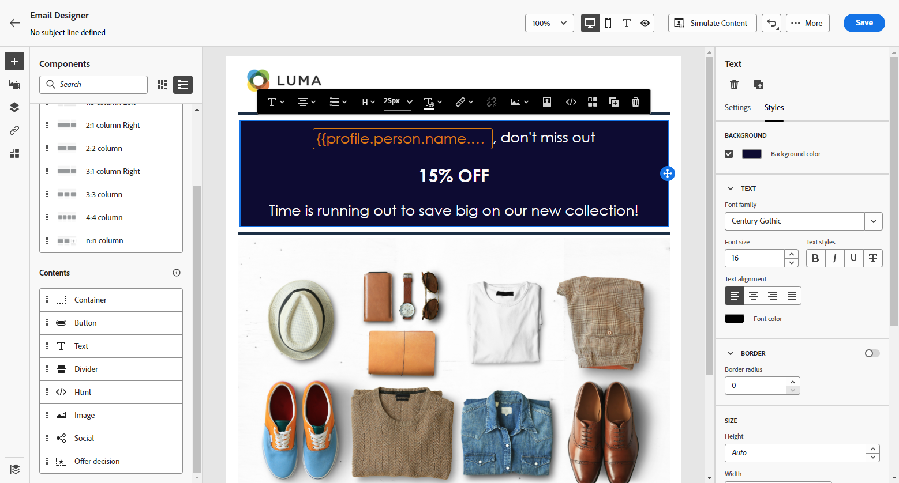
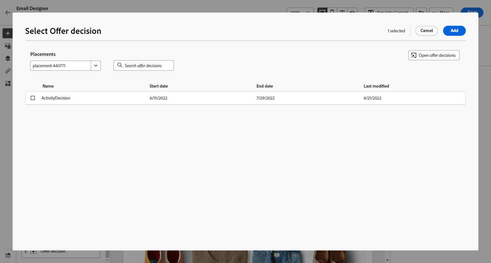

# Uso de los componentes de contenido del Diseñador de correo electrónico {#content-components}

>[!CONTEXTUALHELP]
>id="ac_content_components_email"
>title="Acerca de los componentes de contenido"
>abstract="Los componentes de contenido son marcadores de posición de contenido vacíos que se pueden utilizar para crear el diseño de un correo electrónico."

>[!CONTEXTUALHELP]
>id="ac_content_components_landing_page"
>title="Acerca de los componentes de contenido"
>abstract="Los componentes de contenido son marcadores de posición de contenido vacíos que se pueden utilizar para crear el diseño de una página de aterrizaje."

>[!CONTEXTUALHELP]
>id="ac_content_components_fragment"
>title="Acerca de los componentes de contenido"
>abstract="Los componentes de contenido son marcadores de posición de contenido vacíos que se pueden utilizar para crear el diseño de un fragmento."

>[!CONTEXTUALHELP]
>id="ac_content_components_template"
>title="Acerca de los componentes de contenido"
>abstract="Los componentes de contenido son marcadores de posición de contenido vacíos que se pueden utilizar para crear el diseño de una plantilla."

Al crear el contenido del correo electrónico, **[!UICONTROL Componentes de contenido]** le permite personalizar aún más el correo electrónico con componentes sin procesar que puede editar una vez colocados en un correo electrónico.

Puede añadir tantos componentes de contenido como necesite dentro de uno o varios componentes de estructura, que definen el diseño del correo electrónico.

## Añadir componentes de contenido {#add-content-components}

Para añadir componentes de contenido al correo electrónico y ajustarlos a sus necesidades, siga los pasos a continuación.

1. En el Diseñador de correo electrónico, utilice un contenido existente o arrastre y suelte **[!UICONTROL Componentes de estructura]** en el contenido vacío para definir el diseño del correo electrónico. [Descubra cómo](content-from-scratch.md)

1. Para acceder a la **[!UICONTROL Componentes de contenido]** , seleccione el botón correspondiente en el panel izquierdo del Diseñador de correo electrónico.

   

1. Arrastre y suelte los componentes de contenido que desee dentro de los componentes de estructura relevantes.

   

   >[!NOTE]
   >
   >Puede añadir varios componentes en un único componente de estructura y en cada columna de un componente de estructura.

1. Ajuste los atributos de estilo para cada componente mediante el **[!UICONTROL Configuración]** y **[!UICONTROL Estilo]** a la derecha. Por ejemplo, puede cambiar el estilo, el relleno o el margen del texto de cada componente. [Obtenga más información sobre la alineación y el relleno](alignment-and-padding.md)

   

1. Desde el menú avanzado de su **[!UICONTROL Componente de contenido]**, puede eliminar o duplicar fácilmente cualquier componente de contenido según sea necesario.

   

## Contenedor {#container}

Para aplicar un estilo específico a un grupo de componentes de contenido, puede agregar una **[!UICONTROL Contenedor]** y, a continuación, añada los componentes de contenido que desee dentro de él. Esto le permite aplicar un estilo distinto al contenedor, que diferirá del estilo aplicado a los componentes de contenido dentro de.

Por ejemplo, agregue un **[!UICONTROL Contenedor]** y, a continuación, agregue un [Botón](#button) dentro de ese contenedor. Puede utilizar un fondo específico para el contenedor y otro para el botón .

## Botón {#button}

Utilice la variable **[!UICONTROL Botón]** para insertar uno o varios botones en el correo electrónico y redirigir la audiencia de correo electrónico a otra página.

1. De **[!UICONTROL Componentes de contenido]**, arrastre y suelte el **[!UICONTROL Botón]** en un **[!UICONTROL Componente de estructura]**.

1. Haga clic en el botón recién agregado para personalizar el texto y tener acceso al **[!UICONTROL Configuración]** y **[!UICONTROL Estilos]** en el panel derecho del Diseñador de correo electrónico.

   

1. En el **[!UICONTROL Vínculo]** , añada la dirección URL a la que desee redirigir al hacer clic en el botón .

1. Elija cómo se redirigirá a su audiencia con la variable **[!UICONTROL Target]** lista desplegable:

   * **[!UICONTROL Ninguna]**: abre el vínculo en el mismo marco en el que se hizo clic (predeterminado).
   * **[!UICONTROL En blanco]**: abre el vínculo en una nueva ventana o pestaña.
   * **[!UICONTROL Self]**: abre el vínculo en el mismo marco en el que se hizo clic.
   * **[!UICONTROL Principal]**: abre el vínculo en el marco principal.
   * **[!UICONTROL Superior]**: abre el vínculo en todo el cuerpo de la ventana.

   

1. Puede personalizar aún más el botón cambiando atributos de estilo como **[!UICONTROL Borde]**, **[!UICONTROL Tamaño]**, **[!UICONTROL Margen]**, etc. de la variable **[!UICONTROL Configuración de componentes]** panel.

## Texto {#text}

Utilice la variable **[!UICONTROL Texto]** para insertar texto en el correo electrónico y ajustar el estilo (borde, tamaño, relleno, etc.) usando la variable **[!UICONTROL Estilos]** pestaña .

1. De **[!UICONTROL Componentes de contenido]**, arrastre y suelte el **[!UICONTROL Texto]** en un **[!UICONTROL Componente de estructura]**.

1. Haga clic en el componente recién agregado para personalizar el texto y tener acceso al **[!UICONTROL Configuración]** y **[!UICONTROL Estilos]** en el panel derecho del Diseñador de correo electrónico.

1. Cambie el texto con las siguientes opciones disponibles en la barra de herramientas:

   

   * **[!UICONTROL Cambiar estilo de texto]**: aplique negrita, cursiva, subrayado o tachado al texto.
   * **Cambiar alineación**: elija entre alineación izquierda, derecha, centro o justificada para el texto.
   * **[!UICONTROL Crear lista]**: añada viñetas o listas numéricas al texto.
   * **[!UICONTROL Definir encabezado]**: añada hasta seis niveles de encabezado al texto.
   * **Tamaño de fuente**: seleccione el tamaño de fuente del texto en píxeles.
   * **[!UICONTROL Cambiar color de fuente]**: elija el color de la fuente.
   * **[!UICONTROL Insertar vínculo]**: añada cualquier tipo de vínculo al contenido.
   * **[!UICONTROL Editar imagen]**: añada una imagen o un recurso al componente de texto. [Obtenga más información sobre la administración de recursos](assets-essentials.md)
   * **[!UICONTROL Cambiar color de fuente]**: elija el color de la fuente.
   * **[!UICONTROL Añadir personalización]**: añada campos personalizados para personalizar el contenido de los datos de perfiles. [Descubra más información sobre la personalización del contenido](../personalization/personalize.md)
   * **[!UICONTROL Mostrar el código fuente]**: muestre el código fuente del texto. No se puede modificar.
   * **[!UICONTROL Habilitar contenido condicional]**: añada contenido condicional para adaptar el contenido del componente a los perfiles de destino. [Descubra más información sobre el contenido dinámico](../personalization/get-started-dynamic-content.md)
   * **[!UICONTROL Duplicar]**: añada una copia del componente de texto.
   * **[!UICONTROL Eliminar]**: elimine el componente de texto seleccionado del correo electrónico.

1. Ajuste los demás atributos de estilo, como el color del texto, la familia de fuentes, el borde, el relleno, el margen, etc. de la variable **[!UICONTROL Estilos]** pestaña .

   

## Divisor {#divider}

Utilice la variable **[!UICONTROL Divisor]** para insertar una línea divisoria y organizar el diseño y el contenido del correo electrónico.

Puede ajustar atributos de estilo, como el color de la línea, el estilo y la altura desde la **[!UICONTROL Configuración]** y **[!UICONTROL Estilos]** pestañas.

## HTML {#HTML}

Utilice la variable **[!UICONTROL HTML]** para copiar y pegar las diferentes partes del HTML existente. Esto le permite crear componentes de HTML modulares gratuitos para reutilizar contenido externo.

1. De **[!UICONTROL Componentes de contenido]**, arrastre y suelte el **[!UICONTROL HTML]** en un **[!UICONTROL Componente de estructura]**.

1. Haga clic en el componente recién agregado y, a continuación, seleccione **[!UICONTROL Mostrar el código fuente]** de la barra de herramientas contextual para añadir el HTML.

   

1. Copie y pegue el código del HTML que desee añadir al correo electrónico y haga clic en **[!UICONTROL Guardar]**.

   

>[!NOTE]
>
>Para hacer que un contenido externo sea compatible con el Diseñador de correo electrónico, Adobe recomienda crear un mensaje desde cero y copiar el contenido del correo electrónico existente en los componentes.

## Imagen {#image}

Utilice la variable **[!UICONTROL Imagen]** para insertar un archivo de imagen del equipo en el contenido del correo electrónico.

1. De **[!UICONTROL Componentes de contenido]**, arrastre y suelte el **[!UICONTROL Imagen]** en un **[!UICONTROL Componente de estructura]**.

   

1. Haga clic en **[!UICONTROL Examinar]** para elegir un archivo de imagen de los recursos.

   Para obtener más información sobre [!DNL Assets Essentials], consulte [Documentación de Adobe Experience Manager Assets Essentials](https://experienceleague.adobe.com/docs/experience-manager-assets-essentials/help/introduction.html){target="_blank"}.

1. Haga clic en el componente recién agregado y configure las propiedades de la imagen desde el **[!UICONTROL Configuración]** pestaña:

   * **[!UICONTROL Título de imagen]** permite definir un título para la imagen.
   * **[!UICONTROL Texto alternativo]** permite definir el rótulo vinculado a la imagen. Esto corresponde al atributo del HTML alternativo.

   

1. También puede elegir **[!UICONTROL Buscar fotos similares de Stock]**. [Más información](stock.md)

1. En el **[!UICONTROL Estilos]** , ajuste los demás atributos de estilo, como margen, borde, etc. o agregando un vínculo para redirigir a la audiencia a otro contenido de la **[!UICONTROL Configuración de componentes]** panel.

## Social {#social}

Utilice la variable **[!UICONTROL Social]** para insertar vínculos a páginas de medios sociales en el contenido del correo electrónico.

1. De **[!UICONTROL Componentes de contenido]**, arrastre y suelte el **[!UICONTROL Social]** en un **[!UICONTROL Componente de estructura]**.

1. Seleccione el componente recién agregado.

1. En el **[!UICONTROL Social]** del campo **[!UICONTROL Configuración]** , elija qué medios sociales desea agregar o eliminar.

   

1. Elija el tamaño de los iconos a través del campo dedicado.

1. Haga clic en cada uno de los iconos de los medios sociales para configurar la variable **[!UICONTROL URL]** al que se redirigirá la audiencia.

   

1. También puede cambiar los iconos de cada uno de los medios sociales si es necesario desde Assets.

1. Ajuste los demás atributos de estilo, como estilo, margen, borde, etc. de la variable **[!UICONTROL Estilos]** pestaña .

## Decisión de oferta {#offer-decision}

Utilice la variable **[!UICONTROL Decisión de oferta]** para insertar ofertas en los mensajes. La variable [gestión de decisiones](../offers/get-started/starting-offer-decisioning.md) El motor de búsqueda elegirá la mejor oferta para enviarla a sus clientes.

1. De **[!UICONTROL Componentes de contenido]**, arrastre y suelte el **[!UICONTROL Decisión de oferta]** en un **[!UICONTROL Componente de estructura]**.

1. Haga clic en **[!UICONTROL Agregar]** para seleccionar el **[!UICONTROL Decisión de oferta]**.

   

1. En la lista desplegable , seleccione su **[!UICONTROL Ubicaciones]**.  A continuación, seleccione la variable **[!UICONTROL Decisión de oferta]** desea añadir al contenido y hacer clic en **[!UICONTROL Agregar]**.

   

1. En el **[!UICONTROL Decisión de oferta]** , puede obtener una vista previa o cambiar la oferta insertada.

Aprenda a añadir ofertas personalizadas a un correo electrónico en [esta sección](add-offers-email.md).

>[!IMPORTANT]
>
>Si se realizan cambios en una decisión de oferta que se está utilizando en el mensaje de un recorrido, debe cancelar la publicación del recorrido y volver a publicarlo.  Esto garantizará que los cambios se incorporen al mensaje del recorrido y que el mensaje sea coherente con las últimas actualizaciones.
