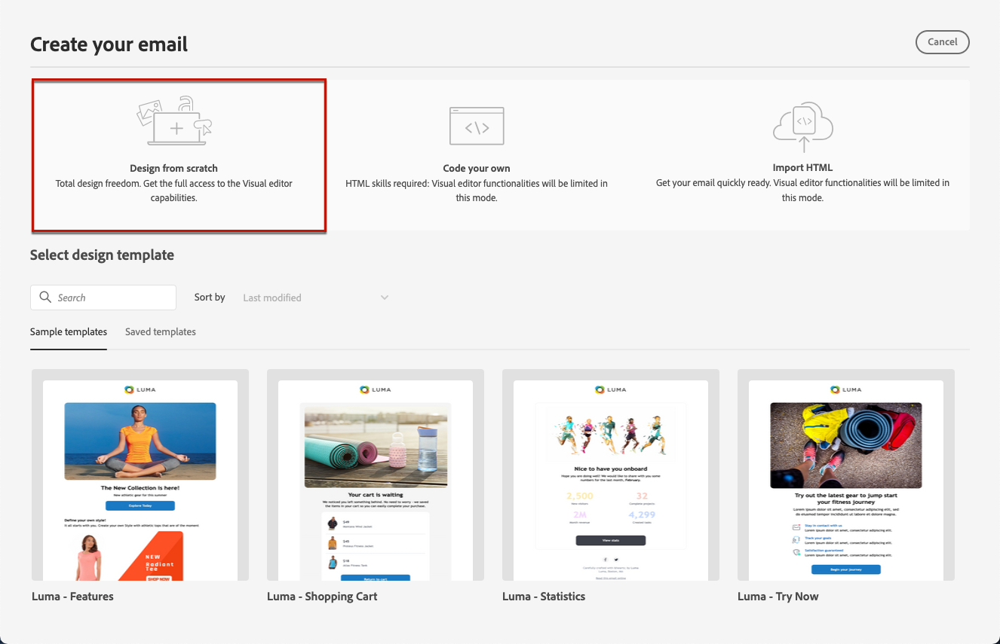
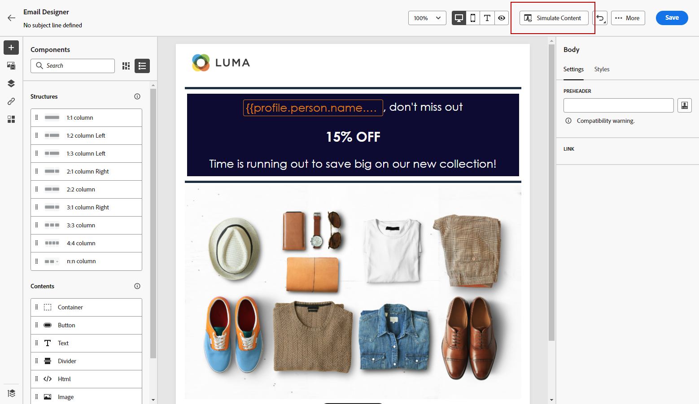

# Diseño del contenido desde cero con el Diseñador de correo electrónico {#content-from-scratch}

>[!BEGINSHADEBOX]

**En esta página:** Aprenda a diseñar contenido de correo electrónico desde cero en Adobe Journey Optimizer Email Designer agregando estructuras y componentes de contenido y, a continuación, personalizando y previsualizando el correo electrónico.

>[!ENDSHADEBOX]

>[!CONTEXTUALHELP]
>id="ac_structure_components_email"
>title="Adición de componentes de estructura"
>abstract="Los componentes de estructura definen el diseño del correo electrónico. Arrastre y suelte un componente **Estructura** en el lienzo para empezar a diseñar el contenido del correo electrónico."

>[!CONTEXTUALHELP]
>id="ac_structure_components_landing_page"
>title="Adición de componentes de estructura"
>abstract="Los componentes de estructura definen el diseño de la página de destino. Arrastre y suelte un componente **Estructura** en el lienzo para empezar a diseñar el contenido de la página de destino."

>[!CONTEXTUALHELP]
>id="ac_structure_components_fragment"
>title="Adición de componentes de estructura"
>abstract="Los componentes de estructura definen el diseño del fragmento. Arrastre y suelte un componente **Estructura** en el lienzo para empezar a diseñar el contenido del fragmento."

>[!CONTEXTUALHELP]
>id="ac_structure_components_template"
>title="Adición de componentes de estructura"
>abstract="Los componentes de estructura definen el diseño de la plantilla. Arrastre y suelte un componente **Estructura** en el lienzo para empezar a diseñar el contenido de la plantilla."

>[!CONTEXTUALHELP]
>id="ac_edition_columns_email"
>title="Definición de columnas de correo electrónico"
>abstract="El diseñador de correo electrónico permite definir fácilmente el diseño del correo electrónico mediante la selección de la estructura de columnas."

>[!CONTEXTUALHELP]
>id="ac_edition_columns_landing_page"
>title="Definición de columnas de página de destino"
>abstract="El diseñador permite definir fácilmente el diseño de la página de destino mediante la selección de la estructura de columnas."

>[!CONTEXTUALHELP]
>id="ac_edition_columns_fragment"
>title="Definición de columnas de fragmento"
>abstract="El diseñador permite definir fácilmente el diseño del fragmento mediante la selección de la estructura de columnas."

>[!CONTEXTUALHELP]
>id="ac_edition_columns_template"
>title="Definición de columnas de plantilla"
>abstract="El diseñador permite definir fácilmente el diseño de la plantilla mediante la selección de la estructura de columnas."

Use el Designer de correo electrónico [!DNL Adobe Journey Optimizer] para definir fácilmente la estructura de su contenido. Al agregar y mover elementos estructurales con simples acciones de arrastrar y soltar, puede diseñar la forma del contenido en cuestión de segundos.

>[!NOTE]
>
>La [Ley de accesibilidad europea](https://eur-lex.europa.eu/legal-content/EN/TXT/?uri=CELEX%3A32019L0882){target="_blank"} estipula que todas las comunicaciones digitales deben ser accesibles. Asegúrese de seguir las directrices específicas que se enumeran en [esta página](accessible-content.md) al diseñar contenido en [!DNL Journey Optimizer].

Para empezar a crear contenido, siga los pasos a continuación:

1. En la página de inicio de Designer, seleccione la opción **[!UICONTROL Diseñar desde cero]**.

   

1. Para empezar rápidamente, usa **[!UICONTROL Módulos]** —bloques de contenido prediseñados y listos para usar, como encabezados, secciones a pantalla completa y pies de página— para acelerar la creación de correo electrónico y mantener la coherencia visual de tus campañas. [Más información sobre los módulos](email-modules.md)

   

1. De lo contrario, diseñe el contenido arrastrando y soltando **[!UICONTROL Estructuras]** en el lienzo para definir el diseño del correo electrónico.

   >[!TIP]
   >
   >También puedes acelerar la creación de correos electrónicos con Generar contenido para generar contenido de correo electrónico completo, incluidos texto e imágenes, con [Generar contenido completo con IA](../content-management/generative-full-content.md). A continuación, puede ir directamente a la vista previa y validación del contenido.

1. Agregue tantas **[!UICONTROL estructuras]** como sea necesario y edite su configuración en el panel dedicado de la derecha.

   

   >[!NOTE]
   >
   >En pantallas estrechas (por ejemplo, móviles), las columnas se apilan verticalmente de forma predeterminada para facilitar la lectura. Algunos clientes de correo electrónico no admiten este comportamiento, en cuyo caso las columnas permanecen una al lado de la otra. También puede desactivarlo usando la opción **[!UICONTROL No apilar columnas en el móvil]** en la pestaña **[!UICONTROL Configuración]**.

1. La mayoría de las estructuras (**[!UICONTROL 1:1 column]**, **[!UICONTROL 2:2 column]**, **[!UICONTROL 1:2 column Left]**, etc.) son ajustes preestablecidos fijos. Seleccione el componente **[!UICONTROL n:n column]** en su lugar para definir cualquier número de columnas de su elección (entre 3 y 10).

   

   Puede aumentar las **[!UICONTROL Columnas número]** de una estructura existente en cualquier momento desde la ficha **[!UICONTROL Configuración]**, incluso después de agregarle contenido: el contenido existente se conserva en lugar de perderse.

   También puede ajustar el ancho de cada columna directamente en el lienzo o editando los porcentajes en la ficha **[!UICONTROL Configuración]**.

   >[!NOTE]
   >
   >Cada tamaño de columna no puede ser inferior al 10 % de la anchura total del componente de la estructura. No se puede quitar una columna que no esté vacía.

1. Desde la sección **[!UICONTROL Contents]**, agregue tantos elementos como necesite a uno o más componentes de estructura. [Más información sobre los componentes de contenido](content-components.md)

1. Cada componente se puede personalizar aún más mediante las fichas **[!UICONTROL Configuración]** o **[!UICONTROL Estilo]** del menú derecho. Por ejemplo, puede cambiar el estilo, el relleno o el margen del texto de cada componente. [Obtenga más información sobre la alineación y el relleno](alignment-and-padding.md)

   

1. Desde el **[!UICONTROL Selector de recursos]**, puede seleccionar directamente los recursos almacenados en la **[!UICONTROL biblioteca de Assets]**. [Más información acerca de la administración de recursos](../integrations/assets.md)

   Haga doble clic en la carpeta que contiene los recursos. Arrástrelos y suéltelos en un componente de estructura.

   

1. Inserte campos de personalización para personalizar el contenido a partir de atributos de perfiles, suscripciones a audiencias, atributos contextuales, etc. [Más información sobre la personalización de contenido](../personalization/personalize.md)

   

1. Haga clic en **[!UICONTROL Habilitar contenido de condición]** para agregar contenido dinámico y adaptar el contenido a los perfiles de destino según las reglas condicionales. [Introducción al contenido dinámico](../personalization/get-started-dynamic-content.md)

   

1. Haga clic en la ficha **[!UICONTROL Vínculos]** del panel izquierdo para mostrar todas las direcciones URL del contenido de las que se realizará un seguimiento. Puede modificar su **[!UICONTROL tipo de seguimiento]** o **[!UICONTROL etiqueta]** y agregar **[!UICONTROL etiquetas]** si es necesario. [Más información sobre los vínculos y el seguimiento](message-tracking.md)

   

1. Si es necesario, puede personalizar aún más el correo electrónico haciendo clic en **[!UICONTROL Cambiar al editor de código]** en el menú avanzado. Esto le permite editar el código fuente del correo electrónico, por ejemplo, para agregar etiquetas HTML personalizadas o de seguimiento. [Obtenga más información sobre el editor de código](code-content.md)

   >[!CAUTION]
   >
   >No puede volver al diseñador visual para este correo electrónico después de cambiar al editor de código.

1. Una vez que el contenido esté listo, utilice cualquiera de los métodos de simulación para comprobar la renderización. Puede elegir la vista de escritorio o la vista móvil. Encontrará información detallada en la sección [Administración de contenido](../content-management/preview-test.md).

   

1. También puede validar la calidad del contenido para evaluar la legibilidad, la eficacia y la coherencia del contenido. [Más información sobre la validación de calidad del contenido](../content-management/brands-score.md#validate-quality)

1. Cuando el contenido esté listo, haz clic en **[!UICONTROL Guardar]**.

{{$include /help/_includes/do-not-localize/email/ai-augmented-content-from-scratch.md}}
