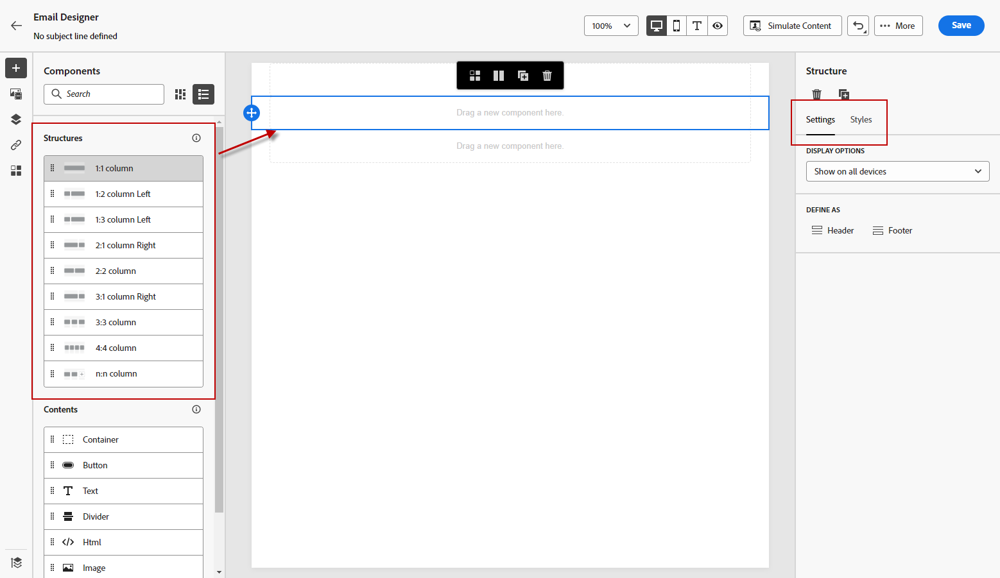

# Empezar desde cero {#content-from-scratch}

>[!CONTEXTUALHELP]
>id="ac_structure_components_email"
>title="Acerca de los componentes de estructura"
>abstract="Los componentes de estructura definen el diseño del correo electrónico."

>[!CONTEXTUALHELP]
>id="ac_structure_components_landing_page"
>title="Acerca de los componentes de estructura"
>abstract="Los componentes de estructura definen el diseño de la página de aterrizaje."

>[!CONTEXTUALHELP]
>id="ac_structure_components_fragment"
>title="Acerca de los componentes de estructura"
>abstract="Los componentes de estructura definen el diseño del fragmento."

>[!CONTEXTUALHELP]
>id="ac_structure_components_template"
>title="Acerca de los componentes de estructura"
>abstract="Los componentes de estructura definen el diseño de la plantilla."

>[!CONTEXTUALHELP]
>id="ac_edition_columns_email"
>title="Definición de columnas de correo electrónico"
>abstract="El Diseñador de correo electrónico permite definir fácilmente el diseño del correo electrónico definiendo la estructura de columnas."

>[!CONTEXTUALHELP]
>id="ac_edition_columns_landing_page"
>title="Definición de columnas de página de aterrizaje"
>abstract="El Diseñador de correo electrónico le permite definir fácilmente el diseño de la página de aterrizaje mediante la definición de la estructura de columnas."

>[!CONTEXTUALHELP]
>id="ac_edition_columns_fragment"
>title="Definición de columnas de fragmento"
>abstract="El Diseñador de correo electrónico le permite definir fácilmente el diseño del fragmento definiendo la estructura de la columna."

>[!CONTEXTUALHELP]
>id="ac_edition_columns_template"
>title="Definición de columnas de plantilla"
>abstract="El Diseñador de correo electrónico le permite definir fácilmente el diseño de la plantilla mediante la definición de la estructura de columnas."

El Diseñador de correo electrónico le permite definir fácilmente la estructura del correo electrónico. Al agregar y mover elementos estructurales con simples acciones de arrastrar y soltar, puede diseñar la forma de su correo electrónico en cuestión de segundos.

Para empezar a crear el contenido del correo electrónico, siga los pasos a continuación:

1. En la página de inicio del Diseñador de correo electrónico, seleccione la opción **[!UICONTROL Diseño desde cero]** .

   

1. Empiece a diseñar el contenido del correo electrónico arrastrando y soltando **[!UICONTROL Componentes de estructura]** en el lienzo para definir el diseño del correo electrónico.

   >[!NOTE]
   >
   >El apilamiento de columnas no es compatible con todos los programas de correo electrónico. Cuando no se admita, las columnas no se apilarán.

   <!--Once placed in the email, you cannot move nor remove your components unless there is already a content component or a fragment placed inside. This is not true in AJO - TBC?-->

1. Agregar tantos **[!UICONTROL Componentes de estructura]** según sea necesario y edite su configuración en el panel dedicado de la derecha.

   

   Seleccione el **[!UICONTROL columna n:n]** para definir el número de columnas que elija (entre 3 y 10). También puede definir el ancho de cada columna moviendo las flechas en la parte inferior de cada columna.

   >[!NOTE]
   >
   >Cada tamaño de columna no puede ser inferior al 10 % de la anchura total del componente de estructura. No se puede quitar una columna que no esté vacía.

1. En el **[!UICONTROL Componentes de contenido]** añada todos los elementos que necesite en uno o varios componentes de estructura. [Descubra más información sobre los componentes de contenido](content-components.md)

1. Cada componente se puede personalizar aún más mediante el **[!UICONTROL Configuración]** o **[!UICONTROL Estilo]** en el menú de la derecha. Por ejemplo, puede cambiar el estilo, el relleno o el margen del texto de cada componente. [Obtenga más información sobre la alineación y el relleno](alignment-and-padding.md)

   

1. En el **[!UICONTROL Selector de recursos]**, puede seleccionar directamente los recursos almacenados en la variable **[!UICONTROL Biblioteca de activos]**. [Obtenga más información sobre la administración de recursos](assets-essentials.md)

   Haga doble clic en la carpeta que contiene los recursos. Arrástrelos y suéltelos en un componente de estructura.

   

1. Inserte campos de personalización para personalizar el contenido del correo electrónico a partir de los datos de perfiles. [Descubra más información sobre la personalización del contenido](../personalization/personalize.md)

   

1. Haga clic en **[!UICONTROL Habilitar contenido de condición]** para añadir contenido dinámico y adaptar el contenido a los perfiles de destino según las reglas condicionales. [Introducción al contenido dinámico](../personalization/get-started-dynamic-content.md)

   

1. Haga clic en el **[!UICONTROL Vínculos]** del panel izquierdo para mostrar todas las direcciones URL del contenido que se rastreará. Puede modificar sus **[!UICONTROL Tipo de seguimiento]** o **[!UICONTROL Etiqueta]** y agregue **[!UICONTROL Etiquetas]** si es necesario. [Obtenga más información sobre los vínculos y el seguimiento de mensajes](message-tracking.md)

   

1. Puede personalizar aún más el correo electrónico haciendo clic en **[!UICONTROL Cambiar al editor de código]** en el menú avanzado. [Obtenga más información sobre el editor de código](code-content.md)

   

   >[!CAUTION]
   >
   >No podrá volver al diseñador visual para este correo electrónico después de cambiar al editor de código.

1. Una vez que el contenido esté listo, haga clic en **[!UICONTROL Simular contenido]** para comprobar la renderización del correo electrónico. Puede elegir la vista de escritorio o la vista móvil. [Obtenga más información sobre la vista previa del correo electrónico](preview.md)

   

1. Cuando el correo electrónico esté listo, haga clic en **[!UICONTROL Guardar]**.

