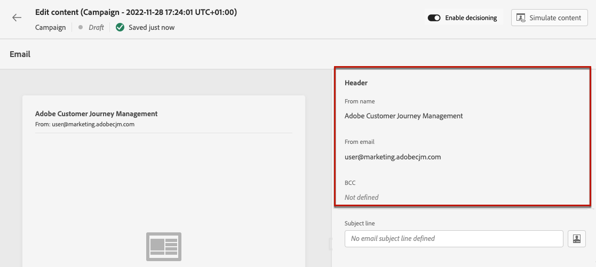
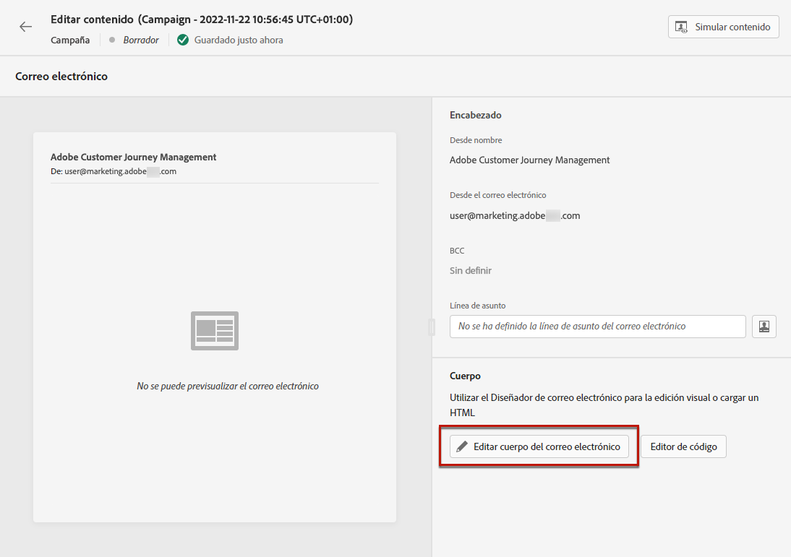

# Creación de un correo electrónico {#create-email}

>[!CONTEXTUALHELP]
>id="ajo_message_email"
>title="Creación de correo electrónico"
>abstract="Defina la línea de asunto del correo electrónico y abra el diseñador de correo electrónico para crear su contenido."

## Añadir una acción de correo electrónico {#email-action}

Para crear un correo electrónico en [!DNL Journey Optimizer], agregue una acción **[!UICONTROL Enviar correo electrónico]** a un recorrido o a una campaña. A continuación, siga los pasos que se indican a continuación según su caso.

>[!BEGINTABS]

>[!TAB Agregar un correo electrónico a un recorrido]

1. Abra el recorrido y, a continuación, arrastre y suelte una actividad **[!UICONTROL Correo electrónico]** desde la sección **[!UICONTROL Acciones]** de la paleta.

1. Proporcione información básica sobre el mensaje (etiqueta, descripción, categoría).

1. Elija o cree la [configuración de correo electrónico](email-settings.md).

   

   El campo se rellena previamente de forma predeterminada con la última configuración que el usuario utilizó para ese canal.

>[!NOTE]
>
>Puede utilizar la opción Optimización del tiempo de envío para predecir el mejor momento para enviar el mensaje y maximizar la participación en función de la apertura histórica y las tasas de clics. [Aprenda a trabajar con la optimización del tiempo de envío](../building-journeys/send-time-optimization.md)

Para obtener más información sobre cómo configurar un recorrido, consulte [esta página](../building-journeys/journey-gs.md).

>[!TAB Agregar un correo electrónico a una campaña]

1. Cree una nueva campaña programada o desencadenada por API y seleccione **[!UICONTROL Correo electrónico]** como acción.

1. Complete los pasos para crear una campaña de correo electrónico, como las propiedades de campaña, [audiencia](../audience/about-audiences.md) y [programación](../campaigns/create-campaign.md#schedule).

   

1. Seleccione la acción **[!UICONTROL Correo electrónico]**.

1. Seleccione o cree la configuración de correo electrónico. [Más información](email-settings.md)

   

<!--
From the **[!UICONTROL Action]** section, specify if you want to track how your recipients react to your delivery: you can track email opens, and/or clicks on links and buttons in your email.

-->

Para obtener más información sobre cómo configurar una campaña, consulte [esta página](../campaigns/get-started-with-campaigns.md).

>[!ENDTABS]

## Definición del contenido del correo electrónico {#define-email-content}

<!-- update the quarry component with right ID value-->

>[!CONTEXTUALHELP]
>id="test_id"
>title="Configurar el contenido del correo electrónico"
>abstract="Cree el contenido del correo electrónico. Defina su asunto y, a continuación, aproveche el diseñador de correo electrónico para crear y personalizar el cuerpo del correo electrónico."

1. En la pantalla de configuración del recorrido o la campaña, haga clic en el botón **[!UICONTROL Editar contenido]** para configurar el contenido del correo electrónico. [Más información](get-started-email-design.md)

   

1. Alterne **[!UICONTROL Habilitar toma de decisiones]** si desea agregar directivas de decisión al correo electrónico.

   Las políticas de decisión son contenedores para sus ofertas que aprovechan el motor de decisión para devolver dinámicamente el mejor contenido para entregar a cada miembro de la audiencia. [Aprenda a agregar una directiva de decisión en un correo electrónico](../experience-decisioning/create-decision.md#add)

   

   >[!AVAILABILITY]
   >
   >Por ahora, la creación de políticas de decisión en correos electrónicos no está disponible para las organizaciones que han adquirido las ofertas adicionales de Adobe Healthcare Shield o Privacy and Security Shield.

1. En la sección **[!UICONTROL Header]**, compruebe los campos **[!UICONTROL From name]**, **[!UICONTROL From email]** y **[!UICONTROL BCC]**. Se configuran en la configuración de correo electrónico seleccionada. [Más información](email-settings.md) <!--check if same for journey-->

   

1. Añada una línea de asunto al mensaje. Para configurar y personalizar la línea de asunto con el editor de personalización, haga clic en el icono **[!UICONTROL Abrir diálogo de personalización]**. [Más información](../personalization/personalization-build-expressions.md)

   >[!NOTE]
   >
   >La línea de asunto es obligatoria. No debe incluir saltos de línea.

1. Haga clic en el botón **[!UICONTROL Editar cuerpo del correo electrónico]** para acceder al Designer de correo electrónico y comenzar a crear su contenido. [Más información](get-started-email-design.md)

   

1. Si está en una campaña, también puede hacer clic en el botón **[!UICONTROL Editor de código]** para codificar su propio contenido en HTML sin formato mediante la ventana emergente que se muestra.

   

   >[!NOTE]
   >
   >Si ya ha creado o importado contenido a través de Designer de correo electrónico, este contenido se mostrará en HTML.

## Comprobación de alertas {#check-email-alerts}

A medida que diseña los mensajes, se muestran alertas en la interfaz (en la parte superior derecha de la pantalla) cuando falta la configuración clave.

>[!NOTE]
>
>Si no ve este botón, no se ha detectado ninguna alerta.

A continuación se enumeran los ajustes y elementos comprobados por el sistema. También encontrará información sobre cómo adaptar la configuración para resolver los problemas correspondientes.

Pueden producirse dos tipos de alertas:

* **Advertencias** hacen referencia a recomendaciones y prácticas recomendadas, como:

   * **[!UICONTROL El vínculo de no participación no está presente en el cuerpo del correo electrónico]**: se recomienda agregar un vínculo para darse de baja al cuerpo del correo electrónico. Aprenda a configurarla en [esta sección](../privacy/opt-out.md#opt-out-management).

     >[!NOTE]
     >
     >Los mensajes de correo electrónico de tipo marketing deben incluir un vínculo de no participación, que no es necesario para los mensajes transaccionales. La categoría del mensaje (**[!UICONTROL Marketing]** o **[!UICONTROL Transaccional]**) se define en el nivel de [configuración de canal](email-settings.md#email-type) y cuando [crea el mensaje](#create-email-journey-campaign) a partir de un recorrido o una campaña.

   * **[!UICONTROL La versión de texto de HTML está vacía]**: no olvide definir una versión de texto de su cuerpo de correo electrónico, ya que se utilizará cuando el contenido de HTML no se pueda mostrar. Aprenda a crear la versión de texto en [esta sección](text-version-email.md).

   * **[!UICONTROL El vínculo vacío está presente en el cuerpo del correo electrónico]**: compruebe que todos los vínculos del correo electrónico sean correctos. Aprenda a administrar contenido y vínculos en [esta sección](content-from-scratch.md).

   * **[!UICONTROL El tamaño del correo electrónico ha superado el límite de 100 KB]**: para una entrega óptima, asegúrese de que el tamaño del correo electrónico no supere los 100 KB. Aprenda a editar el contenido del correo electrónico en [esta sección](content-from-scratch.md).

* **Los errores** le impiden probar o activar el recorrido o la campaña siempre y cuando no se resuelvan, por ejemplo:

   * **[!UICONTROL Falta la línea de asunto]**: la línea de asunto del correo electrónico es obligatoria. Aprenda a definirlo y personalizarlo en [esta sección](create-email.md).

  <!--HTML is empty when Amp HTML is present-->

   * **[!UICONTROL La versión de correo electrónico del mensaje está vacía]**: este error se muestra cuando no se ha configurado el contenido del correo electrónico. Aprenda a diseñar contenido de correo electrónico en [esta sección](get-started-email-design.md).

   * **[!UICONTROL la configuración no existe]**: no puede usar el mensaje si la configuración seleccionada se elimina después de la creación del mensaje. Si se produce este error, seleccione otra configuración en el mensaje **[!UICONTROL Propiedades]**. Obtenga más información acerca de las configuraciones de canal en [esta sección](../configuration/channel-surfaces.md).

>[!CAUTION]
>
>Para poder probar o activar el recorrido o la campaña por correo electrónico, debes resolver todas las alertas de **error**.

## Compruebe y envíe su correo electrónico

Una vez definido el contenido del mensaje, puede utilizar perfiles de prueba para previsualizarlo, enviar pruebas y controlar su renderización en clientes populares de escritorio, móviles y web. Si ha insertado contenido personalizado, puede comprobar cómo se muestra este en el mensaje con los datos del perfil de prueba.

>[!NOTE]
>
>Además de los perfiles de prueba, [!DNL Journey optimizer] también le permite probar distintas variantes del contenido mediante la vista previa y el envío de pruebas utilizando datos de entrada de muestra cargados desde un archivo CSV/JSON, o agregados manualmente. [Aprenda a simular variaciones de contenido](../test-approve/simulate-sample-input.md)

Para ello, haga clic en **[!UICONTROL Simular contenido]** y añada un perfil de prueba para comprobar el mensaje con los datos del perfil de prueba.

Encontrará información detallada sobre cómo seleccionar perfiles de prueba y obtener una vista previa del contenido en la sección [Administración de contenido](../content-management/preview-test.md).

Cuando el correo electrónico esté listo, completa la configuración de tu [recorrido](../building-journeys/journey-gs.md) o [campaña](../campaigns/create-campaign.md) y actívalo para enviar el mensaje.

>[!NOTE]
>
>Para realizar un seguimiento del comportamiento de los destinatarios a través de aperturas de correo electrónico o interacciones, asegúrese de que las opciones específicas de la sección **[!UICONTROL Seguimiento]** estén habilitadas en la [actividad de correo electrónico](../building-journeys/journeys-message.md) del recorrido o en el correo electrónico [campaña](../campaigns/create-campaign.md).<!--to move?-->

<!--

## Define your email content {#email-content}

Use [!DNL Journey Optimizer] Email Designer to [design your email from scratch](../email/content-from-scratch.md). If you have an existing content, you can [import it in the Email Designer](../email/existing-content.md), or [code your own content](../email/code-content.md) in [!DNL Journey Optimizer]. 

[!DNL Journey Optimizer] comes with a set of [built-in templates](email-templates.md) to help you start. Any email can also be saved as a template.

Use [!DNL Journey Optimizer] personalization editor to personalize your messages with profiles' data. For more on personalization, refer to [this section](../personalization/personalize.md).

Adapt the content of your messages to the targeted profiles by using [!DNL Journey Optimizer] dynamic content capabilities. [Get started with dynamic content](../personalization/get-started-dynamic-content.md)

## Email tracking {#email-tracking}

If you want to track the behavior of your recipients through openings and/or clicks on links, enable the following options: **[!UICONTROL Email opens]** and **[!UICONTROL Click on email]**. 

Learn more about tracking in [this section](message-tracking.md).

## Validate your email content {#email-content-validate}

Control the rendering of your email, and check personalization settings with test profiles, using the preview section on the left-hand side. For more on this, refer to [this section](preview.md).

You must also check alerts in the upper section of the editor.  Some of them are simple warnings, but others can prevent you from using the message. 

-->

