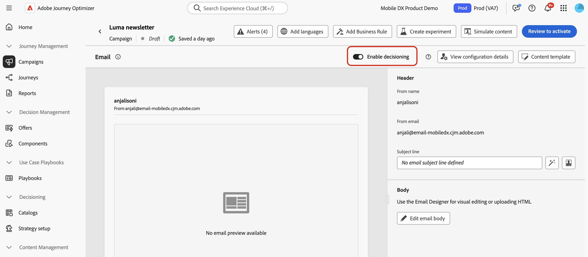
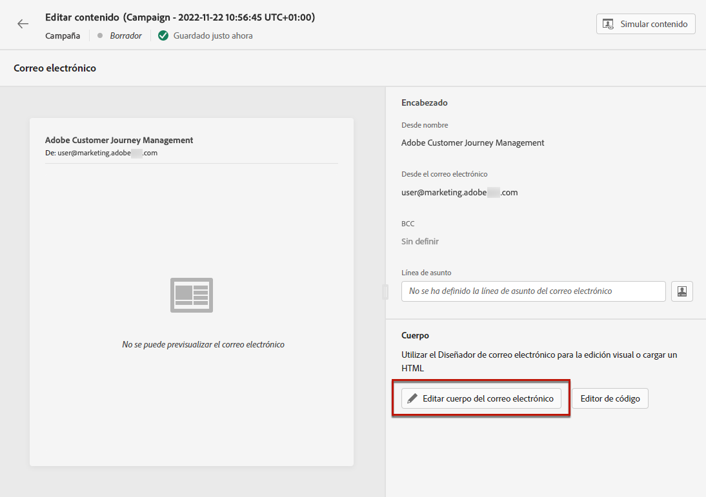
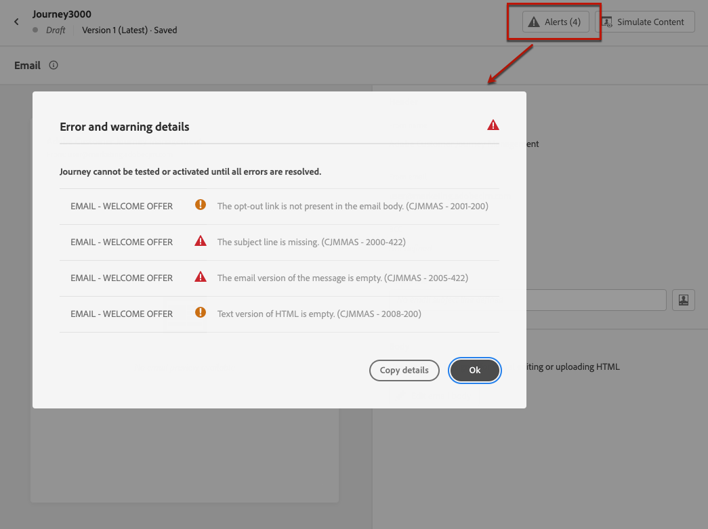

# Creación de un correo electrónico {#create-email}

>[!BEGINSHADEBOX]

**En esta página:** Aprenda a agregar una acción de correo electrónico a un recorrido o campaña en Adobe Journey Optimizer, definir su asunto y contenido, comprobar las alertas y obtener una vista previa antes de enviarlas.

>[!ENDSHADEBOX]

>[!CONTEXTUALHELP]
>id="ajo_message_email"
>title="Creación de correo electrónico"
>abstract="Defina la línea de asunto del correo electrónico y abra el diseñador de correo electrónico para crear su contenido."

## Añadir una acción de correo electrónico {#email-action}

>[!CONTEXTUALHELP]
>id="ajo_journey_action_email"
>title="Acción de correo electrónico"
>abstract="Una acción del canal de correo electrónico envía un correo electrónico a los perfiles cuando llegan a este paso del recorrido. La etiqueta identifica la actividad en el lienzo de recorrido y la acción hace referencia a una configuración de correo electrónico que define el contenido enviado. La sección **Optimization** puede incluir experimentos de contenido o reglas de segmentación, la sección **Multilingual** puede entregar contenido en varios idiomas y la sección **Timeout o error** puede definir una ruta alternativa si la acción falla."
>additional-url="https://experienceleague.adobe.com/en/docs/journey-optimizer/using/orchestrate-journeys/about-journey-building/journey-action#add-action" text="Introducción a las acciones del canal"

Para crear un correo electrónico en [!DNL Journey Optimizer], agregue una acción **[!UICONTROL Enviar correo electrónico]** a un recorrido o a una campaña. A continuación, siga los pasos que se indican a continuación según su caso.

>[!BEGINTABS]

>[!TAB Agregar un correo electrónico a un recorrido]

1. Abra el recorrido y, a continuación, arrastre y suelte una actividad **[!UICONTROL Action]** desde la sección **[!UICONTROL Actions]** de la paleta. Más información sobre la [actividad de acción](../building-journeys/journey-action.md).

   >[!IMPORTANT]
   >
   >Las actividades heredadas de canales nativos (correo electrónico, push, SMS, en la aplicación, web, experiencia basada en código y tarjeta de contenido) quedaron obsoletas a partir de la versión de marzo de 2026. Los recorridos existentes que utilizan estas actividades siguen funcionando sin ningún cambio; no se requiere ninguna migración.

1. Seleccione **[!UICONTROL Correo electrónico]** como tipo de acción.

   

1. Escriba una **[!UICONTROL etiqueta]** para identificar la acción en el lienzo de recorrido.

1. Haga clic en el botón **[!UICONTROL Configurar acción]**.

1. Se le dirigirá a la ficha **[!UICONTROL Acciones]**. A partir de ahí, seleccione o cree la configuración de correo electrónico que desee utilizar. [Más información](email-settings.md)

   

1. Además:

   * Puede aplicar reglas de límite a su acción de correo electrónico seleccionando un conjunto de reglas en la lista desplegable **[!UICONTROL Reglas de negocio]**. [Más información](../conflict-prioritization/channel-capping.md)

   * Puede usar la opción **[!DNL Send time optimization]** para predecir el mejor momento para enviar el mensaje y maximizar la participación en función de la apertura histórica y las tasas de clics. [Descubra cómo](../building-journeys/send-time-optimization.md)

1. Seleccione el botón **[!UICONTROL Editar contenido]** y cree el contenido que desee con el Designer de correo electrónico. [Más información](#define-email-content)

1. Volver al lienzo de recorrido. Si es necesario, complete el flujo de recorrido arrastrando y soltando acciones o eventos adicionales. [Más información](../building-journeys/about-journey-activities.md)

Para obtener más información sobre cómo crear, configurar y publicar un recorrido, consulte [esta página](../building-journeys/journey-gs.md).

>[!TAB Agregar un correo electrónico a una campaña]

1. [Cree una campaña](../campaigns/create-campaign.md) y seleccione **[!UICONTROL Correo electrónico]** como acción.

1. Complete los pasos para crear una campaña de correo electrónico, como las propiedades de campaña, [audiencia](../audience/about-audiences.md) y [programación](../campaigns/campaign-schedule.md).

   

1. Seleccione la acción **[!UICONTROL Correo electrónico]**.

1. Seleccione o cree la configuración de correo electrónico. [Más información](email-settings.md)

   

<!--
From the **[!UICONTROL Action]** section, specify if you want to track how your recipients react to your delivery: you can track email opens, and/or clicks on links and buttons in your email.

-->
Para obtener más información sobre cómo crear, configurar y activar una campaña, consulte [esta página](../campaigns/get-started-with-campaigns.md).

>[!ENDTABS]

## Definición del contenido del correo electrónico {#define-email-content}

<!-- update the quarry component with right ID value-->

>[!CONTEXTUALHELP]
>id="test_id"
>title="Configurar el contenido del correo electrónico"
>abstract="Cree el contenido del correo electrónico. Defina su asunto y, a continuación, aproveche el diseñador de correo electrónico para crear y personalizar el cuerpo del correo electrónico."

Después de agregar la acción de correo electrónico al recorrido o a la campaña, debe definir el contenido del correo electrónico, incluida la línea de asunto, la información del remitente y el cuerpo del correo electrónico mediante el Designer de correo electrónico. Siga estos pasos:

1. En la pantalla de configuración del recorrido o la campaña, haga clic en el botón **[!UICONTROL Editar contenido]** para configurar el contenido del correo electrónico. [Más información](get-started-email-design.md)

   

1. Alterne **[!UICONTROL Habilitar toma de decisiones]** si desea agregar directivas de decisión al correo electrónico.

   Las políticas de decisión son contenedores para sus ofertas que aprovechan el motor de tomas de decisiones para devolver de forma dinámica el mejor contenido para entregar a cada miembro del público. [Aprenda a agregar una directiva de decisión en un correo electrónico](../experience-decisioning/create-decision.md#create-decision)

   

   >[!AVAILABILITY]
   >
   >Por ahora, la creación de directivas de decisión en correos electrónicos está disponible en Disponibilidad limitada. Póngase en contacto con su representante de Adobe para obtener acceso.

1. En la sección **[!UICONTROL Header]**, compruebe los campos **[!UICONTROL From name]**, **[!UICONTROL From email]** y **[!UICONTROL BCC]**. Se configuran en la configuración de correo electrónico seleccionada. [Más información](email-settings.md) <!--check if same for journey-->

   

1. Añada una línea de asunto al mensaje. Para configurar y personalizar la línea de asunto con el editor de personalización, haga clic en el icono **[!UICONTROL Abrir diálogo de personalización]**. [Más información](../personalization/personalization-build-expressions.md)

   >[!NOTE]
   >
   >La línea de asunto es obligatoria. No debe incluir saltos de línea.

1. Haga clic en el botón **[!UICONTROL Editar cuerpo del correo electrónico]** para acceder al Designer de correo electrónico y comenzar a crear su contenido. [Más información](get-started-email-design.md)

   

1. Si está en una campaña, también puede hacer clic en el botón **[!UICONTROL Editor de código]** para codificar su propio contenido en HTML sin formato mediante la ventana emergente que se muestra.

   

   >[!NOTE]
   >
   >Si ya ha creado o importado contenido a través de Designer de correo electrónico, este contenido se mostrará en HTML.

1. Si es necesario, habilite la opción **[!UICONTROL Optimizar tamaño de HTML]** para reducir el tamaño de su HTML de correo electrónico durante el proceso de publicación. [Más información](#optimize-html-size)

## Comprobación de alertas {#check-email-alerts}

A medida que diseña los mensajes, se muestran alertas en la interfaz (en la parte superior derecha de la pantalla) cuando falta la configuración clave.

>[!NOTE]
>
>Si no ve este botón, no se ha detectado ninguna alerta.

A continuación se enumeran los ajustes y elementos comprobados por el sistema. También encontrará información sobre cómo adaptar la configuración para resolver los problemas correspondientes.

Pueden producirse dos tipos de alertas:

* **Advertencias** hacen referencia a recomendaciones y prácticas recomendadas, como:

   * **[!UICONTROL El vínculo de no participación no está presente en el cuerpo del correo electrónico]**: se recomienda agregar un vínculo para darse de baja al cuerpo del correo electrónico. Aprenda a configurarla en [esta sección](../privacy/opt-out.md#opt-out-decision-management).

     >[!NOTE]
     >
     >Los mensajes de correo electrónico de tipo marketing deben incluir un vínculo de no participación, que no es necesario para los mensajes transaccionales. La categoría del mensaje (**[!UICONTROL Marketing]** o **[!UICONTROL Transaccional]**) se define en el nivel de [configuración de canal](email-settings.md#email-type) y cuando [crea el mensaje](#create-email-journey-campaign) a partir de un recorrido o una campaña.

   * **[!UICONTROL La versión de texto de HTML está vacía]**: no olvide definir una versión de texto de su cuerpo de correo electrónico, ya que se utilizará cuando el contenido de HTML no se pueda mostrar. Aprenda a crear la versión de texto en [esta sección](text-version-email.md).

   * **[!UICONTROL El vínculo vacío está presente en el cuerpo del correo electrónico]**: compruebe que todos los vínculos del correo electrónico sean correctos. Aprenda a administrar contenido y vínculos en [esta sección](content-from-scratch.md).

   * **[!UICONTROL El tamaño del correo electrónico ha superado el límite de 100 KB]**: para una entrega óptima, asegúrese de que el tamaño del correo electrónico no supere los 100 KB. Para reducir el tamaño de HTML, usa la opción **[!UICONTROL Optimizar tamaño de HTML]**. [Más información](#optimize-html-size)

* **Los errores** le impiden probar o activar el recorrido o la campaña siempre y cuando no se resuelvan, por ejemplo:

   * **[!UICONTROL Falta la línea de asunto]**: la línea de asunto del correo electrónico es obligatoria. Aprenda a definirlo y personalizarlo en [esta sección](create-email.md).

  <!--HTML is empty when Amp HTML is present-->

   * **[!UICONTROL La versión de correo electrónico del mensaje está vacía]**: este error se muestra cuando no se ha configurado el contenido del correo electrónico. Aprenda a diseñar contenido de correo electrónico en [esta sección](get-started-email-design.md).

   * **[!UICONTROL la configuración no existe]**: no puede usar el mensaje si la configuración seleccionada se elimina después de la creación del mensaje. Si se produce este error, seleccione otra configuración en el mensaje **[!UICONTROL Propiedades]**. Obtenga más información acerca de las configuraciones de canal en [esta sección](../configuration/channel-surfaces.md).

>[!CAUTION]
>
>Para poder probar o activar el recorrido o la campaña por correo electrónico, debes resolver todas las alertas de **error**.

## Optimizar tamaño de HTML de correo electrónico {#optimize-html-size}

>[!CONTEXTUALHELP]
>id="ajo_email_minification"
>title="Reducir el tamaño de HTML"
>abstract="Active esta opción para comprimir el correo electrónico de HTML durante la publicación eliminando los espacios en blanco, la sangría y los comentarios no esenciales innecesarios. Esto ayuda a evitar el recorte del correo electrónico en clientes como Gmail, que trunca los mensajes que exceden los 100 KB. Tenga en cuenta que cuando se trabaja con correos electrónicos multilingües, esta opción está habilitada de forma predeterminada para todas las configuraciones regionales."

[!DNL Journey Optimizer] le permite comprimir su versión de HTML de correo electrónico durante el proceso de publicación al eliminar espacios en blanco, sangrías y comentarios no esenciales innecesarios. Mantener el tamaño pequeño de HTML le ayuda a lo siguiente:

* Evite **recortes de correo electrónico**: algunos clientes, como Gmail, truncan mensajes de más de ~100 KB, lo que impide que los destinatarios vean todo el contenido.
* Mejorar **tiempo de carga del correo electrónico** en la bandeja de entrada del destinatario.
* Mejore la capacidad de **entrega** y reduzca el uso del ancho de banda.

Esta optimización no se aplica automáticamente; debe habilitarla manualmente en la pantalla [Editar contenido](#define-email-content).

>[!IMPORTANT]
>
> La reducción del tamaño de la HTML solo se aplica en el momento de la publicación.

La optimización es segura para el cliente de correo electrónico:

* Conserva los comentarios condicionales de MSO/Outlook.
* No altera el contenido, las imágenes ni los vídeos reales.

>[!NOTE]
>
>La reducción del tamaño del correo electrónico depende de la estructura original de HTML del correo electrónico. Si el contenido ya es compacto o la carga útil del correo electrónico es muy grande, la reducción puede ser mínima y puede que no impida completamente el recorte en todos los casos.

Puede probar el impacto de la optimización de tamaño de HTML antes de publicar al enviar pruebas. [Más información](#optimize-html-proof)

### Optimización del tamaño de HTML en correos electrónicos multilingües {#optimize-html-multilingual}

Cuando se trabaja con [variantes de correo electrónico multilingües](../content-management/multilingual-gs.md), la configuración de **[!UICONTROL Optimizar tamaño de HTML]** se rastrea en el nivel de correo electrónico, no por configuración regional.

Por lo tanto, al habilitar esta configuración en cualquier configuración regional, se aplica a todas las configuraciones regionales de ese correo electrónico en el momento de la publicación, incluso a las configuraciones regionales en las que la casilla de verificación sigue apareciendo sin marcar en la interfaz de usuario. No es necesario repetir la acción para cada configuración regional.

Para deshabilitar la optimización de tamaño de HTML, debe desmarcar **[!UICONTROL Optimizar tamaño de HTML]** en todas las configuraciones regionales. Dejarla habilitada en una sola configuración regional es suficiente para que la optimización se aplique en todas las configuraciones regionales.

>[!NOTE]
>
>Si está ejecutando un [experimento de contenido](../content-management/content-experiment.md), la configuración de **[!UICONTROL Optimizar tamaño de HTML]** se administra de forma independiente para cada tratamiento, ya que cada tratamiento se considera un mensaje independiente.

## Compruebe y envíe su correo electrónico

Una vez definido el contenido del mensaje, puede previsualizar su contenido mediante cualquiera de los métodos de simulación:

* Haga clic en **[!UICONTROL Simular contenido]** para probar las variaciones de contenido con datos de entrada de muestra o generación automática de IA. [Aprenda a simular variaciones de contenido](../test-approve/simulate-sample-input.md)
* Haga clic en **[!UICONTROL Simular contenido]** y, a continuación, seleccione **[!UICONTROL Simular contenido (perfiles de AEP)]** en el menú desplegable para previsualizarlo con perfiles de prueba, enviar pruebas y comprobar el procesamiento de correo electrónico.

También puede validar la calidad del contenido para evaluar la legibilidad, la eficacia y la coherencia del contenido. [Más información sobre la validación de calidad del contenido](../content-management/brands-score.md#validate-quality)

Encontrará información detallada sobre cómo seleccionar perfiles de prueba y obtener una vista previa del contenido en la sección [Administración de contenido](../content-management/preview-test.md).

Cuando el correo electrónico esté listo, completa la configuración de tu [recorrido](../building-journeys/journey-gs.md) o [campaña](../campaigns/create-campaign.md) y actívalo para enviar el mensaje.

>[!NOTE]
>
>Para realizar un seguimiento del comportamiento de los destinatarios a través de aperturas de correo electrónico o interacciones, asegúrese de que las opciones específicas de la sección **[!UICONTROL Seguimiento]** estén habilitadas en la [actividad de correo electrónico](../building-journeys/journey-action.md) del recorrido o en el correo electrónico [campaña](../campaigns/create-campaign.md).<!--to move?-->

### Probar optimización de tamaño de HTML {#optimize-html-proof}

Si ha habilitado la opción [Optimización de tamaño de HTML](#optimize-html-size), puede evaluar su impacto antes de publicar al enviar pruebas. Siga los pasos a continuación.

1. En Email Designer, haga clic en el icono Issues en el carril derecho. Si el tamaño del correo electrónico procesado supera los 100 KB, se muestra un mensaje para avisarle de que esto puede provocar un truncamiento en algunos clientes de correo electrónico. <!--Learn more about content checks in [this section](#check-email-alerts).-->

   

1. Haga clic en **[!UICONTROL Simular contenido]**.

   <!---->

1. Para probar la versión optimizada, haga clic en el botón **[!UICONTROL Enviar revisión]** y seleccione la opción **[!UICONTROL Optimizar tamaño de HTML]**. Esto enviará una prueba con el tamaño reducido de HTML a los destinatarios de la prueba.

   

   >[!NOTE]
   >
   >Esta configuración es independiente del editor de correo electrónico: la prueba refleja lo que seleccione en la prueba, independientemente de si la opción está activada o desactivada en el propio correo electrónico.

1. Seleccione los destinatarios de la prueba y haga clic en el botón **[!UICONTROL Enviar prueba]**. Obtenga más información sobre cómo enviar pruebas en [esta sección](../content-management/proofs.md).
1. Una vez enviada, vuelva a la pantalla **[!UICONTROL Simular]** y haga clic en el botón **[!UICONTROL Ver prueba]**.
1. Haga clic en el icono de información junto al estado de la prueba. Los detalles de optimización se muestran en una ventana emergente, que incluye el tamaño original de HTML, el tamaño de HTML optimizado y el porcentaje de reducción de tamaño.

   

   Utilice esta información para validar la salida optimizada y confirmar que el correo electrónico permanece dentro del umbral recomendado de 100 KB antes de la publicación.

<!--
## Define your email content {#email-content}

Use [!DNL Journey Optimizer] Email Designer to [design your email from scratch](../email/content-from-scratch.md). If you have an existing content, you can [import it in the Email Designer](../email/existing-content.md), or [code your own content](../email/code-content.md) in [!DNL Journey Optimizer]. 

[!DNL Journey Optimizer] comes with a set of [built-in templates](email-templates.md) to help you start. Any email can also be saved as a template.

Use [!DNL Journey Optimizer] personalization editor to personalize your messages with profiles' data. For more on personalization, refer to [this section](../personalization/personalize.md).

Adapt the content of your messages to the targeted profiles by using [!DNL Journey Optimizer] dynamic content capabilities. [Get started with dynamic content](../personalization/get-started-dynamic-content.md)

## Email tracking {#email-tracking}

If you want to track the behavior of your recipients through openings and/or clicks on links, enable the following options: **[!UICONTROL Email opens]** and **[!UICONTROL Click on email]**. 

Learn more about tracking in [this section](message-tracking.md).

## Validate your email content {#email-content-validate}

Control the rendering of your email, and check personalization settings with test profiles, using the preview section on the left-hand side. For more on this, refer to [this section](preview.md).

You must also check alerts in the upper section of the editor.  Some of them are simple warnings, but others can prevent you from using the message. 
-->
