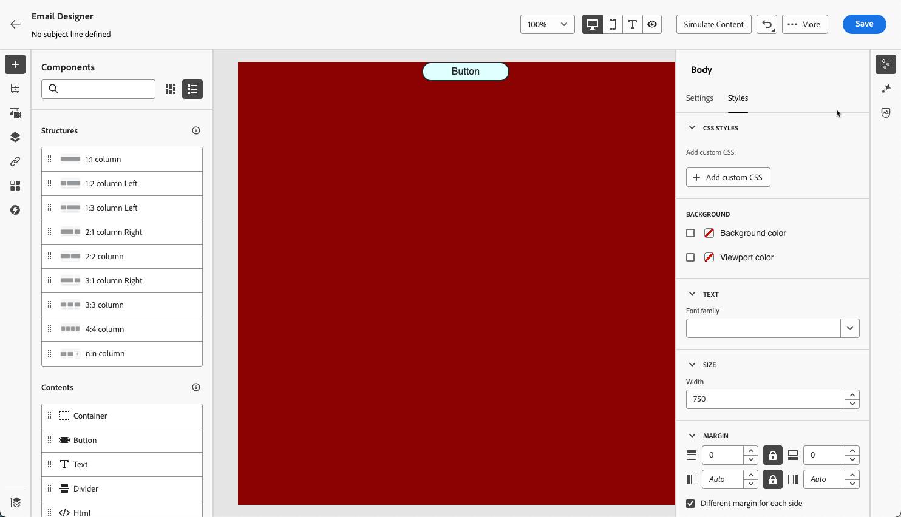

# Añadir CSS personalizado al contenido del correo electrónico {#email-metadata}

>[!CONTEXTUALHELP]
>id="ac_edition_css"
>title="Introduzca su propio CSS"
>abstract="Para obtener una mayor flexibilidad y control sobre el aspecto del contenido, puede agregar CSS personalizado directamente dentro del Designer de correo electrónico para aplicar un estilo avanzado y específico."

Al diseñar los correos electrónicos, puede agregar su propio CSS personalizado directamente en [!DNL Journey Optimizer] [Email Designer](get-started-email-design.md). Esta capacidad le permite aplicar estilos avanzados y específicos para obtener una mayor flexibilidad y control sobre el aspecto del contenido.

## Definir CSS personalizado {#define-custom-css}

Para añadir CSS personalizado al contenido del correo electrónico, siga los pasos a continuación.

1. Asegúrese de que haya contenido definido en el Designer de correo electrónico agregando al menos un [componente](content-components.md).

1. Seleccione **[!UICONTROL Cuerpo]**, ya sea en el **[!UICONTROL árbol de navegación]** a la izquierda o en la parte superior del panel derecho. La sección **[!UICONTROL estilos CSS]** se muestra a la derecha.

   {width="85%"}

   >[!NOTE]
   >
   >La sección **[!UICONTROL estilos CSS]** solo está disponible cuando el contenido ya está presente en el editor.

1. Introduzca su código CSS en el área de texto dedicada que aparece. Asegúrese de que CSS personalizado sea válido y siga la sintaxis adecuada. [Más información](#use-valid-css)

   {width="65%"}

   >[!NOTE]
   >
   >El botón **[!UICONTROL Agregar CSS personalizado]** solo está disponible cuando se selecciona **[!UICONTROL Cuerpo]**. Sin embargo, puede aplicar estilos CSS personalizados a todos los componentes del contenido.

1. Guarde el CSS personalizado y compruebe que el CSS personalizado se aplica correctamente al contenido. Si no es así, consulte la sección [Solución de problemas](#troubleshooting).

   {width="85%"}

1. Si elimina todo el contenido, la sección desaparece y ya no se aplica el CSS personalizado definido anteriormente.

1. Vuelva a agregar contenido al editor para que vuelva a aparecer la sección **[!UICONTROL estilos CSS]**. Se vuelve a aplicar el CSS personalizado.

## Asegúrese de utilizar CSS válido {#use-valid-css}

Puede introducir cualquier cadena CSS válida en el área de texto **[!UICONTROL Agregar CSS]** personalizado. El CSS con el formato correcto se aplica inmediatamente al contenido.

>[!CAUTION]
>
>Los usuarios son responsables de la seguridad de su CSS personalizado. Asegúrese de que CSS no introduzca vulnerabilidades ni conflictos con el contenido existente.
>
>Evite utilizar CSS que pudiera romper involuntariamente el diseño o la funcionalidad del contenido.

### CSS válido

A continuación se muestran ejemplos de CSS válido.

```css
.acr-component[data-component-id="form"] {
  display: flex;
  justify-content: center;
  background: none;
}

.acr-Form {
  width: 100%;
  padding: 20px 100px;
  border-spacing: 0px 8px;
  box-sizing: border-box;
  margin: 0;
}

.acr-Form .spectrum-FieldLabel {
  width: 20%;
}

.acr-Form.spectrum-Form--labelsAbove .spectrum-FieldLabel,
.acr-Form [data-form-item="checkbox"] .spectrum-FieldLabel {
  width: auto;
}

.acr-Form .spectrum-Textfield {
  width: 100%;
}

#acr-form-error,
#acr-form-confirmation {
  width: 100%;
  padding: var(--spectrum-global-dimension-static-size-500);
  display: flex;
  align-items: center;
  flex-direction: column;
  justify-content: center;
  gap: var(--spectrum-global-dimension-static-size-200);
}

.spectrum-Form-item.is-required .spectrum-FieldLabel:after{
  content: '*';
  font-size: 1.25rem;
  margin-left: 5px;
  position: absolute;
}

/* Error field placeholder */
.spectrum-HelpText {
  display: none !important;
}

.spectrum-HelpText.is-invalid,
.is-invalid ~ .spectrum-HelpText {
  display: flex !important;
}
```

```css
@media only screen and (min-width: 600px) {
  .acr-paragraph-1 {
    width: 100% !important;
  }
}
```

### CSS no válido

Si se introduce un CSS no válido, se muestra un mensaje de error que indica que el CSS no se puede guardar. A continuación se muestran ejemplos de CSS no válido.

No se acepta el uso de etiquetas `<style>`:

```html
<style type="text/css">
  .acr-Form {
    width: 100%;
    padding: 20px 100px;
    border-spacing: 0px 8px;
    box-sizing: border-box;
    margin: 0;
  }
</style>
```

No se acepta sintaxis no válida como llaves que faltan:

```css
body {
  background: red;
```

## Implementación técnica {#implementation}

Su CSS personalizado se agrega al final de la sección `<head>` como parte de una etiqueta `<style>` con el atributo `data-name="global-custom"`, como en el ejemplo siguiente. Esto garantiza que los estilos personalizados se apliquen globalmente al contenido.

```html
<!DOCTYPE html>
<html>
  <head>
    <meta charset="utf-8">
    <meta name="content-version" content="3.3.31">
    <meta name="x-apple-disable-message-reformatting">
    <meta name="viewport" content="width=device-width,initial-scale=1.0">
    <style data-name="default" type="text/css">
      td { padding: 0; }
      th { font-weight: normal; }
    </style>
    <style data-name="grid" type="text/css">
      .acr-grid-table { width: 100%; }
    </style>
    <style data-name="acr-theme" type="text/css" data-theme="default" data-variant="0">
      body { margin: 0; font-family: Arial; }
    </style>
    <style data-name="media-default-max-width-500px" type="text/css">
      @media screen and (max-width: 500px) {
        body { width: 100% !important; }
      }
    </style>
    <style data-name="global-custom" type="text/css">
      /* Add you custom CSS here */
    </style>
  </head>
  <body>
    <!-- Minimal content -->
  </body>
</html>
```

El panel **[!UICONTROL Configuración]** de Designer de correo electrónico no interpreta ni valida la CSS personalizada. Es totalmente independiente y solo se puede modificar mediante la opción **[!UICONTROL Agregar CSS personalizado]**.

### Contenido importado

Si desea utilizar CSS personalizado con contenido importado en el Designer de correo electrónico, tenga en cuenta lo siguiente:

* Si importa contenido externo de HTML, incluido CSS, a menos que convierta ese contenido, estará en **[!UICONTROL modo de compatibilidad]**, donde la sección **[!UICONTROL estilos CSS]** no está disponible. [Más información sobre cómo importar contenido existente](existing-content.md)

* Si se importa contenido creado con el Designer de correo electrónico, incluido CSS aplicado a través de la opción **[!UICONTROL Agregar CSS personalizado]**, el CSS aplicado anteriormente se podrá ver y editar desde la misma opción.

<!--
* If importing content created with the Email Designer with CSS applied externally, the CSS code previously applied cannot be accessed within the **[!UICONTROL Add custom CSS]** pop-up window, but you can still override it with new custom CSS.-->

## Resolución de problemas {#troubleshooting}

Si no se aplica el CSS personalizado, tenga en cuenta las siguientes opciones.

* Asegúrese de que el CSS sea válido y esté libre de errores de sintaxis (como llaves que faltan, nombres de propiedad incorrectos). [Descubra cómo](#use-valid-css)

* Asegúrese de que su CSS se agrega a la etiqueta `<style>` con el atributo `data-name="global-custom"`. [Más información](#implementation)

* Asegúrese de que otras reglas CSS no anulen su CSS, incluido cualquier [tema](apply-email-themes.md) aplicado al contenido.

   * Utilice las herramientas para desarrolladores del navegador para inspeccionar el contenido y comprobar que el CSS está dirigido a los selectores correctos.

   * Considere agregar `!important` a sus declaraciones para asegurarse de que tengan prioridad. Por ejemplo:

     ```css
     .acr-Form {
       background: red !important;
     }
     ```

<!--
### Guardrails
-->


