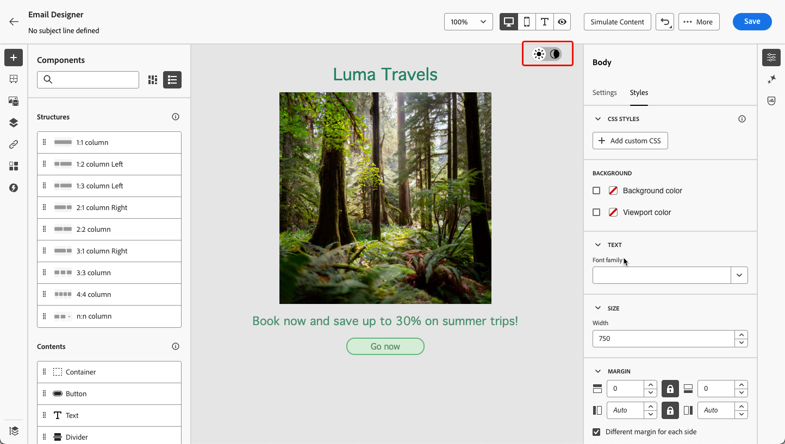

# Administrar contenido en modo oscuro {#dark-mode}

>[!CONTEXTUALHELP]
>id="ac_edition_darkmode"
>title="Cambiar a modo oscuro"
>abstract="Cambie al modo oscuro, donde puede obtener una vista previa cómo puede ser la representación y definir ajustes personalizados específicos.  Precaución: la representación final depende del cliente de correo electrónico del destinatario. No todos los clientes de correo electrónico admiten el modo oscuro."

>[!CONTEXTUALHELP]
>id="ac_edition_darkmode_image"
>title="Utilizar una imagen específica para el modo oscuro"
>abstract="Puede seleccionar otra imagen que se mostrará cuando el modo oscuro esté activado.  Precaución: añadir una imagen específica para el modo oscuro no garantiza que se represente correctamente en todos los clientes de correo electrónico. No todos los clientes de correo electrónico admiten el modo oscuro."

>[!CONTEXTUALHELP]
>id="ac_edition_darkmode_preview"
>title="Cambiar a modo oscuro"
>abstract="Cambie al modo oscuro, donde puede obtener una vista previa de cómo se puede representar en los clientes de correo electrónico compatibles.  Precaución: la representación final depende del cliente de correo electrónico del destinatario. No todos los clientes de correo electrónico admiten el modo oscuro."

Al diseñar los mensajes de correo electrónico, [!DNL Journey Optimizer] [Email Designer](get-started-email-design.md) le permite cambiar al **[!UICONTROL modo oscuro]**, donde puede definir configuraciones personalizadas específicas. Cuando el modo oscuro está activado, los clientes de correo electrónico de soporte mostrarán la configuración definida para este modo.

>[!WARNING]
>
>El procesamiento final del modo oscuro depende del cliente de correo electrónico del destinatario.
>
>No todos los clientes de correo electrónico admiten el modo oscuro personalizado. <!--[See the list](#non-supporting-email-clients)-->Además, algunos clientes de correo electrónico solo aplican su propio modo oscuro predeterminado a todos los mensajes de correo electrónico que reciben. En este caso, no se puede procesar la configuración personalizada que definió en el Designer de correo electrónico.

En [esta sección](#supporting-email-clients) se muestra una lista de los clientes de correo electrónico que admiten el modo oscuro.

## ¿Qué es el modo oscuro? {#what-is-dark-mode}

El modo oscuro permite a los clientes de correo electrónico y las aplicaciones compatibles mostrar correos electrónicos con fondos más oscuros y colores más claros para el texto, los botones y otros elementos de la interfaz de usuario. Permite reducir la fatiga ocular, ahorrar batería y mejorar la legibilidad en entornos con poca luz para una experiencia de visualización más cómoda.

<!--Dark Mode uses a dark color palette with light text and UI elements to reduce eye strain, save battery life, and improve readability in low-light environments.-->

Como tendencia creciente en los principales sistemas operativos y aplicaciones (Apple Mail, Gmail, Outlook, Twitter, Slack), se ha convertido en una consideración importante en el diseño moderno de correos electrónicos garantizar que el contenido siga siendo legible y visualmente atractivo para todos los usuarios.

Sin embargo, no es posible garantizar que su correo electrónico tenga el mismo aspecto en el modo oscuro en todos los dispositivos. Algunos cambios visuales también pueden deberse a que la aplicación de correo electrónico o el dispositivo anulan el diseño original.

De hecho, la forma en que los clientes de correo electrónico aplican el modo oscuro puede variar de la siguiente manera<!--between different devices and apps-->:

* No todos los clientes de correo electrónico admiten esta función.

  >[!NOTE]
  >
  >En [esta sección](#non-supporting-email-clients) se muestra una lista de los clientes de correo electrónico que no admiten el modo oscuro.

* Algunos clientes de correo electrónico ajustan automáticamente los colores, los fondos y las imágenes. En este caso, si define la configuración personalizada en el Designer de correo electrónico, es probable que dicha configuración no se represente.

* Otros clientes de correo electrónico dan la opción de procesar el modo oscuro personalizado (como con el método `@media (prefers-color-scheme: dark)`). En este caso, se debe mostrar la configuración específica que defina en la Designer de correo electrónico. Aprenda a definir la configuración personalizada del modo oscuro en el Designer de correo electrónico en [esta sección](#define-custom-dark-mode).

## Modo oscuro en el Designer de correo electrónico {#dark-mode-email-designer}

Cuando se trata del modo oscuro en el Designer de correo electrónico, hay dos aspectos que hay que tener en cuenta:

* Puede obtener una previsualización del modo oscuro predeterminado en la mayoría de los clientes de correo electrónico de soporte. [Más información](#preview-dark-mode)

<!--
    >[!CAUTION]
    >
    >The final rendering may vary according to the recipient's email client. To see the exact rendering for each email client, use the [Email rendering](../content-management/rendering.md) option.-->

* Si desea anular la configuración predeterminada de los clientes de correo electrónico de soporte, puede definir la configuración personalizada del modo oscuro aplicable al correo electrónico que está editando. [Más información](#define-custom-dark-mode)

<!--
    >[!WARNING]
    >
    >Not all email clients support custom dark mode. Some email clients only apply their own default dark mode for all emails that are received. In this case, the custom settings that you defined in the Email Designer cannot be rendered. [Learn more](#guardrails)-->

### Previsualizar modo oscuro predeterminado {#preview-dark-mode}

Para acceder al modo oscuro en Email Designer y obtener una previsualización de la configuración predeterminada del modo oscuro, siga los pasos a continuación.

1. En la página de inicio de Email Designer, seleccione la opción **[!UICONTROL Diseñar desde cero]**. [Más información](content-from-scratch.md)

   >[!NOTE]
   >
   >Actualmente es posible que no pueda cambiar al modo oscuro si selecciona una [plantilla de correo electrónico](use-email-templates.md) o si aplica un [tema](apply-email-themes.md).

1. Agregue [estructuras](content-from-scratch.md) y [componentes de contenido](content-components.md) al contenido.

1. En la parte superior derecha del lienzo central, cambie el conmutador a **[!UICONTROL Modo oscuro]**.

   

1. Se muestra la previsualización predeterminada del modo oscuro.

   
<!--
    >[!NOTE]
    >
    >Dark mode applies to all elements, except images and icons.-->

De forma predeterminada, la previsualización en modo oscuro de Email Designer aplica el esquema de colores &quot;inversión de color completo&quot; a todos los elementos, excepto a las imágenes y los iconos. <!--It fully inverts all colors for all the elements (texts, buttons, etc.)-->

Significa que detecta áreas con elementos claros y oscuros y los invierte, de modo que los fondos claros se vuelven oscuros y el texto oscuro se vuelve claro, mientras que los fondos oscuros se vuelven claros y el texto claro se vuelve oscuro.

>[!CAUTION]
>
>La renderización final puede variar según el cliente de correo electrónico del destinatario. Para ver una simulación lo más parecida posible al resultado final de cada cliente de correo electrónico, use la opción [Procesamiento de correo electrónico](../content-management/rendering.md).

<!--This is custom dark mode:

  

Here you can see that we have applied a different background, defined another image and change the color of the text and button.-->

### Definir modo oscuro personalizado {#define-custom-dark-mode}

Después de cambiar a **[!UICONTROL Modo oscuro]**, puede elegir editar elementos de estilo específicos de su contenido que se mostrarán solo cuando el modo oscuro esté habilitado en el cliente de correo electrónico del destinatario, siempre que admita esa función.

>[!WARNING]
>
>No todos los clientes de correo electrónico admiten el modo oscuro. Además, algunos clientes de correo electrónico solo aplican su propio modo oscuro predeterminado a todos los correos electrónicos recibidos. En ambos casos, no se puede procesar la configuración personalizada que definió en el Designer de correo electrónico.

Para aprovechar el estilo de modo oscuro personalizado de Email Designer, Journey Optimizer usa <!-- `@media (prefers-color-scheme: dark)` method--> `@media (prefers-color-scheme: dark)` consulta CSS, que detecta si el cliente de correo electrónico del usuario está configurado en modo oscuro y aplica el diseño de tema oscuro definido en su correo electrónico.

Para definir la configuración personalizada del modo oscuro, siga los pasos a continuación.

1. Asegúrese de que **[!UICONTROL Modo oscuro]** esté habilitado en el Designer de correo electrónico. [Descubra cómo](#preview-dark-mode)

1. Edite cualquier atributo de color de estilo, como texto, fondos, botones, etc.

1. No puede cambiar los colores de las imágenes y los iconos, pero puede definir recursos específicos únicamente para el modo oscuro. Para ello, seleccione cualquier imagen. Cambie a **[!UICONTROL Modo oscuro]** con el conmutador específico del panel **[!UICONTROL Configuración]** y seleccione un recurso diferente.

   

   <!---->

1. En cualquier momento puedes **[!UICONTROL Cambiar a la vista en vivo]** para comprobar cómo se puede presentar tu contenido en varios tamaños de dispositivo. En esta vista, seleccione el conmutador Modo oscuro de la parte superior de la pantalla para previsualizar la versión en modo oscuro del contenido en los distintos dispositivos.

   {width="80%" align="center"}

   >[!CAUTION]
   >
   >La vista en directo es una previsualización genérica diseñada para comparar el aspecto que podría tener la renderización en varios tamaños de dispositivo. La renderización final puede variar según el cliente de correo electrónico del destinatario.

1. Cuando esté satisfecho con los cambios del modo oscuro, haga clic en **[!UICONTROL Simular contenido]**.

   

1. Seleccione **[!UICONTROL Procesar correo electrónico]** y conéctese a su cuenta de Litmus. Puede ver el procesamiento final del modo oscuro para varios clientes de correo electrónico. Más información sobre [Procesamiento de correo electrónico](../content-management/rendering.md).

   >[!WARNING]
   >
   >Mientras que la simulación se aproxima mucho al modo oscuro en el que aparecerán los correos electrónicos, el procesamiento real puede diferir debido a variaciones en los proveedores de servicios de correo electrónico o en la configuración del nivel de dispositivo.

## Prácticas recomendadas {#best-practices}

A medida que la adopción del modo oscuro aumenta en los principales clientes de correo electrónico, es esencial tener en cuenta cómo se procesan los mensajes de correo electrónico en los entornos claro y oscuro, tanto si utiliza [modo oscuro personalizado](#define-custom-dark-mode) como si no.

El modo oscuro puede alterar colores, fondos e imágenes, a veces anulando las opciones de diseño. Para garantizar la coherencia visual, la accesibilidad y la integridad de la marca, siga las prácticas recomendadas que se enumeran a continuación.

**Optimizar imágenes y logotipos**

* Evite imágenes con fondos blancos o claros codificados.

* Guarde los logotipos e iconos como PNG con fondos transparentes para evitar cuadros blancos visibles en modo oscuro.

* Si la transparencia no es una opción, coloque las imágenes sobre un fondo sólido en el diseño para evitar incómodas inversiones de color.

**Observe sus fondos**

* Asegúrese de que haya suficiente contraste entre los colores del texto y del fondo para facilitar la lectura tanto en los modos claro como oscuro.

* Evite depender únicamente de los colores de fondo para el contenido crítico. Algunos clientes omiten los colores de fondo en el modo oscuro, por lo que asegúrese de que la información clave sigue visible.

**Diseñar contenido accesible en modo oscuro**

* Utilice combinaciones de colores fáciles de distinguir para las personas con daltonismo.

* Utilice una paleta de medios tonos para garantizar el contraste con fondos claros y oscuros.

* Utilice combinaciones de colores accesibles con alto contraste para mejorar la legibilidad y cumplir los estándares de las Directrices de accesibilidad del contenido web (WCAG). Utilice herramientas como el verificador de contraste de WebAIM para verificar el contraste de color.

* Evite las fuentes delgadas, ya que pueden afectar a la legibilidad. Si su marca requiere una fuente fina, atíguela en modo oscuro.

* Omita el blanco puro sobre el negro puro, ya que puede causar distensión ocular y algunos clientes de correo electrónico podrían invertirlo automáticamente.

* Proporcionar un estilo de reserva accesible si no se admite el modo oscuro.

**Pruebe sus correos electrónicos en el entorno de modo oscuro**

* Use la [vista previa en modo oscuro](#preview-dark-mode) de Email Designer, que usa esquemas de color invertidos para detectar los problemas de forma temprana.

* Utilice la opción [Procesamiento de correo electrónico](../content-management/rendering.md) que aprovecha Litmus para simular los diseños en los principales clientes de correo electrónico (Apple Mail, Gmail, Outlook) y ver cómo se comportan los colores y las imágenes en modo oscuro.

<!--**Inline critical styles**

Inline CSS helps maintain more control over styling, as some clients strip external styles in dark mode.-->

## Clientes de correo electrónico que admiten el modo oscuro {#supporting-email-clients}

A continuación se muestra una lista de los principales clientes de correo electrónico que admiten el modo oscuro.

>[!NOTE]
>
>Algunas versiones de estos clientes de correo electrónico no admiten el modo oscuro, por lo que también se presentan en esta tabla para mayor claridad.

| Clientes de correo electrónico que admiten el modo oscuro | Versiones compatibles | *Versiones no admitidas* |
|---------|----------|---------|
| Apple Mail macOS | 12.4, 16.0 | *10.3* |
| Apple Mail iOS | 13.0, 16.1 | *12.2* |
| Outlook macOS | 2019, 16.70, 16.80 | NA |
| Outlook.com | 07-2019, 12-2022 | NA |
| Outlook iOS | 01-2020, 12-2022 | NA |
| Outlook Android | 03-2023 | *2020-01, 12-2022* |
| Samsung Email (Android) | 6,1 | *6.0* |
| Mozilla Thunderbird (macOS) | 68,4 | *60.8, 78.5, 91.13* |
| Fastmail (Webmail de escritorio) | 12-2022 | *2021-07* |
| HEY (Webmail de escritorio) | 06-2020 | *2022-12* |
| Orange Desktop Webmail | 08-2019, 03-2021, 12-2022, 04-2024 | NA |
| Orange iOS | 12-2022, 04-2024 | *2020-01* |
| Orange Android | 04-2024 | *2020-01, 12-2022* |
| LaPoste.net | 08-2021, 12-2022 | NA |
| Webmail de escritorio SFR | 08-2019-2022-12 | NA |
| GMX (iOS y Android) | 06-2022 | NA |
| 1&amp;1 (Desktop Webmail y Android) | 06-2022 | NA |
| WEB.DE (iOS y Android) | 06-2022 | NA |
| Free.fr | 12-2022 | NA |

>[!WARNING]
>
>El procesamiento final del modo oscuro depende de cada cliente de correo electrónico, por lo que los resultados pueden variar de uno a otro.

<!--
* Check out the list of [email clients supporting dark mode](https://www.caniemail.com/search/?s=dark){target="_blank"}

* Learn more on Dark mode in this [Litmus blog post](https://www.litmus.com/blog/the-ultimate-guide-to-dark-mode-for-email-marketers){target="_blank"}
-->

## Clientes de correo electrónico que no admiten el modo oscuro {#non-supporting-email-clients}

Algunos clientes de correo electrónico permiten a los usuarios cambiar su interfaz al modo oscuro, pero esta configuración no afecta a cómo se muestran los correos electrónicos de HTML. Independientemente de si la interfaz está en modo claro u oscuro, el correo electrónico procesará lo mismo. Esta es una lista de esos clientes:

| Clientes de correo electrónico que no admiten el modo oscuro |
|---------|
| Gmail (Desktop Webmail, iOS, Android, Mobile Webmail) |
| Ventanas de Outlook |
| Outlook Windows Mail |
| Yahoo!Mail |
| AOL |
| ProtonMail |
| SFR IOS |
| SFR ANDROID |
| GMX Desktop Webmail |
| Mail.ru |
| Webmail de escritorio de WEB.DE |
| T-online.de |
