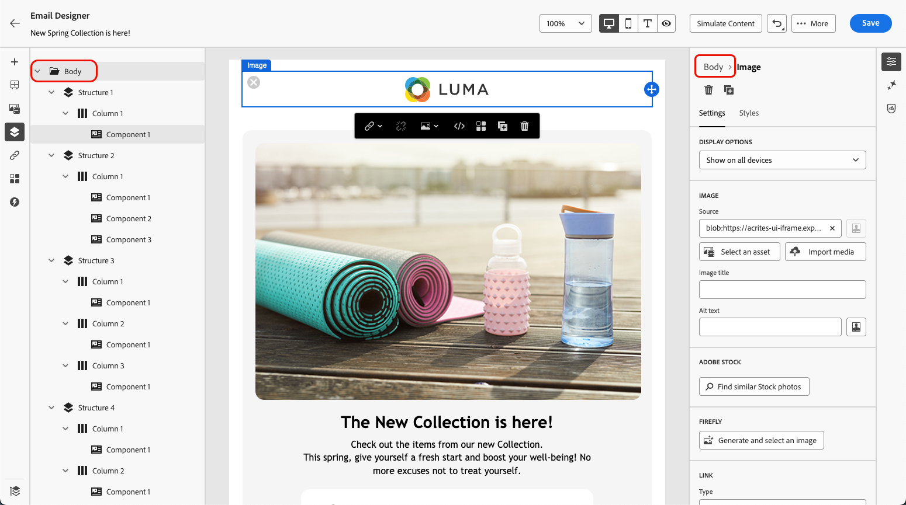

# Añadir metadatos al contenido del correo electrónico {#email-metadata}

>[!BEGINSHADEBOX]

**En esta página:** Aprenda a establecer metadatos de correo electrónico en el Designer de correo electrónico, incluido el preencabezado, el título y el idioma del documento, para mejorar la legibilidad y accesibilidad del contenido del correo electrónico.

>[!ENDSHADEBOX]

>[!CONTEXTUALHELP]
>id="ac_edition_preheader"
>title="Definir un preencabezado"
>abstract="Un preencabezado es un breve texto de resumen que sigue a la línea del asunto cuando se visualiza un correo electrónico desde su cliente de correo electrónico. En muchos casos, proporciona un breve resumen del correo electrónico y suele contener una frase."

Al diseñar los correos electrónicos, para mejorar la legibilidad y la accesibilidad, puede definir metaatributos adicionales para el contenido. El [!DNL Journey Optimizer] [Designer de correo electrónico](get-started-email-design.md) le permite especificar los siguientes elementos:

* **[!UICONTROL Encabezado previo]**: Un encabezado previo es un breve texto de resumen que sigue a la línea de asunto cuando ve un correo electrónico de su cliente de correo electrónico. En muchos casos, proporciona un breve resumen del correo electrónico y suele contener una frase.

  >[!NOTE]
  >
  >Los preencabezados no son compatibles con todos los clientes de correo electrónico. Cuando no se admite, el preencabezado no se muestra.

* **[!UICONTROL Título del documento]**: este campo, que corresponde al elemento `<title>`, proporciona información descriptiva sobre el contenido del correo electrónico, que normalmente se muestra como información de objeto al pasar el ratón por encima. Puede ayudar a los usuarios con discapacidades al proporcionar un contexto adicional y puede contribuir a una mejor comprensión del contenido por parte de los motores de búsqueda.

* **[!UICONTROL Idioma del documento]**: para garantizar la accesibilidad, puede especificar el idioma que los lectores de pantalla utilizarán para convertir texto e imágenes en voz o braille, para personas con deficiencias visuales o con discapacidades de aprendizaje. Esta configuración corresponde al atributo `lang` en el elemento `<html>`.

Para establecer esta configuración, siga los pasos a continuación.

1. En [Email Designer](content-from-scratch.md), agrega al menos un **[!UICONTROL componente de estructura]** para comenzar a diseñar tu correo electrónico.

1. Haga clic en **[!UICONTROL Cuerpo]**, ya sea en el **[!UICONTROL árbol de navegación]** a la izquierda o en la parte superior del panel derecho.

   

1. En la ficha **[!UICONTROL Configuración]**, escriba texto dentro de los campos **[!UICONTROL Encabezado previo]**, **[!UICONTROL Título del documento]** o **[!UICONTROL Idioma del documento]**.

1. También puede hacer clic en el icono de personalización junto a cada campo para personalizar el contenido de atributos de perfil, audiencias, atributos contextuales, etc. [Más información sobre personalización](../personalization/personalization-build-expressions.md)

   

1. Haz clic en **[!UICONTROL Guardar]** para confirmar los cambios.