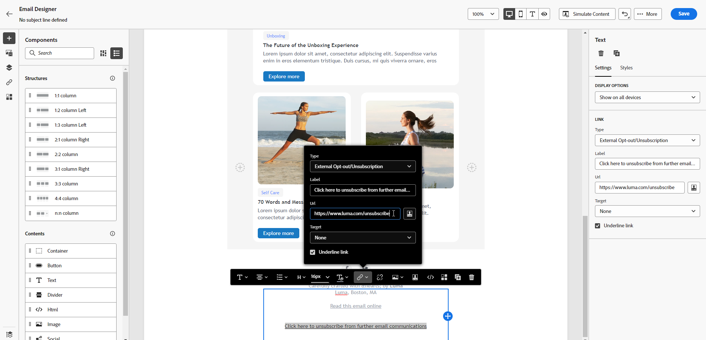
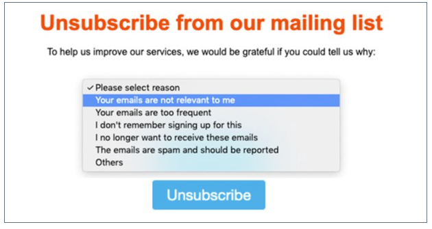

# Administración de exclusión de correo electrónico {#email-opt-out}

Para proporcionar a los destinatarios la capacidad de cancelar la suscripción a la recepción de comunicaciones por correo electrónico, siempre debe incluir un **cancelar suscripción** en cada correo electrónico enviado a los destinatarios. [Obtenga más información sobre la administración de privacidad y exclusión](../privacy/opt-out.md)

Para ello, puede:

* Insertar un **vínculo a una página de aterrizaje externa** en un correo electrónico para permitir a los usuarios cancelar la suscripción de recibir comunicaciones de su marca. [Aprenda a añadir un vínculo de no participación externo](#opt-out-external-lp)

* Agregue un **vínculo de exclusión con un solo clic** en el contenido del correo electrónico. Este vínculo permite a los destinatarios cancelar rápidamente la suscripción a sus comunicaciones, sin ser redirigidos a una página de aterrizaje donde necesiten confirmar su elección, lo que acelera el proceso de cancelación de suscripción. [Aprenda a añadir un vínculo de no participación de un clic](#one-click-opt-out)

Además, si la variable **[!UICONTROL List-Unsubscribe]** está activada en el nivel de superficie del canal, los correos electrónicos correspondientes enviados con Journey Optimizer incluirán un vínculo de cancelación de suscripción en el encabezado del correo electrónico. [Obtenga más información sobre la exclusión en el encabezado de correo electrónico](#unsubscribe-header)

>[!NOTE]
>
>Los mensajes de correo electrónico de tipo de marketing deben incluir un vínculo de no participación, que no es necesario para los mensajes transaccionales. La categoría del mensaje (**[!UICONTROL Marketing]** o **[!UICONTROL Transactional]**) se define en la variable [superficie del canal](../configuration/channel-surfaces.md#email-type) (es decir, ajuste preestablecido de mensaje) y al crear el mensaje).

## Exclusión externa {#opt-out-external-lp}

### Añadir un vínculo de cancelación de suscripción {#add-unsubscribe-link}

Primero debe añadir un vínculo de cancelación de suscripción a un mensaje. Para ello, siga los pasos a continuación:

1. Cree su propia página de aterrizaje de baja.

1. Alojarlo en el sistema de terceros que elija.

1. Cree un mensaje en un recorrido.

1. Seleccione texto en el contenido y [insertar un vínculo](../email/message-tracking.md#insert-links) con la barra de herramientas contextual.

   

1. Select **[!UICONTROL External Opt-out/Unsubscription]** de la variable **[!UICONTROL Link type]** lista desplegable.

   

1. En el **[!UICONTROL Link]** pegue el vínculo en la página de aterrizaje de terceros.

   

1. Haga clic en **[!UICONTROL Save]**.

### Implementación de una llamada de API para la exclusión {#opt-out-api}

Para que los destinatarios se excluyan cuando envíen su elección desde la página de aterrizaje, debe implementar una **Llamada de API de suscripción** hasta [Desarrollador de Adobe](https://developer.adobe.com){target=&quot;_blank&quot;} para actualizar las preferencias de los perfiles correspondientes.

Esta llamada POST es la siguiente:

Punto final: platform.adobe.io/journey/imp/consent/preferences

Parámetros de consulta:

* **params**: contiene la carga útil cifrada
* **sig**: signature
* **pid**: ID de perfil cifrado

Estos tres parámetros se incluyen en la dirección URL de la página de aterrizaje de terceros que se envía al destinatario:


Requisitos de encabezado:

* x-api-key
* x-gw-ims-org-id
* x-sandbox-name
* autorización (token de usuario de su cuenta técnica)

Cuerpo de la solicitud:

```
{
   "marketing": [
       {
            "type": "email",           
            "choice": "no",          
            "scope": "channel"       
        }
    ],
 
}
```

[!DNL Journey Optimizer] utilizará estos parámetros para actualizar la elección del perfil correspondiente mediante la variable [Desarrollador de Adobe](https://developer.adobe.com)Llamada de API {target=&quot;_blank&quot;}.

### Enviar el mensaje con el vínculo de cancelación de suscripción {#send-message-unsubscribe-link}

Una vez configurado el vínculo de cancelación de suscripción a la página de aterrizaje e implementado la llamada de API, el mensaje está listo para enviarse.

1. Envíe el mensaje, incluido el vínculo a través de un [recorrido](../building-journeys/journey.md).

1. Una vez recibido el mensaje, si el destinatario hace clic en el vínculo unsubscribe , se muestra la página de aterrizaje.

   

1. Si el destinatario envía el formulario (aquí, pulsando el botón **Cancelar suscripción** en la página de aterrizaje), los datos de perfil se actualizan a través de la variable [Llamada de API](#opt-out-api).

1. El destinatario excluido se redirige a la pantalla de mensaje de confirmación para indicar que la exclusión se ha realizado correctamente.

   

   Como resultado, este usuario no recibirá comunicación de su marca a menos que se vuelva a suscribir.

1. Para comprobar que se ha actualizado la opción del perfil correspondiente, vaya a Experience Platform y acceda al perfil seleccionando un área de nombres de identidad y un valor de identidad correspondiente. Obtenga más información en la [Documentación de Experience Platform](https://experienceleague.adobe.com/docs/experience-platform/profile/ui/user-guide.html#getting-started){target=&quot;_blank&quot;}.

   

   En el **[!UICONTROL Attributes]** , puede ver el valor de **[!UICONTROL choice]** ha cambiado a **[!UICONTROL no]**.

## Opción de exclusión de un clic {#one-click-opt-out}

Para añadir un vínculo de no participación en el correo electrónico, siga los pasos a continuación.

1. [Inserción de un vínculo](../email/message-tracking.md#insert-links) y seleccione **[!UICONTROL One click Opt-out]** como tipo de vínculo.

   

1. Seleccione cómo desea aplicar la exclusión: en el nivel de canal, identidad o suscripción.

   

   * **[!UICONTROL Channel]**: La exclusión se aplica a mensajes futuros enviados al destinatario del perfil (es decir, la dirección de correo electrónico) para el canal actual. Si hay varios objetivos asociados a un perfil, la exclusión se aplica a todos los destinos (es decir, direcciones de correo electrónico) del perfil de ese canal.
   * **[!UICONTROL Identity]**: La exclusión se aplica a los mensajes futuros enviados al destinatario específico (es decir, la dirección de correo electrónico) que se estén utilizando para el mensaje actual.
   * **[!UICONTROL Subscription]**: La exclusión se aplica a mensajes futuros asociados a una lista de suscripción específica. Esta opción solo se puede seleccionar si el mensaje actual está asociado con una lista de suscripción.

1. Introduzca la dirección URL de la página de aterrizaje a la que se redirigirá al usuario una vez cancelada la suscripción. Esta página solo está aquí para confirmar que la exclusión se ha realizado correctamente.

   >[!NOTE]
   >
   >Si ha activado la variable **Cancelación de suscripción a una lista** en el nivel de superficie del canal, esta URL también se utilizará cuando los usuarios hagan clic en el vínculo unsubscribe en el encabezado del correo electrónico. [Más información](#unsubscribe-header)

   

   Puede personalizar los vínculos. Obtenga más información sobre las direcciones URL personalizadas en [esta sección](../personalization/personalization-syntax.md).

1. Guarde los cambios.

Una vez que el mensaje se envía a través de una [recorrido](../building-journeys/journey.md), si un destinatario hace clic en el vínculo de exclusión, su perfil se excluye inmediatamente.

## Vínculo de cancelación de suscripción en el encabezado de correo electrónico {#unsubscribe-header}

>[!CONTEXTUALHELP]
>id="ajo_admin_preset_unsubscribe"
>title="Añadir vínculo de cancelación de suscripción al encabezado del correo electrónico"
>abstract="Active Cancelación de suscripción a una lista para añadir un vínculo de cancelación de suscripción al encabezado del correo electrónico. Para establecer una URL de cancelación de suscripción, inserte un vínculo de exclusión de un solo clic en el contenido del correo electrónico."
>additional-url="https://experienceleague.adobe.com/docs/journey-optimizer/using/privacy/consent/opt-out.html#one-click-opt-out" text="Opción de exclusión de un clic"

Si la variable [Opción List-Unsubscribe](../configuration/channel-surfaces.md#list-unsubscribe) se activa en el nivel de superficie del canal; los correos electrónicos correspondientes se envían con [!DNL Journey Optimizer] incluirá un vínculo de cancelación de suscripción en el encabezado del correo electrónico.

Por ejemplo, el vínculo de cancelación de suscripción se mostrará así en Gmail:


>[!NOTE]
>
>Para mostrar el vínculo de cancelación de suscripción en el encabezado del correo electrónico, el cliente de correo electrónico de los destinatarios debe admitir esta función.

La dirección de cancelación de suscripción es la predeterminada **[!UICONTROL Mailto (unsubscribe)]** dirección mostrada en la superficie del canal correspondiente. [Más información](../configuration/channel-surfaces.md#list-unsubscribe).

Para establecer una URL de cancelación de suscripción personalizada, inserte un vínculo de exclusión de un solo clic en el contenido del mensaje de correo electrónico e introduzca la URL que elija. [Más información](#one-click-opt-out)

Según el cliente de correo electrónico, hacer clic en el vínculo de cancelación de suscripción del encabezado puede tener los siguientes efectos:

* La solicitud de cancelación de suscripción se envía a la dirección de cancelación de suscripción predeterminada.

* El destinatario se dirige a la dirección URL de la página de aterrizaje que especificó al agregar el vínculo de no participación al mensaje.

   >[!NOTE]
   >
   >Si no agrega un vínculo de exclusión de un clic al contenido del mensaje, no se mostrará ninguna página de aterrizaje.

* El perfil correspondiente se excluye inmediatamente y esta opción se actualiza en Experience Platform. Obtenga más información en la [Documentación de Experience Platform](https://experienceleague.adobe.com/docs/experience-platform/profile/ui/user-guide.html#getting-started){target=&quot;_blank&quot;}.
