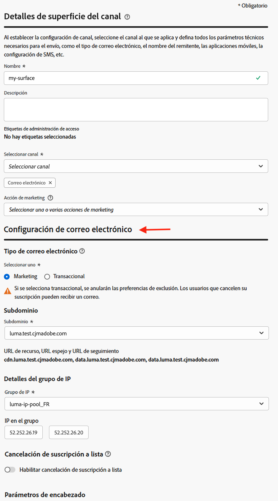
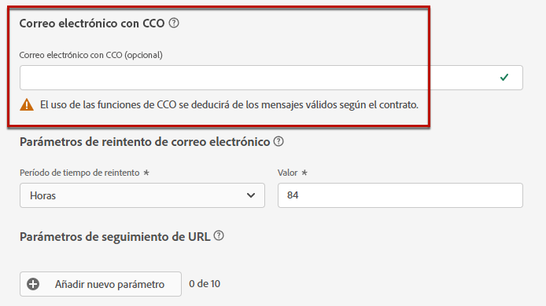

# Configuración de correo electrónico {#email-settings}

Para empezar a crear un correo electrónico, debe establecer las configuraciones de canal de correo electrónico que definen todos los parámetros técnicos necesarios para sus mensajes. [Aprenda a crear configuraciones](../configuration/channel-surfaces.md)

>[!NOTE]
>
>Para preservar su reputación y mejorar su entregabilidad, configure los subdominios que utilizará para enviar correos electrónicos antes de crear una configuración de correo electrónico. [Más información](../configuration/about-subdomain-delegation.md)
>
>Antes de crear una configuración de canal de correo electrónico, primero debe haber creado al menos un grupo de IP. [Más información](../configuration/ip-pools.md)

Defina la configuración de correo electrónico en la sección dedicada de la configuración de canal, tal como se detalla a continuación.

{width="50%" align="left"}

Se recoge la configuración de correo electrónico para enviar comunicaciones siguiendo la lógica siguiente:

* Para los recorridos por lotes, no se aplica a la ejecución por lotes que ya se había iniciado antes de configurar la superficie de correo electrónico. El cambio se aplica en la siguiente periodicidad o nueva ejecución.

* En el caso de los mensajes transaccionales, el cambio se recoge inmediatamente para la siguiente comunicación (con un retraso de hasta cinco minutos).

>[!NOTE]
>
>La configuración de correo electrónico actualizada se aplica automáticamente en los recorridos o campañas en las que se utiliza la configuración.

## Tipo de correo electrónico {#email-type}

>[!CONTEXTUALHELP]
>id="ajo_admin_presets_emailtype"
>title="Definir el tipo de correo electrónico"
>abstract="Seleccione el tipo de correos electrónicos que se enviarán al utilizar esta configuración: Marketing para correos electrónicos promocionales, que requieren el consentimiento del usuario, o Transaccional para correos electrónicos no comerciales, que también se pueden enviar a perfiles cuya suscripción se haya cancelado en contextos específicos."

En la sección **Tipo de correo electrónico**, seleccione el tipo de mensaje para la configuración: **[!UICONTROL Marketing]** o **[!UICONTROL Transaccional]**.

* Seleccione **Marketing** para el correo electrónico promocional, como por ejemplo, las promociones semanales de una tienda minorista. Estos mensajes requieren el consentimiento del usuario.

* Seleccione **Transaccional** para correo electrónico no comercial, como confirmaciones de pedidos, notificaciones de restablecimiento de contraseña o información de envío, por ejemplo. Estos correos electrónicos se pueden enviar a perfiles que **cancelaron la suscripción** a comunicaciones de marketing. Estos mensajes solo se pueden enviar en contextos específicos.

Al crear un mensaje, debe elegir una configuración de canal válida que coincida con la categoría seleccionada para el correo electrónico.

## Subdominio {#subdomains}

Seleccione el subdominio que desea utilizar para enviar los correos electrónicos.

>[!NOTE]
>
>Para aumentar el control sobre la configuración del correo electrónico, puede definir subdominios dinámicos. [Más información](../email/surface-personalization.md#dynamic-subdomains)

Para preservar la reputación de su dominio, acelerar el proceso de calentamiento de IP y mejorar la entregabilidad, delegue los subdominios de envío a Adobe. [Más información](../configuration/about-subdomain-delegation.md)

## Detalles del grupo de IP {#ip-pools}

Seleccione el grupo de IP que desea asociar con la configuración. [Más información](../configuration/ip-pools.md)

{width="50%" align="left"}

No puede proceder a crear la configuración mientras el grupo de IP seleccionado está en [edición](../configuration/ip-pools.md#edit-ip-pool) (estado **[!UICONTROL Procesando]**) y nunca se ha asociado con el subdominio seleccionado. En caso contrario, se seguirá utilizando la versión más antigua de la asociación de grupo de IP/subdominio. En este caso, guarde la configuración como borrador y vuelva a intentarlo una vez que el grupo de IP tenga el estado **[!UICONTROL Correcto]**.

>[!NOTE]
>
>En los entornos que no son de producción, Adobe no crea subdominios de prueba predeterminados ni concede acceso a un grupo de IP de envío compartido. Debe [delegar sus propios subdominios](../configuration/delegate-subdomain.md) y utilizar las IP del grupo asignado a su organización.

Una vez seleccionado un grupo de IP, la información de PTR se hace visible al pasar el puntero por encima de las direcciones IP que se muestran debajo de la lista desplegable de grupo de IP. [Más información sobre los registros PTR](../configuration/ptr-records.md)

>[!NOTE]
>
>Si no se ha configurado un registro PTR, póngase en contacto con el representante de Adobe.

## Cancelación de suscripción a lista {#list-unsubscribe}

Tras seleccionar un subdominio de la lista, se muestra la opción **[!UICONTROL Habilitar cancelación de suscripción a lista]**. De forma predeterminada, está habilitada.

Permite incluir una URL de cancelación de suscripción de un solo clic en el encabezado del correo electrónico. [Más información](list-unsubscribe.md)

## Parámetros de encabezado {#email-header}

En la sección **[!UICONTROL Parámetros de encabezado]**, escriba los nombres de los remitentes y las direcciones de correo electrónico asociadas al tipo de correos electrónicos enviados con esa configuración. [Más información](header-parameters.md)

## Correo electrónico CCO {#bcc-email}

Puede enviar una copia idéntica (o copia oculta) de los mensajes de correo electrónico enviados por [!DNL Journey Optimizer] a una bandeja de entrada de CCO donde se almacenarán con fines de cumplimiento o archivo.

Para ello, habilite la característica opcional **[!UICONTROL Correo electrónico CCO]** en el nivel de configuración de canal. [Más información](../configuration/archiving-support.md#bcc-email)

Además, al definir la dirección **[!UICONTROL Correo electrónico CCO]**, asegúrese de utilizar un subdominio que tenga una configuración de registro MX válida; de lo contrario, no se podrá procesar la configuración de correo electrónico.

Si se produce un error al enviar la configuración de correo electrónico, significa que el registro MX no está configurado para el subdominio de la dirección que ha introducido. Póngase en contacto con el administrador para configurar el registro MX correspondiente o use otra dirección con una configuración de registro MX válida.

## Envío a direcciones de correo electrónico suprimidas {#send-to-suppressed-email-addresses}

>[!CONTEXTUALHELP]
>id="ajo_surface_suppressed_addresses"
>title="Anular prioridad de lista de supresión"
>abstract="Puede decidir enviar mensajes transaccionales a perfiles incluso si sus direcciones de correo electrónico están en la lista de supresión de Adobe Journey Optimizer debido a una queja de correo no deseado. Esta opción está deshabilitada de forma predeterminada."
>additional-url="https://experienceleague.adobe.com/docs/journey-optimizer/using/configuration/monitor-reputation/manage-suppression-list.html?lang=es" text="Administrar la lista de supresión"

>[!IMPORTANT]
>
>Esta opción solo está disponible si ha seleccionado el tipo de correo electrónico **[!UICONTROL Transaccional]**. [Más información](#email-type)

En [!DNL Journey Optimizer], todas las direcciones de correo electrónico marcadas como rechazos permanentes, rechazos temporales y quejas de spam se recopilan automáticamente en la [lista de supresión](../configuration/manage-suppression-list.md) y se excluyen del envío en un recorrido o una campaña.

Sin embargo, puede optar por continuar enviando mensajes del tipo **transaccional** a los perfiles aunque sus direcciones de correo electrónico estén en la lista de supresión debido a una queja de spam del usuario.

De hecho, los mensajes transaccionales generalmente contienen información útil y esperada, como una confirmación de pedido o una notificación de restablecimiento de contraseña. Por lo tanto, aunque sus clientes hayan notificado que uno de sus mensajes de marketing es un spam, la mayoría de las veces sí que desea que reciban este tipo de correo electrónico no comercial.

Para incluir direcciones de correo electrónico suprimidas debido a quejas de spam en el público de mensajes transaccionales, seleccione la opción correspondiente en la sección **[!UICONTROL Enviar a direcciones de correo electrónico suprimidas]**.

>[!NOTE]
>
>Esta opción está deshabilitada de forma predeterminada.

Como práctica recomendada de entregabilidad, esta opción está deshabilitada de forma predeterminada para garantizar que no se contacte a los clientes que se han excluido. Sin embargo, puede cambiar esta opción predeterminada, que le permite enviar mensajes transaccionales a sus clientes.

Una vez habilitada esta opción, aunque un cliente haya marcado su correo electrónico de marketing como spam, dicho cliente podrá recibir sus mensajes transaccionales utilizando la configuración actual. Asegúrese siempre de administrar las preferencias de exclusión de acuerdo con las prácticas recomendadas de entregabilidad.

## Lista semilla {#seed-list}

>[!CONTEXTUALHELP]
>id="ajo_surface_seed_list"
>title="Añadir una lista semilla"
>abstract="Seleccione la lista semilla que desee para añadir automáticamente direcciones internas específicas a sus públicos. Estas direcciones semilla se incluirán en el momento de la ejecución de la entrega y recibirán una copia exacta del mensaje con fines de garantía."
>additional-url="https://experienceleague.adobe.com/docs/journey-optimizer/using/configuration/seed-lists.html?lang=es#use-seed-list" text="¿Qué son las listas semilla?"

Una lista semilla en [!DNL Journey Optimizer] le permite incluir automáticamente direcciones semilla de correo electrónico específicas en los envíos. [Más información](../configuration/seed-lists.md)

>[!CAUTION]
>
>Actualmente, esta función solo se aplica al canal de correo electrónico.

Seleccione la lista que sea relevante para usted en la sección **[!UICONTROL Lista semilla]**. Obtenga información sobre cómo crear un lista semilla en [esta sección](../configuration/seed-lists.md#create-seed-list).

{width="80%"}

>[!NOTE]
>
>Solo se puede seleccionar una lista semilla a la vez.

Cuando se utiliza la configuración actual en una campaña o un recorrido, las direcciones de correo electrónico de la lista semilla seleccionada se incluyen en el momento de la ejecución del envío, lo que significa que recibirán una copia del envío con fines de garantía.

Obtenga información sobre cómo utilizar la lista semilla en una campaña o un recorrido en [esta sección](../configuration/seed-lists.md#use-seed-list).

## Parámetros de reintento de correo electrónico {#email-retry}

>[!CONTEXTUALHELP]
>id="ajo_admin_presets_retryperiod"
>title="Ajustar el período de tiempo de reintento"
>abstract="Los reintentos se realizan durante 3,5 días (84 horas) cuando falla el envío de un correo electrónico debido a un error temporal de mensaje devuelto no entregado. Puede ajustar este período de tiempo de reintento predeterminado para adaptarlo mejor a sus necesidades."
>additional-url="https://experienceleague.adobe.com/docs/journey-optimizer/using/configuration/monitor-reputation/retries.html?lang=es" text="Acerca de los reintentos"

Puede configurar los **Parámetros de reintento de correo electrónico**.

De manera predeterminada, el [período de tiempo de reintento](../configuration/retries.md#retry-duration) está establecido en 84 horas, pero puede ajustar esta configuración para que se adapte mejor a sus necesidades.

Debe introducir un valor entero (en horas o minutos) dentro del siguiente intervalo:

* Para los correos electrónicos de marketing, el período mínimo de reintento es de 6 horas.
* Para los correos electrónicos transaccionales, el período mínimo de reintento es de 10 minutos.
* Para ambos tipos de correo electrónico, el período máximo de reintento es de 84 horas (o 5040 minutos).

Obtenga más información sobre los reintentos en [esta sección](../configuration/retries.md).

## Seguimiento de URL {#url-tracking}

Puede usar **[!UICONTROL parámetros de seguimiento de URL]** para medir la eficacia de sus esfuerzos de marketing entre canales. [Más información](url-tracking.md)

## Dirección de ejecución {#execution-address}

Al segmentar un perfil, pueden estar disponibles en la base de datos varias direcciones de correo electrónico (dirección de correo electrónico profesional, dirección de correo electrónico personal, etc.).

En ese caso, [!DNL Journey Optimizer] usa la dirección especificada en los **[!UICONTROL Campos de ejecución]** en el nivel de zona protegida para determinar qué dirección de correo electrónico usar del servicio de perfil de forma prioritaria. [Más información](../configuration/primary-email-addresses.md)

>[!NOTE]
>
>Para comprobar los campos que se utilizan actualmente de forma predeterminada, acceda al menú **[!UICONTROL Administración]** > **[!UICONTROL Canales]** > **[!UICONTROL Configuración general]** > **[!UICONTROL Campos de ejecución]**.

Sin embargo, puede cambiar este campo de ejecución predeterminado en el nivel de configuración del canal de correo electrónico. A continuación, puede aplicar esta configuración a campañas o recorridos específicos.

Para ello, edite el campo **[!UICONTROL Dirección de envío]** y seleccione un elemento en la lista de campos XDM de tipo correo electrónico disponibles. [Más información](../configuration/primary-email-addresses.md#override-execution-address-channel-config)

