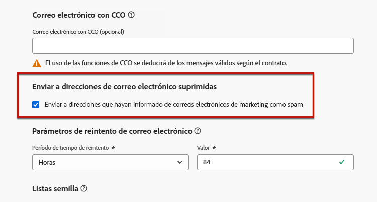
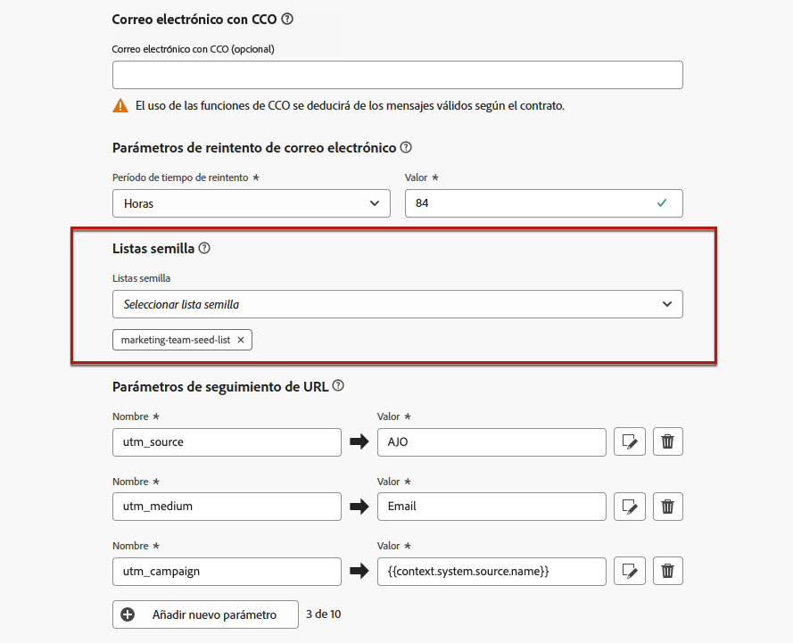
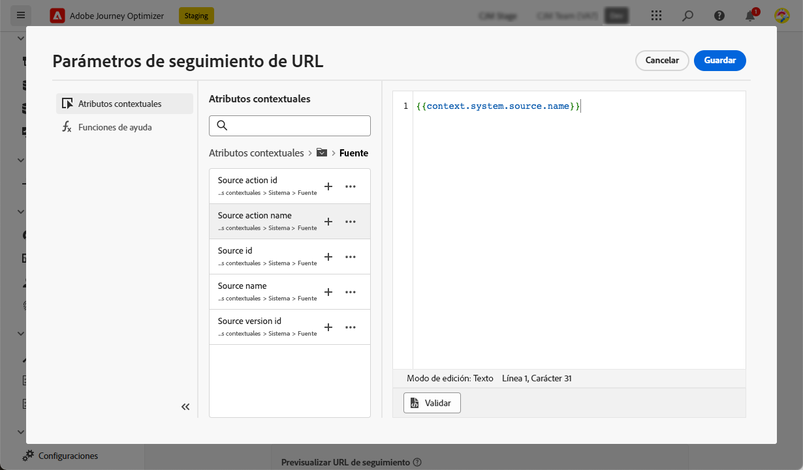

# Configuración de correo electrónico {#email-settings}

Para empezar a crear un correo electrónico, debe configurar las superficies de canal de correo electrónico que definan todos los parámetros técnicos necesarios para los mensajes. [Aprenda a crear superficies](../configuration/channel-surfaces.md)

>[!NOTE]
>
>Para preservar su reputación y mejorar su capacidad de entrega, configure los subdominios que utilizará para enviar correos electrónicos antes de crear una superficie de correo electrónico. [Más información](../configuration/about-subdomain-delegation.md)

Defina la configuración de correo electrónico en la sección dedicada de la configuración de superficie de canal, como se detalla a continuación.

La configuración de la superficie de correo electrónico se recoge para enviar comunicaciones siguiendo la lógica siguiente:

* Para los recorridos por lotes, no se aplica a la ejecución por lotes que ya se había iniciado antes de configurar la superficie de correo electrónico. Los cambios se recogerán en la próxima periodicidad o en la nueva ejecución.

* En el caso de los mensajes transaccionales, el cambio se recoge inmediatamente para la siguiente comunicación (con un retraso de hasta cinco minutos).

>[!NOTE]
>
>La configuración actualizada de la superficie de correo electrónico se recoge automáticamente en los recorridos o campañas en los que se utiliza la superficie.

## Tipo de correo electrónico {#email-type}

>[!CONTEXTUALHELP]
>id="ajo_admin_presets_emailtype"
>title="Definir la categoría del correo electrónico"
>abstract="Seleccione el tipo de correos electrónicos que se enviarán al utilizar esta superficie: Marketing para correos electrónicos promocionales, que requieren el consentimiento del usuario, o Transaccional para correos electrónicos no comerciales, que también se pueden enviar a perfiles cuya suscripción se haya cancelado en contextos específicos."

En el **TIPO DE CORREO** , seleccione el tipo de mensaje que se enviará con la superficie: **[!UICONTROL Marketing]** o **[!UICONTROL Transaccional]**.

* Elegir **Marketing** para correo electrónico promocional, como promociones semanales de una tienda minorista. Estos mensajes requieren el consentimiento del usuario.

* Elegir **Transaccional** para correos electrónicos no comerciales, como confirmaciones de pedidos, notificaciones de restablecimiento de contraseña o información de entrega, por ejemplo. Estos correos electrónicos se pueden enviar a perfiles que **cancelado** de comunicaciones de marketing. Estos mensajes solo se pueden enviar en contextos específicos.

Al crear un mensaje, debe elegir una superficie de canal válida que coincida con la categoría seleccionada para el correo electrónico.

## Subdominios y grupos de IP {#subdomains-and-ip-pools}

En el **Subdominios y grupos de IP** , rellene los campos obligatorios como se indica a continuación.

1. Seleccione el subdominio que desea utilizar para enviar los correos electrónicos.

   Para preservar la reputación de su dominio, acelerar el proceso de calentamiento de IP y mejorar la capacidad de entrega, delegue los subdominios de envío al Adobe. [Más información](../configuration/about-subdomain-delegation.md)

<!--If needed, you can define dynamic subdomains. [Learn more](../email/surface-personalization.md#dynamic-subdomains)-->

1. Seleccione el grupo de IP que se asociará a la superficie. [Más información](../configuration/ip-pools.md)

   

   No se puede continuar con la creación de superficies mientras el grupo de IP seleccionado se encuentra en [edición](../configuration/ip-pools.md#edit-ip-pool) (**[!UICONTROL Procesando]** estado) y nunca se ha asociado con el subdominio seleccionado. De lo contrario, se seguirá utilizando la versión más antigua de la asociación de subdominios/grupos de IP. En este caso, guarde la superficie como borrador y vuelva a intentarlo una vez que el grupo de IP tenga el valor **[!UICONTROL Correcto]** estado.

   >[!NOTE]
   >
   >En los entornos que no son de producción, Adobe no crea subdominios de prueba predeterminados ni concede acceso a un grupo de IP de envío compartido. Tienes que hacerlo [delegar sus propios subdominios](../configuration/delegate-subdomain.md) y utilice las direcciones IP del grupo asignado a su organización.

1. Una vez seleccionado un grupo de IP, la información de PTR se ve al pasar el ratón por encima de las direcciones IP que se muestran debajo de la lista desplegable Grupo de IP. [Más información sobre los registros PTR](../configuration/ptr-records.md)

   

   >[!NOTE]
   >
   >Si no se ha configurado un registro PTR, póngase en contacto con el representante del Adobe.

## Cancelación de suscripción a lista {#list-unsubscribe}

Tras [selección de un subdominio](#subdomains-and-ip-pools) de la lista, la variable **[!UICONTROL Habilitar cancelación de suscripción a lista]** se muestra la opción.

Esta opción está habilitada de manera predeterminada.

Si lo deja habilitado, se incluirá automáticamente un vínculo para cancelar la suscripción en el encabezado del correo electrónico, como:

Si desactiva esta opción, no se mostrará ningún vínculo para cancelar la suscripción en el encabezado del correo electrónico.

El vínculo de cancelación de suscripción consta de dos elementos:

* Un **cancelar suscripción de dirección de correo electrónico**, a los que se envían todas las solicitudes de cancelación de suscripción.

  Entrada [!DNL Journey Optimizer], la dirección de correo electrónico para cancelar la suscripción es la predeterminada **[!UICONTROL Mailto (cancelar la suscripción)]** dirección mostrada en la superficie de canal, basada en la variable [subdominio seleccionado](#subdomains-and-ip-pools).

  

* El **URL de cancelación de suscripción**, que es la dirección URL de la página de aterrizaje a la que se redirige al usuario una vez cancelada la suscripción.

  Si agrega un [vínculo de no participación de un clic](../privacy/opt-out.md#one-click-opt-out) Para agregar un mensaje creado con esta superficie, la URL de cancelación de suscripción será la URL definida para el vínculo de no participación de un solo clic.

  

  >[!NOTE]
  >
  >Si no agrega un vínculo de no participación de un clic al contenido del mensaje, no se mostrará ninguna página de aterrizaje al usuario.

Obtenga más información sobre cómo añadir un vínculo de cancelación de suscripción de encabezado a los mensajes en [esta sección](../privacy/opt-out.md#unsubscribe-header).

<!--If you have added one or more dynamic subdomains, URLs will be populated based on the resolved dynamic subdomain. [Learn more](../email/surface-personalization.md#dynamic-subdomains)-->

<!--Select the **[!UICONTROL Custom List-Unsubscribe]** option to enter your own Unsubscribe URL and/or your own Unsubscribe email address.(to add later)-->

## Parámetros de encabezado {#email-header}

En el **[!UICONTROL Parámetros de encabezado]** , introduzca los nombres de remitente y direcciones de correo electrónico asociados al tipo de correos electrónicos enviados mediante esa superficie.

* **[!UICONTROL Nombre del remitente]**: Nombre del remitente, como el nombre de la marca.

* **[!UICONTROL Correo electrónico del remitente]**: la dirección de correo electrónico que desea utilizar para sus comunicaciones.

* **[!UICONTROL Responder a (nombre)]**: Nombre que se utilizará cuando el destinatario haga clic en el **Responder** en el software de cliente de correo electrónico.

* **[!UICONTROL Responder a (correo electrónico)]**: La dirección de correo electrónico que se utilizará cuando el destinatario haga clic en el **Responder** en el software de cliente de correo electrónico. [Más información](#reply-to-email)

* **[!UICONTROL Correo electrónico de error]**: Todos los errores generados por los ISP después de unos días de envío del correo (devoluciones asincrónicas) se reciben en esta dirección. Las notificaciones fuera de la oficina y las respuestas a las preguntas y respuestas de desafío también se reciben en esta dirección.

  Si desea recibir notificaciones fuera de la oficina y respuestas de desafío en una dirección de correo electrónico específica que no se delega al Adobe, debe configurar un [proceso de reenvío](#forward-email). En ese caso, asegúrese de tener una solución manual o automatizada para procesar los correos electrónicos que llegan a esta bandeja de entrada.

>[!CAUTION]
>
>El **[!UICONTROL Correo electrónico del remitente]** y **[!UICONTROL Correo electrónico de error]** las direcciones deben utilizar el seleccionado actualmente [subdominio delegado](../configuration/about-subdomain-delegation.md). Por ejemplo, si el subdominio delegado es *marketing.luma.com*, puede utilizar *contact@marketing.luma.com* y *error@marketing.luma.com*.

>[!NOTE]
>
>Las direcciones deben comenzar por una letra (A-Z) y solo pueden contener caracteres alfanuméricos. También puede utilizar guiones bajos `_`, punto`.` y guiones `-` caracteres.

### Responder al correo electrónico {#reply-to-email}

Al definir la variable **[!UICONTROL Responder a (correo electrónico)]** dirección, puede especificar cualquier dirección de correo electrónico siempre que sea una dirección válida, en el formato correcto y sin errores tipográficos.

La bandeja de entrada utilizada para las respuestas recibirá todos los correos electrónicos de respuesta, excepto las notificaciones de fuera de la oficina y las respuestas de desafío, que se reciben en la **[!UICONTROL Correo electrónico de error]** dirección.

Para garantizar una administración de respuestas adecuada, siga las recomendaciones a continuación:

* Asegúrese de que la bandeja de entrada dedicada tenga suficiente capacidad de recepción para recibir todos los correos electrónicos de respuesta enviados mediante la superficie de correo electrónico. Si la bandeja de entrada devuelve devoluciones, es posible que algunas respuestas de sus clientes no se reciban.

* Las respuestas deben procesarse teniendo en cuenta las obligaciones de privacidad y cumplimiento, ya que pueden contener información de identificación personal (PII).

* No marque los mensajes como correo no deseado en la bandeja de entrada de respuestas, ya que afectará a todas las demás respuestas enviadas a esta dirección.

Además, al definir la variable **[!UICONTROL Responder a (correo electrónico)]** , asegúrese de utilizar un subdominio que tenga una configuración de registro MX válida; de lo contrario, el procesamiento de la superficie de correo electrónico fallará.

Si se produce un error al enviar la superficie de correo electrónico, significa que el registro MX no está configurado para el subdominio de la dirección introducida. Póngase en contacto con el administrador para configurar el registro MX correspondiente o use otra dirección con una configuración de registro MX válida.

>[!NOTE]
>
>Si el subdominio de la dirección que ha introducido es un dominio que [totalmente delegado](../configuration/delegate-subdomain.md#full-subdomain-delegation) para obtener Adobe, póngase en contacto con su administrador de cuentas de Adobe.

### Reenviar correo electrónico {#forward-email}

Para reenviar a una dirección de correo electrónico específica todos los correos electrónicos recibidos por [!DNL Journey Optimizer] para el subdominio delegado, póngase en contacto con el Servicio de atención al cliente de Adobe.

>[!NOTE]
>
>Si el subdominio utilizado para **[!UICONTROL Responder a (correo electrónico)]** La dirección no se ha delegado al Adobe. El reenvío no puede funcionar con esta dirección.

Debe proporcionar lo siguiente:

* La dirección de correo electrónico de reenvío que elija. Tenga en cuenta que el dominio de dirección de correo electrónico de reenvío no puede coincidir con ningún subdominio delegado al Adobe.
* Nombre de la zona protegida.
* El nombre de la superficie o subdominio para el que se utilizará la dirección de correo electrónico de reenvío.
  <!--* The current **[!UICONTROL Reply to (email)]** address or **[!UICONTROL Error email]** address set at the channel surface level.-->

>[!NOTE]
>
>Solo puede haber una dirección de correo electrónico de reenvío por subdominio. Por lo tanto, si varias superficies utilizan el mismo subdominio, se debe utilizar la misma dirección de correo electrónico de reenvío para todas ellas.

La dirección de correo electrónico de reenvío se configura por Adobe. Esto puede tardar de 3 a 4 días.

Una vez finalizado, todos los mensajes recibidos en la **[!UICONTROL Responder a (correo electrónico)]** y **[!UICONTROL Correo electrónico de error]** Las direcciones se reenvían a la dirección de correo electrónico específica proporcionada.

## Correo electrónico CCO {#bcc-email}

Puede enviar una copia idéntica (o copia oculta) de los correos electrónicos enviados por [!DNL Journey Optimizer] a una bandeja de entrada CCO donde se almacenarán para fines de cumplimiento o archivo.

Para ello, habilite la variable **[!UICONTROL Correo electrónico CCO]** función opcional en el nivel de superficie de canal. [Más información](../configuration/archiving-support.md#bcc-email)

Además, al definir la variable **[!UICONTROL Correo electrónico CCO]** , asegúrese de utilizar un subdominio que tenga una configuración de registro MX válida; de lo contrario, el procesamiento de la superficie de correo electrónico fallará.

Si se produce un error al enviar la superficie de correo electrónico, significa que el registro MX no está configurado para el subdominio de la dirección introducida. Póngase en contacto con el administrador para configurar el registro MX correspondiente o use otra dirección con una configuración de registro MX válida.

## Envío a direcciones de correo electrónico suprimidas {#send-to-suppressed-email-addresses}

>[!CONTEXTUALHELP]
>id="ajo_surface_suppressed_addresses"
>title="Anular prioridad de lista de supresión"
>abstract="Puede decidir enviar mensajes transaccionales a perfiles incluso si sus direcciones de correo electrónico están en la lista de supresión de Adobe Journey Optimizer debido a una queja de correo no deseado. Esta opción está desactivada de forma predeterminada."
>additional-url="https://experienceleague.adobe.com/docs/journey-optimizer/using/configuration/monitor-reputation/manage-suppression-list.html?lang=es" text="Administrar la lista de supresión"

>[!IMPORTANT]
>
>Esta opción solo está disponible si ha seleccionado la variable **[!UICONTROL Transaccional]** tipo de correo electrónico. [Más información](#email-type)

Entrada [!DNL Journey Optimizer], todas las direcciones de correo electrónico marcadas como rechazos graves, rechazos leves y quejas de spam se recopilan automáticamente en [lista de supresión](../configuration/manage-suppression-list.md) y se excluye del envío de un recorrido o una campaña.

Sin embargo, puede optar por seguir enviando mensajes del **transaccional** escriba a los perfiles aunque sus direcciones de correo electrónico estén en la lista de supresión debido a una queja de correo no deseado del usuario.

De hecho, los mensajes transaccionales generalmente contienen información útil y esperada, como una confirmación de pedido o una notificación de restablecimiento de contraseña. Por lo tanto, incluso si han informado de uno de sus mensajes de marketing como correo no deseado, la mayoría de las veces desea que sus clientes reciban este tipo de correo electrónico no comercial.

Para incluir las direcciones de correo electrónico suprimidas debido a una queja de correo no deseado en la audiencia de mensajes transaccionales, seleccione la opción correspondiente en la **[!UICONTROL Enviar a direcciones de correo electrónico suprimidas]** sección.

>[!NOTE]
>
>Esta opción está desactivada de forma predeterminada.

Como práctica recomendada de envío, esta opción está desactivada de forma predeterminada para garantizar que no se contacte con los clientes que se han excluido. Sin embargo, puede cambiar esta opción predeterminada, que le permite enviar mensajes transaccionales a sus clientes.

Una vez activada esta opción, aunque un cliente haya marcado su correo electrónico de marketing como correo no deseado, dicho cliente podrá recibir sus mensajes transaccionales utilizando la superficie actual. Asegúrese siempre de administrar las preferencias de exclusión de acuerdo con las prácticas recomendadas de envío.

## Lista semilla {#seed-list}

>[!CONTEXTUALHELP]
>id="ajo_surface_seed_list"
>title="Añadir una lista semilla"
>abstract="Seleccione la lista semilla que desee para añadir automáticamente direcciones internas específicas a sus públicos. Estas direcciones semilla se incluirán en el momento de la ejecución de la entrega y recibirán una copia exacta del mensaje con fines de garantía."
>additional-url="https://experienceleague.adobe.com/docs/journey-optimizer/using/configuration/seed-lists.html#use-seed-list?lang=es" text="¿Qué son las listas semilla?"
>additional-url="https://experienceleague.adobe.com/docs/journey-optimizer/using/configuration/seed-lists.html?lang=es#create-seed-list" text="Crear listas semilla"

Una lista semilla en [!DNL Journey Optimizer] permite incluir automáticamente direcciones semilla de correo electrónico específicas en las entregas. [Más información](../configuration/seed-lists.md)

>[!CAUTION]
>
>Actualmente, esta función solo se aplica al canal de correo electrónico.

Seleccione la lista que sea relevante para usted en la **[!UICONTROL Lista semilla]** sección. Obtenga información sobre cómo crear una lista semilla en [esta sección](../configuration/seed-lists.md#create-seed-list).

>[!NOTE]
>
>Solo se puede seleccionar una lista semilla a la vez.

Cuando la superficie actual se utiliza en una campaña o recorrido, las direcciones de correo electrónico de la lista semilla seleccionada se incluyen en el momento de la ejecución de la entrega, lo que significa que recibirán una copia de la entrega con fines de garantía.

Aprenda a utilizar la lista semilla en una campaña o un recorrido en [esta sección](../configuration/seed-lists.md#use-seed-list).

## Parámetros de reintento de correo electrónico {#email-retry}

>[!CONTEXTUALHELP]
>id="ajo_admin_presets_retryperiod"
>title="Ajustar el período de tiempo de reintento"
>abstract="Los reintentos se realizan durante 3,5 días (84 horas) cuando falla el envío de un correo electrónico debido a un error temporal de mensaje devuelto no entregado. Puede ajustar este período de tiempo de reintento predeterminado para adaptarlo mejor a sus necesidades."
>additional-url="https://experienceleague.adobe.com/docs/journey-optimizer/using/configuration/monitor-reputation/retries.html?lang=es" text="Acerca de los reintentos"

Puede configurar las variables **Parámetros de reintento de correo electrónico**.

De forma predeterminada, la variable [período de tiempo de reintento](../configuration/retries.md#retry-duration) tiene un valor de 84 horas, pero puede ajustarlo para adaptarlo mejor a sus necesidades.

Debe introducir un valor entero (en horas o minutos) dentro del siguiente intervalo:

* Para los correos electrónicos de marketing, el periodo mínimo de reintento es de 6 horas.
* Para los correos electrónicos transaccionales, el período mínimo de reintento es de 10 minutos.
* Para ambos tipos de correo electrónico, el periodo máximo de reintento es de 84 horas (o 5040 minutos).

Obtenga más información sobre reintentos en [esta sección](../configuration/retries.md).

## Seguimiento de URL {#url-tracking}

>[!CONTEXTUALHELP]
>id="ajo_admin_preset_utm"
>title="Definir los parámetros de seguimiento de URL"
>abstract="Utilice esta sección para adjuntar automáticamente parámetros de seguimiento a las direcciones URL presentes en el contenido del correo electrónico. Esta función es opcional."

>[!CONTEXTUALHELP]
>id="ajo_admin_preset_url_preview"
>title="Previsualizar los parámetros de seguimiento de URL"
>abstract="Revise cómo se adjuntarán los parámetros de seguimiento a las direcciones URL presentes en el contenido del correo electrónico."

Puede utilizar **[!UICONTROL Parámetros de seguimiento de URL]** para medir la eficacia de sus esfuerzos de marketing entre canales. Esta funcionalidad es opcional.

Los parámetros definidos en esta sección se adjuntan al final de las direcciones URL incluidas en el contenido del mensaje de correo electrónico. A continuación, puede capturar estos parámetros en herramientas de análisis web como Adobe Analytics o Google Analytics y crear varios informes de rendimiento.

Puede añadir hasta 10 parámetros de seguimiento con la variable **[!UICONTROL Añadir nuevo parámetro]** botón.

Para configurar un parámetro de seguimiento de URL, puede introducir directamente los valores deseados en **[!UICONTROL Nombre]** y **[!UICONTROL Valor]** campos.

También puede editar cada **[!UICONTROL Valor]** mediante el campo [Editor de expresiones](../personalization/personalization-build-expressions.md). Haga clic en el icono de edición para abrir el editor. Desde allí, puede seleccionar los atributos contextuales disponibles o editar directamente el texto.

Los siguientes valores predefinidos están disponibles a través del Editor de expresiones:

* **ID de acción de origen**: ID de la acción de correo electrónico agregada al recorrido o la campaña.

* **Nombre de acción de origen**: nombre de la acción de correo electrónico agregada al recorrido o a la campaña.

* **ID de origen**: ID del recorrido o campaña con la que se envió el correo electrónico.

* **Nombre de origen**: nombre del recorrido o campaña con la que se envió el correo electrónico.

* **ID de versión de origen**: ID de la versión de recorrido o campaña con la que se envió el correo electrónico.

* **ID de oferta**: ID de la oferta utilizada en el correo electrónico.

>[!NOTE]
>
>Puede combinar la escritura de valores de texto y el uso de atributos contextuales desde el Editor de expresiones. Cada **[!UICONTROL Valor]** El campo puede contener un número de caracteres hasta el límite de 5 KB.

<!--You can drag and drop the parameters to reorder them.-->

A continuación, se muestran ejemplos de URL compatibles con Adobe Analytics y Google Analytics.

* URL compatible con Adobe Analytics: `www.YourLandingURL.com?cid=email_AJO_{{context.system.source.id}}_image_{{context.system.source.name}}`

* URL compatible con Google Analytics: `www.YourLandingURL.com?utm_medium=email&utm_source=AJO&utm_campaign={{context.system.source.id}}&utm_content=image`

Puede obtener una vista previa dinámica de la URL de seguimiento resultante. Cada vez que se añade, edita o elimina un parámetro, la vista previa se actualiza automáticamente.

>[!NOTE]
>
>También puede añadir parámetros de seguimiento personalizados dinámicos a los vínculos presentes en el contenido del correo electrónico, pero esto no es posible en el nivel de superficie. Debe hacerlo al crear el mensaje con el diseñador de correo electrónico. [Más información](message-tracking.md#url-tracking)
