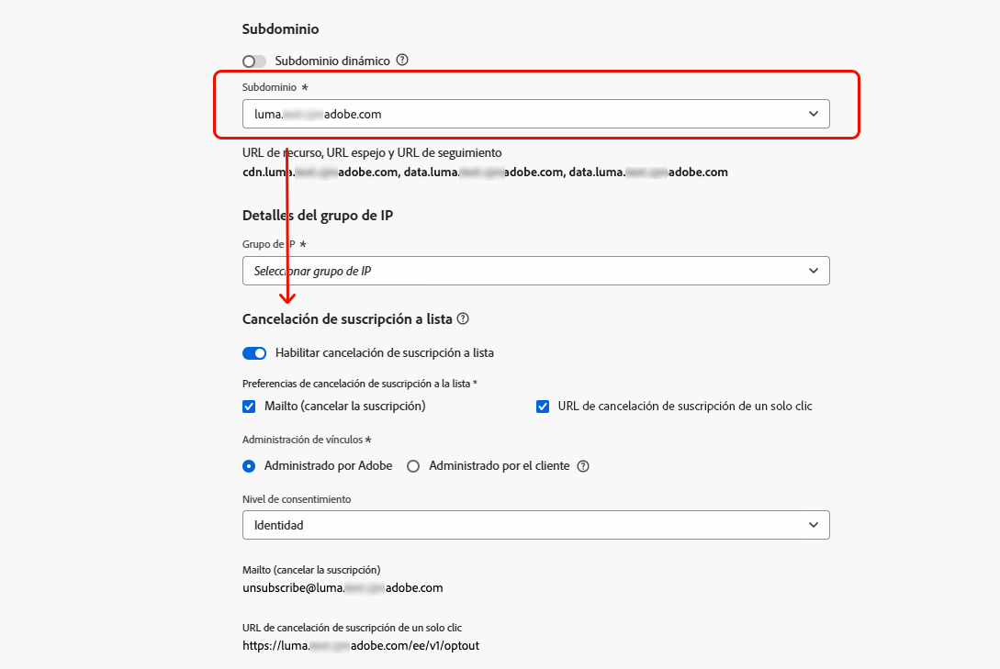
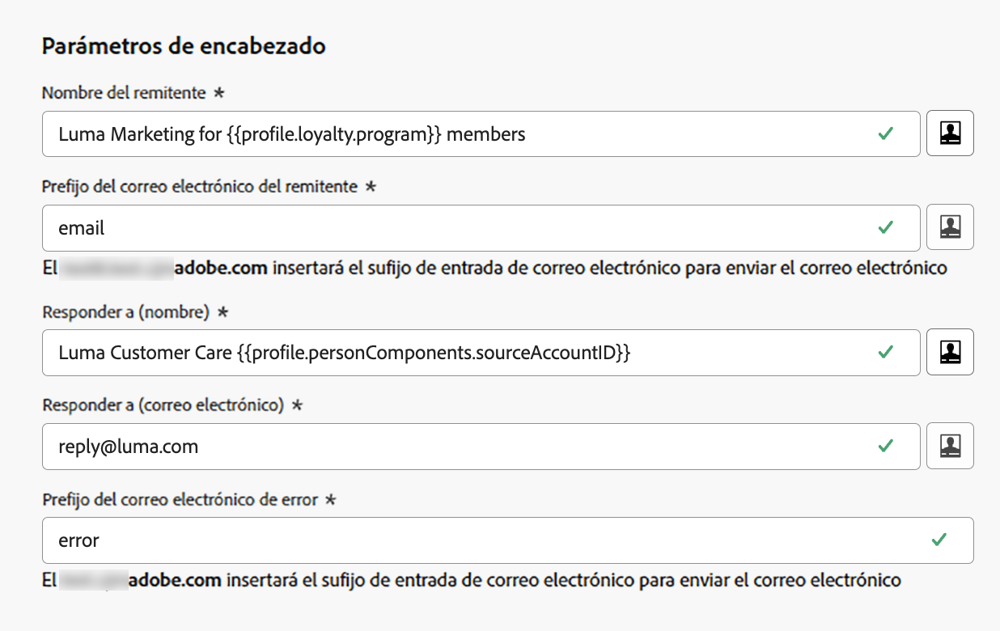

# Configuración de correo electrónico {#email-settings}

Para empezar a crear un correo electrónico, debe configurar las superficies del canal de correo electrónico que definan todos los parámetros técnicos necesarios para los mensajes. [Aprenda a crear superficies](../configuration/channel-surfaces.md)

Defina la configuración del correo electrónico en la sección dedicada de la configuración de la superficie del canal.

La configuración de la superficie del correo electrónico se recoge para enviar comunicaciones siguiendo la lógica siguiente:

* Para los recorridos por lotes y de ráfagas, no se aplica a la ejecución por lotes o de ráfagas que ya se había iniciado antes de que se realice la configuración de la superficie del correo electrónico. Los cambios se recogen en la siguiente recurrencia o en la nueva ejecución.

* En el caso de los mensajes transaccionales, el cambio se recoge inmediatamente para la siguiente comunicación (con un retraso de hasta cinco minutos).

>[!NOTE]
>
>La configuración actualizada de la superficie del correo electrónico se recogerá automáticamente en los recorridos o campañas en los que se utilice la superficie.

## Tipo de correo electrónico {#email-type}

>[!CONTEXTUALHELP]
>id="ajo_admin_presets_emailtype"
>title="Definir la categoría de correo electrónico"
>abstract="Seleccione el tipo de correos electrónicos que se enviarán al utilizar esta superficie: Marketing para correos electrónicos promocionales, que requieren el consentimiento del usuario, o Transactional para correos electrónicos no comerciales, que también se pueden enviar a perfiles cancelados de suscripción en contextos específicos."

En el **TIPO DE CORREO ELECTRÓNICO** seleccione el tipo de mensaje que se enviará con la superficie: **Marketing** o **Transaccional**.

* Choose **Marketing** para correo electrónico promocional: estos mensajes requieren el consentimiento del usuario.

* Choose **Transaccional** para correo electrónico no comercial, como confirmación de pedido, notificaciones de restablecimiento de contraseña o información de entrega, por ejemplo.

>[!CAUTION]
>
>**Transaccional** los correos electrónicos se pueden enviar a perfiles que cancelan la suscripción a las comunicaciones de marketing. Estos mensajes solo se pueden enviar en contextos específicos.

Al crear un mensaje, debe elegir una superficie de canal válida que coincida con la categoría seleccionada para el correo electrónico.

## Grupos de subdominios e IP {#subdomains-and-ip-pools}

En el **Grupos de subdominios e IP** , debe:

1. Seleccione el subdominio que desea utilizar para enviar los correos electrónicos. [Más información](../configuration/about-subdomain-delegation.md)

1. Seleccione el grupo IP que desea asociar con la superficie. [Más información](../configuration/ip-pools.md)

No puede continuar con la creación de superficie mientras el grupo IP seleccionado está bajo [edición](../configuration/ip-pools.md#edit-ip-pool) (**[!UICONTROL Procesamiento]** ) y nunca se ha asociado con el subdominio seleccionado. De lo contrario, se seguirá utilizando la versión más antigua de la asociación de agrupación/subdominio de IP. Si este es el caso, guarde la superficie como borrador y vuelva a intentarlo una vez que el grupo de IP tenga la variable **[!UICONTROL Correcto]** estado.

>[!NOTE]
>
>Para los entornos que no son de producción, Adobe no crea subdominios de prueba predeterminados ni concede acceso a un grupo de IP de envío compartido. Debe [delegar sus propios subdominios](../configuration/delegate-subdomain.md) y usar las IP del grupo asignado a su organización.

Una vez seleccionado un grupo de IP, la información de PTR es visible al pasar el ratón por encima de las direcciones IP que se muestran debajo de la lista desplegable del grupo de IP. [Más información sobre los registros PTR](../configuration/ptr-records.md)

>[!NOTE]
>
>Si no se ha configurado un registro PTR, póngase en contacto con el representante de Adobe.

## Cancelación de suscripción a una lista {#list-unsubscribe}

upon [selección de un subdominio](#subdomains-and-ip-pools) de la lista, la variable **[!UICONTROL Habilitar la cancelación de la suscripción a una lista]** se muestra.

Esta opción está habilitada de manera predeterminada.

Si lo deja habilitado, se incluirá automáticamente un vínculo de cancelación de suscripción en el encabezado del correo electrónico, como:

Si desactiva esta opción, no aparecerá ningún vínculo de cancelación de suscripción en el encabezado del correo electrónico.

El vínculo de cancelación de suscripción consta de dos elementos:

* Un **cancelar la suscripción de la dirección de correo electrónico**, a la que se envían todas las solicitudes de cancelación de suscripción.

   En [!DNL Journey Optimizer], la dirección de correo electrónico de cancelación de suscripción es la predeterminada **[!UICONTROL Mailto (cancelar suscripción)]** dirección mostrada en la superficie del canal, según la variable [subdominio seleccionado](#subdomains-and-ip-pools).

   

* La variable **cancelar la suscripción de la dirección URL**, que es la dirección URL de la página de aterrizaje a la que se redirige al usuario una vez que se da de baja de la suscripción.

   Si agrega un [vínculo de exclusión con un solo clic](../privacy/opt-out.md#one-click-opt-out) en un mensaje creado con esta superficie, la URL de cancelación de suscripción será la URL definida para el vínculo de exclusión de un clic.

   

   >[!NOTE]
   >
   >Si no agrega un vínculo de exclusión de un clic al contenido del mensaje, no se mostrará ninguna página de aterrizaje al usuario.

Obtenga más información sobre cómo añadir un vínculo de cancelación de suscripción a un encabezado a sus mensajes en [esta sección](../privacy/opt-out.md#unsubscribe-header).

<!--Select the **[!UICONTROL Custom List-Unsubscribe]** option to enter your own Unsubscribe URL and/or your own Unsubscribe email address.(to add later)-->

## Parámetros de encabezado {#email-header}

En el **[!UICONTROL Parámetros de encabezado]** , introduzca los nombres del remitente y las direcciones de correo electrónico asociadas al tipo de correos electrónicos enviados con esa superficie.

* **[!UICONTROL Nombre del remitente]**: El nombre del remitente, como el nombre de su marca.

* **[!UICONTROL Correo electrónico del remitente]**: La dirección de correo electrónico que desea utilizar para sus comunicaciones.

* **[!UICONTROL Responder a (nombre)]**: El nombre que se utilizará cuando el destinatario haga clic en la variable **Responder** en el software cliente de correo electrónico.

* **[!UICONTROL Responder a (correo electrónico)]**: La dirección de correo electrónico que se utilizará cuando el destinatario haga clic en el **Responder** en el software cliente de correo electrónico. [Más información](#reply-to-email)

* **[!UICONTROL Correo electrónico de error]**: Todos los errores generados por los ISP después de unos días de envío del correo (devoluciones asincrónicas) se reciben en esta dirección.

>[!CAUTION]
>
>La variable **[!UICONTROL Correo electrónico del remitente]** y **[!UICONTROL Correo electrónico de error]** Las direcciones deben utilizar el [subdominio delegado](../configuration/about-subdomain-delegation.md). Por ejemplo, si el subdominio delegado es *marketing.luma.com*, puede usar *contact@marketing.luma.com* y *error@marketing.luma.com*.

>[!NOTE]
>
>Las direcciones deben comenzar por una letra (A-Z) y solo pueden contener caracteres alfanuméricos. También puede utilizar guiones bajos `_`, punto`.` Guión `-` caracteres.

### Responder a correo electrónico {#reply-to-email}

Al definir la variable **[!UICONTROL Responder a (correo electrónico)]** dirección, puede especificar cualquier dirección de correo electrónico siempre que sea una dirección válida, con el formato correcto y sin ningún tipo de error.

Para garantizar una administración de respuestas adecuada, siga las recomendaciones a continuación:

* La bandeja de entrada utilizada para las respuestas recibirá todos los correos electrónicos de respuesta, incluidas las notificaciones fuera de la oficina y las respuestas de desafío, por lo que debe asegurarse de tener un proceso manual o automatizado para procesar el aterrizaje de los correos electrónicos en esta bandeja de entrada.

* Asegúrese de que la bandeja de entrada dedicada tenga suficiente capacidad de recepción para recibir todos los correos electrónicos de respuesta que se envían mediante la superficie del correo electrónico. Si la bandeja de entrada devuelve devoluciones, es posible que algunas respuestas de sus clientes no se reciban.

* Las respuestas deben procesarse teniendo en cuenta las obligaciones de privacidad y cumplimiento, ya que pueden contener información personal identificable (PII).

* No marque los mensajes como correo no deseado en la bandeja de entrada de respuesta, ya que esto afectará a todas las demás respuestas enviadas a esta dirección.

Además, al definir la variable **[!UICONTROL Responder a (correo electrónico)]** , asegúrese de utilizar un subdominio que tenga una configuración de registro MX válida; de lo contrario, el procesamiento de la superficie del correo electrónico fallará.

Si aparece un error al enviar el correo electrónico, significa que el registro MX no está configurado para el subdominio de la dirección que ha introducido. Póngase en contacto con el administrador para configurar el registro MX correspondiente o utilice otra dirección con una configuración de registro MX válida.

>[!NOTE]
>
>Si el subdominio de la dirección que ha introducido es un dominio que [completamente delegado](../configuration/delegate-subdomain.md#full-subdomain-delegation) para obtener Adobes, póngase en contacto con el administrador de cuentas de Adobe.

### Reenviar correo electrónico {#forward-email}

Si desea reenviar a una dirección de correo electrónico específica, todos los correos electrónicos recibidos por [!DNL Journey Optimizer] para el subdominio delegado, póngase en contacto con el servicio de atención al cliente de Adobe. Deberá proporcionar:

* La dirección de correo electrónico de reenvío que elija. Tenga en cuenta que el dominio de dirección de correo electrónico de reenvío no puede coincidir con ningún subdominio delegado a Adobe.
* El nombre del simulador de pruebas.
* El nombre de superficie para el que se utilizará la dirección de correo electrónico de reenvío.
* El **[!UICONTROL Responder a (correo electrónico)]** dirección definida en el nivel de superficie del canal.

>[!NOTE]
>
>Solo puede haber una dirección de correo electrónico de reenvío por subdominio. Por lo tanto, si varias superficies utilizan el mismo subdominio, se debe utilizar la misma dirección de correo electrónico de reenvío para todas ellas.

La dirección de correo electrónico de reenvío se configura por Adobe. Esto puede tardar entre 3 y 4 días.

## Correo electrónico CCO {#bcc-email}

Puede enviar una copia idéntica (o una copia ciega de los correos electrónicos enviados por [!DNL Journey Optimizer] a una bandeja de entrada BCC donde se almacenarán para fines de cumplimiento o archivo.

Para ello, habilite la **[!UICONTROL Correo electrónico CCO]** función opcional en el nivel de superficie del canal. [Más información](../configuration/archiving-support.md#bcc-email)

Además, al definir la variable **[!UICONTROL Correo electrónico CCO]** , asegúrese de utilizar un subdominio que tenga una configuración de registro MX válida; de lo contrario, el procesamiento de la superficie del correo electrónico fallará.

Si aparece un error al enviar el correo electrónico, significa que el registro MX no está configurado para el subdominio de la dirección que ha introducido. Póngase en contacto con el administrador para configurar el registro MX correspondiente o utilice otra dirección con una configuración de registro MX válida.

## Parámetros de reintentos de correo electrónico {#email-retry}

>[!CONTEXTUALHELP]
>id="ajo_admin_presets_retryperiod"
>title="Ajustar el período de tiempo de reintento"
>abstract="Los reintentos se realizan durante 3,5 días (84 horas) cuando un envío de correo electrónico falla debido a un error temporal de devolución del mensaje. Puede ajustar este período de tiempo de reintento predeterminado para adaptarlo mejor a sus necesidades."
>additional-url="https://experienceleague.adobe.com/docs/journey-optimizer/using/configuration/monitor-reputation/retries.html" text="Acerca de los reintentos"

Puede configurar la variable **Parámetros de reintentos de correo electrónico**.

De forma predeterminada, la variable [periodo de tiempo de reintento](../configuration/retries.md#retry-duration) está configurada a 84 horas, pero puede ajustar esta configuración para adaptarla mejor a sus necesidades.

Debe introducir un valor entero (en horas o minutos) dentro del siguiente intervalo:

* En los correos electrónicos de marketing, el periodo de reintento mínimo es de 6 horas.
* Para los correos electrónicos transaccionales, el periodo mínimo de reintentos es de 10 minutos.
* Para ambos tipos de correo electrónico, el periodo de reintento máximo es de 84 horas (o 5040 minutos).

Obtenga más información sobre los reintentos en [esta sección](../configuration/retries.md).

## Seguimiento de URL {#url-tracking}

>[!CONTEXTUALHELP]
>id="ajo_admin_preset_utm"
>title="Definir los parámetros de seguimiento de URL"
>abstract="Utilice esta sección para adjuntar automáticamente parámetros de seguimiento a las direcciones URL presentes en el contenido del correo electrónico. Esta función es opcional."

>[!CONTEXTUALHELP]
>id="ajo_admin_preset_url_preview"
>title="Vista previa de los parámetros de seguimiento de URL"
>abstract="Revise cómo se adjuntarán los parámetros de seguimiento a las direcciones URL presentes en el contenido del correo electrónico."

Puede usar **[!UICONTROL Parámetros de seguimiento de URL]** para medir la eficacia de sus esfuerzos de marketing en todos los canales. Esta función es opcional.

Los parámetros definidos en esta sección se anexarán al final de las direcciones URL incluidas en el contenido del mensaje de correo electrónico. A continuación, puede capturar estos parámetros en herramientas de análisis web, como Adobe Analytics o Google Analytics, y crear varios informes de rendimiento.

<!--Three URL tracking parameters are auto-populated as an example when you create a channel surface. You can edit these and add up to 10 tracking parameters using the **[!UICONTROL Add new parameter]** button.-->

Puede agregar hasta 10 parámetros de seguimiento utilizando la variable **[!UICONTROL Añadir nuevo parámetro]** botón.

Para configurar un parámetro de seguimiento de URL, puede introducir directamente los valores deseados en la variable **[!UICONTROL Nombre]** y **[!UICONTROL Valor]** campos.

<!--You can also choose from a list of predefined values by navigating to the following objects:
* Journey attributes: **Source id**, **Source name**, **Source version id**
* Action attributes: **Action id**, **Action name**
* Offer decisioning attributes: **Offer id**, **Offer name**

>[!CAUTION]
>
>Do not select a folder: make sure to browse to the necessary folder and select a profile attribute to use as a tracking parameter value.-->

También puede editar cada **[!UICONTROL Valor]** utilizando la variable [Editor de expresiones](../personalization/personalization-build-expressions.md). Haga clic en el icono de edición para abrir el editor. Desde allí, puede seleccionar los atributos contextuales de su elección o editar directamente el texto.

>[!NOTE]
>
>Puede combinar la escritura de valores de texto y el uso de atributos contextuales desde el Editor de expresiones. Cada **[!UICONTROL Valor]** puede contener un número de caracteres hasta el límite de 5 KB.

<!--You can drag and drop the parameters to reorder them.-->

A continuación se muestran ejemplos de URL compatibles con Adobe Analytics y Google Analytics.

* URL compatible con Adobe Analytics: `www.YourLandingURL.com?cid=email_AJO_{{context.system.source.id}}_image_{{context.system.source.name}}`

* URL compatible con Google Analytics: `www.YourLandingURL.com?utm_medium=email&utm_source=AJO&utm_campaign={{context.system.source.id}}&utm_content=image`

Puede obtener una vista previa dinámica de la URL de seguimiento resultante. Cada vez que se añade, edita o elimina un parámetro, la vista previa se actualiza automáticamente.

