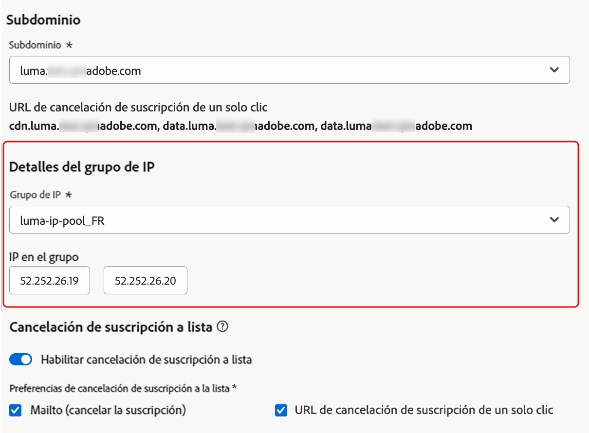
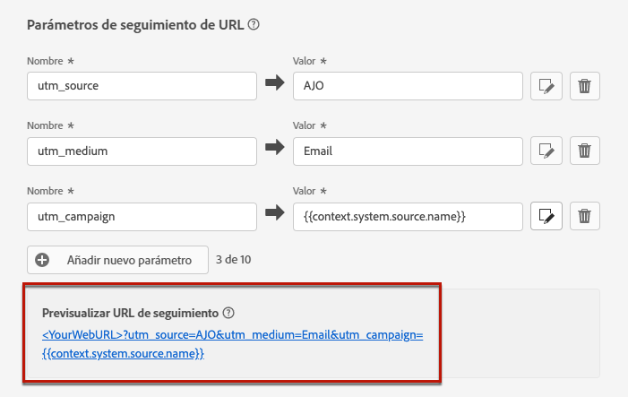

# Configuración de correo electrónico {#email-settings}

Para empezar a crear un correo electrónico, debe configurar las configuraciones de canal de correo electrónico que definen todos los parámetros técnicos necesarios para los mensajes. [Aprenda a crear configuraciones](../configuration/channel-surfaces.md)

>[!NOTE]
>
>Para preservar su reputación y mejorar su capacidad de entrega, configure los subdominios que utilizará para enviar correos electrónicos antes de crear una configuración de correo electrónico. [Más información](../configuration/about-subdomain-delegation.md)

Defina la configuración de correo electrónico en la sección dedicada de la configuración de canal, como se detalla a continuación.

{width="50%" align="left"}

La configuración de correo electrónico se recoge para enviar comunicaciones siguiendo la lógica siguiente:

* Para los recorridos por lotes, no se aplica a la ejecución por lotes que ya se había iniciado antes de configurar la superficie de correo electrónico. Los cambios se recogen en la siguiente periodicidad o nueva ejecución.

* En el caso de los mensajes transaccionales, el cambio se recoge inmediatamente para la siguiente comunicación (con un retraso de hasta cinco minutos).

>[!NOTE]
>
>La configuración de correo electrónico actualizada se recoge automáticamente en los recorridos o campañas en las que se utiliza la configuración.

## Tipo de correo electrónico {#email-type}

>[!CONTEXTUALHELP]
>id="ajo_admin_presets_emailtype"
>title="Definir el tipo de correo electrónico"
>abstract="Seleccione el tipo de correos electrónicos que se enviarán al utilizar esta configuración: Marketing para correos electrónicos promocionales, que requieren el consentimiento del usuario, o Transaccional para correos electrónicos no comerciales, que también se pueden enviar a perfiles sin suscribir en contextos específicos."

En la sección **Tipo de correo electrónico**, seleccione el tipo de mensaje para la configuración: **[!UICONTROL Marketing]** o **[!UICONTROL Transaccional]**.

* Seleccione **Marketing** para el correo electrónico promocional, como las promociones semanales de una tienda minorista. Estos mensajes requieren el consentimiento del usuario.

* Seleccione **Transaccional** para correo electrónico no comercial, como confirmaciones de pedidos, notificaciones de restablecimiento de contraseña o información de envío, por ejemplo. Estos correos electrónicos se pueden enviar a perfiles que **cancelaron la suscripción** a comunicaciones de marketing. Estos mensajes solo se pueden enviar en contextos específicos.

Al crear un mensaje, debe elegir una configuración de canal válida que coincida con la categoría seleccionada para el correo electrónico.

## Subdomain {#subdomains}

Seleccione el subdominio que desea utilizar para enviar los correos electrónicos.

Para preservar la reputación de su dominio, acelerar el proceso de calentamiento de IP y mejorar la capacidad de entrega, delegue los subdominios de envío al Adobe. [Más información](../configuration/about-subdomain-delegation.md)

<!--If needed, you can define dynamic subdomains. [Learn more](../email/surface-personalization.md#dynamic-subdomains)-->

## Detalles del grupo de IP {#ip-pools}

Seleccione el grupo de IP que desea asociar con la configuración. [Más información](../configuration/ip-pools.md)

{width="50%" align="left"}

No puede continuar con la creación de la configuración mientras el grupo de IP seleccionado esté en [edición](../configuration/ip-pools.md#edit-ip-pool) (**[!UICONTROL Procesando]** estado) y nunca se haya asociado con el subdominio seleccionado. De lo contrario, se seguirá utilizando la versión más antigua de la asociación de subdominios/grupos de IP. En este caso, guarde la configuración como borrador y vuelva a intentarlo una vez que el grupo de IP tenga el estado **[!UICONTROL Correcto]**.

>[!NOTE]
>
>En los entornos que no son de producción, Adobe no crea subdominios de prueba predeterminados ni concede acceso a un grupo de IP de envío compartido. Debe [delegar sus propios subdominios](../configuration/delegate-subdomain.md) y utilizar las direcciones IP del grupo asignado a su organización.

Una vez seleccionado un grupo de IP, la información de PTR se ve al pasar el ratón por encima de las direcciones IP que se muestran debajo de la lista desplegable Grupo de IP. [Más información sobre los registros PTR](../configuration/ptr-records.md)

>[!NOTE]
>
>Si no se ha configurado un registro PTR, póngase en contacto con el representante del Adobe.

## Encabezado Cancelar suscripción a lista{#list-unsubscribe}

<!--Do not modify - Legal Review Done -->

Al [seleccionar un subdominio](#subdomains-and-ip-pools) de la lista, se muestra la opción **[!UICONTROL Habilitar cancelación de suscripción a una lista]**.

Esta opción está habilitada de forma predeterminada para incluir una URL de cancelación de suscripción de un solo clic en el encabezado del correo electrónico, como:

Si desactiva esta opción, no se mostrará la URL &quot;Cancelar la suscripción&quot; con un solo clic en el encabezado del correo electrónico.

Puede seleccionar el nivel de consentimiento en la lista desplegable **[!UICONTROL Nivel de consentimiento]**. Puede ser específico del canal o de la identidad del perfil. En función de esta configuración, cuando un usuario cancela la suscripción mediante la URL de cancelación de suscripción de lista en el encabezado de un correo electrónico, el consentimiento se actualiza en Adobe Journey Optimizer en el nivel de canal o de ID.

El encabezado Cancelar la suscripción a una lista ofrece dos funciones (Mailto y URL de cancelación de suscripción con un clic, como se explica a continuación) que están habilitadas de forma predeterminada a menos que desactive una o ambas funciones:

* Una dirección **Mailto (cancelación de suscripción)**, que es la dirección de destino a la que se dirigen las solicitudes de cancelación de suscripción para el procesamiento automático.

  En Journey Optimizer, la dirección de correo electrónico para cancelar la suscripción es la dirección predeterminada **Mailto (cancelar la suscripción)** mostrada en la configuración del canal, según el [subdominio seleccionado](#subdomains-and-ip-pools).

  {width="80%" align="left"}

* La URL **Cancelar la suscripción con un solo clic**, que de forma predeterminada es la opción de un solo clic del encabezado Cancelar la suscripción a la lista generado por la URL, según el subdominio que haya establecido y configurado en las Opciones de configuración del canal.

<!--
    >[!AVAILABILITY]
    >
    >One-click Unsubscribe URL Header will be available in Adobe Journey Optimizer starting June 3, 2024.
    >
-->

La característica **[!UICONTROL Mailto (cancelar la suscripción)]** y la característica **[!UICONTROL Cancelar la suscripción a una URL]** con un solo clic son opcionales. Si no desea utilizar la URL de cancelación de suscripción generada de un solo clic predeterminada, puede desactivar la función. En el escenario donde la opción **[!UICONTROL Configuración de exclusión]** está activada y la función **[!UICONTROL Cancelar la suscripción a una URL]** con un solo clic está desactivada, si agrega un vínculo de exclusión de [un clic](../privacy/opt-out.md#one-click-opt-out) a un mensaje creado con esta configuración, el encabezado de cancelación de suscripción a una lista recogerá el vínculo de exclusión de un clic que ha insertado en el cuerpo del correo electrónico y lo usará como valor de URL de cancelación de suscripción con un solo clic.

>[!NOTE]
>
>Si no agrega un vínculo de no participación de un clic al contenido del mensaje y la URL predeterminada de cancelación de suscripción de un clic no está marcada en la Configuración de canal, no se pasará ninguna URL al encabezado del correo electrónico como parte del encabezado Cancelación de suscripción a una lista.

Obtenga más información sobre cómo administrar las capacidades de cancelación de suscripción en sus mensajes en [esta sección](../email/email-opt-out.md#unsubscribe-header).

## Parámetros de encabezado {#email-header}

En la sección **[!UICONTROL Parámetros de encabezado]**, escriba los nombres de remitente y las direcciones de correo electrónico asociadas al tipo de correos electrónicos enviados con esa configuración.

* **[!UICONTROL Nombre del remitente]**: El nombre del remitente, como el nombre de su marca.
* **[!UICONTROL Correo electrónico del remitente]**: La dirección de correo electrónico que desea usar para sus comunicaciones.
* **[!UICONTROL Responder a (nombre)]**: El nombre que se usará cuando el destinatario haga clic en el botón **Responder** en el software de cliente de correo electrónico.
* **[!UICONTROL Responder a (correo electrónico)]**: La dirección de correo electrónico que se usará cuando el destinatario haga clic en el botón **Responder** en el software de cliente de correo electrónico. [Más información](#reply-to-email)
* **[!UICONTROL Correo electrónico de error]**: todos los errores generados por los ISP después de unos días de envío del correo (devoluciones asincrónicas) se reciben en esta dirección. Las notificaciones fuera de la oficina y las respuestas a las preguntas y respuestas de desafío también se reciben en esta dirección.

  Si desea recibir notificaciones fuera de la oficina y respuestas de desafío en una dirección de correo electrónico específica que no se ha delegado al Adobe, debe configurar un [proceso de reenvío](#forward-email). En ese caso, asegúrese de tener una solución manual o automatizada para procesar los correos electrónicos que llegan a esta bandeja de entrada.

>[!CAUTION]
>
>Las direcciones de **[!UICONTROL correo electrónico del remitente]** y **[!UICONTROL correo electrónico con error]** deben usar el [subdominio delegado seleccionado actualmente](../configuration/about-subdomain-delegation.md). Por ejemplo, si el subdominio delegado es *marketing.luma.com*, puede usar *contact@marketing.luma.com* y *error@marketing.luma.com*.

>[!NOTE]
>
>Las direcciones deben comenzar por una letra (A-Z) y solo pueden contener caracteres alfanuméricos. También puede utilizar caracteres de guion bajo `_`, punto`.` y guión `-`.

### Responder al correo electrónico {#reply-to-email}

Al definir la dirección **[!UICONTROL Responder a (correo electrónico)]**, puede especificar cualquier dirección de correo electrónico siempre que sea válida, tenga el formato correcto y no contenga errores tipográficos.

La bandeja de entrada utilizada para las respuestas recibirá todos los correos electrónicos de respuesta, excepto las notificaciones de Fuera de la oficina y las respuestas de desafío, que se reciben en la dirección de **[!UICONTROL correo electrónico con errores]**.

Para garantizar una administración de respuestas adecuada, siga las recomendaciones siguientes:

* Asegúrese de que la bandeja de entrada dedicada tenga suficiente capacidad de recepción para recibir todos los correos electrónicos de respuesta enviados con la configuración de correo electrónico. Si la bandeja de entrada devuelve devoluciones, es posible que algunas respuestas de sus clientes no se reciban.

* Las respuestas deben procesarse teniendo en cuenta las obligaciones de privacidad y cumplimiento, ya que pueden contener información de identificación personal (PII).

* No marque los mensajes como correo no deseado en la bandeja de entrada de respuestas, ya que afectará a todas las demás respuestas enviadas a esta dirección.

Además, al definir la dirección **[!UICONTROL Responder a (correo electrónico)]**, asegúrese de utilizar un subdominio que tenga una configuración de registro MX válida; de lo contrario, se producirá un error durante el procesamiento de la configuración de correo electrónico.

Si se produce un error al enviar la configuración de correo electrónico, significa que el registro MX no está configurado para el subdominio de la dirección que ha introducido. Póngase en contacto con el administrador para configurar el registro MX correspondiente o use otra dirección con una configuración de registro MX válida.

>[!NOTE]
>
>Si el subdominio de la dirección que ingresó es un dominio que se [delegó completamente](../configuration/delegate-subdomain.md#full-subdomain-delegation) al Adobe, comuníquese con el ejecutivo de cuenta de Adobe.

### Reenviar correo electrónico {#forward-email}

Para reenviar a una dirección de correo electrónico específica todos los mensajes de correo electrónico recibidos por [!DNL Journey Optimizer] para el subdominio delegado, póngase en contacto con el Servicio de atención al cliente de Adobe.

>[!NOTE]
>
>Si el subdominio usado para la dirección **[!UICONTROL Responder a (correo electrónico)]** no se delega al Adobe, el reenvío no funcionará para esta dirección.

Debe proporcionar lo siguiente:

* La dirección de correo electrónico de reenvío que elija. Tenga en cuenta que el dominio de dirección de correo electrónico de reenvío no puede coincidir con ningún subdominio delegado al Adobe.
* Nombre de la zona protegida.
* El nombre de configuración o subdominio para el cual se utilizará la dirección de correo electrónico de reenvío.
  <!--* The current **[!UICONTROL Reply to (email)]** address or **[!UICONTROL Error email]** address set at the channel configuration level.-->

>[!NOTE]
>
>Solo puede haber una dirección de correo electrónico de reenvío por subdominio. Por lo tanto, si varias configuraciones utilizan el mismo subdominio, se debe utilizar la misma dirección de correo electrónico de reenvío para todas ellas.

La dirección de correo electrónico de reenvío se configura por Adobe. Esto puede tardar de 3 a 4 días.

Una vez finalizado, todos los mensajes recibidos en las direcciones de **[!UICONTROL Responder a (correo electrónico)]** y **[!UICONTROL Correo electrónico con errores]** se reenviarán a la dirección de correo electrónico específica que haya proporcionado.

## Correo electrónico CCO {#bcc-email}

Puede enviar una copia idéntica (o copia oculta) de los mensajes de correo electrónico enviados por [!DNL Journey Optimizer] a una bandeja de entrada de CCO donde se almacenarán para fines de cumplimiento o archivo.

Para ello, habilite la característica opcional **[!UICONTROL correo electrónico CCO]** en el nivel de configuración de canal. [Más información](../configuration/archiving-support.md#bcc-email)

Además, al definir la dirección **[!UICONTROL Correo electrónico CCO]**, asegúrese de utilizar un subdominio que tenga una configuración de registro MX válida; de lo contrario, no se podrá procesar la configuración de correo electrónico.

Si se produce un error al enviar la configuración de correo electrónico, significa que el registro MX no está configurado para el subdominio de la dirección que ha introducido. Póngase en contacto con el administrador para configurar el registro MX correspondiente o use otra dirección con una configuración de registro MX válida.

## Envío a direcciones de correo electrónico suprimidas {#send-to-suppressed-email-addresses}

>[!CONTEXTUALHELP]
>id="ajo_surface_suppressed_addresses"
>title="Anular prioridad de lista de supresión"
>abstract="Puede decidir enviar mensajes transaccionales a perfiles incluso si sus direcciones de correo electrónico están en la lista de supresión de Adobe Journey Optimizer debido a una queja de correo no deseado. Esta opción está desactivada de forma predeterminada."
>additional-url="https://experienceleague.adobe.com/docs/journey-optimizer/using/configuration/monitor-reputation/manage-suppression-list.html?lang=es" text="Administrar la lista de supresión"

>[!IMPORTANT]
>
>Esta opción solo está disponible si seleccionó el tipo de correo electrónico **[!UICONTROL Transaccional]**. [Más información](#email-type)

En [!DNL Journey Optimizer], todas las direcciones de correo electrónico marcadas como rechazos graves, rechazos leves y quejas de correo no deseado se recopilan automáticamente en la [lista de supresión](../configuration/manage-suppression-list.md) y se excluyen del envío de un recorrido o una campaña.

Sin embargo, puede optar por continuar enviando mensajes del tipo **transaccional** a los perfiles aunque sus direcciones de correo electrónico estén en la lista de supresión debido a una queja de correo no deseado del usuario.

De hecho, los mensajes transaccionales generalmente contienen información útil y esperada, como una confirmación de pedido o una notificación de restablecimiento de contraseña. Por lo tanto, incluso si han informado de uno de sus mensajes de marketing como correo no deseado, la mayoría de las veces desea que sus clientes reciban este tipo de correo electrónico no comercial.

Para incluir direcciones de correo electrónico suprimidas debido a quejas de correo no deseado en la audiencia de mensajes transaccionales, seleccione la opción correspondiente en la sección **[!UICONTROL Enviar a direcciones de correo electrónico suprimidas]**.

>[!NOTE]
>
>Esta opción está desactivada de forma predeterminada.

Como práctica recomendada de envío, esta opción está desactivada de forma predeterminada para garantizar que no se contacte con los clientes que se han excluido. Sin embargo, puede cambiar esta opción predeterminada, que le permite enviar mensajes transaccionales a sus clientes.

Una vez activada esta opción, aunque un cliente haya marcado su correo electrónico de marketing como correo no deseado, dicho cliente podrá recibir sus mensajes transaccionales utilizando la configuración actual. Asegúrese siempre de administrar las preferencias de exclusión de acuerdo con las prácticas recomendadas de envío.

## Lista semilla {#seed-list}

>[!CONTEXTUALHELP]
>id="ajo_surface_seed_list"
>title="Añadir una lista semilla"
>abstract="Seleccione la lista semilla que desee para añadir automáticamente direcciones internas específicas a sus públicos. Estas direcciones semilla se incluirán en el momento de la ejecución de la entrega y recibirán una copia exacta del mensaje con fines de garantía."
>additional-url="https://experienceleague.adobe.com/docs/journey-optimizer/using/configuration/seed-lists.html?lang=es#use-seed-list" text="¿Qué son las listas semilla?"

Una lista semilla en [!DNL Journey Optimizer] le permite incluir automáticamente direcciones semilla de correo electrónico específicas en las entregas. [Más información](../configuration/seed-lists.md)

>[!CAUTION]
>
>Actualmente, esta función solo se aplica al canal de correo electrónico.

Seleccione la lista que sea relevante para usted en la sección **[!UICONTROL Lista semilla]**. Aprenda a crear una lista semilla en [esta sección](../configuration/seed-lists.md#create-seed-list).

>[!NOTE]
>
>Solo se puede seleccionar una lista semilla a la vez.

Cuando se utiliza la configuración actual en una campaña o recorrido, las direcciones de correo electrónico de la lista semilla seleccionada se incluyen en el momento de la ejecución de la entrega, lo que significa que recibirán una copia de la entrega con fines de garantía.

Aprenda a utilizar la lista semilla en una campaña o un recorrido en [esta sección](../configuration/seed-lists.md#use-seed-list).

## Parámetros de reintento de correo electrónico {#email-retry}

>[!CONTEXTUALHELP]
>id="ajo_admin_presets_retryperiod"
>title="Ajustar el período de tiempo de reintento"
>abstract="Los reintentos se realizan durante 3,5 días (84 horas) cuando falla el envío de un correo electrónico debido a un error temporal de mensaje devuelto no entregado. Puede ajustar este período de tiempo de reintento predeterminado para adaptarlo mejor a sus necesidades."
>additional-url="https://experienceleague.adobe.com/docs/journey-optimizer/using/configuration/monitor-reputation/retries.html?lang=es" text="Acerca de los reintentos"

Puede configurar **parámetros de reintento de correo electrónico**.

De manera predeterminada, el [período de tiempo de reintento](../configuration/retries.md#retry-duration) está establecido en 84 horas, pero puede ajustar esta configuración para que se ajuste mejor a sus necesidades.

Debe introducir un valor entero (en horas o minutos) dentro del siguiente intervalo:

* Para los correos electrónicos de marketing, el periodo mínimo de reintento es de 6 horas.
* Para los correos electrónicos transaccionales, el período mínimo de reintento es de 10 minutos.
* Para ambos tipos de correo electrónico, el periodo máximo de reintento es de 84 horas (o 5040 minutos).

Obtenga más información sobre reintentos en [esta sección](../configuration/retries.md).

## Seguimiento de URL {#url-tracking}

>[!CONTEXTUALHELP]
>id="ajo_admin_preset_utm"
>title="Definir los parámetros de seguimiento de URL"
>abstract="Utilice esta sección para adjuntar automáticamente parámetros de seguimiento a las direcciones URL presentes en el contenido del correo electrónico. Esta funcionalidad es opcional."

>[!CONTEXTUALHELP]
>id="ajo_admin_preset_url_preview"
>title="Previsualizar los parámetros de seguimiento de URL"
>abstract="Revise cómo se adjuntarán los parámetros de seguimiento a las direcciones URL presentes en el contenido del correo electrónico."

Puede usar **[!UICONTROL parámetros de seguimiento de URL]** para medir la eficacia de sus esfuerzos de marketing entre canales. Esta funcionalidad es opcional.

Los parámetros definidos en esta sección se adjuntan al final de las direcciones URL incluidas en el contenido del mensaje de correo electrónico. A continuación, puede capturar estos parámetros en herramientas de análisis web como Adobe Analytics o Google Analytics y crear varios informes de rendimiento.

Puede agregar hasta 10 parámetros de seguimiento con el botón **[!UICONTROL Agregar nuevo parámetro]**.

Para configurar un parámetro de seguimiento de URL, puede escribir directamente los valores deseados en los campos **[!UICONTROL Nombre]** y **[!UICONTROL Valor]**.

También puede editar cada campo **[!UICONTROL Value]** con el [editor de personalización](../personalization/personalization-build-expressions.md). Haga clic en el icono de edición para abrir el editor. Desde allí, puede seleccionar los atributos contextuales disponibles o editar directamente el texto.

Los siguientes valores predefinidos están disponibles a través del editor de personalización:

* **ID de acción de Source**: ID de la acción de correo electrónico agregada al recorrido o a la campaña.

* **nombre de acción de Source**: nombre de la acción de correo electrónico agregada al recorrido o a la campaña.

* **Source id**: ID del recorrido o campaña con el que se envió el correo electrónico.

* **Source name**: nombre del recorrido o campaña con la que se envió el correo electrónico.

* **id. de versión de Source**: ID. de la versión de recorrido o campaña con la que se envió el correo electrónico.

* **ID de oferta**: ID de la oferta usada en el correo electrónico.

>[!NOTE]
>
>Puede combinar la escritura de valores de texto y el uso de atributos contextuales desde el editor de personalización. Cada campo **[!UICONTROL Value]** puede contener un número de caracteres hasta el límite de 5 KB.

<!--You can drag and drop the parameters to reorder them.-->

A continuación, se muestran ejemplos de URL compatibles con Adobe Analytics y Google Analytics.

* URL compatible con Adobe Analytics: `www.YourLandingURL.com?cid=email_AJO_{{context.system.source.id}}_image_{{context.system.source.name}}`

* URL compatible con Google Analytics: `www.YourLandingURL.com?utm_medium=email&utm_source=AJO&utm_campaign={{context.system.source.id}}&utm_content=image`

Puede obtener una vista previa dinámica de la URL de seguimiento resultante. Cada vez que se añade, edita o elimina un parámetro, la vista previa se actualiza automáticamente.

>[!NOTE]
>
>También puede añadir parámetros de seguimiento personalizados dinámicos a los vínculos presentes en el contenido del correo electrónico, pero esto no es posible en el nivel de configuración. Debe hacerlo al crear el mensaje con el diseñador de correo electrónico. [Más información](message-tracking.md#url-tracking)
