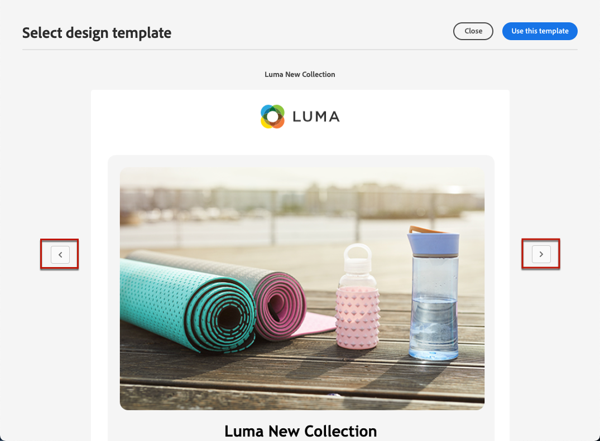

# Trabajar con plantillas de correo electrónico {#email-templates}

Utilice la variable **[!UICONTROL Select design template]** para comenzar a crear el contenido a partir de una plantilla.

Puede elegir entre:
* 20 plantillas de correo electrónico predeterminadas.
* Plantillas guardadas. [Más información](#use-saved-template)

## Guardar como plantilla {#save-as-template}

>[!CONTEXTUALHELP]
>id="ajo_messages_depecrated_inventory"
>title="Descubra cómo migrar sus mensajes"
>abstract="El 25 de julio de 2022, desapareció el menú Mensajes y los mensajes ahora se crean directamente desde un Recorrido. Si desea reutilizar los mensajes heredados en los recorridos, debe guardarlos como plantillas."

Una vez que haya diseñado el [contenido de correo electrónico](get-started-email-design.md), puede guardarla para su reutilización futura. Para ello, siga los pasos a continuación.

1. Haga clic en los puntos suspensivos en la parte superior derecha de la pantalla.

1. Select **[!UICONTROL Save design template]** en el menú desplegable.

   

1. Añada un nombre para esta plantilla.

   

1. Haga clic en **[!UICONTROL Save]**.

La próxima vez que cree un correo electrónico, puede usar esta plantilla para crear su contenido. [Descubra cómo](#use-saved-template)

## Usar una plantilla guardada {#use-saved-template}

1. Abra el [diseñador de correo electrónico](content-from-scratch.md).

1. En el **[!UICONTROL Create your email screen]**, el **[!UICONTROL Sample templates]** está seleccionada de forma predeterminada. Seleccione el **[!UICONTROL Saved templates]** pestaña .

   

1. La lista de todas las [plantillas guardadas](#save-as-template) se muestra. Puede ordenarlas **[!UICONTROL By name]**, **[!UICONTROL Last modified]** y **[!UICONTROL Last created]**.

   

1. Seleccione la plantilla que desee en la lista.

1. Una vez seleccionadas, puede desplazarse entre todas las plantillas guardadas con las flechas derecha e izquierda.

   

1. Haga clic en **[!UICONTROL Use this email]** en la parte superior derecha de la pantalla.

1. Edite el contenido según sus preferencias mediante el diseñador de correo electrónico.
