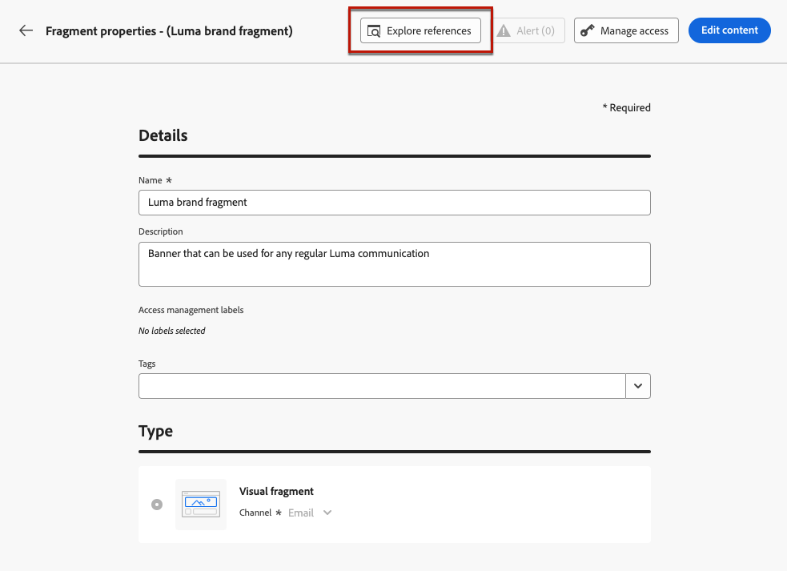

# Trabajo con fragmentos {#fragments}

Un fragmento es un componente reutilizable al que se puede hacer referencia en uno o varios correos electrónicos [!DNL Journey Optimizer] campañas y recorridos.

Esta funcionalidad permite crear previamente varios bloques de contenido personalizado que los usuarios de marketing no técnico pueden utilizar para ensamblar rápidamente el contenido del correo electrónico en un proceso de diseño mejorado.

➡️ [Aprenda a administrar, crear y utilizar fragmentos en este vídeo](#video-fragments)

>[!CAUTION]
>
>Para crear, editar y archivar fragmentos, debe tener el **[!DNL Manage Library Items]** permiso incluido en el **[!DNL Content Library Manager]** perfil del producto. [Más información](../administration/ootb-product-profiles.md#content-library-manager)

Para aprovechar al máximo los fragmentos:

* Cree sus propios fragmentos. Consulte [Creación de fragmentos](#create-fragments)
* Utilícelos tantas veces como sea necesario en sus correos electrónicos. Consulte [Uso de fragmentos](#use-fragments)

>[!NOTE]
>
>Actualmente, esta función solo está disponible para correos electrónicos.

## Acceso y administración de fragmentos {#access-manage-fragments}

Para acceder a la lista de fragmentos, seleccione **[!UICONTROL Gestión de contenido]** > **[!UICONTROL Fragmentos]** en el menú de la izquierda.

Todos los fragmentos creados en la zona protegida actual, ya sea desde el **[!UICONTROL Fragmentos]** , ya sea con el menú [Guardar como fragmento](#save-as-fragment) opción - se muestran.

Puede filtrar fragmentos en la fecha de creación o modificación. Puede elegir mostrar todos los fragmentos o solo los elementos que el usuario actual ha creado o modificado. También puede mostrar el **[!UICONTROL Archivado]** fragmentos. [Más información](#archive-fragments)

Desde el **[!UICONTROL Más acciones]** junto a cada fragmento, puede hacer lo siguiente:

* Duplique un fragmento.

* Utilice el **[!UICONTROL Explorar referencias]** para ver los recorridos, campañas o plantillas donde se utiliza. [Más información](#explore-references)

* Archivar un fragmento. [Más información](#archive-fragments)

### Editar fragmentos {#edit-fragments}

Para editar un fragmento, siga los pasos a continuación.

1. Haga clic en el elemento que desee en **[!UICONTROL Fragmento]** lista.
1. En las propiedades del fragmento, puede hacer lo siguiente [explorar referencias](#explore-references), [administrar su acceso](../administration/object-based-access.md) y actualice los detalles del fragmento.

   

1. Seleccione el botón correspondiente para editar el contenido como lo haría al crear un fragmento desde cero. [Más información](#create-from-scratch)

>[!NOTE]
>
>Al editar un fragmento, los cambios se propagan automáticamente a todos los correos electrónicos o plantillas que contengan ese fragmento, excepto a los correos electrónicos utilizados en **[!UICONTROL Activo]** recorridos o campañas. También puede interrumpir la herencia del fragmento original. [Más información](#break-inheritance)

<!--Changes made to a fragment are not propagated to live journeys or campaigns where it is used.-->

<!--When added to an email, if you want to modify a fragment for a specific email, you can break the synchronization with the original fragment. The fragment becomes part of the email content and the changes will not be synchronized anymore. [Learn more](#break-inheritance)-->

### Explorar referencias {#explore-references}

Puede mostrar la lista de los recorridos, campañas y plantillas de contenido que están utilizando actualmente un fragmento.

Para ello, seleccione **[!UICONTROL Explorar referencias]** ya sea desde el **[!UICONTROL Más acciones]** en la lista de fragmentos o en la pantalla de propiedades del fragmento.

Seleccione una pestaña para alternar entre recorridos, campañas y plantillas. Puede ver su estado y hacer clic en un nombre para redirigirlo al elemento correspondiente donde se hace referencia al fragmento.

>[!NOTE]
>
>Si el fragmento se utiliza en un recorrido, campaña o plantilla que tenga una etiqueta que le impida acceder a él, verá un mensaje de alerta sobre la pestaña seleccionada. [Obtenga más información sobre el Control de acceso de nivel de objeto (OLAC)](../administration/object-based-access.md)

### Archivar fragmentos {#archive-fragments}

Puede limpiar la lista de fragmentos de los elementos que ya no son relevantes para su marca.

Para ello, haga clic en el **[!UICONTROL Más acciones]** junto al fragmento deseado y seleccione. **[!UICONTROL Archivar]**. Desaparecerá de la lista de fragmentos, lo que impide que los usuarios lo utilicen en futuros correos electrónicos o plantillas.

>[!NOTE]
>
>Si archiva un fragmento que se utiliza en un correo electrónico o en una plantilla de contenido, <!--it will remain in the email or template, but you won't be able to select it from the fragment list to edit it-->el correo electrónico o la plantilla no se verán afectados.

Para desarchivar un fragmento, filtre por la **[!UICONTROL Archivado]** elementos y seleccione **[!UICONTROL Desarchivar]** desde el **[!UICONTROL Más acciones]** menú. Ahora vuelve a ser accesible desde la lista de fragmentos y se puede utilizar en cualquier correo electrónico o plantilla.

## Creación de fragmentos {#create-fragments}

Existen dos formas de crear fragmentos:

* Cree un fragmento desde cero utilizando **[!UICONTROL Fragmentos]** menú específico. [Descubra cómo](#create-template-from-scratch)

* Al diseñar un correo electrónico o una plantilla de contenido, guarde una parte del contenido como fragmento. [Descubra cómo](#save-as-template)

Una vez guardado, el fragmento está disponible para utilizarlo en un recorrido, una campaña o una plantilla. Ya se haya creado desde cero o a partir de contenido existente, ahora puede utilizar este fragmento al crear cualquier [email](get-started-email-design.md) o [plantilla de contenido](content-templates.md) dentro [!DNL Journey Optimizer]. [Más información](#use-fragments)

### Crear desde cero {#create-from-scratch}

>[!CONTEXTUALHELP]
>id="ajo_create_fragment"
>title="Defina su propio fragmento"
>abstract="Cree un fragmento independiente desde cero para que el contenido se pueda reutilizar en varios recorridos y campañas."

Para crear un fragmento desde cero, siga los pasos a continuación.

1. Acceda a la lista de fragmentos a través de **[!UICONTROL Gestión de contenido]** > **[!UICONTROL Fragmentos]** menú izquierdo.

1. Seleccionar **[!UICONTROL Crear fragmento]**.

1. Complete los detalles del fragmento, es decir, el nombre y la descripción (si es necesario).

   

   >[!NOTE]
   >
   >Actualmente solo el **[!UICONTROL Fragmento visual]** tipo y el **Correo electrónico** son compatibles.

1. Para asignar etiquetas de uso de datos personalizadas o principales al fragmento, seleccione **[!UICONTROL Administrar acceso]**. [Obtenga más información sobre el Control de acceso de nivel de objeto (OLAC)](../administration/object-based-access.md).

1. Haga clic en **[!UICONTROL Crear]**.

1. El [Diseñador de correo electrónico](get-started-email-design.md) muestra. Edite el contenido según sea necesario, del mismo modo que lo haría para cualquier correo electrónico dentro de un recorrido o una campaña.

   >[!NOTE]
   >
   >Puede añadir campos de personalización y contenido dinámico, pero los atributos contextuales no son compatibles con los fragmentos.

   

1. Cuando el fragmento esté listo, haga clic en **[!UICONTROL Guardar]**.

1. Si es necesario, haga clic en la flecha situada junto al nombre del fragmento para volver al **[!UICONTROL Detalles]** y editarlo en pantalla.

   

Este fragmento ya está listo para utilizarse al crear cualquier [email](get-started-email-design.md) o [plantilla de contenido](content-templates.md) dentro [!DNL Journey Optimizer]. [Descubra cómo](#use-fragments)

### Guardar como fragmento {#save-as-fragment}

Al diseñar una [plantilla de contenido](content-templates.md) o un [email](get-started-email-design.md) en una campaña o un recorrido, puede guardar una parte del contenido como fragmento para reutilizarlo en el futuro. Para realizar esto, siga los pasos a continuación.

1. En el [Diseñador de correo electrónico](get-started-email-design.md), haga clic en los puntos suspensivos en la parte superior derecha de la pantalla.

1. Seleccionar **[!UICONTROL Guardar como fragmento]** en el menú desplegable.

   

1. El **[!UICONTROL Guardar como fragmento]** se muestra. Seleccione los elementos que desee incluir en el fragmento, incluidos los campos de personalización y el contenido dinámico. Tenga en cuenta que los atributos contextuales no son compatibles con los fragmentos.

   >[!CAUTION]
   >
   >Sólo se pueden seleccionar secciones adyacentes entre sí. No puede seleccionar una estructura vacía u otro fragmento.

   

1. Haga clic en **[!UICONTROL Crear]**. Complete los detalles del fragmento, es decir, el nombre y la descripción (si es necesario).

   

   >[!NOTE]
   >
   >Actualmente solo el **[!UICONTROL Fragmento visual]** tipo y el **Correo electrónico** son compatibles.

1. Para asignar etiquetas de uso de datos personalizadas o principales al fragmento, seleccione **[!UICONTROL Administrar acceso]**. [Obtenga más información sobre el Control de acceso de nivel de objeto (OLAC)](../administration/object-based-access.md).

1. Clic **[!UICONTROL Crear]** otra vez. El fragmento se guardará en la variable **[!UICONTROL Fragmentos]** , accesible desde el [!DNL Journey Optimizer] menú específico.

   Se convierte en un fragmento independiente que se puede [accedido](#access-manage-fragments), [editado](#edit-fragments) y [archivado](#archive-fragments) como cualquier otro elemento de esa lista.

Ahora puede utilizar este fragmento al crear cualquier [email](get-started-email-design.md) o [plantilla de contenido](content-templates.md) dentro [!DNL Journey Optimizer]. [Descubra cómo](#use-fragments)

>[!NOTE]
>
>Cualquier cambio en ese nuevo fragmento no se propaga al correo electrónico o a la plantilla de los que proviene. Del mismo modo, cuando el contenido original se edita dentro de ese correo electrónico o plantilla, el nuevo fragmento no se modifica.

## Uso de fragmentos {#use-fragments}

Puede utilizar un fragmento en una [email](get-started-email-design.md) dentro de un recorrido o una campaña, o en una [plantilla de contenido](content-templates.md).

1. Abra cualquier contenido de correo electrónico o plantilla con la variable [Diseñador de correo electrónico](get-started-email-design.md).

1. Seleccione el **[!UICONTROL Fragmentos]** del carril izquierdo.

   

1. Se muestra la lista de todos los fragmentos creados en la zona protegida actual. Puede hacer lo siguiente:

   * Busque un fragmento específico escribiendo su etiqueta.
   * Ordene los fragmentos en orden ascendente o descendente.
   * Cambie la forma en que se muestran los fragmentos (tarjetas o vista de lista).

1. También puede actualizar la lista.

   >[!NOTE]
   >
   >Si se han modificado o agregado fragmentos mientras edita el contenido, la lista se actualizará con los cambios más recientes.

1. Arrastre y suelte cualquier fragmento de la lista en el área en la que desee insertarlo.

   

1. Al igual que cualquier otro componente, puede mover el fragmento por el contenido.

1. Seleccione el fragmento para mostrar el panel correspondiente a la derecha. Desde allí, puede eliminar el fragmento del contenido o duplicarlo. También puede realizar estas acciones directamente desde el menú contextual que se muestra sobre el fragmento.

   

1. Desde el **[!UICONTROL Configuración]** pestaña, puede:

   * Elija los dispositivos en los que desea que se muestre el fragmento.
   * Abra el fragmento en una nueva pestaña para editarlo si es necesario. [Más información](#edit-fragments)
   * Explore las referencias. [Más información](#explore-references)

1. Puede personalizar aún más el fragmento mediante el **[!UICONTROL Estilos]** pestaña.

1. Si es necesario, puede romper la herencia con el fragmento original. [Más información](#break-inheritance)

1. Añada tantos fragmentos como desee y **[!UICONTROL Guardar]** sus cambios.

### Romper herencia {#break-inheritance}

Al editar un fragmento, los cambios se sincronizan. Se propagan automáticamente a todos los **[!UICONTROL Borrador]** recorridos/campañas y plantillas de contenido que contienen ese fragmento.

>[!NOTE]
>
>Los cambios no se propagan a los correos electrónicos utilizados en **[!UICONTROL Activo]** recorridos o campañas.

Cuando se añaden a un correo electrónico o a una plantilla de contenido, los fragmentos se sincronizan de forma predeterminada.

Sin embargo, puede romper la herencia del fragmento original. En ese caso, el contenido del fragmento se copia en el diseño actual y los cambios ya no se sincronizan.

Para interrumpir la herencia, siga los pasos a continuación:

1. Seleccione el fragmento.

1. Haga clic en el icono de desbloqueo de la barra de herramientas contextual.

   

1. Ese fragmento se convierte en un elemento independiente que ya no está vinculado al fragmento original. Edítela como cualquier otro componente de contenido en el contenido. [Más información](content-components.md)

## Vídeo explicativo {#video-fragments}

Obtenga información sobre cómo administrar, crear y utilizar fragmentos en [!DNL Journey Optimizer].

>[!VIDEO](https://video.tv.adobe.com/v/3419932/?quality=12)

