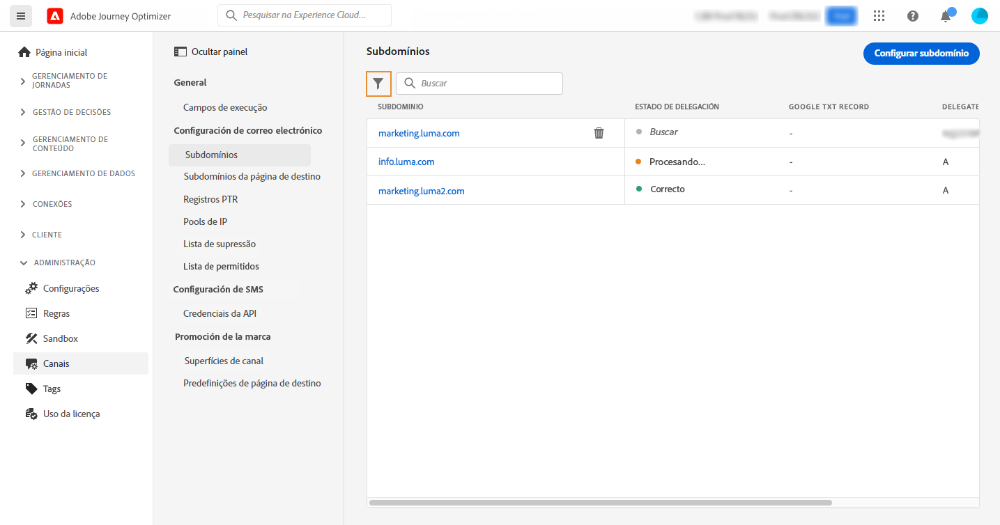
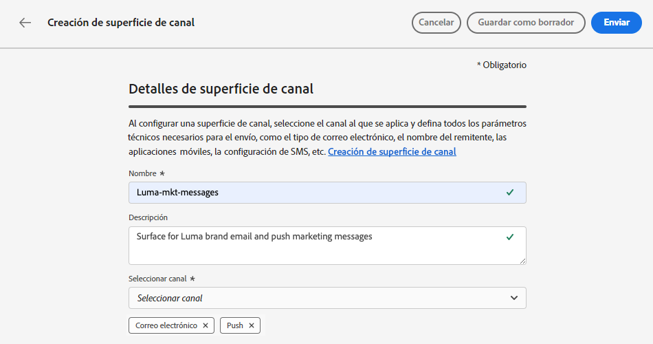
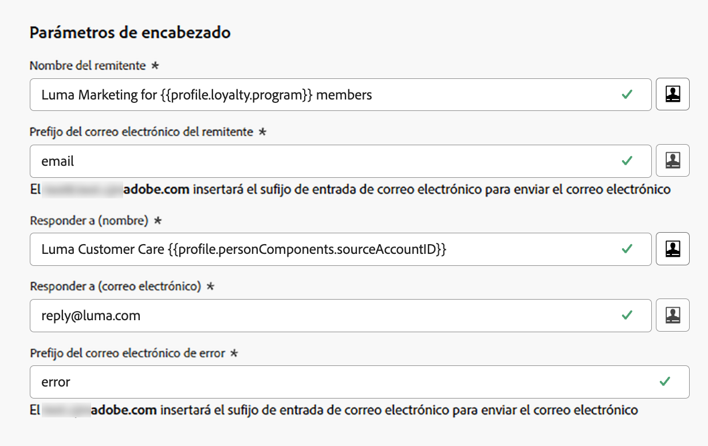
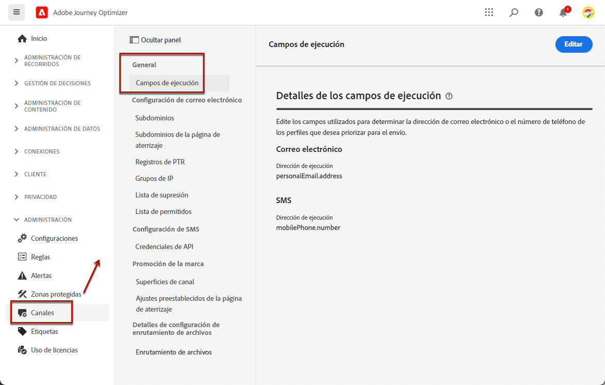
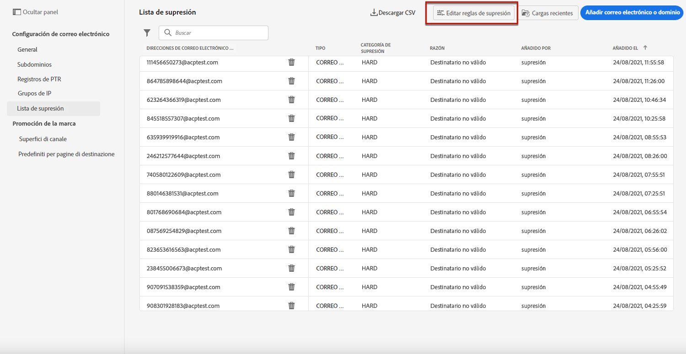

# Empezar a configurar el correo electrónico {#get-starte-email-config}

Para poder enviar correos electrónicos a través de recorridos y campañas en [!DNL Journey Optimizer], debe seguir varios pasos de configuración.

1. Para garantizar una entregabilidad óptima y proteger su reputación, empiece **delegando en Adobe los subdominios** que va a utilizar para enviar sus correos electrónicos con [!DNL Journey Optimizer]. Estos subdominios determinarán elementos como las páginas web de las que se realizará un seguimiento y las direcciones URL de las páginas espejo. [Más información](../configuration/about-subdomain-delegation.md)

   

1. Cree grupos de IP para **agrupar conjuntamente las direcciones IP** suministradas con su instancia. [Más información](../configuration/ip-pools.md)

   

1. Cree **configuraciones de canal** y seleccione el canal de **[!UICONTROL Correo electrónico]**. [Más información](../configuration/channel-surfaces.md)

   

1. En cada configuración de canal de correo electrónico, configure todos los **parámetros técnicos** necesarios para enviar correos electrónicos. [Más información](email-settings.md)

   * Aquí es donde se selecciona el subdominio que se utilizará para enviar los correos electrónicos y los grupos de IP que se asociarán con la configuración. [Más información](email-settings.md#ip-pools)

   

   * Las direcciones **[!UICONTROL Correo electrónico del remitente]** y **[!UICONTROL Correo electrónico de error]** deben utilizar el subdominio delegado seleccionado actualmente. [Más información](email-settings.md#email-header)

   

1. Determine qué **campos de ejecución** va a utilizar prioritariamente para los destinatarios cuando haya varias direcciones disponibles en Adobe Experience Platform. [Más información](../configuration/primary-email-addresses.md)

   

1. Administre el número de días durante los cuales se realizan **reintentos** antes de enviar direcciones de correo electrónico a la lista de supresión. [Más información](../configuration/manage-suppression-list.md)

   
