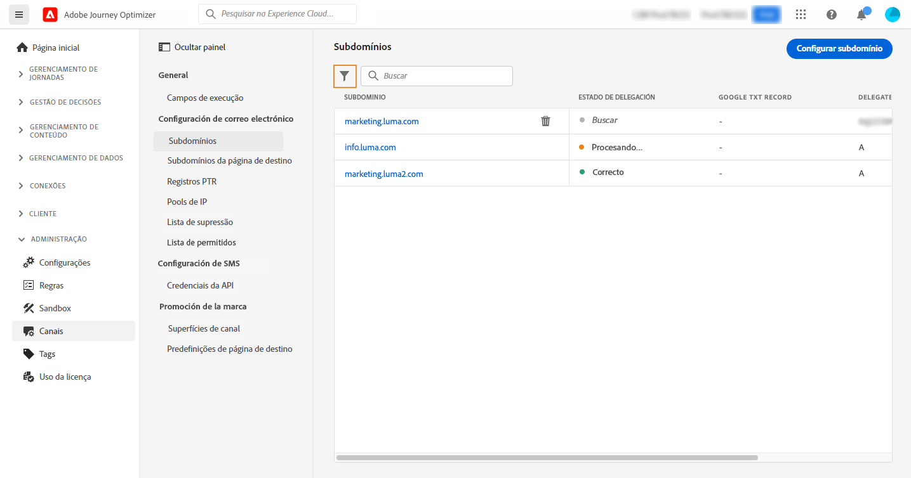
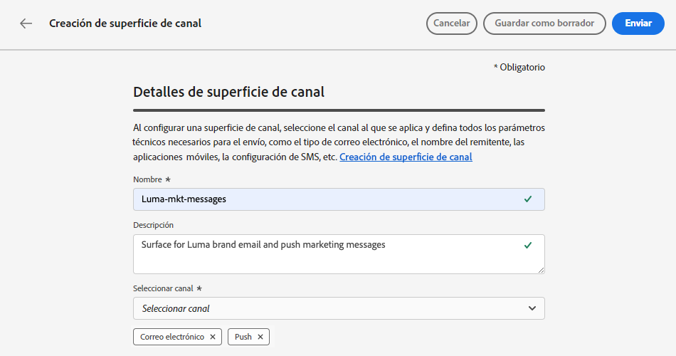
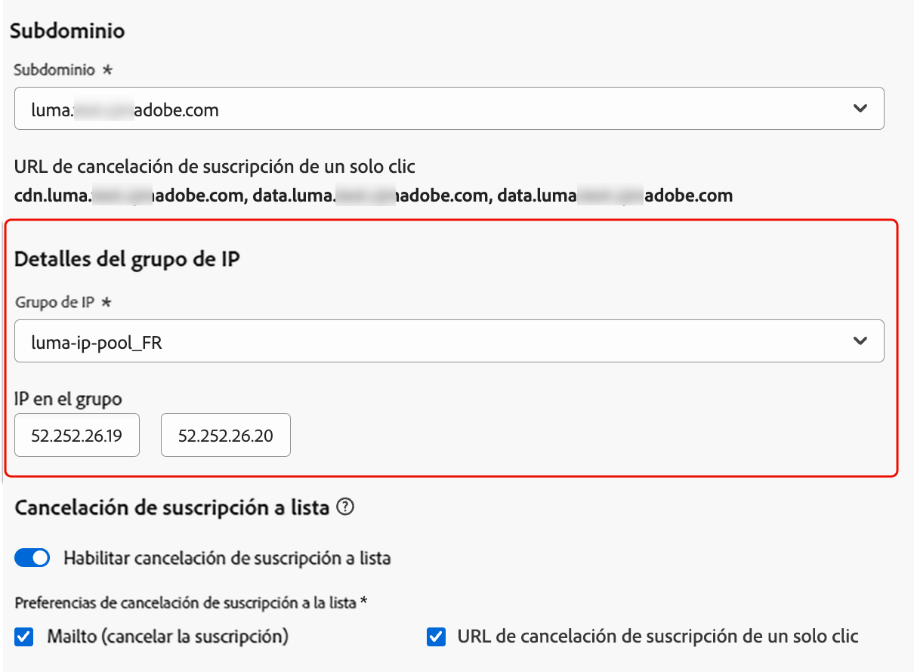
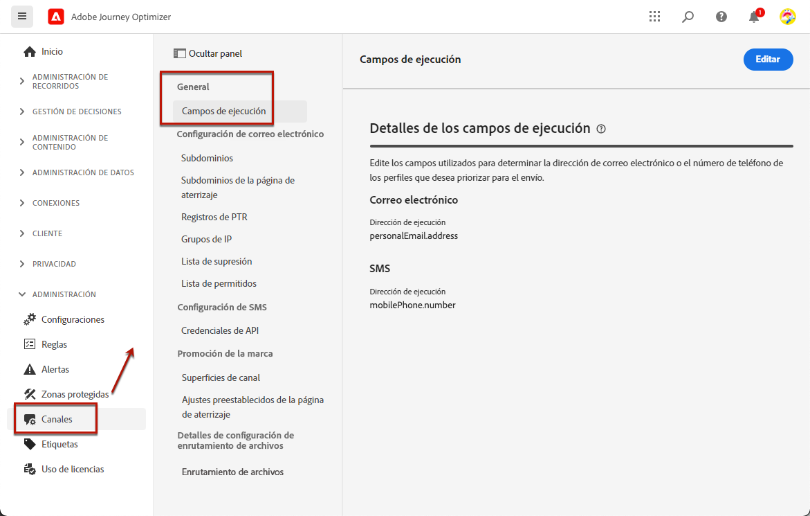
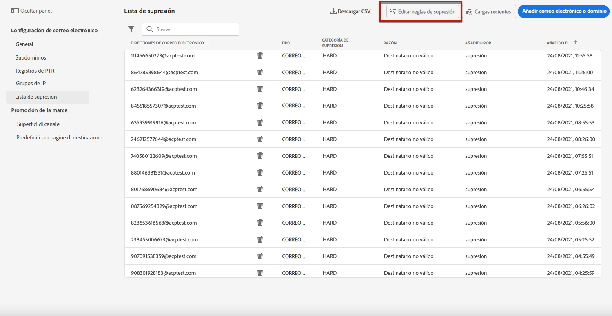

# Empezar con la configuración de correo electrónico {#get-starte-email-config}

>[!BEGINSHADEBOX]

**En esta página:** Conozca los pasos esenciales para configurar el canal de correo electrónico en Adobe Journey Optimizer, desde delegar subdominios y crear grupos de IP hasta configurar configuraciones de canal, campos de ejecución y reintentos.

>[!ENDSHADEBOX]

La configuración del canal de correo electrónico en Adobe Journey Optimizer es la puerta de enlace para crear experiencias de correo electrónico personalizadas e impactantes que involucren de forma eficaz a su público.

Esta sección le guía por los pasos de configuración esenciales que debe seguir para enviar correos electrónicos a través de [!DNL Journey Optimizer]. También descubrirá cómo configurar encabezados de correo electrónico, personalizar la configuración para varias marcas, habilitar el seguimiento de URL para Analytics e incluso añadir vínculos de cancelación de suscripción de un solo clic para la comodidad del usuario. Cada tema se basa en el último, lo que le proporciona las herramientas para ajustar su estrategia de correo electrónico al tiempo que mantiene el control y la precisión.

Para poder enviar correos electrónicos a través de recorridos y campañas en [!DNL Journey Optimizer], debe seguir varios pasos de configuración. Estos pasos se enumeran a continuación:

1. Para garantizar una entregabilidad óptima y proteger su reputación, empiece **delegando en Adobe los subdominios** que va a utilizar para enviar sus correos electrónicos con [!DNL Journey Optimizer]. Estos subdominios determinarán elementos como las páginas web de las que se realizará un seguimiento y las direcciones URL de las páginas espejo. [Más información](../configuration/about-subdomain-delegation.md)

   

1. Cree grupos de IP para **agrupar conjuntamente las direcciones IP** suministradas con su instancia. [Más información](../configuration/ip-pools.md)

   

1. Cree **configuraciones de canal** y seleccione el canal de **[!UICONTROL Correo electrónico]**. [Más información](../configuration/channel-surfaces.md)

   

1. En cada configuración de canal de correo electrónico, configure todos los **parámetros técnicos** necesarios para enviar correos electrónicos. [Más información](email-settings.md)

   * Aquí es donde se selecciona el subdominio que se utilizará para enviar los correos electrónicos y los grupos de IP que se asociarán con la configuración. [Más información](email-settings.md#ip-pools)

   

   * El **[!UICONTROL prefijo del correo electrónico de origen]** y el **[!UICONTROL prefijo del correo electrónico de error]** utilizan el [subdominio delegado seleccionado](../configuration/about-subdomain-delegation.md). Opcionalmente, **[!UICONTROL Nombre del remitente]** y **[!UICONTROL Correo electrónico del remitente]** pueden identificar a una parte transmisora diferente (dirección completa de **Remitente**, no vinculada a ese sufijo de subdominio). [Más información](header-parameters.md#sender-header)

   

1. Complete la configuración de su canal de correo electrónico configurando otros parámetros avanzados, como habilitar CCO, definir el seguimiento de URL para Analytics o añadir vínculos de cancelación de suscripción de un solo clic para la comodidad del usuario. [Más información](email-settings.md)

1. Determine qué **campos de ejecución** va a utilizar prioritariamente para los destinatarios cuando haya varias direcciones disponibles en Adobe Experience Platform. [Más información](../configuration/primary-email-addresses.md)

   

1. Administre el número de días durante los cuales se realizan **reintentos** antes de enviar direcciones de correo electrónico a la lista de supresión. [Más información](../configuration/manage-suppression-list.md)

   

:::: landing-cards-container
:::

Introducción a la configuración de correo electrónico

Conozca los pasos esenciales para configurar las funciones de correo electrónico, como la delegación de subdominios, los grupos de IP y la administración de listas de supresión.

[Empezar a configurar el correo electrónico](get-started-email-config.md)
:::

:::

Definir la configuración de correo electrónico

Realice la configuración del correo electrónico para la entregabilidad, el cumplimiento y la personalización con funciones avanzadas como CCO, anulaciones de supresión y seguimiento de URL.

[Configurar ajustes](email-settings.md)
:::

:::

Habilitar y configurar la cancelación de suscripción a la lista

Obtenga información sobre cómo habilitar la función “Cancelar la suscripción a la lista” para incluir direcciones URL de cancelación de la suscripción con un solo clic en los encabezados de correo electrónico para las exclusiones de destinatarios.

[Configurar la cancelación de suscripción a la lista](list-unsubscribe.md)
:::

:::

Configurar parámetros de encabezado de correo electrónico

Personalice las direcciones de correo electrónico del remitente y la respuesta, gestione los errores y reenvíe correos electrónicos para que la comunicación sea eficaz.

[Configurar parámetros de encabezados](header-parameters.md)
:::

:::

Configurar el seguimiento de URL para el canal de correo electrónico

Configure los parámetros de seguimiento de URL para medir la eficacia de las campañas de correo electrónico e integrarlos con las herramientas de análisis.

[Configurar el seguimiento de URL](url-tracking.md)
:::

:::

Ajustes de configuración de correo electrónico personalizados

Configure subdominios dinámicos, encabezados personalizados y el seguimiento de URL para ofrecer experiencias de correo electrónico adaptadas.

[Configuración personalizada del correo electrónico](surface-personalization.md)
:::

::::
