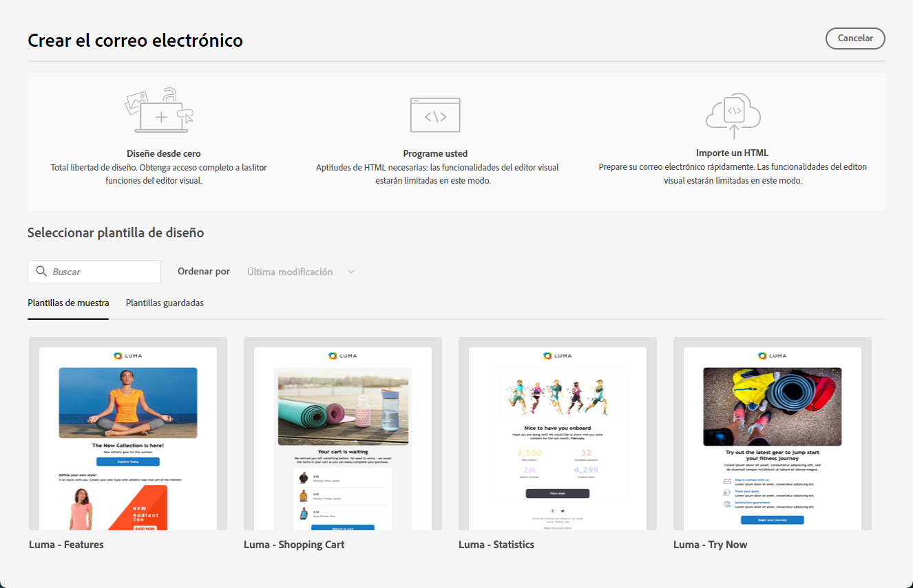
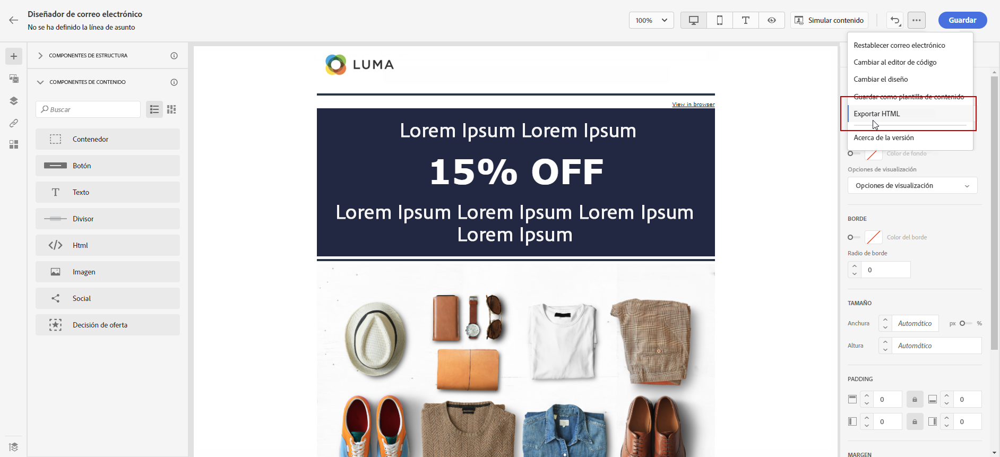

# Introducción al diseño de correo electrónico {#get-started-content-design}

Para acceder al Diseñador de correo electrónico y comenzar a diseñar el contenido de su correo electrónico, primero debe [crear un correo electrónico](create-email.md) en un recorrido o una campaña.

A continuación, puede usar [!DNL Journey Optimizer] **funcionalidades de diseño de correo electrónico** para importar el contenido existente o empezar a crear correos electrónicos adaptables desde cero. [Más información](content-from-scratch.md)

El Diseñador de correo electrónico también le permite lo siguiente:

* Aproveche **Adobe Experience Manager Assets Essentials** para enriquecer los correos electrónicos, crear y administrar su propia base de datos de activos. [Más información](../integrations/assets.md)

* Encuentre **fotos de Adobe Stock** para crear su contenido y mejorar su diseño de correo electrónico. [Más información](../integrations/stock.md)

* Mejore la experiencia de los clientes creando mensajes y de correo electrónico personalizados en función de sus atributos de perfil. Más información sobre [personalización](../personalization/personalize.md) y [contenido dinámico](../personalization/get-started-dynamic-content.md).

➡️ [Descubra esta funcionalidad en vídeo](#video)

## Pasos clave para crear contenido de correo electrónico {#key-steps}

Una vez creado un correo electrónico, puede empezar a diseñar su contenido.

1. Desde la pantalla de configuración de recorrido o de campaña, pase por la pantalla **[!UICONTROL Editar contenido]** para acceder al Diseñador de correo electrónico. [Más información](create-email.md#define-email-content)

   

1. En la página de inicio del Diseñador de correo electrónico, elija cómo desea diseñar el correo electrónico desde las opciones siguientes:

   * **Diseñe su correo electrónico desde cero** a través de la interfaz del diseñador de correo electrónico y aproveche las imágenes de [Adobe Experience Manager Assets](../integrations/assets.md). Información sobre cómo diseñar el contenido de su correo electrónico en [esta sección](content-from-scratch.md).

   * **Codifique o pegue el HTML sin procesar** directamente en el diseñador de correo electrónico. Información sobre cómo codificar su propio contenido en [esta sección](code-content.md).

     >[!NOTE]
     >
     >En una campaña, también puede seleccionar el botón **[!UICONTROL Editor de código]** del **[!UICONTROL Editar contenido]** en el Navegador. [Más información](create-email.md#define-email-content)

   * **Importe contenido de HTML existente** desde un archivo o una carpeta .zip. Obtenga información sobre cómo importar contenido de correo electrónico en [esta sección](existing-content.md).

   * **Convierta diseños de imagen en plantillas de HTML** con el conversor de imagen a HTML con tecnología de IA. Aprenda a transformar imágenes estáticas en plantillas de correo electrónico editables en [esta sección](../content-management/image-to-html.md).

   * **Seleccione un contenido existente** de una lista de plantillas integradas o personalizadas. Aprenda a trabajar con plantillas de correo electrónico en [esta sección](../email/use-email-templates.md).

   

1. Una vez definido y personalizado el contenido del correo electrónico, puede exportar el contenido para su validación o para utilizarlo posteriormente. Haga clic en **[!UICONTROL HTML de exportación]** para guardar en su equipo un archivo zip que incluirá su HTML y sus recursos.

   

1. También puede validar la calidad del contenido para identificar posibles problemas con legibilidad, coherencia del contenido y eficacia. [Más información sobre la validación de calidad del contenido](../content-management/brands-score.md#validate-quality)

## Prácticas recomendadas para el diseño de correo electrónico {#best-practices}

Al enviar correos electrónicos, es importante tener en cuenta que los destinatarios pueden reenviarlos, lo que a veces puede causar problemas con el procesamiento del correo electrónico. Esto es especialmente cierto cuando se utilizan clases CSS que tal vez el proveedor de correo electrónico no admita para el reenvío, por ejemplo, si utiliza la clase de CSS &quot;is-desktop-hidden&quot; para ocultar una imagen en dispositivos móviles.

Para minimizar estos problemas de renderización, se recomienda mantener la estructura de diseño del correo electrónico lo más sencilla posible. Intente utilizar un único diseño que funcione bien tanto para dispositivos de escritorio como móviles, y evite utilizar clases CSS complejas u otros elementos de diseño que puedan no ser totalmente compatibles con todos los clientes de correo electrónico. Siguiendo estas prácticas recomendadas, puede ayudar a garantizar que los mensajes de correo electrónico se procesen correctamente, independientemente de cómo los destinatarios los vean o los reenvíen.

Consulte la tabla siguiente para conocer las prácticas recomendadas sobre el diseño de correo electrónico:

| Recomendado | Usar con cuidado | No recomendado |
|-|-|-|
| <ul><li><b>Diseños estáticos basados en tablas</b> para la estructura</li> <li><b>Tablas HTML y tablas anidadas</b> para mantener la coherencia del diseño</li> <li><b>Anchuras de plantilla</b> entre 600 y 800 píxeles </li> <li><b>CSS en línea simple</b> para diseñar </li> <li><b>Fuentes seguras para la web</b> para compatibilidad universal</li> | <ul><li>Es posible que las <b>imágenes de fondo</b> no aparezcan en ciertas plataformas de correo electrónico.</li><li><b>Las fuentes web personalizadas</b> carecen de compatibilidad universal.</li><li><b>Los diseños anchos</b> pueden visualizarse mal en las pantallas más pequeñas.</li><li><b>Los mapas de imagen</b> ofrecen una funcionalidad limitada.</li><li><b>Un CSS incrustado</b> a veces se elimina durante el envío del correo electrónico.</li> | <ul><li><b>JavaScript</b> generalmente no es compatible en los entornos de correo electrónico.</li> <li> Las etiquetas <b>`<iframe>`</b> se bloquean en la mayoría de las plataformas. </li> <li><b>Flash</b> está obsoleto y ya no es compatible.</li> <li><b>El audio incrustado</b> a menudo no se reproduce.</li> <li><b>El vídeo incrustado</b> no es compatible con muchas plataformas de correo electrónico.</li> <li> <b>Los formularios</b> no funcionan en los correos electrónicos.</li> <li> Las capas `
` pueden dar lugar a problemas de renderizado.</li> |

>[!NOTE]
>
>La [Ley de accesibilidad europea](https://eur-lex.europa.eu/legal-content/EN/TXT/?uri=CELEX%3A32019L0882){target="_blank"} estipula que todas las comunicaciones digitales deben ser accesibles. Además de las prácticas recomendadas de diseño de correo electrónico incluidas en esta sección, asegúrese de seguir las directrices específicas que se indican en [esta página](accessible-content.md) para la creación de contenido accesible con el Diseñador de correo electrónico.

## Vídeotutoriales {#video}

Aprenda a crear contenido de correo electrónico con el editor de mensajes.

>[!VIDEO](https://video.tv.adobe.com/v/3416231?captions=spa&quality=12)

Aprenda a configurar experimentos de contenido para realizar pruebas A/B y explorar el contenido de correo electrónico que mejor impulsa sus objetivos empresariales.

>[!VIDEO](https://video.tv.adobe.com/v/3447334?captions=spa)
