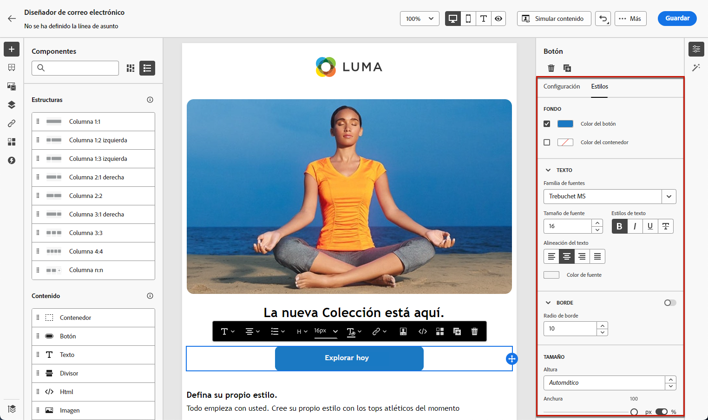

# Introducción al diseño de correo electrónico {#get-started-email-style}

Una vez que haya empezado a crear el contenido de su correo electrónico en [!DNL Journey Optimizer], puede ajustar una serie de parámetros y atributos de estilo desde el panel de **[!UICONTROL Estilos]** del Diseñador de correo electrónico.

Puede aplicar los cambios al cuerpo del correo electrónico, a un componente de estructura o a un componente de contenido.

Siga los vínculos siguientes para descubrir cómo ajustar algunos de los ajustes de estilo de su correo electrónico.

* Obtenga información sobre cómo [personalizar el fondo del correo electrónico](backgrounds.md)
* Obtenga información sobre cómo [administrar alineación vertical y relleno](alignment-and-padding.md)
* Obtenga información sobre cómo [personalizar atributos de estilo en línea](inline-styling.md)
* Aprenda a [agregar CSS personalizado al contenido del correo electrónico](custom-css.md)
* Aprenda a [administrar contenido en modo oscuro](dark-mode.md)

>[!NOTE]
>
>La [ley de accesibilidad europea](https://eur-lex.europa.eu/legal-content/EN/TXT/?uri=CELEX%3A32019L0882){target="_blank"} estipula que todas las comunicaciones digitales deben ser accesibles. Asegúrese de seguir las directrices de estilo específicas que se enumeran en [esta página](../email/accessible-content.md) al diseñar contenido en [!DNL Journey Optimizer], como ajustar colores, etiquetas e iconos para garantizar la claridad y optimizar el diseño para diseños móviles y adaptables.