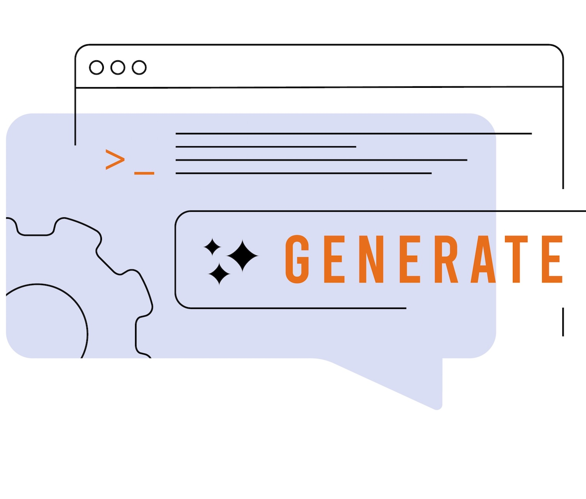

# Introducción al correo electrónico {#get-started-email}

>[!BEGINSHADEBOX]

**En esta página:** empiece a utilizar el canal de correo electrónico en Adobe Journey Optimizer y aprenda a crear, diseñar, personalizar y previsualizar mensajes de correo electrónico en recorridos y campañas mediante el diseñador de correo electrónico.

>[!ENDSHADEBOX]

>[!CONTEXTUALHELP]
>id="ajo_homepage_card4"
>title="Diseño de correos electrónicos"
>abstract="Utilice **Adobe Journey Optimizer** para enviar mensajes de correo electrónico a sus clientes. Puede crear, personalizar y previsualizar mensajes en el Diseñador de correo electrónico."

Utilice [!DNL Journey Optimizer] para enviar mensajes de correo electrónico a sus clientes. Puede crear, personalizar y previsualizar mensajes en el Diseñador de correo electrónico.

Se pueden crear envíos de correo electrónico de la siguiente manera:

* En un **Recorrido**: una vez que haya añadido una actividad de **[!UICONTROL Correo electrónico]** para su recorrido y haya definido la configuración básica, utilice el panel derecho **[!UICONTROL Acciones: correo electrónico]** para crear el contenido del mensaje. [Obtenga información sobre cómo crear un recorrido](../building-journeys/journey-gs.md)

* En una **Campaña**: una vez creada la campaña, seleccione **[!UICONTROL Correo electrónico]** como su acción y defina la configuración básica. Aprenda a crear [una campaña de acción](../campaigns/campaign-action.md#action-campaign-action) | [una campaña desencadenada por API](../campaigns/api-triggered-campaigns.md) | [una campaña orquestada](../orchestrated/create-orchestrated-campaign.md#create)

>[!IMPORTANT]
>
>Si es la primera vez que crea un correo electrónico, asegúrese de que el canal de correo electrónico esté configurado. [Más información](email-settings.md)

<table style="table-layout:fixed"><tr style="border: 0;">
<td>

<a href="create-email.md"><strong>Creación de un correo electrónico</strong>

</td>
<td>

<a href="get-started-email-design.md"><strong>Cree un correo electrónico</strong></a>

</td>
<td>

<a href="email-opt-out.md"><strong>Administración de exclusión de correo electrónico</strong></a>

</td>
<td>

<a href="email-settings.md"><strong>Configurar canal de correo electrónico</strong></a>

</td>
</tr></table>

<table style="table-layout:fixed"><tr style="border: 0;">
<td>

<a href="../content-management/generative-full-content.md"><strong>Asistente de IA para la generación de contenido</strong>

</td>
<td>

<a href="../content-management/fragments.md"><strong>Uso de fragmentos de contenido de correo electrónico</strong></a>

</td>
<td>

<a href="../personalization/personalize.md"><strong>Personalización del contenido del correo electrónico</strong></a>

</td>
<td>

<a href="../integrations/assets.md"><strong>Combinación de aplicaciones y soluciones de Adobe</strong></a>

</td>
</tr></table>

## Recursos adicionales

* **[Cree un correo electrónico](create-email.md)**: aprenda a crear mensajes de correo electrónico en campañas y recorridos con instrucciones paso a paso.
* **[Diseñe contenido de correo electrónico](get-started-email-design.md)**: descubra las diferentes formas de diseñar el contenido de su correo electrónico, desde cero o con plantillas.
* **[Configuración de correo electrónico](get-started-email-config.md)**: aprenda a configurar opciones de correo electrónico, como superficies de correo electrónico, subdominios y grupos de IP.
* **[Personalización y estilo de correo electrónico](get-started-email-style.md)**: técnicas de estilo maestro que incluyen CSS personalizado, alineación, relleno y compatibilidad con modo oscuro.
* **[Hacer un seguimiento y monitorizar correos electrónicos](message-tracking.md)**: aprenda a rastrear aperturas de mensajes, clics y administrar el seguimiento de URL para el análisis de rendimiento.
* **[Tutoriales de canal de correo electrónico](https://experienceleague.adobe.com/es/docs/journey-optimizer-learn/tutorials/channels/email-channel){target="_blank"}**: explore tutoriales de vídeo paso a paso sobre las funciones de correo electrónico y las prácticas recomendadas.
