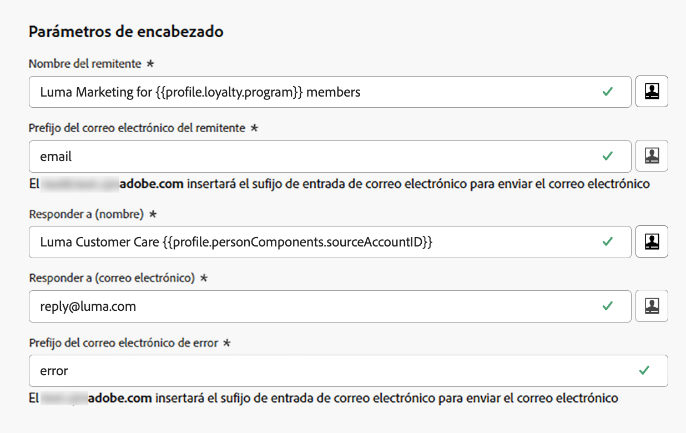

# Parámetros de encabezado {#email-header}

Al configurar una nueva [configuración del canal de correo electrónico](email-settings.md), en la sección **[!UICONTROL Parámetros de encabezado]**, escriba los nombres de remitente y las direcciones de correo electrónico asociadas al tipo de correos electrónicos enviados mediante esa configuración.

>[!NOTE]
>
>Para un mayor control sobre la configuración del correo electrónico, puede personalizar los parámetros del encabezado. [Más información](../email/surface-personalization.md#personalize-header)
>
>Al [editar una configuración de correo electrónico](../configuration/channel-surfaces.md#edit-channel-surface), no puede agregar nuevos [atributos de perfil](../personalization/personalization-build-expressions.md#sources) a los parámetros de encabezado. Debe crear una nueva configuración de canal.

* **[!UICONTROL Nombre del remitente]**: el nombre del remitente, como por ejemplo, el nombre de su marca.

* **[!UICONTROL Prefijo del correo electrónico del remitente]**: la dirección de correo electrónico que desea usar para sus comunicaciones.

* **[!UICONTROL Responder a (nombre)]**: el nombre que se usará cuando el destinatario haga clic en el botón **Responder** en el software de cliente de correo electrónico.

* **[!UICONTROL Responder a (correo electrónico)]**: la dirección de correo electrónico que se usará cuando el destinatario haga clic en el botón **Responder** en el software de cliente de correo electrónico. [Más información](#reply-to-email)

* **[!UICONTROL Prefijo del correo electrónico de error]**: todos los errores generados por los ISP varios días después de que se haya entregado el correo (rechazos asíncronos) se reciben en esta dirección. Las notificaciones de fuera de la oficina y los retos-respuestas también se reciben en esta dirección.

  Si desea recibir notificaciones de fuera de la oficina y retos-respuestas en una dirección de correo electrónico específica que no se ha delegado a Adobe, debe configurar un [proceso de reenvío](#forward-email). En ese caso, asegúrese de que dispone de una solución manual o automatizada para procesar los correos electrónicos que llegan a esta bandeja de entrada.

>[!NOTE]
>
>Las direcciones **[!UICONTROL Prefijo del correo electrónico del remitente]** y **[!UICONTROL Prefijo del correo electrónico de error]** utilizan el [subdominio delegado](../configuration/about-subdomain-delegation.md) seleccionado actualmente para enviar el correo electrónico. Por ejemplo, si el subdominio delegado es *marketing.luma.com*:
>
>* Escriba *contact* como **[!UICONTROL Prefijo del correo electrónico del remitente]**: el correo electrónico del remitente es *contact@marketing.luma.com*.
>* Escriba *error* como **[!UICONTROL Prefijo del correo electrónico de error]**: la dirección de error es *error@marketing.luma.com*.

{width="80%"}

>[!NOTE]
>
>Para **[!UICONTROL From email prefix]** y **[!UICONTROL Error email prefix]**, los valores deben comenzar con una letra (A-Z) y solo pueden contener caracteres alfanuméricos. También puede utilizar caracteres de guion bajo `_`, punto `.` y guión `-`.

## Encabezados del remitente {#sender-header}

>[!CONTEXTUALHELP]
>id="ajo_admin_preset_sender_header"
>title="Encabezados del remitente"
>abstract="Utilice estos campos opcionales cuando la entidad transmisora (Remitente) sea distinta de la entidad autora (De); por ejemplo, cuando una empresa matriz envía mensajes para una marca filial o una agencia los envía para varios clientes. Los clientes de correo electrónico que admiten esto generalmente lo representan como “Remitente en nombre de Desde” o muestran un indicador “a través de”."

Algunos casos de uso requieren que el buzón que transmite el mensaje sea diferente del autor de **From**; por ejemplo, una organización principal que envía en nombre de una subsidiaria, un equipo de marketing compartido para varias marcas o una agencia que envía para varios clientes.

En otras palabras, **De** es el autor del mensaje (de quién es el correo electrónico) y **Remitente** es el agente responsable de transmitir el mensaje (que realmente lo envió). El campo **Remitente** está diseñado para utilizarse cuando la entidad de transmisión es diferente de la del autor.

En este caso, puede establecer un nombre de **Remitente** y una dirección de correo electrónico diferentes para agregarlos al encabezado del correo electrónico mediante los campos siguientes en la sección **Encabezados de remitente**:

* **[!UICONTROL Nombre del remitente]**: El nombre de la parte responsable de transmitir el mensaje cuando difiere del autor de **From**.

* **[!UICONTROL Correo electrónico del remitente]**: La dirección de correo electrónico de la parte transmisora.

{width="80%"}

>[!NOTE]
>
>Estos campos son opcionales. Puede [personalizarlos](surface-personalization.md#personalize-header) como otros campos de encabezado.

Cuando se establecen **[!UICONTROL Nombre del remitente]** y **[!UICONTROL Correo electrónico del remitente]**, [!DNL Journey Optimizer] agrega un encabezado SMTP del **remitente** al correo electrónico<!--as defined in [RFC 5322](https://datatracker.ietf.org/doc/html/rfc5322#section-3.6.2){target="_blank"}-->. Los clientes de correo electrónico que admitan esto pueden mostrar frases como **Remitente a nombre de Desde** o un indicador de **a través de**.

>[!IMPORTANT]
>
>**[!UICONTROL El nombre del remitente]** y **[!UICONTROL El correo electrónico del remitente]** deben configurarse juntos; o bien ambos campos se rellenan o se dejan vacíos. Al rellenar solo uno de ellos, se evita que los recorridos y las campañas se publiquen con esta configuración de canal.

Al configurar los encabezados **Sender**, tenga en cuenta lo siguiente:

* Si deja vacíos los campos **[!UICONTROL Nombre del remitente]** y **[!UICONTROL Correo electrónico del remitente]**, o si el **Remitente** resuelto es idéntico a **De**, no se agrega ningún encabezado **Remitente**.
* La dirección **Remitente** no se usa para la alineación de SPF, DKIM o DMARC; solo se realiza la validación de **formato**. SPF, DKIM y DMARC siguen dependiendo de los campos **De**. El [subdominio delegado](../configuration/about-subdomain-delegation.md) seleccionado para la configuración sigue siendo el dominio de envío utilizado para esas comprobaciones.

* Si los encabezados **Sender** están configurados y la personalización no se resuelve en un valor para un destinatario, el mensaje no se envía a ese destinatario.

## Responder a (correo electrónico) {#reply-to-email}

Al definir la dirección **[!UICONTROL Responder a (correo electrónico)]**, puede especificar cualquier dirección de correo electrónico siempre que sea válida, tenga el formato correcto y no contenga errores tipográficos.

La bandeja de entrada que se utiliza para las respuestas recibirá todos los correos electrónicos de respuesta, excepto las notificaciones de fuera de la oficina y los retos-respuestas, que se reciben en la dirección de **correo electrónico de error**.

Para garantizar una administración de respuestas adecuada, siga las recomendaciones siguientes:

* Asegúrese de que la bandeja de entrada dedicada tenga suficiente capacidad de recepción para recibir todos los correos electrónicos de respuesta enviados con la configuración de correo electrónico. Si la bandeja de entrada devuelve mensajes de rechazo, es posible que algunas respuestas de sus clientes no se reciban.

* Las respuestas deben procesarse teniendo en cuenta las obligaciones de privacidad y cumplimiento, ya que pueden contener información de identificación personal (PII).

* No marque los mensajes como spam en la bandeja de entrada de respuestas, ya que afectará a todas las demás respuestas enviadas a esta dirección.

Además, al definir la dirección **[!UICONTROL Responder a (correo electrónico)]**, asegúrese de utilizar un subdominio que tenga una configuración de registro MX válida; de lo contrario, no se podrá procesar la configuración de correo electrónico.

Si se produce un error al enviar la configuración de correo electrónico, significa que el registro MX no está configurado para el subdominio de la dirección que ha introducido. Póngase en contacto con el administrador para configurar el registro MX correspondiente o use otra dirección con una configuración de registro MX válida.

>[!NOTE]
>
>Si el subdominio de la dirección que ingresó es un dominio que se [delegó completamente](../configuration/delegate-subdomain.md#set-up-subdomain) a Adobe, comuníquese con el representante de Adobe.

## Correo electrónico de reenvío {#forward-email}

Para reenviar a una dirección de correo electrónico específica todos los mensajes de correo electrónico recibidos por [!DNL Journey Optimizer] para el subdominio delegado, póngase en contacto con el Servicio de atención al cliente de Adobe.

>[!NOTE]
>
>Si el subdominio que se utiliza para la dirección **[!UICONTROL Responder a (correo electrónico)]** no se ha delegado a Adobe, el reenvío no funcionará para esta dirección.

Es necesario que facilite:

* La dirección de correo electrónico de reenvío que elija. Tenga en cuenta que el dominio de dirección de correo electrónico de reenvío no puede coincidir con ningún subdominio delegado a Adobe.
* El nombre de su zona protegida.
* El nombre de la configuración o el subdominio para el cual se utilizará la dirección de correo electrónico de reenvío.
  <!--* The current **[!UICONTROL Reply to (email)]** address or **[!UICONTROL Error email]** address set at the channel configuration level.-->

>[!NOTE]
>
>* Solo puede haber una dirección de correo electrónico de reenvío por subdominio: si varias configuraciones utilizan el mismo subdominio, se debe utilizar la misma dirección de correo electrónico de reenvío para todas ellas.
>* Si el reenvío no está habilitado, los correos electrónicos enviados directamente a la dirección **Del correo electrónico** se descartarán de forma predeterminada.

La dirección de correo electrónico de reenvío la configura Adobe. Este proceso puede tardar entre 3 y 4 días.

Una vez finalizado, todos los mensajes recibidos en las direcciones **[!UICONTROL Responder a (correo electrónico)]** y **Correo electrónico de error**, así como todos los correos electrónicos enviados a la dirección **Correo electrónico del remitente**, se reenviarán a la dirección de correo electrónico específica que haya facilitado.

