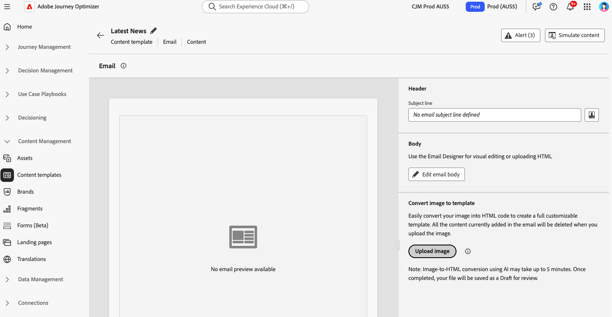

# Convertir imágenes a plantillas de HTML con el convertidor de imágenes a HTML {#image-to-html}

## Información general {#overview}

El conversor de imagen a HTML es una característica innovadora con tecnología de IA disponible en el menú de **Plantillas de contenido** que acelera considerablemente la creación de correos electrónicos al convertir diseños de imagen estáticos en plantillas de contenido de correo electrónico modulares de HTML totalmente personalizables. Esta herramienta sin código permite a los especialistas en marketing transformar diseños visuales de diseñadores gráficos o herramientas de diseño en plantillas de correo electrónico interactivas y editables que se pueden guardar en la biblioteca de plantillas de contenido y, a continuación, reutilizarse en varios recorridos y campañas, sin necesidad de conocimientos técnicos.

>[!AVAILABILITY]
>
>Esta capacidad tiene disponibilidad limitada. Póngase en contacto con su representante de Adobe para obtener acceso.

Al aprovechar la tecnología de IA generativa, el conversor de imagen a HTML analiza el diseño, la tipografía, los colores y los elementos visuales de la imagen y genera un código HTML modular y limpio que mantiene la fidelidad del diseño, a la vez que garantiza la editabilidad y compatibilidad completas con el Designer de correo electrónico. Esto elimina el proceso manual y laborioso de conversión de maquetas a HTML y reduce la dependencia de los recursos de desarrollo.

**Ventajas principales:**

* **Diseño a HTML en minutos**: la conversión sin código con tecnología de IA transforma las imágenes estáticas en plantillas modulares editables en minutos, lo que reduce considerablemente el tiempo de creación de plantillas
* **Habilita a los usuarios no técnicos**: reduce la dependencia de los equipos de diseño o desarrollo; los especialistas en marketing pueden generar y personalizar plantillas con conocimientos técnicos mínimos
* **Migración de plataformas simplificada**: Convierta plantillas o diseños externos de otras plataformas en HTML preparados para AJO sin esfuerzo
* **Crear una biblioteca de plantillas reutilizable**: cree una biblioteca de plantillas escalable y coherente con la marca que se pueda usar en varios recorridos y campañas
* **Fidelidad de diseño**: mantenga la coherencia visual con el diseño original mientras crea contenido totalmente editable
* **Compatibilidad de correo electrónico**: genere un HTML que funcione perfectamente con el Designer de correo electrónico y entre clientes de correo electrónico

## Casos de uso comunes {#use-cases}

El convertidor de imagen a HTML es ideal para:

* **Migración de la plataforma**: ¿Está migrando desde otra plataforma de marketing por correo electrónico? Convierta sus diseños de correo electrónico existentes en plantillas de HTML compatibles con AJO sin tener que volver a crear desde cero
* **Conversión de maqueta de diseño**: transforme maquetas de diseño de herramientas como Photoshop, Figma u otro software de diseño en plantillas de correo electrónico funcionales
* **Creación rápida de plantillas**: genere plantillas de correo electrónico rápidamente para campañas en las que el tiempo sea importante sin esperar los recursos para desarrolladores
* **Creación de bibliotecas de plantillas**: cree una biblioteca completa de plantillas compatibles con la marca que los integrantes del equipo no técnicos puedan personalizar e implementar
* **Reducción de las dependencias técnicas**: permita que los especialistas en marketing creen plantillas de correo electrónico e iteren de forma independiente, lo que acelera la ejecución de la campaña

## Requisitos previos {#prerequisites}

Antes de usar el convertidor de imagen a HTML, asegúrese de lo siguiente:

* Acceso a Adobe Journey Optimizer con el Designer de correo electrónico
* Archivo de imagen en formato JPEG o PNG que contiene el diseño de correo electrónico
* Acceso de disponibilidad limitado a la función de conversión de imágenes a HTML (póngase en contacto con su representante de Adobe)

>[!NOTE]
>
>Para obtener los mejores resultados, utilice imágenes de alta calidad con elementos visuales claros y texto legible. Lo ideal es que las imágenes tengan entre 600 y 800 píxeles de ancho para coincidir con las dimensiones de correo electrónico estándar.

## Conversión de una imagen en una plantilla de HTML {#convert-image}

Para convertir un diseño de imagen en una plantilla de correo electrónico de HTML totalmente personalizable, siga estos pasos:

1. Para obtener acceso a la lista Plantillas de contenido, seleccione **[!UICONTROL Administración de contenido]** > **[!UICONTROL Plantillas de contenido]** en el menú de la izquierda.

1. Haga clic en **[!UICONTROL Crear plantilla]**.

1. Complete los detalles de la plantilla, seleccione **[!UICONTROL Correo electrónico]** como canal y haga clic en **[!UICONTROL Crear]**.

1. En la sección de la derecha, en la sección **[!UICONTROL Convertir imagen en plantilla]**, haga clic en el botón **[!UICONTROL Cargar imagen]** para seleccionar el archivo de imagen.

   

   >[!CAUTION]
   >
   >Al cargar una imagen para su conversión, **todo el contenido que se agrega actualmente al correo electrónico se eliminará y se reemplazará** con la plantilla generada. Si tiene contenido existente en el correo electrónico, asegúrese de guardarlo antes de continuar con la conversión de la imagen.

1. Elija la imagen y haga clic en **[!UICONTROL Abrir]** para iniciar el proceso de conversión con tecnología de IA.

   >[!NOTE]
   >
   >El proceso de generación puede tardar hasta 5 minutos en función de la complejidad y el tamaño del diseño de la imagen. El procesamiento de IA se produce en segundo plano, por lo que puede salir de esta pantalla y trabajar en otras tareas mientras la conversión está en curso. No es necesario que mantenga la pantalla abierta.

1. Una vez completada la conversión, la plantilla de contenido se guardará automáticamente como borrador. A continuación, puede revisar y editar la plantilla de HTML generada en el lienzo de Designer de correo electrónico.

   

1. La plantilla convertida se abre en el Designer de correo electrónico con funciones de edición completas. Ahora puede:

   * Editar contenido de texto y aplicar personalización
   * Modificación de imágenes y adición de vínculos
   * Ajuste de colores, fuentes y estilo
   * Agregar, quitar o reorganizar componentes de contenido
   * Aproveche todas las funciones de Email Designer como con cualquier otra plantilla

   

1. Realice los ajustes necesarios para perfeccionar la plantilla y adaptarla a las directrices de marca.

1. Una vez que esté satisfecho con la plantilla, haga clic en **[!UICONTROL Guardar]** para guardar la plantilla de contenido.

1. La plantilla ya está disponible en la biblioteca de plantillas de contenido y se puede utilizar al crear correos electrónicos en recorridos o campañas. [Aprenda a utilizar las plantillas de contenido](use-email-templates.md)

## Uso de la plantilla convertida en correos electrónicos {#use-template}

Una vez creada y guardada la plantilla de contenido, puede utilizarla al diseñar correos electrónicos en recorridos o campañas:

Al crear un correo electrónico en un recorrido o una campaña, accede al Designer de correo electrónico desde la pantalla **[!UICONTROL Editar contenido]**.

Más información acerca de [cómo trabajar con plantillas de correo electrónico](use-email-templates.md) y [cómo crear plantillas de contenido](../content-management/content-templates.md).

## Prácticas recomendadas {#best-practices}

Para obtener resultados óptimos al utilizar el convertidor de imagen a HTML, siga estas recomendaciones:

**Antes de comenzar**

* **Guardar contenido existente**: al convertir una imagen a HTML, se reemplazará todo el contenido existente en el correo electrónico. Guarde siempre el trabajo actual antes de utilizar esta función.
* **Planifique el flujo de trabajo**: use el convertidor de imagen a HTML al principio del proceso de creación del correo electrónico o asegúrese de que está listo para reemplazar todo el contenido actual.

**Preparación de imágenes**

* **Resolución**: Use imágenes de alta resolución (al menos 1200 px de ancho) para un mejor reconocimiento de texto y detección de elementos
* **Claridad**: Asegúrese de que el texto sea claramente legible y de que los elementos visuales estén bien definidos
* **Anchura**: diseñe imágenes con anchuras de correo electrónico estándar (600-800 px) para que coincidan con los requisitos habituales de los clientes de correo electrónico
* **Formato de archivo**: use el formato JPEG o PNG para evitar imágenes comprimidas o de baja calidad
* **Diseño completo**: incluya el diseño de correo electrónico completo en una sola imagen, de encabezado a pie de página

**Consideraciones de diseño**

* **Diseños simples**: los diseños más simples y bien estructurados se convierten con mayor precisión que los diseños muy complejos
* **Elementos estándar**: utilice patrones de diseño de correo electrónico comunes (encabezado, secciones de cuerpo, CTA, pie de página).
* **Legibilidad del texto**: Asegúrese de que haya suficiente contraste entre el texto y los fondos
* **Fuentes seguras para la Web**: Los diseños que usan fuentes seguras para la Web comunes tendrán una mejor fidelidad
* **Evite elementos superpuestos**: Mantenga los elementos de diseño claramente separados para un mejor reconocimiento de la estructura

**Después de la conversión**

* **Revise el borrador**: una vez completada la conversión, la plantilla se guardará automáticamente como borrador. Tómese tiempo para revisar cuidadosamente la HTML generada para comprobar su precisión
* **Realizar pruebas exhaustivas**: probar el correo electrónico en distintos clientes y dispositivos de correo electrónico
* **Refinar manualmente**: realice los ajustes necesarios mediante las funciones de edición completas de Designer de correo electrónico
* **Alineación de marca**: compruebe que los colores, las fuentes y el estilo coinciden con las directrices de marca
* **Personalization**: agregue contenido dinámico y tokens de personalización según sea necesario
* **Accesibilidad**: revise y mejore las características de accesibilidad si es necesario

## Limitaciones y consideraciones {#limitations}

Tenga en cuenta las siguientes limitaciones al utilizar el convertidor de Imagen a HTML:

* **Interpretación de IA**: La IA genera HTML basándose en la interpretación visual de su imagen. Los diseños complejos o inusuales pueden requerir ajustes manuales después de la conversión.

* **Precisión del texto**: Mientras la IA intenta reconocer y reproducir el texto con precisión, compruebe siempre el contenido del texto y realice las correcciones necesarias.

* **Contenido dinámico**: el proceso de conversión crea HTML estático basado en la imagen. Después de la conversión, debe agregar manualmente la personalización, el contenido dinámico y el seguimiento.

* **Diseños complejos**: Es posible que los diseños muy complejos con capas complejas, formas inusuales o elementos no estándar no se conviertan a la perfección. Los diseños más simples generalmente arrojan mejores resultados.

* **Tiempo de procesamiento**: El proceso de conversión puede tardar hasta 5 minutos según la complejidad y el tamaño de la imagen. El procesamiento de IA se produce en segundo plano, lo que le permite trabajar en otras tareas sin mantener la pantalla abierta. La plantilla se guarda automáticamente como borrador una vez completada la conversión.

* **Disponibilidad limitada**: como característica de disponibilidad limitada, el conversor de imagen a HTML se mejora continuamente. La funcionalidad y la precisión pueden variar, y los comentarios ayudan a mejorar la función.

>[!NOTE]
>
>El conversor de imagen a HTML está diseñado para proporcionar un punto de partida sólido para la creación de correos electrónicos. La HTML generada debe revisarse y refinarse usando la Designer de correo electrónico para asegurarse de que cumple con sus requisitos exactos.

## Preguntas frecuentes {#faq}

+++¿Qué sucede con el contenido del correo electrónico existente cuando utilizo el convertidor de imagen a HTML?

Todo el contenido existente en su correo electrónico se eliminará y se reemplazará por la plantilla recién generada al cargar una imagen para su conversión. Asegúrese de guardar cualquier contenido importante antes de utilizar esta función. Es mejor utilizar el conversor de imagen a HTML al principio del proceso de creación del correo electrónico.

+++

+++¿Qué formatos de archivo se admiten?

El convertidor de imagen a HTML es compatible con los formatos de imagen JPEG (.jpg, .jpeg) y PNG (.png).

+++

+++¿Cuánto tiempo tarda el proceso de conversión?

La conversión puede tardar hasta 5 minutos, según la complejidad y el tamaño del diseño de la imagen. El procesamiento de IA se realiza en segundo plano, por lo que puede desplazarse y trabajar en otras tareas; no es necesario que mantenga la pantalla abierta. Una vez completada la conversión, el archivo se guardará automáticamente como borrador para que lo revise y edite.

+++

+++¿Puedo editar la plantilla generada?

¡Sí! La plantilla de HTML generada se abre en el Designer de correo electrónico con funciones de edición completas. Puede modificar todos los aspectos de la plantilla, incluidos el texto, las imágenes, el estilo, el diseño y la estructura.

+++

+++¿Qué sucede si la conversión no coincide exactamente con mi diseño?

La IA hace todo lo posible para interpretar con precisión su diseño, pero puede ser necesario un poco de refinamiento manual. Utilice la Designer de correo electrónico para ajustar cualquier elemento que necesite ajustes.

+++

+++¿Puedo utilizar esta función para páginas de aterrizaje u otros tipos de contenido?

El convertidor de imagen a HTML está diseñado actualmente específicamente para plantillas de correo electrónico. Para otros tipos de contenido, utilice las opciones de diseño e importación estándar disponibles en el Designer de correo electrónico.

+++

+++¿Necesito permisos especiales para utilizar esta función?

El convertidor de imagen a HTML está disponible en disponibilidad limitada. Necesita acceso de disponibilidad limitado (póngase en contacto con su representante de Adobe para obtener acceso) y permisos estándar de Designer de correo electrónico para utilizar esta función.

+++

+++¿Puedo reutilizar plantillas convertidas en varias campañas?

¡Sí! Las plantillas creadas con el convertidor de imagen a HTML se guardan automáticamente en la biblioteca de plantillas de contenido. Puede acceder a ellas y reutilizarlas en cualquier mensaje de correo electrónico de sus recorridos y campañas. [Más información](../content-management/content-templates.md)

+++

+++¿Puedo utilizarlo para la migración de plataformas?

¡Sí! El conversor de imagen a HTML es ideal para migrar desde otras plataformas de marketing por correo electrónico. Solo tiene que exportar o capturar la pantalla de sus diseños de correo electrónico existentes de la plataforma anterior y convertirlos en plantillas de HTML preparadas para AJO sin necesidad de reconstruirlos desde cero.

+++

## Temas relacionados {#related-topics}

* [Introducción a las plantillas de contenido](../content-management/content-templates.md)
* [Creación de plantillas de contenido](../content-management/create-content-templates.md)
* [Uso de plantillas de correo electrónico](use-email-templates.md)
* [Introducción al diseño de correo electrónico](get-started-email-design.md)
* [Importar el contenido del correo electrónico](existing-content.md)
* [Diseño de contenido desde cero](content-from-scratch.md)

