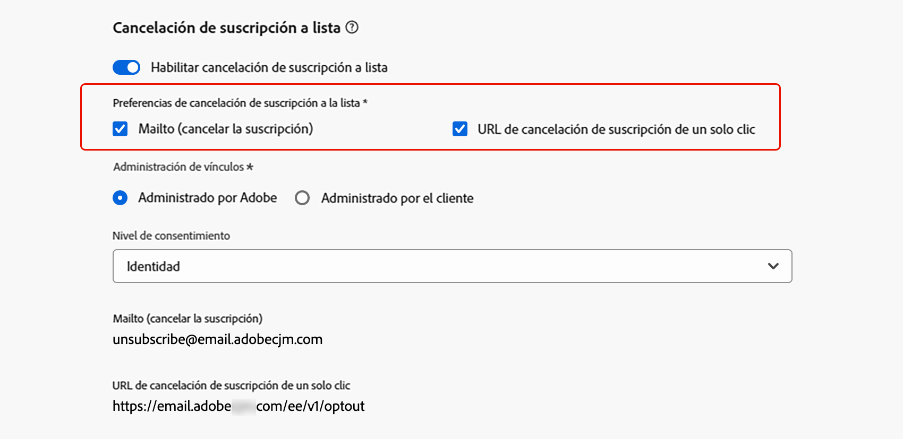
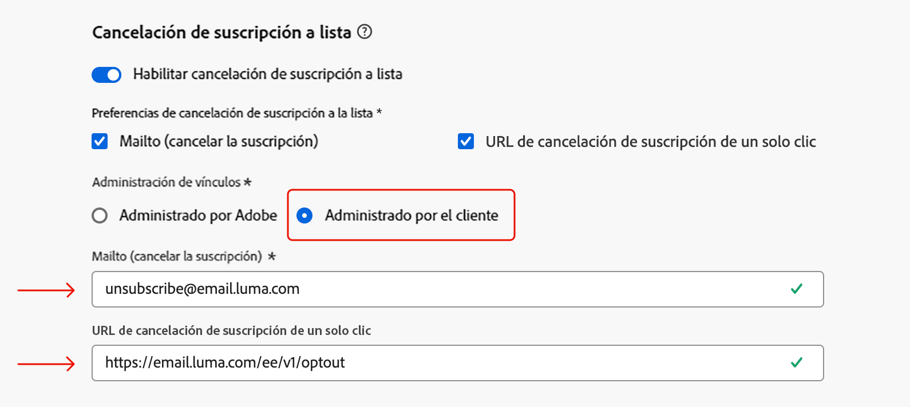

# Cancelación de suscripción a lista{#list-unsubscribe}

<!--Do not modify - Legal Review Done -->

En [!DNL Adobe Journey Optimizer], al establecer una nueva configuración de canal de correo electrónico, tras [seleccionar un subdominio](email-settings.md#ip-pools) en la lista, aparece la opción **[!UICONTROL Habilitar cancelación de suscripción a lista]**. De forma predeterminada, está habilitada.


La URL para cancelar la suscripción de una lista con un solo clic es un vínculo o botón para cancelarla que se muestra junto a la información del remitente del correo electrónico y permite a los destinatarios excluirse al instante de sus listas de correo con un solo clic.

Por ejemplo, la URL de cancelación de suscripción con un solo clic muestra un vínculo como el siguiente en Gmail:


>[!IMPORTANT]
>
>Para mostrar la URL para cancelar la suscripción con un solo clic en el encabezado del correo electrónico, el cliente de correo electrónico de los destinatarios debe admitir esta función.

Según el cliente y la configuración de correo electrónico para cancelar la suscripción, hacer clic en el vínculo de cancelación de suscripción en el encabezado del correo electrónico puede tener los siguientes efectos:

* Cuando la característica **Mailto (cancelar la suscripción)** está habilitada, la solicitud de cancelación de suscripción se envía a la dirección predeterminada según el subdominio que haya configurado.
* Cuando la función **Cancelar la suscripción con un solo clic** está habilitada (o si insertó una URL para cancelar la suscripción en el contenido del cuerpo del correo electrónico), el destinatario se excluye directamente, ya sea en el nivel de canal o en el nivel de ID (según cómo se configure el consentimiento), cuando el destinatario hace clic en la URL de cancelación de suscripción con un solo clic (según el subdominio que haya configurado).

>[!NOTE]
>
>Aprenda a administrar la configuración de cancelación de suscripción en [esta sección](#enable-list-unsubscribe) a continuación.

En ambos casos, cuando un destinatario hace clic en el vínculo de no participación, su solicitud de cancelar la suscripción se procesa en consecuencia. El perfil correspondiente se excluye de inmediato y esta opción se actualiza en [Experience Platform](https://experienceleague.adobe.com/docs/experience-platform/profile/ui/user-guide.html?lang=es){target="_blank"}. Obtenga más información sobre el procesamiento del consentimiento en la [documentación de Experience Platform](https://experienceleague.adobe.com/docs/experience-platform/landing/governance-privacy-security/consent/adobe/overview.html?lang=es){target="_blank"}.

>[!NOTE]
>
>En ocasiones, los eventos de cancelación de suscripción pueden tardar más en reflejarse en el nivel de perfil debido al procesamiento de datos descendente. Espere un poco para que se actualice el sistema.

## Habilitar la cancelación de suscripción a una lista {#enable-list-unsubscribe}

>[!CONTEXTUALHELP]
>id="ajo_admin_preset_unsubscribe"
>title="Añadir una URL de cancelación de suscripción a los correos electrónicos"
>abstract="Habilite esta opción para añadir automáticamente una URL de cancelar la suscripción al encabezado del correo electrónico. También puede establecer una URL de cancelación de suscripción en un mensaje, insertando un vínculo de no participación con un solo clic en el contenido del correo electrónico."
>additional-url="https://experienceleague.adobe.com/es/docs/journey-optimizer/using/channels/email/email-opt-out#one-click-opt-out" text="Definir la exclusión con un solo clic del contenido del correo electrónico"

Cuando la opción **[!UICONTROL Habilitar cancelación de suscripción a la lista]** está habilitada, si es compatible con el cliente de correo electrónico de los destinatarios, el encabezado del correo electrónico incluye un mailto o una URL de forma predeterminada. Los destinatarios pueden usarla para cancelar la suscripción a su lista de correo.

>[!NOTE]
>
>Si deshabilita esta opción, no se muestra la URL de cancelación de suscripción con un solo clic en el encabezado del correo electrónico.

El encabezado Cancelación de suscripción a lista ofrece dos opciones que están habilitadas de forma predeterminada a menos que desmarque una o ambas:

{width="80%"}

* Una dirección **[!UICONTROL Mailto (cancelar la suscripción)]**, que es la dirección de destino a la que se dirigen las solicitudes de cancelación de suscripción para el procesamiento automático. En [!DNL Journey Optimizer], la dirección de correo electrónico de cancelación de suscripción es la dirección predeterminada **[!UICONTROL Mailto (cancelar la suscripción)]** mostrada en la configuración de canal, según el [subdominio seleccionado](email-settings.md#subdomains). <!--With this method, clicking the Unsubscribe link sends a pre-filled email to the unsubscribe address specified in the email header.-->

* La **[!UICONTROL URL para cancelar la suscripción con un solo clic]**, que de forma predeterminada es el encabezado de cancelación de la suscripción a la lista generado por la URL de exclusión con un solo clic, basado en el [subdominio seleccionado](email-settings.md#subdomains). <!--With this method, clicking the Unsubscribe link directly unsubscribes the user, requiring only a single action to unsubscribe.-->

Puede seleccionar el **[!UICONTROL Nivel de consentimiento]** en la lista desplegable correspondiente. Puede ser específico del canal o de la identidad del perfil. En función de esta configuración, cuando un usuario cancela la suscripción mediante la URL de cancelación de suscripción a lista en el encabezado de un correo electrónico, el consentimiento se actualiza en [!DNL Adobe Journey Optimizer], a nivel de canal o de ID.

## Mecanismos de protección y recomendaciones {#list-unsubscribe-guardrails}

La función de URL para cancelar la suscripción a una lista con un solo clic permite a los destinatarios excluirse con facilidad de sus comunicaciones. Sin embargo, como no todos los clientes de correo electrónico admiten este vínculo en el encabezado del correo electrónico, Adobe recomienda que también añada un [vínculo de no participación con un solo clic](email-opt-out.md#one-click-opt-out) o un [vínculo para cancelar la suscripción](email-opt-out.md#add-unsubscribe-link) al cuerpo del correo electrónico.

La función **[!UICONTROL Mailto (cancelar la suscripción)]** y la de **[!UICONTROL URL de cancelación de suscripción de un solo clic]** son opcionales.

* Si ha activado la opción **[!UICONTROL Habilitar cancelación de suscripción a lista]** en la [configuración de correo electrónico](email-settings.md), le recomendamos que habilite ambos métodos: **Mailto (cancelar la suscripción)** y **URL para cancelar la suscripción con un solo clic**. No todos los clientes de correo electrónico admiten el método HTTP. Con la función de cancelación de suscripción a una lista Mailto que se proporciona para que seleccione una alternativa, su reputación de remitente puede estar mejor protegida y todos sus destinatarios pueden tener acceso para usar la funcionalidad de cancelación de suscripción.

* Si no desea utilizar la URL de cancelación de suscripción de un solo clic generada por defecto, puede desactivar la función. 

   * En el escenario donde la opción **[!UICONTROL Habilitar cancelación de suscripción a lista]** está activada y la función **[!UICONTROL URL de cancelación de suscripción de un solo clic]** está desactivada, si añade un [vínculo de no participación de un solo clic](../email/email-opt-out.md#one-click-opt-out) a un mensaje creado con esta configuración, el encabezado Cancelación de suscripción a lista recupera el vínculo de no participación de un solo clic que ha insertado en el cuerpo del correo electrónico y lo utiliza como valor de URL de cancelación de suscripción de un solo clic.

     

   * Si no añade un vínculo de no participación de un solo clic al contenido del mensaje y la opción predeterminada **[!UICONTROL URL de cancelación de suscripción de un solo clic]** no está marcada en la configuración de canal, no se pasa ninguna dirección URL al encabezado del correo electrónico como parte del encabezado Cancelación de suscripción a lista.

  >[!NOTE]
  >
  >Obtenga más información sobre cómo administrar las funciones de cancelación de suscripción en sus mensajes en [esta sección](../email/email-opt-out.md#unsubscribe-header).

En [!DNL Journey Optimizer], el consentimiento se gestiona mediante el [Esquema de consentimiento](https://experienceleague.adobe.com/docs/experience-platform/xdm/field-groups/profile/consents.html?lang=es){target="_blank"} de Experience Platform. De forma predeterminada, el valor del campo de consentimiento está vacío y se trata como consentimiento para recibir sus comunicaciones. Puede modificar este valor predeterminado al incorporar uno de los posibles valores enumerados [aquí](https://experienceleague.adobe.com/docs/experience-platform/xdm/data-types/consents.html?lang=es#choice-values){target="_blank"}, o usar [directivas de consentimiento](../action/consent.md) para anular la lógica predeterminada.

En la actualidad, [!DNL Journey Optimizer] no anexa una etiqueta específica para cancelar la suscripción a los eventos desencadenados por la característica Cancelar la suscripción a una lista. Si necesita diferenciar los clics de cancelación de suscripción a una lista de otras acciones de cancelación de suscripción, debe implementar el etiquetado personalizado de forma externa o usar una página de destino externa para el seguimiento.

## Administrar datos de cancelación de suscripción externamente {#custom-managed}

>[!CONTEXTUALHELP]
>id="ajo_email_config_unsubscribe_custom"
>title="Definir cómo se administran los datos de cancelación de suscripción"
>abstract="**Administrado por Adobe**: es usted quien administra los datos de consentimiento dentro del sistema de Adobe.<br>**Administrado por el cliente**: es usted quien administra los datos de consentimiento en un sistema externo y no se actualizará ninguna sincronización de los datos de consentimiento en el sistema de Adobe a menos que usted la inicie."

>[!CONTEXTUALHELP]
>id="ajo_email_config_unsubscribe_custom_url"
>title="Introduzca su propia URL para cancelar la suscripción con un solo clic"
>abstract="La **URL para cancelar la suscripción con un solo clic** debe usar el método de petición POST."

Si está administrando el consentimiento fuera de Adobe, seleccione la opción **[!UICONTROL Administrado por el cliente]** para introducir una dirección de correo electrónico de cancelación de suscripción personalizada y su propia URL de cancelación de suscripción de un solo clic.

{width="80%"}

La **[!UICONTROL URL para cancelar la suscripción con un solo clic]** debe ser una URL de POST.

>[!WARNING]
>
>Si usa la opción **[!UICONTROL Administrado por el cliente]**, Adobe no almacenará los datos de cancelación de suscripción o consentimiento. Con la opción **[!UICONTROL Administrado por el cliente]**, las organizaciones optan por utilizar un sistema externo y serán responsables de administrar sus datos de consentimiento en dicho sistema externo. No se realiza ninguna sincronización automática de datos de consentimiento entre el sistema externo y [!DNL Journey Optimizer]. Cualquier sincronización de los datos de consentimiento, originada en el sistema externo para actualizar los datos de consentimiento del usuario en [!DNL Journey Optimizer], deberá iniciarla la organización como una transferencia de datos para volver a insertar los datos de consentimiento en [!DNL Journey Optimizer].

### Anexar atributos personalizados a los puntos finales {#custom-attributes}

Con la opción **[!UICONTROL Administrado por el cliente]** seleccionada, si introduce puntos finales personalizados y los utiliza en una campaña o un recorrido, [!DNL Journey Optimizer] añade algunos parámetros específicos de perfil predeterminados al evento de actualización de consentimiento <!--sent to the custom endpoint -->cuando los destinatarios hacen clic en el vínculo para cancelar la suscripción.

Para personalizar aún más los puntos finales<!-- (**[!UICONTROL Mailto (unsubscribe)]** and **[!UICONTROL One-click Unsubscribe URL]**)-->, puede definir atributos personalizados que se adjuntarán al evento de consentimiento.

>[!AVAILABILITY]
>
>Para la opción **[!UICONTROL Mailto (cancelar la suscripción)]**, esta funcionalidad está disponible con disponibilidad limitada. Póngase en contacto con su representante de Adobe para obtener acceso. En este caso, debe usar los nuevos parámetros de consulta que se describen en la sección **Mailto (cancelar la suscripción) con los atributos personalizados (disponibilidad limitada)** [que viene a continuación](#configure-decrypt-api).

Para definir los atributos personalizados de los puntos finales, utilice la sección **[!UICONTROL Parámetros de seguimiento de URL]**. Todos los parámetros de seguimiento de URL que defina en la sección correspondiente se adjuntarán al final de los puntos finales personalizados, además de los parámetros predeterminados. [Aprenda a configurar el seguimiento de URL personalizado](url-tracking.md)

### Configuración de la API de descifrado {#configure-decrypt-api}

Cuando los destinatarios hacen clic en un vínculo personalizado para cancelar la suscripción, los parámetros adjuntos al evento de actualización de consentimiento se envían al punto final de forma cifrada. Por lo tanto, el sistema de consentimiento externo necesita implementar una API específica a través de [Adobe Developer](https://developer.adobe.com){target="_blank"} para descifrar los parámetros enviados por Adobe.

La llamada GET para recuperar estos parámetros depende de la opción Cancelación de suscripción a lista que esté usando: **[!UICONTROL URL de cancelación de suscripción de un solo clic]** o **[!UICONTROL Mailto (cancelar la suscripción)]**.

<!--To configure the API to send back the information to [!DNL Adobe Journey Optimizer] when a recipient has unsubscribed using the List unsubscribe option with custom endpoints, follow the steps below.-->

+++ URL de cancelación de suscripción de un solo clic

Con la opción **[!UICONTROL URL de cancelación de suscripción de un solo clic]**, al hacer clic en el vínculo Cancelar la suscripción se cancela directamente la suscripción del usuario.

La llamada GET es la siguiente:

Punto final: https://platform.adobe.io/journey/imp/consent/decrypt

Parámetros de consulta:

* **params**: contiene la carga útil cifrada
* **pid**: ID de perfil cifrado

Estos dos parámetros se incluirán en el evento de actualización de consentimiento enviado a los puntos finales personalizados.

Requisitos de encabezado:

* x-api-key
* x-gw-ims-org-id
* authorization (token de usuario de su cuenta técnica)

A continuación, se muestran parámetros de ejemplo y la respuesta de consentimiento:

| Parámetros de consulta | Carga útil de ejemplo |
|---------|----------|
| pid | {<br>&quot;pid&quot;  : &quot;5142733041546020095851529937068211571&quot;,<br>&quot;pns&quot;  : &quot;CRMID&quot;,<br>&quot;e&quot;    : &quot;john@google.com&quot;,<br>&quot;ens&quot;  : &quot;Email&quot;,<br>} |
| params | {<br>&quot;m&quot;  : &quot;messageExecutionId&quot;,<br>&quot;ci&quot;  : &quot;campaignId&quot;,<br>&quot;jv&quot; : &quot;journeyVersionId&quot;,<br>&quot;ja&quot; : &quot;journeyActionId&quot;,<br>&quot;s&quot;  : &quot;sandboxId&quot;,<br>&quot;us&quot; : &quot;unsubscribeScope&quot;<br>} |

Respuesta de consentimiento:

```
{
    "profileNameSpace": " CRMID ",
    "profileId": "5142733041546020095851529937068211571",
    "emailAddress": "john@google.com",
    "emailNameSpace": "Email",
    "sandboxId": "sandboxId",
    "optOutLevel": "channel",
    "channelType": "email",
    "timestamp": "2024-11-26T14:25:09.316930Z"
    "utm": [
         {
            "utm_source": "AJO",
            "utm_medium": "Email"
        }
    ]
}
```

+++

+++ Mailto (cancelar la suscripción)

Con la opción **[!UICONTROL Mailto (cancelar la suscripción)]**, al hacer clic en el vínculo Cancelar la suscripción, se envía un correo electrónico cumplimentado previamente a la dirección de cancelación de suscripción especificada.

La llamada GET es la siguiente:

Punto final: https://platform.adobe.io/journey/imp/consent/decrypt

Parámetros de consulta:

* **emailParams**: cadena que contiene los parámetros **params** (carga útil cifrada) y **pid** (ID de perfil cifrado).

Los parámetros **params** y **pid** se incluirán en el evento de actualización de consentimiento enviado a los puntos finales personalizados.

Requisitos de encabezado:

* x-api-key
* x-gw-ims-org-id
* authorization (token de usuario de su cuenta técnica)

A continuación, se muestran parámetros de ejemplo y la respuesta de consentimiento:

| Parámetros de consulta | Carga útil de ejemplo |
|---------|----------|
| emailParams | {<br>&quot;p&quot;  : &quot;profileId&quot;,<br>&quot;pn&quot;  : &quot;profileNamespace&quot;,<br>&quot;en&quot;  : &quot;emailNamespace&quot;,<br>&quot;ci&quot;  : &quot;campaignId&quot;,<br>&quot;jv&quot; : &quot;journeyVersionId&quot;,<br>&quot;ja&quot; : &quot;journeyActionId&quot;,<br>&quot;si&quot;  : &quot;sandboxId&quot;,<br>&quot;us&quot;: &quot;unsubscribeScope&quot;<br>} |

Respuesta de consentimiento:

```
{
    "profileNameSpace": " CRMID ",
    "profileId": "5142733041546020095851529937068211571",
    "emailAddress": "john@google.com",
    "emailNameSpace": "Email",
    "sandboxId": "sandboxId",
    "optOutLevel": "channel",
    "channelType": "email",
    "timestamp": "2024-11-26T14:25:09.316930Z"
}
```

+++

+++ Mailto (cancelar la suscripción) con atributos personalizados (disponibilidad limitada)

Con la opción **[!UICONTROL Mailto (cancelar la suscripción)]**, al hacer clic en el vínculo Cancelar la suscripción, se envía un correo electrónico cumplimentado previamente a la dirección de cancelación de suscripción especificada.

A partir de octubre de 2025, si utiliza la opción **[!UICONTROL Administrado por el cliente]** para el punto final **[!UICONTROL Mailto (cancelar la suscripción)]**, puede definir atributos personalizados que se adjuntarán al evento de consentimiento. En este caso, debe utilizar los parámetros de consulta que se describen a continuación.

>[!AVAILABILITY]
>
>Esta capacidad tiene disponibilidad limitada. Póngase en contacto con su representante de Adobe para obtener acceso.

La llamada GET es la siguiente:

Punto final: https://platform.adobe.io/journey/imp/consent/decrypt

Parámetros de consulta:

* **emailParamsSub**: cadena extraída del asunto del correo electrónico recibido en la dirección Mailto.

   * Ejemplo: *unsubscribev1.abc*

   * Valor analizado: *v1.abc*

* **emailParamsBody**: cadena extraída del cuerpo del correo electrónico (si está presente) con el formato *unsubscribev1.xyz*.

   * Valor analizado: *v1.xyz*

Ejemplo de API: https://platform.adobe.io/journey/imp/consent/decrypt?emailParamsSub=v1.abc&amp;emailParamsBody=v1.xyz

>[!CAUTION]
>
>Si estaba utilizando la implementación anterior (por ejemplo: https://platform.adobe.io/journey/imp/consent/decrypt?emailParams=&lt;v1.xxx>), debe utilizar los nuevos parámetros **emailParamsSub** y **emailParamsBody** en lugar de **emailParams**. Póngase en contacto con su representante de Adobe para obtener más información.

Los parámetros **emailParamsSub** y **emailParamsBody** se incluirán en el evento de actualización de consentimiento enviado a los puntos finales personalizados.

Requisitos de encabezado:

* x-api-key
* x-gw-ims-org-id
* authorization (token de usuario de su cuenta técnica)

Respuesta de consentimiento:

```
{
    "profileNameSpace": " CRMID ",
    "profileId": "5142733041546020095851529937068211571",
    "emailAddress": "john@google.com",
    "emailNameSpace": "Email",
    "sandboxId": "sandboxId",
    "optOutLevel": "channel",
    "channelType": "email",
    "timestamp": "2024-11-26T14:25:09.316930Z"
    "utm": [
        {
            "utm_source": "AJO",
            "utm_medium": "Email"
        }
    ]
}
```

+++
