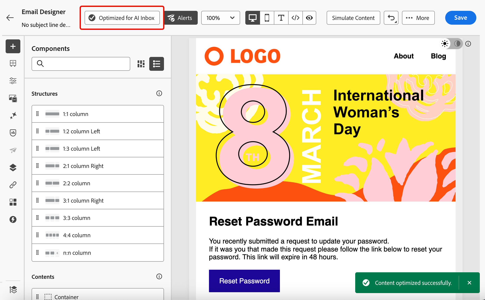

# Optimizar el texto del correo electrónico para bandejas de entrada AI {#email-text-optimizer}

[!DNL Adobe Journey Optimizer] incorpora una función de canal de correo electrónico que le ayuda a estructurar una versión específica de sus mensajes para mejorar las experiencias de la bandeja de entrada con asistencia de IA, como [!DNL Apple Intelligence] y [!DNL Google Gemini] en [!DNL Gmail], de modo que puedan responder preguntas y resumir el correo electrónico en función de su contenido de forma más precisa, con mejores resultados.

Puede utilizar esta capacidad para refinar una versión de texto dedicada de sus mensajes, de modo que las experiencias de la bandeja de entrada asistida por IA tengan más probabilidades de mostrar las ofertas, las llamadas a la acción y los detalles que pretenda, en lugar de texto generado automáticamente o contexto no relacionado.

## Funcionamiento {#how-it-works}

Las preguntas típicas que los destinatarios pueden hacer en las experiencias de bandeja de entrada asistida por IA son *¿De qué se trata este correo electrónico?* o *¿Qué son estas ofertas?*.

* Las respuestas proporcionadas por estos asistentes de IA pueden ser un breve resumen (por ejemplo, que el mensaje es promocional, menciona el acceso anticipado de VIP y una venta, e incluye vínculos a categorías de productos), pero aun así omiten los objetivos que preocupaban al experto en marketing, porque los asistentes deducen del texto que ven de forma eficaz, no necesariamente de la historia completa que pretendía.

* Además, los asistentes pueden buscar de forma proactiva descuentos o cupones relacionados con la marca y doblarlos en la respuesta, de modo que el usuario ya no esté mirando únicamente lo que su mensaje realmente prometió. Este comportamiento es útil para los usuarios finales, pero diluye el control para los especialistas en marketing que necesitan respuestas para realizar un seguimiento de los términos reales del envío.

Para evitar estos problemas, [!DNL Journey Optimizer] crea una versión de texto adicional de los mensajes para que los cupones, los intervalos de descuento, las llamadas a la acción y otras prioridades aparezcan de antemano en una copia lineal transparente.

>[!NOTE]
>
>Esta versión de texto dedicada no es la misma que la versión de texto sin formato predeterminada o personalizada de los mensajes. [Más información](text-version-email.md)

El objetivo es que la IA de la bandeja de entrada base resúmenes y preguntas y respuestas en las ofertas y acciones definidas, en lugar de apoyarse en una parte de texto predeterminado delgada o en resultados web no relacionados.

>[!IMPORTANT]
>
>Los comportamientos exactos del asistente de IA dependen del proveedor de la bandeja de entrada y de la versión del modelo. Una vez enviado el correo electrónico, las respuestas y los resúmenes proporcionados por clientes de IA externos pueden ser incorrectos, incompletos o mezclados con los resultados de la web.
>
>La funcionalidad Optimizar el texto del correo electrónico para las bandejas de entrada de IA solo genera una versión de texto dedicada en Journey Optimizer; no garantiza cómo un asistente de terceros interpretará o mostrará el mensaje. Obtenga más información sobre las [limitaciones y riesgos de la IA de la bandeja de entrada de terceros](#inbox-ai-risks).

## Casos de uso recomendados {#use-cases}

<!--
* **Critical details only in images** — Offers, promo codes, or deadlines shown in banners or graphics are invisible in plain text. Use the optimizer (and manual edits) so the same facts appear as text, improving extraction by AI summaries and text-only clients.
-->

* **Texto denso o fragmentado generado automáticamente**: cuando el texto sin formato predeterminado es difícil de analizar, la optimización puede producir una narrativa lineal más clara con ofertas y vínculos explícitos.

* **Control de las preguntas y respuestas de la bandeja de entrada**: cuando espera que los destinatarios pregunten a los asistentes *de qué se trata el correo electrónico* o *cuáles son las ofertas*, una versión de bandeja de entrada segura reduce los resúmenes parciales y evita la dependencia en las respuestas completadas por la web que no están vinculadas a la copia aprobada.

## Optimizar para experiencias de bandeja de entrada de IA {#optimize-with-ai}

>[!IMPORTANT]
>
>Antes de usar esta capacidad, lea los [riesgos y limitaciones](#inbox-ai-risks) relacionados.
>
>Para tener acceso a esta característica, debe aceptar un acuerdo de usuario que se muestre la primera vez que utilice IA generativa en [!DNL Journey Optimizer]. Para obtener más información, lea las [Directrices de usuario de IA generativa de Adobe Experience Cloud](https://www.adobe.com/es/legal/licenses-terms/adobe-gen-ai-user-guidelines.html){target="_blank"}.

Para optimizar la versión de texto sin formato del correo electrónico para las bandejas de entrada de IA con [!DNL Journey Optimizer], siga los pasos a continuación.

1. Abra su correo electrónico en [Email Designer](content-from-scratch.md) (de una campaña, recorrido o plantilla, según el flujo de trabajo).

1. Haga clic en el botón **[!UICONTROL Optimizar para la bandeja de entrada de IA]** para generar una versión mejorada que resalte la información clave para la lectura y el resumen asistidos por IA.

   {zoomable="yes" width="80%"}

1. Si es la primera vez que usa IA generativa en [!DNL Journey Optimizer], se le pedirá que acepte el contrato de usuario. Para obtener más información, consulte las [Directrices de usuario de IA generativa de Adobe](https://www.adobe.com/es/legal/licenses-terms/adobe-gen-ai-user-guidelines.html){target="_blank"}.

   {width=50%}

   Haga clic en **[!UICONTROL Aceptar]** para continuar.

1. Se muestra la versión generada.

   {zoomable="yes" width="80%"}

   >[!NOTE]
   >
   >**Optimizar el texto del correo electrónico para las bandejas de entrada de IA** no cambia el diseño, el diseño ni las imágenes de HTML.

1. Para realizar cambios en el contenido generado automáticamente, seleccione la opción **[!UICONTROL Habilitar edición]** y edite manualmente el contenido según sea necesario.

1. Una vez que esté satisfecho con su versión, haga clic en el botón **[!UICONTROL Optimizar correo electrónico]** para confirmar.

1. El correo electrónico se ha optimizado correctamente para las bandejas de entrada de IA.

1. Para acceder o editar la versión optimizada, haga clic en el botón **[!UICONTROL Bandeja de entrada optimizada para IA]**.

   {zoomable="yes" width="80%"}

1. Se muestra la versión optimizada. Puede **[!UICONTROL Quitar optimización]** o hacer clic en **[!UICONTROL Volver a optimizar]** para generar una nueva versión.

   {zoomable="yes" width="80%"}

   >[!NOTE]
   >
   >Si realiza cambios en el contenido original de HTML, debe volver a optimizar la versión para las bandejas de entrada de IA.

## Riesgos y limitaciones de la IA de la bandeja de entrada de terceros {#inbox-ai-risks}

La función Optimizar correo electrónico para bandejas de entrada de IA le ayuda a preparar una versión de su correo electrónico para que los proveedores de buzones de correo procesen sus envíos de [!DNL Journey Optimizer]. No controla los productos de esos proveedores. Una vez enviado el mensaje, las características de IA de [!DNL Gmail], [!DNL Apple] Mail, [!DNL Outlook] u otros clientes funcionarán bajo sus términos, modelos y directivas, no de Adobe.

* **Presentación impredecible**: los resúmenes, las notificaciones, los comentarios y las respuestas conversacionales pueden omitir ofertas, indicar precios o fechas incorrectos, combinar contenido con resultados web no relacionados o parafrasear de formas que ya no coincidan con la copia aprobada. El comportamiento cambia cuando los proveedores actualizan los modelos o la interfaz de usuario sin previo aviso.

* **No hay garantía de paridad con HTML**: Es posible que los destinatarios que dependen de las vistas previas o las respuestas del asistente nunca vean el diseño, las imágenes o los pies de página legales completos de HTML. Lo que creen que el mensaje &quot;dice&quot; puede provenir solamente de un breve resumen generado por IA.

* **Privacidad, cumplimiento y uso de datos**: la inteligencia artificial aplicada a la bandeja de entrada puede procesar el contenido de los mensajes en la infraestructura del proveedor sujeto a la política de privacidad, la retención y las reglas regionales de dicho proveedor. Las organizaciones de los sectores regulados deben evaluar si el uso de estas características por parte de los destinatarios afecta a sus obligaciones, independientemente de cómo se haya creado el correo electrónico en [!DNL Journey Optimizer].

* **Exposición legal o de marca**: los resúmenes de IA incorrectos o incompletos pueden crear confusión o disputas con los clientes acerca de promociones, términos o lenguaje de exclusión. **Optimizar el correo electrónico para bandejas de entrada de IA** no garantiza que el modelo de un tercero reproduzca fielmente la versión optimizada del correo electrónico.

* **[!UICONTROL Optimizar para la bandeja de entrada de IA]** en [!DNL Journey Optimizer]: el control de tiempo de creación de Designer de correo electrónico es independiente de los asistentes de la bandeja de entrada del usuario final. Revise siempre el texto sin formato generado antes de enviarlo.

## Temas relacionados {#related-topics}

* [Introducción al diseño de correo electrónico](get-started-email-design.md)
* Para ver las características generativas de Adobe en un sentido más amplio, consulte [Introducción al asistente de IA para crear contenido](../content-management/gs-generative.md).
