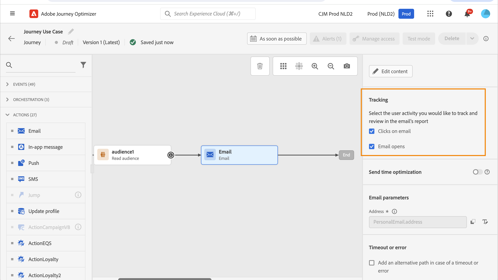
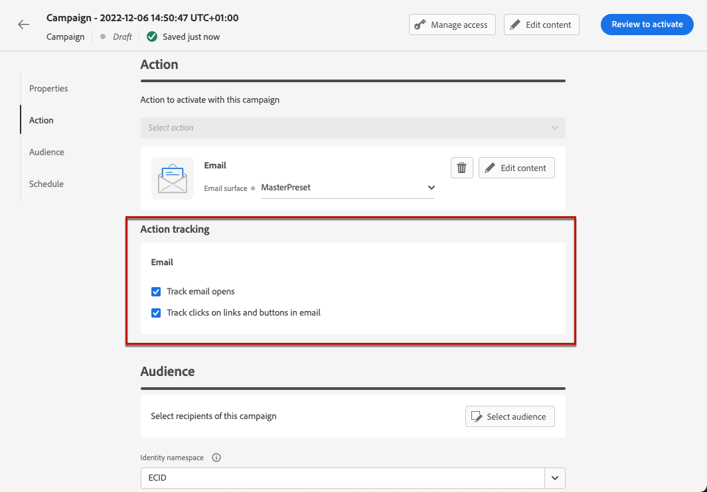
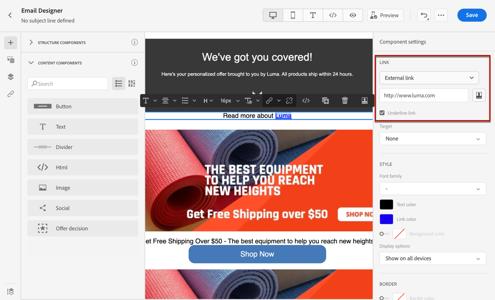
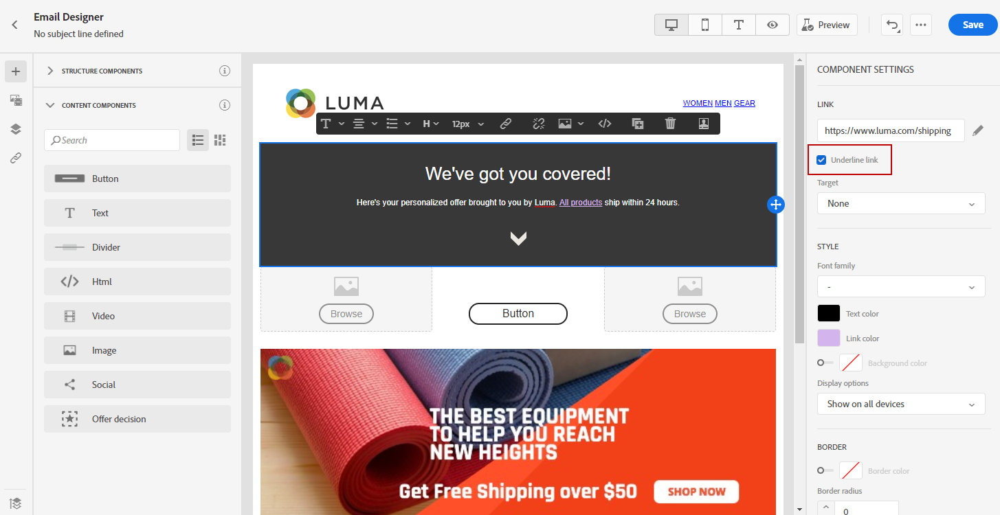
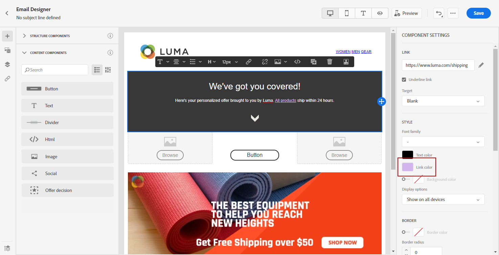
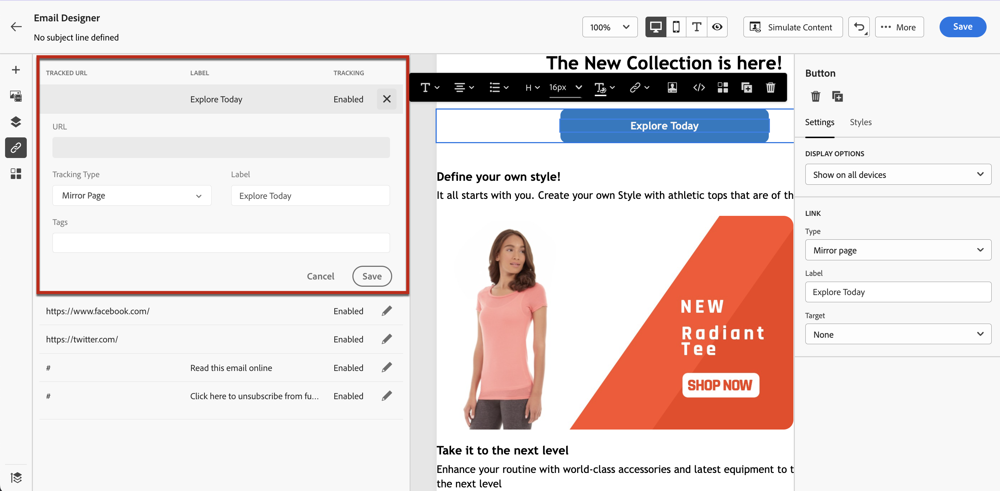

# Adición de vínculos y seguimiento de mensajes {#tracking}

Use [!DNL Journey Optimizer] para agregar vínculos al contenido y realizar un seguimiento de los mensajes enviados a fin de supervisar el comportamiento de los destinatarios.

>[!NOTE]
>
>Cuando los vínculos se incluyen en el contenido, caducan **25 meses** después de que se envíe el mensaje, excepto los vínculos a una página espejo, que caducan después de **90 días**. Una vez transcurrido ese tiempo, los vínculos ya no están disponibles.

## Habilitar seguimiento {#enable-tracking}

Puede habilitar el seguimiento en el nivel de mensaje de correo electrónico comprobando las opciones **[!UICONTROL Aperturas de correo electrónico]** o **[!UICONTROL Haga clic en el correo electrónico]** al crear su mensaje dentro de un recorrido o una campaña, como se muestra en las pestañas siguientes:

>[!BEGINTABS]

>[!TAB Habilitar el seguimiento en un recorrido]

>[!TAB Habilitar el seguimiento en una campaña]

>[!ENDTABS]

>[!NOTE]
>
>Ambas opciones están habilitadas de forma predeterminada.

Cuando se habilita, estas opciones hacen un seguimiento del comportamiento de los destinatarios de los mensajes:

* La métrica **[!UICONTROL Aperturas del correo electrónico]** comprueba cuántos mensajes se han abierto.
* La métrica **[!UICONTROL Hacer clic en el correo electrónico]** calcula el número de clics en los vínculos de un correo electrónico.

### Seguimiento en varios correos electrónicos {#track-across-multiple-emails}

Un identificador de seguimiento único (urlID) solo se genera cuando **URL** y **etiqueta** son únicos. Los vínculos que comparten la misma dirección URL y tienen la misma etiqueta efectiva (incluso cuando la etiqueta está en blanco) vuelven a utilizar el mismo urlID, lo que significa que no se puede saber en qué vínculo se hizo clic.

Para rastrear la misma dirección URL en varios correos electrónicos (o varias veces en un correo electrónico), usa una etiqueta única para cada dirección URL similar; de lo contrario, [!DNL Journey Optimizer] no podrá rastrear en qué vínculo se hizo clic. Puede establecer distintas etiquetas en el Designer de correo electrónico o, para HTML, a través del atributo `data-label`.

| URL | Etiqueta | Etiqueta | comportamiento de urlID |
| --- | --- | --- | --- |
| `https://www.example.com` | Primero | (En blanco) | Obtiene un urlID (por ejemplo, A) |
| `https://www.example.com` | Second | (En blanco) | Reutiliza urlID A: no se puede saber en qué vínculo se hizo clic |
| `https://www.example.com` | Tercero | Primera etiqueta | Obtiene un urlID (por ejemplo, B) |
| `https://www.example.com` | Cuarto | Segunda etiqueta | Obtiene un urlID (por ejemplo, C) |

## Inserción de vínculos {#insert-links}

Cuando el seguimiento [está habilitado](#enable-tracking), se realiza un seguimiento de todos los vínculos incluidos en el contenido del mensaje.

>[!NOTE]
>
>También se realiza un seguimiento de los vínculos de los fragmentos utilizados en un correo electrónico. [Más información sobre fragmentos](../content-management/fragments.md)

Para insertar vínculos en el contenido del correo electrónico, siga los pasos a continuación:

1. Seleccione un elemento (texto o imagen) y haga clic en **[!UICONTROL Insertar vínculo]** en la barra de herramientas contextual.

   

1. Elija el tipo de vínculo que desea crear:

   * Seleccione **[!UICONTROL Vínculo externo]** para insertar un vínculo a una dirección URL externa.

   * Seleccione **[!UICONTROL Página de aterrizaje]** para insertar un vínculo a una página de aterrizaje. [Más información](../landing-pages/create-lp.md)

   * Seleccione **[!UICONTROL Exclusión en un clic]** para insertar un vínculo que permita a los usuarios cancelar la suscripción rápidamente a sus comunicaciones sin necesidad de confirmar la exclusión. [Más información](email-opt-out.md#one-click-opt-out).

   * Seleccione **[!UICONTROL Inclusión/suscripción externa]** para insertar un vínculo que acepte recibir comunicaciones de su marca.

   * Seleccione **[!UICONTROL Exclusión/baja externa]** para insertar un vínculo para cancelar la suscripción y evitar recibir comunicaciones de su marca. Obtenga más información acerca de la administración de la exclusión en [esta sección](email-opt-out.md#email-opt-out).

   * Seleccione **[!UICONTROL Página espejo]** para agregar un vínculo a la página espejo de correo electrónico. [Más información](#mirror-page)

   * Seleccione **[!UICONTROL Vínculo profundo]** para insertar un vínculo a una aplicación móvil. Esto garantiza que los usuarios sean llevados directamente al contenido correcto en la aplicación, en lugar de ser redirigidos a navegadores o tiendas de aplicaciones, preservando el contexto y la participación. [Más información](deeplinks.md)

     >[!IMPORTANT]
     >
     >Antes de usar la vinculación profunda, asegúrese de completar los [pasos de configuración](deeplinks.md#configuration) correspondientes en Journey Optimizer e implementar la [administración de vínculos profundos](deeplinks.md#mobile-implementation) en su aplicación móvil. Si no lo ha hecho, el vínculo profundo no dirigirá a los usuarios al contenido incluido en la aplicación.
     >
     >Además, asegúrate de que el seguimiento de vínculos [está habilitado](#enable-tracking) para tu mensaje, de modo que la URL se reescriba a través de los sistemas Adobe.

1. Introduzca la dirección URL deseada en el campo correspondiente o seleccione una página de aterrizaje y defina la configuración y los estilos del vínculo. [Más información](#adjust-links)

   >[!NOTE]
   >
   >Para interpretar direcciones URL, [!DNL Journey Optimizer] cumple con la sintaxis de URI ([estándar RFC 3986](https://datatracker.ietf.org/doc/html/rfc3986){target="_blank"}), que deshabilita algunos caracteres internacionales especiales en las direcciones URL. Al intentar enviar la prueba o el correo electrónico, si se le devuelve un error que implica una dirección URL añadida al contenido, puede codificar la cadena como una solución alternativa.

1. Puede personalizar los vínculos. [Más información](url-personalization.md)

1. Guarde los cambios.

1. Una vez creado el vínculo, puedes modificarlo desde los paneles **[!UICONTROL Configuración]** y **[!UICONTROL Estilos]** de la derecha.

   

>[!NOTE]
>
>Los mensajes de correo electrónico de tipo Marketing deben incluir un [vínculo de no participación](../privacy/opt-out.md#opt-out-decision-management), que no es necesario para los mensajes transaccionales. La categoría del mensaje (**[!UICONTROL Marketing]** o **[!UICONTROL Transaccional]**) se define en la [configuración del canal](email-settings.md#email-type) al crear el mensaje.

Una vez enviado el mensaje, el período de retención de un vínculo es de **25 meses**. Después de este retraso, el vínculo ya no está disponible.

>[!CAUTION]
>
>Cuando la **etiqueta** y la **URL** de un botón se hacen editables en un [fragmento personalizable](../content-management/customizable-fragments.md), los informes de seguimiento muestran la dirección URL en lugar de la etiqueta del botón.

## Vínculo a una página espejo {#mirror-page}

La página espejo es una versión en línea de su correo electrónico. Añadir un vínculo a la página espejo es una práctica recomendada de marketing por correo electrónico. Los usuarios pueden navegar a la página espejo de un correo electrónico, por ejemplo, si están experimentando problemas de renderización o imágenes rotas al intentar verlo en su bandeja de entrada. También se recomienda proporcionar una versión en línea por motivos de accesibilidad o para fomentar el uso compartido en redes sociales.

La página espejo generada por Adobe Journey Optimizer contiene todos los datos de personalización.

Para agregar un vínculo a una página espejo en el correo electrónico, [inserta un vínculo](#insert-links) y selecciona **[!UICONTROL Página espejo]** como tipo de vínculo.

La página espejo se crea automáticamente. Una vez enviado el correo electrónico, cuando los destinatarios hacen clic en el vínculo de la página espejo, el contenido del correo electrónico se muestra en su navegador web predeterminado.

El período de retención de una página espejo es de **90 días**. Después de ese retraso, la página espejo ya no está disponible.

>[!CAUTION]
>
>* Los vínculos de páginas espejo se generan automáticamente y no se pueden editar. Contienen todos los datos personalizados cifrados necesarios para procesar el correo electrónico original. Como resultado, el uso de atributos personalizados con valores grandes puede generar direcciones URL de páginas espejo largas, lo que puede impedir que el vínculo funcione en exploradores web que tengan una longitud de URL máxima.
>
>* Al crear correos electrónicos que dependen en gran medida de la personalización en tiempo de ejecución (por ejemplo, bucles de `#each`, objetos anidados, datos de carga útil grandes), las direcciones URL de página espejo pueden llegar a ser excesivamente grandes, especialmente en campañas activadas por API que utilizan datos contextuales extensos de cargas útiles. Esto puede provocar errores de HTTP (404, 422, 502) en exploradores o clientes de correo electrónico. Adobe recomienda limitar la anchura y profundidad de los campos dinámicos, reducir la dependencia de fragmentos complejos y acoplar las estructuras de personalización para evitar errores de vínculos.
>
>* En la [prueba](../content-management/proofs.md) enviada a los perfiles de prueba, el vínculo a la página espejo no está activo. Solo está activo en los mensajes finales.

## Personalizar la apariencia y el destino del vínculo {#adjust-links}

Puede realizar ajustes en los vínculos, como subrayarlos, cambiar su color o seleccionar su destino.  Estos cambios se establecen en los paneles **[!UICONTROL Configuración]** y **[!UICONTROL Estilos]** de la sección derecha del editor de contenido.

### Target {#link-target}

El atributo **target** se usa para controlar dónde se abrirá una página vinculada. Añadir un atributo objetivo en una etiqueta de anclaje puede especificar si el vínculo debe abrirse en una pestaña nueva, en la misma pestaña o en un marco diferente.

Para definir el destinatario de un vínculo, siga estos pasos:

1. En un componente de **[!UICONTROL Texto]** donde se inserta un vínculo, seleccione el vínculo.

1. En la ficha **[!UICONTROL Configuración]**, seleccione dónde se abrirá el vínculo en la lista desplegable **[!UICONTROL Destino]**. Los valores posibles se enumeran a continuación:

   * **[!UICONTROL Ninguna]**: abre el vínculo en el mismo marco en el que se hizo clic (predeterminado).
   * **[!UICONTROL En blanco]**: abre el vínculo en una nueva ventana o pestaña.
   * **[!UICONTROL Propio]**: abre el vínculo en el mismo marco en el que se hizo clic.
   * **[!UICONTROL Principal]**: abre el vínculo en el marco principal.
   * **[!UICONTROL Superior]**: abre el vínculo en todo el cuerpo de la ventana.

   

1. Guarde los cambios.

### Subrayar vínculo {#link-underline}

Marque la opción **[!UICONTROL Subrayar vínculo]** para subrayar la etiqueta del vínculo.

### Color del vínculo {#link-color}

Para cambiar el color del vínculo, haga clic en **[!UICONTROL Color del vínculo]** en la pestaña **[!UICONTROL Estilos]**.

## Administrar seguimiento {#manage-tracking}

El [Diseñador de correo electrónico](content-from-scratch.md) le permite administrar las direcciones URL rastreadas, como editar el tipo de seguimiento para cada vínculo.

1. Haga clic en el icono **[!UICONTROL Vínculos]** del panel izquierdo para mostrar la lista de todas las direcciones URL del contenido de las que se realizará un seguimiento.

   Esta lista permite tener una vista centralizada y localizar cada URL en el contenido del correo electrónico.

1. Para editar un vínculo, haga clic en el icono de lápiz correspondiente.

1. Puede modificar el **[!UICONTROL Tipo de seguimiento]** si es necesario:

   

   Para cada URL individual, puede definir el modo de seguimiento en uno de estos valores:

   * **[!UICONTROL Habilitado]**: activa el seguimiento en esta dirección URL.
   * **[!UICONTROL Exclusión]**: considera esta URL como una de exclusión o de baja.
   * **[!UICONTROL Página espejo]**: considera esta URL como una de página espejo.
   * **[!UICONTROL Nunca]**: Nunca activa el seguimiento de esta dirección URL.

Los informes sobre aperturas y clics están disponibles en [Live Report](../reports/live-report.md) y en [Customer Journey Analytics Report](../reports/report-gs-cja.md).

## Personalizar seguimiento de URL {#url-tracking}

Para obtener instrucciones detalladas sobre la personalización de URL (incluyendo cómo personalizar los parámetros de seguimiento de URL y cómo personalizar una URL completa/base), consulte [Personalización de URL](url-personalization.md).
