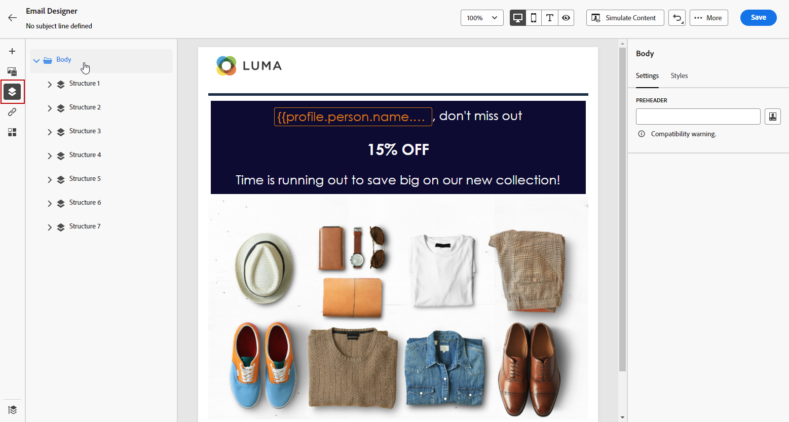

# Añadir un encabezado previo {#preheader}

>[!CONTEXTUALHELP]
>id="ac_edition_preheader"
>title="Adición de un encabezado previo"
>abstract="Un encabezado previo es un breve texto de resumen que sigue la línea del asunto cuando se visualiza un correo electrónico desde su cliente de correo electrónico. En muchos casos, proporciona un breve resumen del correo electrónico y suele contener una frase."

Un encabezado previo es un breve texto de resumen que sigue la línea del asunto cuando se visualiza un correo electrónico desde su cliente de correo electrónico.

En muchos casos, proporciona un breve resumen del correo electrónico y suele contener una frase.

>[!NOTE]
>
>Los encabezados previos no son compatibles con todos los clientes de correo electrónico. Cuando no se admite, el encabezado previo no se muestra.

Para definir el encabezado previo del correo electrónico, siga los pasos a continuación:

1. En el Diseñador de correo electrónico, agregue al menos un **[!UICONTROL Componentes de estructura]** para empezar a diseñar el correo electrónico.

1. Haga clic en el **[!UICONTROL Árbol de navegación]** en el panel izquierdo y seleccione **[!UICONTROL Cuerpo]**.

   

1. En el **[!UICONTROL Configuración]** , haga clic en el icono de personalización situado junto a la pestaña **[!UICONTROL Encabezado previo]** para añadir contenido.

   

1. En el **[!UICONTROL Editar personalización]** ventana, puede añadir **[!UICONTROL Bloque de contenido]**, **[!UICONTROL Contenido dinámico]** o **[!UICONTROL Campos personalizados]**.

1. Haga clic en **[!UICONTROL Validar]** para comprobar la sintaxis de personalización.

   

1. Haga clic en **[!UICONTROL Guardar]**.

El encabezado previo ya está configurado para el correo electrónico.
