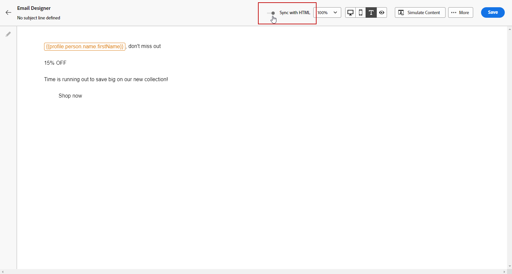

# Creación de la versión de texto de un correo electrónico {#text-version-email}

Se recomienda crear una versión de texto del cuerpo del correo electrónico, que se utiliza cuando no se puede mostrar el contenido HTML.

De forma predeterminada, el Diseñador de correo electrónico crea una versión de **[!UICONTROL Texto sin formato]** del correo electrónico, incluidos los campos de personalización. Esta versión se genera y sincroniza automáticamente con la versión HTML del contenido.

Si prefiere usar un contenido diferente para la versión de texto sin formato, siga los pasos a continuación:

1. En el correo electrónico, seleccione el icono **[!UICONTROL Texto sin formato]**.

   

1. Utilice la opción **[!UICONTROL Sincronizar con HTML]** para deshabilitar la sincronización.

   

1. Haga clic en la marca de verificación para confirmar su elección.

   

1. A continuación, puede editar la versión de texto sin formato como desee.

>[!CAUTION]
>
>* Los cambios realizados en la vista **[!UICONTROL Texto sin formato]** no se reflejan en la vista HTML.
>
>* Si vuelve a habilitar la opción **[!UICONTROL Sincronizar con HTML]** después de actualizar el contenido de texto sin formato, los cambios se perderán y se reemplazarán con el contenido de texto generado a partir de la versión de HTML.
