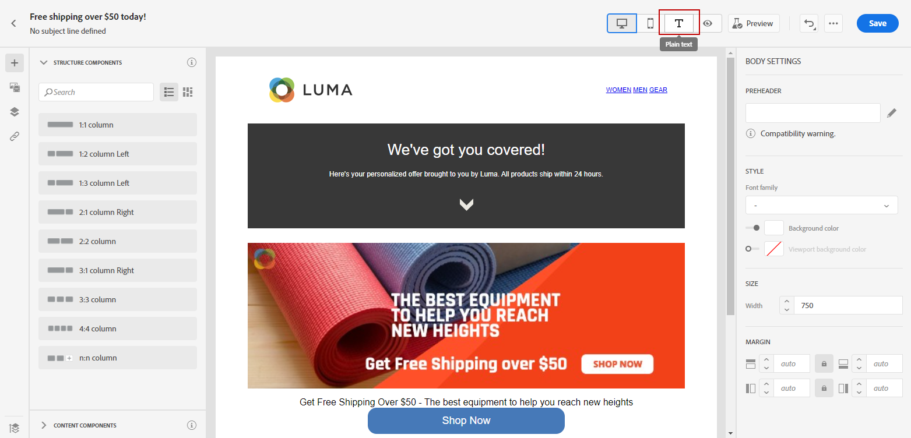
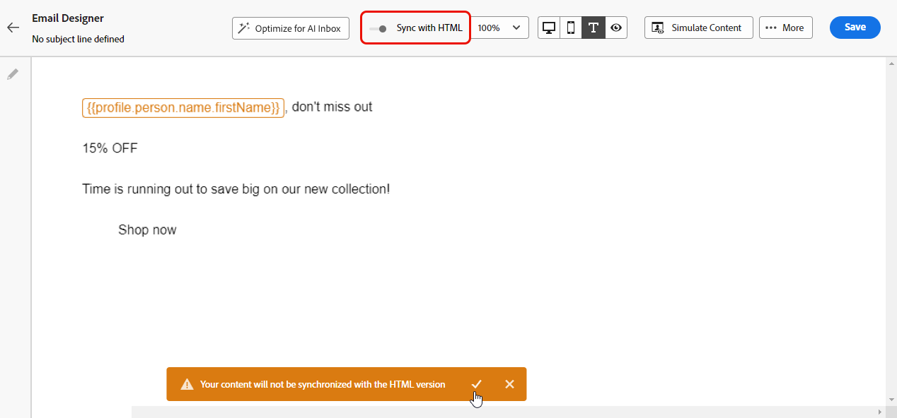

# Administrar la versión de texto de un correo electrónico {#text-version-email}

Se recomienda crear una versión de texto del cuerpo del correo electrónico, que se utiliza cuando no se puede mostrar el contenido HTML.

Desde el punto de vista de la seguridad, ofrecer una versión de texto sin formato es importante porque los correos electrónicos de HTML pueden conllevar riesgos como scripts malintencionados, píxeles de seguimiento o intentos de phishing que dependen del formato enriquecido y de los vínculos. El texto sin formato reduce la superficie de ataque y, a menudo, lo prefieren destinatarios conscientes de la seguridad o sistemas de correo electrónico corporativos que restringen o eliminan HTML. Proporcionar ambas versiones permite a los destinatarios elegir el formato que mejor se adapte a sus requisitos de seguridad y privacidad.

## Acceso a la versión de texto predeterminada {#plain-text-default}

De forma predeterminada, el Diseñador de correo electrónico crea una versión de **[!UICONTROL Texto sin formato]** del correo electrónico, incluidos los campos de personalización. Esta versión se genera y sincroniza automáticamente con la versión HTML del contenido.

Para acceder a la versión de texto predeterminada, seleccione el icono **[!UICONTROL Texto sin formato]** del contenido del correo electrónico.



## Utilizar una versión de texto personalizada {#plain-text-custom}

Si prefiere usar un contenido diferente para la versión de texto sin formato, siga los pasos a continuación:

1. En el correo electrónico, seleccione el icono **[!UICONTROL Texto sin formato]**.

1. Use la opción **[!UICONTROL Sincronizar con HTML]** para deshabilitar la sincronización. Haga clic en la marca de verificación para confirmar su elección.

   

1. A continuación, puede editar la versión de texto sin formato personalizada según desee.

>[!CAUTION]
>
> * Cuando la sincronización está deshabilitada, los cambios realizados en la vista **[!UICONTROL Texto sin formato]** no se reflejarán en la vista de HTML.
>
> * Si vuelve a habilitar la opción **[!UICONTROL Sincronizar con HTML]** después de actualizar el contenido de texto sin formato, los cambios se perderán y se reemplazarán con el contenido de texto generado a partir de la versión de HTML.

## Optimizar la versión de texto para bandejas de entrada de IA {#optimize-plain-text-ai}

Puede ayudar a las funciones de la bandeja de entrada con tecnología de IA (como los resúmenes de [!DNL Gmail], [!DNL Outlook] o [!DNL Apple Mail]) a mostrar sus ofertas y detalles clave mediante el botón **[!UICONTROL Optimizar para la bandeja de entrada de IA]**. Esa acción genera una versión de texto sin formato mejorada centrada en los asistentes de información que probablemente lean la parte de texto del mensaje.

{zoomable="yes" width="80%"}

>[!IMPORTANT]
>
>Al usar esta capacidad, la opción **[!UICONTROL Sincronizar con HTML]** se deshabilita automáticamente.

Para ver un tutorial completo y los escenarios recomendados, consulte [Optimizar el texto del correo electrónico para las bandejas de entrada de IA](llm-email-optimizer.md).

## Cuándo usar versiones de texto sin formato personalizadas {#when-to-use}

Comprender cuándo crear una versión de texto sin formato personalizada en comparación con el uso de la sincronización automática ayuda a garantizar una entrega de correo electrónico y una legibilidad óptimas.

### Utilice texto sin formato personalizado (deshabilite la sincronización) cuando:

* **Diseños complejos de HTML**: el correo electrónico de HTML incluye diseños de varias columnas, tablas o CSS complejas que no se traducen bien en texto sin formato.
* **Contenido con gran presencia visual**: el correo electrónico se basa en gran medida en imágenes y desea proporcionar alternativas de texto descriptivo para los clientes con imágenes deshabilitadas.
* **Estructura de mensajes diferente**: desea proporcionar una estructura de mensajes simplificada o reorganizada optimizada para lectores de texto sin formato.
* **Requisitos de accesibilidad**: necesita un formato de texto sin formato específico para cumplir los estándares de accesibilidad.
* **Clientes de correo electrónico heredados**: su audiencia incluye usuarios de clientes de correo electrónico antiguos (por ejemplo, Outlook 2003, clientes móviles de solo texto) que necesitan contenido con formato especial.
* **Formato ASCII**: desea incluir un formato de texto sin formato específico, como arte ASCII, tablas o saltos de línea específicos.

### Utilice la sincronización automática (predeterminada) cuando:

* **Diseño sencillo de HTML**: el correo electrónico de HTML tiene una estructura simple y lineal que se traduce bien a texto sin formato.
* **Contenido coherente**: desea mantener una coherencia exacta entre HTML y las versiones de texto sin formato.
* **Actualizaciones frecuentes**: actualiza con regularidad el contenido del correo electrónico y desea evitar la duplicación manual.
* **Personalization funciona bien**: los campos personalizados funcionan correctamente en ambos formatos.
* **Restricciones de tiempo**: debe iniciar correos electrónicos rápidamente sin personalizar el texto sin formato.

## Ejemplos prácticos {#practical-examples}

Los siguientes ejemplos muestran escenarios reales para ayudarle a decidir si desea utilizar texto sin formato personalizado o la sincronización automática. En cada ejemplo se explica el contexto, el enfoque recomendado y los motivos que fundamentan la decisión.

+++Ejemplo 1: Newsletter de marketing con diseño complejo

**Escenario:** newsletter de varias columnas con imágenes, botones con estilo y secciones con códigos de color.


**Recomendación:** Usar texto sin formato personalizado (deshabilitar sincronización).

**Por qué utilizar texto sin formato personalizado:** La versión de HTML usa un diseño de cuadrícula de tres columnas con imágenes de titular, botones con estilo y secciones con códigos de color. Estos elementos visuales no se traducen bien en texto sin formato mediante la sincronización automática, lo que da como resultado contenido desordenado y difícil de leer. Una versión personalizada de texto sin formato le permite reestructurar el contenido en un formato lineal y fácil de analizar con encabezados de sección claros y vínculos con el formato correcto.

**Ejemplo de texto sin formato personalizado:**

```
================================================
YOUR BRAND - MONTHLY NEWSLETTER
December 2025
================================================

🌟 FEATURED ARTICLE
"10 Ways to Optimize Your Customer Journeys"
Read more: https://example.com/articles/optimize-journeys

📢 UPCOMING WEBINAR
"Mastering Email Personalization"
December 15, 2025 at 2:00 PM EST
Register: https://example.com/webinar/register

📦 NEW PRODUCTS
- Winter Collection: https://example.com/winter
- Holiday Gift Guide: https://example.com/gifts

================================================
Website: https://example.com
Unsubscribe: https://example.com/unsubscribe
================================================
```

+++

+++Ejemplo 2: Confirmación de pedido transaccional

**Escenario:** Confirmación de pedido con datos estructurados (número de pedido, artículos, precios, detalles de envío).


**Recomendación:** Usar sincronización automática.

**Por qué funciona la sincronización automática:** Las confirmaciones de pedidos tienen una estructura lineal simple que se traduce de forma natural de HTML a texto sin formato. La información fluye de forma lógica (detalles del pedido → artículos → totales → envío) y los campos de personalización como números de pedido y nombres de clientes funcionan de forma idéntica en ambos formatos. Los datos tabulares estructurados se convierten de forma nítida sin necesidad de ajustes manuales, lo que ahorra tiempo y mantiene la claridad.

+++

+++Ejemplo 3: Invitación a un evento con medios enriquecidos

**Escenario:** Invitación a un evento con imágenes de fondo, vídeos incrustados y elementos interactivos.


**Recomendación:** Usar texto sin formato personalizado (deshabilitar sincronización).

**Por qué el texto sin formato personalizado:** La versión de HTML se basa en el impacto visual: imágenes de fondo, incrustaciones de vídeo y botones interactivos de RSVP. La sincronización automática eliminaría estos elementos, lo que dejaría una versión de texto confusa con referencias rotas. Una versión de texto sin formato personalizada permite proporcionar detalles claros del evento, información del orador y vínculos de registro directo en un formato bien organizado que funciona sin elementos visuales.

**Ejemplo de texto sin formato personalizado:**

```
YOU'RE INVITED!
Annual Customer Summit 2025

📅 When: March 15-17, 2025
📍 Where: San Francisco Convention Center
         123 Market Street, San Francisco, CA

KEYNOTE SPEAKERS
- Jane Smith, CEO TechCorp: "The Future of Digital Marketing"
- John Doe, Chief Innovation Officer: "AI and Customer Experience"

REGISTER NOW: https://example.com/summit/register
Early bird discount ends February 1st

Full agenda: https://example.com/summit/agenda
Questions: events@example.com | 1-800-555-0123
```

+++

## Casos de uso comunes {#common-use-cases}

Los siguientes casos de uso muestran situaciones en las que la creación de una versión de texto sin formato personalizada (deshabilitación de la sincronización) resulta beneficiosa. Cada ejemplo muestra el desafío que plantea la versión de HTML y cómo una solución de texto sin formato personalizada lo aborda.

+++Caso de uso 1: Correos electrónicos del catálogo de productos

**Desafío:** HTML muestra una cuadrícula de productos con imágenes, precios y botones de compra

**Solución de texto sin formato:** Cree una lista estructurada con nombres de productos, precios y vínculos directos claros

```
FEATURED PRODUCTS
=================

1. Premium Leather Wallet
   Price: $89.99
   View product: https://example.com/product/wallet
   
2. Designer Sunglasses
   Price: $129.99
   View product: https://example.com/product/sunglasses
```

+++

+++Caso de uso 2: Serie de correos electrónicos de bienvenida

**Desafío:** correo electrónico de bienvenida de marca con logotipo de la compañía y formato con estilo

**Solución de texto sin formato:** Use arte ASCII o formato de texto para crear una jerarquía visual

```
***************************************************
*                                                 *
*     WELCOME TO [BRAND NAME]                    *
*     We're thrilled to have you!                *
*                                                 *
***************************************************
```

+++

+++Caso de uso 3: Encuesta o solicitud de comentarios

**Desafío:** HTML incluye botones con estilo y elementos de formulario

**Solución de texto sin formato:** Proporcione vínculos de texto sin formato con instrucciones

```
We'd love your feedback!
------------------------

Please take 2 minutes to complete our survey:
https://example.com/survey/customer-feedback

Your input helps us improve our service.
```

+++

## Preguntas frecuentes {#faq}

**¿Mis campos de personalización funcionarán en texto sin formato?**\
Sí, los campos de personalización como `{{profile.firstName}}` funcionan de manera idéntica en las versiones de HTML y de texto sin formato.

**¿Cómo pruebo mi versión de texto sin formato?**
* Cambie a la vista **[!UICONTROL Texto sin formato]** en el Designer de correo electrónico. [Descubra cómo](#text-version-email)
* Envíe correos electrónicos de prueba a clientes de correo electrónico de solo texto como versiones antiguas de Pine o aplicaciones de correo electrónico móviles básicas.

**¿Qué sucede si olvido crear una versión de texto sin formato?**\
El sistema genera automáticamente una versión de texto sin formato a partir de HTML, que puede no tener un formato óptimo, pero que garantiza la entrega a clientes de solo texto.

**¿Puedo usar una personalización diferente en HTML frente a texto sin formato?**\
Sí, una vez deshabilitada la sincronización, puede personalizar cada versión de forma independiente, incluido el uso de diferentes campos de personalización o contenido.

**¿Qué clientes de correo electrónico solo admiten texto sin formato?**\
Muy pocos clientes modernos son de solo texto, pero algunas directivas de correo electrónico corporativas, herramientas de accesibilidad y dispositivos móviles más antiguos pueden mostrar texto sin formato. También es una alternativa cuando falla el procesamiento en HTML.

**¿Con qué frecuencia debo actualizar mi versión de texto sin formato?**\
Actualícelo siempre que realice cambios significativos en el contenido de HTML. Es posible que los ajustes menores de HTML no requieran actualizaciones de texto sin formato si el mensaje principal sigue siendo el mismo.

**¿Puedo incluir vínculos en correos electrónicos de texto sin formato?**\
¡Sí! Incluya direcciones URL completas (por ejemplo, https://example.com/page) y la mayoría de los clientes de correo electrónico harán que se puedan seleccionar automáticamente.

**¿Debo incluir imágenes en texto sin formato?**\
No, el texto sin formato no admite imágenes. En su lugar, describa lo que muestra la imagen o proporcione un vínculo para verla en línea.
