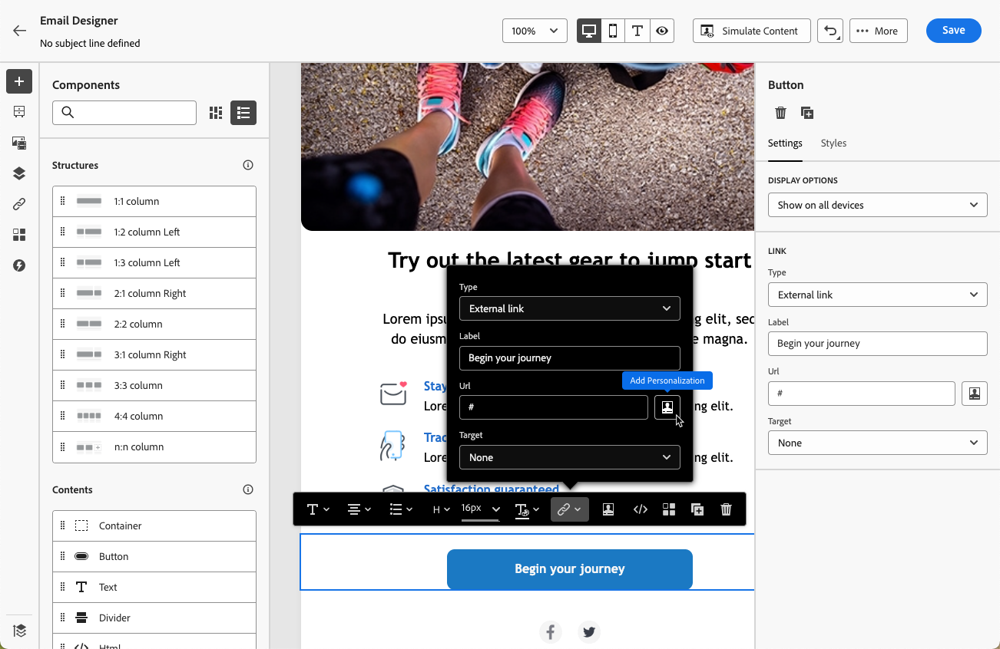
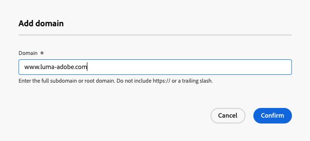

# Personalización de direcciones URL en correos electrónicos {#url-personalization}

>[!BEGINSHADEBOX]

**En esta página:** Aprenda a personalizar las direcciones URL de correo electrónico con atributos de perfil, incluidas las direcciones URL completas o básicas y los parámetros de seguimiento por vínculo, a la vez que mantiene los vínculos válidos y se pueden rastrear.

>[!ENDSHADEBOX]

Las direcciones URL personalizadas le ayudan a entregar experiencias contextuales a través de sus mensajes de correo electrónico de [!DNL Journey Optimizer], como la generación de vínculos específicos del destinatario o la adición de parámetros dinámicos.

Llevan a los destinatarios a páginas específicas de un sitio web o a un micrositio personalizado, según los atributos del perfil.

## Personalización de una URL {#personalize-url}

Para personalizar una URL, siga los pasos a continuación.

1. En el Designer de correo electrónico, seleccione un elemento en el contenido e [inserte un vínculo](message-tracking.md#insert-links) mediante la barra de herramientas contextual.

   >[!IMPORTANT]
   >
   >Personalization solo está disponible para **[!UICONTROL vínculo externo]**, **[!UICONTROL vínculo de baja]** y **[!DNL Opt-Out]**. Asegúrese de seleccionar un tipo de vínculo adecuado.

1. Seleccione el icono de personalización.

   

1. Utilice el editor de personalización para añadir los atributos de perfil con los que desea personalizar la URL.

1. Guarde los cambios.

Estos son algunos ejemplos de direcciones URL personalizadas:

* `https://www.adobe.com/users/{{profile.person.name.lastName}}`
* `https://www.adobe.com/users?uid={{profile.person.name.firstName}}`
* `https://www.adobe.com/usera?uid={{context.journey.technicalProperties.journeyUID}}`
* `https://www.adobe.com/users?uid={{profile.person.crmid}}&token={{context.token}}`

>[!NOTE]
>
>Al editar una URL personalizada en el editor de personalización, las funciones de ayuda y la pertenencia a audiencias se desactivan por motivos de seguridad.
>
>No se admiten espacios en los tokens de personalización utilizados dentro de las direcciones URL.

Para un procesamiento y seguimiento confiables, siga las [prácticas recomendadas y protecciones](#best-practices) a continuación.

## Personalizar una dirección URL completa/base {#personalize-complete-base-url}

Journey Optimizer admite la personalización de la dirección URL **entera** o del **dominio base** de una dirección URL, por ejemplo:

```html
<a href="{{profile.social.link}}" />
<a href="{{profile.social.baseUrl}}/profile" />
<a href="https://{{profile.social.baseUrl}}/profile" />
```

>[!CAUTION]
>
>Para habilitar la personalización completa o básica de la URL, primero debe agregar los dominios aceptados a la lista de permitidos. [Descubra cómo](#manage-accepted-domains)
>
>Las direcciones URL generadas dinámicamente tienen una limitación conocida: es posible que los datos de clics no aparezcan en los informes de recorridos o campañas. [Más información](#click-tracking-limitation)


### Añadir dominios para la personalización completa/básica de la URL {#manage-accepted-domains}

Para habilitar la personalización completa o básica de la URL, primero debe agregar los dominios aceptados a la lista de permitidos.

Esto garantiza que solo se utilicen dominios aprobados en las direcciones URL personalizadas y para ayudar a evitar redirecciones no seguras.

>[!NOTE]
>
>Para ver, agregar o quitar dominios de la lista de permitidos, necesita los permisos **[!UICONTROL Administrar mensajes, configuración general]** y **[!UICONTROL Ver mensajes, configuración general]**. [Más información](../administration/ootb-permissions.md)

Para administrar los dominios permitidos, siga los pasos a continuación.

1. En Adobe Journey Optimizer, vaya a **[!UICONTROL Administración]** > **[!UICONTROL Canales]** > **[!UICONTROL Configuración de correo electrónico]** > **[!UICONTROL Lista de permitidos - dominios]**.

   

   Desde allí, puede examinar todos los dominios aprobados, agregar otros nuevos y eliminar los existentes.

1. Haga clic en el botón **[!UICONTROL Agregar dominio]**.

1. Introduzca el subdominio completo o el dominio raíz.

   {width="80%"}

   >[!NOTE]
   >
   >No incluya https:// ni una barra diagonal, ya que esto provocará que se rechace el dominio. Por ejemplo, escriba `www.example.com` o `example.com`, no `https://www.example.com/`.

1. Haga clic en **[!UICONTROL Confirmar]**. El dominio se añade a la lista de permitidos y ahora se puede utilizar en la personalización completa o base de URL.

1. Para quitar un dominio, haga clic en el icono **[!UICONTROL Eliminar]** que está junto a ese dominio.

   >[!CAUTION]
   >
   >Si elimina un dominio que ya está en uso en una URL personalizada, no se puede garantizar la seguridad del vínculo. Asegúrese de actualizar cualquier dirección URL personalizada que haga referencia a este dominio antes de eliminarlo de la lista de permitidos.

### Limitación de rastreo de clics {#click-tracking-limitation}

Las direcciones URL generadas dinámicamente (donde la dirección URL completa o el dominio base se resuelven a partir de un atributo de perfil en el momento de la entrega) tienen una limitación de seguimiento conocida: Journey Optimizer no puede rastrear de forma fiable los clics para estos vínculos y es posible que **los datos de clics no aparezcan en los informes de recorridos o campañas**.

Esto ocurre porque la redirección de seguimiento se aplica en tiempo de diseño, antes de que se conozca la dirección URL final. Cuando el valor resuelto difiere por destinatario, la cadena de redirección se interrumpe y los clics no se registran. Además, la dirección URL resuelta debe comenzar con `http` o `https` para cada destinatario; si no es así, el seguimiento se omite silenciosamente para ese vínculo.

Para mantener un seguimiento de clics fiable, utilice uno de los siguientes métodos:

* Use una dirección URL base fija y anexe solo parámetros personalizados (por ejemplo, `https://www.example.com/page?uid={{profile.person.crmid}}`).

* Genere previamente una dirección URL personalizada por destinatario, almacénela como atributo de perfil y haga referencia a ella en el contenido del correo electrónico.

## Personalizar parámetros de seguimiento de URL {#personalize-url-tracking-parameters}

[El seguimiento de URL](url-tracking.md) se administra en el nivel de configuración de canal y se aplica a todas las URL incluidas en el contenido del mensaje. También puede personalizar los parámetros de seguimiento de URL para un vínculo individual en el Designer de correo electrónico. Esto permite anexar un parámetro específico del destinatario a un único vínculo (por ejemplo, para pasar un identificador a las herramientas de análisis web).

Para ello, [inserte un vínculo](message-tracking.md#insert-links), seleccione el icono de personalización, agregue el parámetro de seguimiento de URL y seleccione el atributo de perfil que desee en [editor de personalización](../personalization/personalization-build-expressions.md).


Repita los pasos anteriores para cada vínculo al que desee agregar este parámetro de seguimiento.

Ahora, cuando se envía el correo electrónico, este parámetro se anexa automáticamente al final de la dirección URL. A continuación, puede capturar este parámetro en las herramientas de análisis web o en los informes de rendimiento.

>[!NOTE]
>
>Para comprobar la dirección URL final, puede [enviar una prueba](../content-management/proofs.md) y hacer clic en el vínculo del contenido del correo electrónico una vez que reciba la prueba. La dirección URL debe mostrar el parámetro de seguimiento. Por ejemplo: <https://luma.enablementadobe.com/content/luma/us/en.html?utm_contact=profile.userAccount.contactDetails.homePhone.number>

<!--
## Best practices and guardrails {#best-practices}

To keep links valid, clickable, and trackable, follow the best practices and guardrails below.

### Braces for dynamic URLs {#use-braces}

When inserting a URL that contains personalization, use three curly braces (`{{{ ... }}}`) for the dynamic portion of the URL. This prevents escaping from altering special characters (for example `/` and `+`) and helps avoid broken URLs, incorrect redirects, or tracking issues.

Here is an example:

```html
<a href="https://example.com/path/{{{profile.person.customSlug}}}?ref={{{context.system.source.id}}}">View details</a>
```

>[!IMPORTANT]
>
>Using raw output (`{{{ ... }}}`) means the value is inserted as-is. Only use it with values you trust and that are intended to be URL-safe (for example, values you generate or validate upstream).

### Correct URL tracking {#enable-url-tracking}

* When using personalization to generate the URL, ensure the resolved value starts with `http`/`https` for every recipient. Otherwise, tracking may not be applied and the link may not behave as expected.

* Do not use dynamic logic such as `let`, `each`, or `if` statements directly in the personalization editor's URL field. These are disabled for security reasons.

* If your scenario involves complex logic to generate personalized URLs, avoid placing that logic directly in the personalization editor's URL field. Instead:
    * Add the necessary logic and statements in the HTML content above or near the URL field.
    * Generate and store personalized attributes separately, then reference them in your email content.

### URL encoding and length {#encoding}

* URI syntax rules ([RFC 3986 standard](https://datatracker.ietf.org/doc/html/rfc3986){target="_blank"}) apply to all URLs in your email content. However, personalized URLs are more likely to surface encoding issues because recipient-specific values can introduce reserved characters (for example in query parameters). Therefore, ensure your dynamic values are URL-encoded (especially spaces, `&`, `#`, `%`, and `+`) and avoid using `+` for query values.

* Very long URLs can be truncated or rejected by browsers, mail clients, or downstream systems. For example, mirror page URLs can grow significantly when runtime personalization is heavy. Keep personalized payloads small and avoid embedding large objects into URLs.

### Recommended validation steps {#validation}

Before activating a journey or campaign, follow the recommendations below:

* Send a [proof](../content-management/proofs.md) and click links to confirm the resolved URL starts with `http`/`https` and keeps the expected structure.
* If tracking parameters are appended, confirm the final URL includes them (either via configuration-level URL tracking or per-link tracking parameters).
-->

{{$include /help/_includes/do-not-localize/email/ai-augmented-url-personalization.md}}
