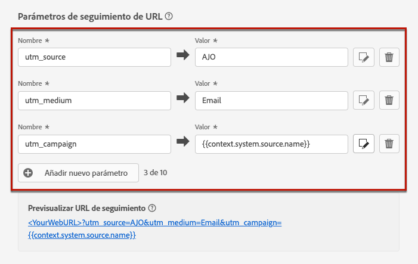
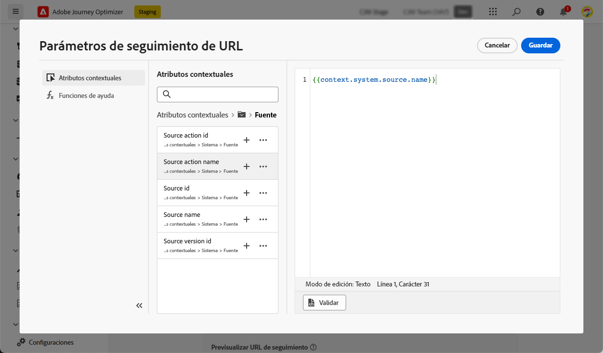
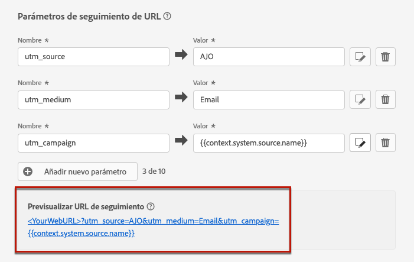

# Seguimiento de URL {#url-tracking}

>[!CONTEXTUALHELP]
>id="ajo_admin_preset_utm"
>title="Definir los parámetros de seguimiento de URL"
>abstract="Utilice esta sección para adjuntar automáticamente parámetros de seguimiento a las direcciones URL presentes en el contenido del correo electrónico. Esta función es opcional."

>[!CONTEXTUALHELP]
>id="ajo_admin_preset_url_preview"
>title="Previsualizar los parámetros de seguimiento de URL"
>abstract="Revise cómo se adjuntarán los parámetros de seguimiento a las direcciones URL presentes en el contenido del correo electrónico."

Al configurar una nueva [configuración de canal de correo electrónico](email-settings.md), puede definir **[!UICONTROL parámetros de seguimiento de URL]** para medir la eficacia de sus esfuerzos de marketing entre canales. La activación de esta función es opcional.

Los parámetros definidos en la sección correspondiente se anexan al final de las direcciones URL incluidas en el contenido del mensaje de correo electrónico. A continuación, puede capturar estos parámetros en herramientas de análisis web como Adobe Analytics o Google Analytics y crear varios informes de rendimiento.

Puede añadir hasta 10 parámetros de seguimiento con el botón **[!UICONTROL Añadir nuevo parámetro]**.

{width="80%"}

Para configurar un parámetro de seguimiento de URL, puede escribir directamente los valores deseados en los campos **[!UICONTROL Nombre]** y **[!UICONTROL Valor]**.

También puede editar cada campo **[!UICONTROL Valor]** con el [editor de personalización](../personalization/personalization-build-expressions.md). Haga clic en el icono de edición para abrir el editor. Desde allí, puede seleccionar los atributos contextuales disponibles y/o editar directamente el texto.

Están disponibles los siguientes valores predefinidos a través del editor de personalización:

* **ID de perfil de mensaje**: atributo orientado al mensaje que identifica de forma exclusiva cada mensaje enviado a cada perfil de destino en una entrega.

* **ID de oferta**: ID de la oferta que se ha utilizado en el correo electrónico.

* **ID de acción de origen**: ID de la acción de correo electrónico añadida al recorrido o a la campaña.

* **Nombre de acción de origen**: nombre de la acción de correo electrónico añadida al recorrido o a la campaña.

* **ID de origen**: ID del recorrido o de la campaña con el que se envió el correo electrónico.

* **Nombre de origen**: nombre del recorrido o de la campaña con el que se envió el correo electrónico.

* **ID de versión de origen**: ID de la versión de recorrido o campaña con la que se envió el correo electrónico.

>[!NOTE]
>
>Puede combinar la escritura de valores de texto y el uso de atributos contextuales desde el editor de personalización. Cada campo **[!UICONTROL Valor]** puede contener un número de caracteres hasta el límite de 5 KB.

<!--You can drag and drop the parameters to reorder them.-->

A continuación, se muestran ejemplos de URL compatibles con Adobe Analytics y Google Analytics.

* URL compatible con Adobe Analytics: `www.YourLandingURL.com?cid=email_AJO_{{context.system.source.id}}_image_{{context.system.source.name}}`

* URL compatible con Google Analytics: `www.YourLandingURL.com?utm_medium=email&utm_source=AJO&utm_campaign={{context.system.source.id}}&utm_content=image`

Puede obtener una vista previa dinámica de la URL de seguimiento resultante. Cada vez que se añade, edita o quita un parámetro, la vista previa se actualiza automáticamente.

>[!NOTE]
>
>También puede añadir parámetros de seguimiento personalizados dinámicos a los vínculos presentes en el contenido del correo electrónico. [Más información](surface-personalization.md#personalize-url-tracking)
