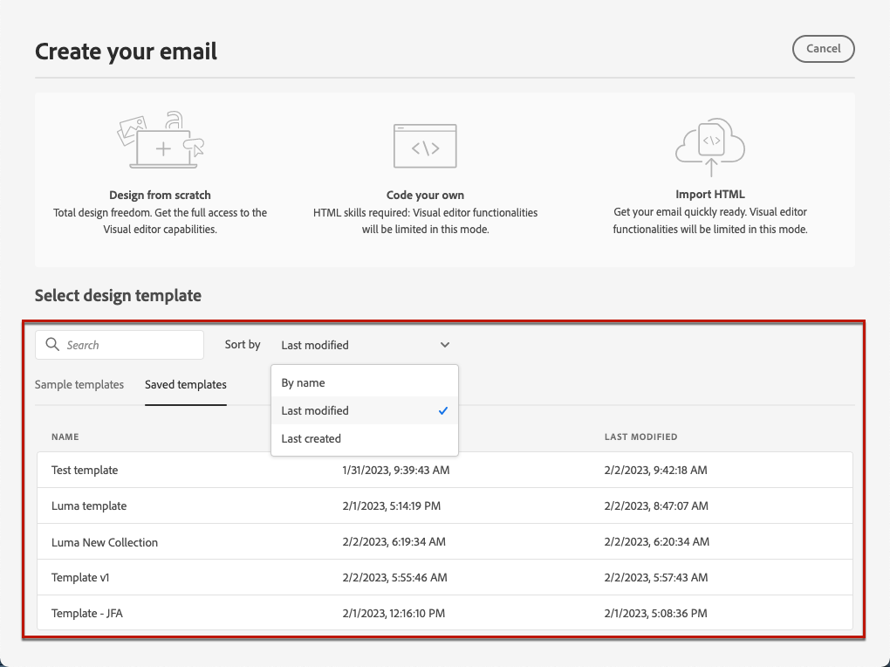

# Uso de plantillas de correo electrónico {#email-templates}

>[!CONTEXTUALHELP]
>id="ajo_use_template"
>title="Generación de contenido a partir de una plantilla"
>abstract="Para empezar a crear el contenido del correo electrónico, seleccione una plantilla predeterminada o una existente personalizada, creada desde cero o guardada como plantilla a partir de un correo electrónico anterior."

Desde la pantalla **[!UICONTROL Crear tu correo electrónico]**, usa la sección **[!UICONTROL Seleccionar plantilla de diseño]** para empezar a crear tu contenido a partir de una plantilla.

Puede elegir entre:

* **Plantillas de ejemplo**. La interfaz [!DNL Journey Optimizer] ofrece 20 plantillas de correo electrónico predeterminadas entre las que puede elegir.

* **Plantillas guardadas**. También puede utilizar una plantilla personalizada que permita:

   * Creadas desde cero utilizando el menú **[!UICONTROL Plantillas de contenido]**. [Más información](../content-management/content-templates.md#content-templates)

   * Se guardó desde un correo electrónico en un recorrido o una campaña usando la opción **[!UICONTROL Guardar como plantilla de contenido]**. [Más información](../content-management/content-templates.md#video-templates)

Para empezar a crear contenido con una de las plantillas de ejemplo o guardadas, siga los pasos a continuación.

1. [Acceda al Designer de correo electrónico](get-started-email-design.md) desde la pantalla del correo electrónico **[!UICONTROL Editar contenido]**.

1. En la pantalla **[!UICONTROL Crear tu correo electrónico]**, la pestaña **[!UICONTROL Plantillas de ejemplo]** está seleccionada de forma predeterminada.

1. Para usar una plantilla personalizada, ve a la pestaña **[!UICONTROL Plantillas guardadas]**.

   

1. Se muestra la lista de todas las [plantillas de contenido](../content-management/content-templates.md#content-templates) creadas en la zona protegida actual. Puede ordenarlas **[!UICONTROL Por nombre]**, **[!UICONTROL Última modificación]** y **[!UICONTROL Última creación]**.

   

1. Seleccione la plantilla que desee en la lista.

1. Una vez seleccionada, puede desplazarse entre todas las plantillas de una categoría (de ejemplo o guardadas según su selección) utilizando las flechas derecha e izquierda.

   

1. Haga clic en **[!UICONTROL Usar esta plantilla]** en la parte superior derecha de la pantalla.

1. Edite el contenido como desee mediante Email Designer.
