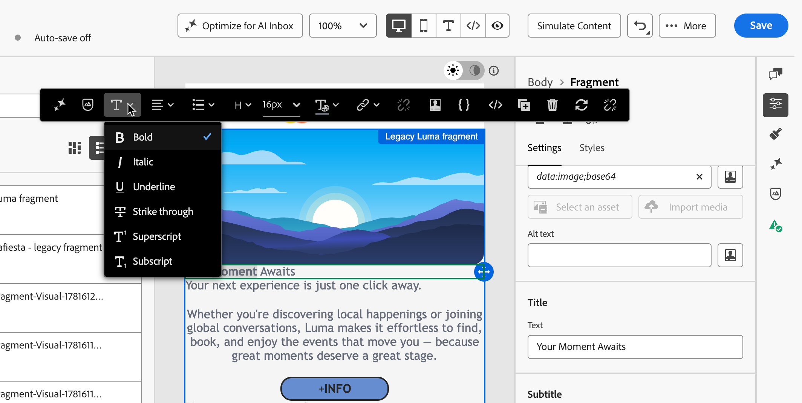

# Añadir fragmentos visuales a los correos electrónicos {#use-visual-fragments}

>[!BEGINSHADEBOX]

**En esta página:** Aprenda a insertar fragmentos visuales reutilizables en sus correos electrónicos, personalizar sus campos editables y romper o mantener su herencia con el fragmento original.

>[!ENDSHADEBOX]

Un fragmento es un componente reutilizable al que se puede hacer referencia en uno o varios correos electrónicos en campañas de Journey Optimizer, recorridos o plantillas de contenido. Esta funcionalidad permite crear previamente varios bloques de contenido personalizados que los usuarios de marketing pueden utilizar para ensamblar rápidamente el contenido del correo electrónico en un proceso de diseño mejorado. [Aprenda a crear y administrar fragmentos](../content-management/fragments.md).

➡️ [Aprenda a administrar, crear y usar fragmentos en este vídeo](../content-management/fragments.md#video-fragments)

## Usar un fragmento {#use-fragment}

Para utilizar un fragmento en un correo electrónico, siga los pasos a continuación.

>[!NOTE]
>
>Puede añadir hasta 30 fragmentos en una entrega determinada. Los fragmentos solo se pueden anidar hasta 1 nivel.

1. Abra cualquier contenido de correo electrónico o plantilla con [Email Designer](get-started-email-design.md).

1. Seleccione el icono **[!UICONTROL Fragmentos]** del carril izquierdo.

   

1. Se muestra la lista de todos los fragmentos visuales creados en la zona protegida actual. Se ordenan por fecha de creación: los fragmentos visuales añadidos recientemente se muestran primero en la lista. Puede hacer lo siguiente:

   * Busque un fragmento específico escribiendo su etiqueta.
   * Ordene los fragmentos en orden ascendente o descendente.
   * Cambie la forma en que se muestran los fragmentos (tarjetas o vista de lista).
   * Actualice la lista.

   >[!NOTE]
   >
   >Si se han modificado o agregado fragmentos mientras edita el contenido, la lista se actualizará con los cambios más recientes.

1. Arrastre y suelte cualquier fragmento de la lista en el área en la que desee insertarlo.

   

   >[!CAUTION]
   >
   >Puede agregar cualquier fragmento de **Borrador** o **Activo** al contenido. Sin embargo, no podrá activar su recorrido o campaña si se está utilizando un fragmento con el estado Borrador. En el momento de la publicación del recorrido o de la campaña, los fragmentos de borrador mostrarán un error y deberá aprobarlos para poder publicarlos.

1. Al igual que cualquier otro componente, puede mover el fragmento por el contenido.

1. Seleccione el fragmento para mostrar el panel correspondiente a la derecha. Desde allí, puede eliminar el fragmento del contenido o duplicarlo. También puede realizar estas acciones directamente desde el menú contextual que se muestra sobre el fragmento.

   

1. En la ficha **[!UICONTROL Configuración]**, puede:

   * Elija los dispositivos en los que desea que se muestre el fragmento.
   * Abra el fragmento en una nueva pestaña y edítelo si es necesario. [Más información](../content-management/manage-fragments.md#edit-fragments)
   * Explore las referencias. [Más información](../content-management/fragments.md#visual-expression)

1. Si es necesario, puede romper la herencia con el fragmento original. [Más información](#break-inheritance)

   Una vez desbloqueado, puede personalizar aún más el fragmento como cualquier otro componente y utilizar la pestaña **[!UICONTROL Estilos]**.

1. Agregue tantos fragmentos como desee y **[!UICONTROL guarde]** sus cambios.

## Administración de contenido condicional en fragmentos {#fragment-dynamic-content}

Cuando trabaje con fragmentos visuales que contengan contenido condicional, siga estas directrices. [Más información sobre el contenido dinámico](../personalization/dynamic-content.md#emails)

>[!CAUTION]
>
>**No se admite el anidamiento de fragmentos con contenido condicional.** No puede colocar un fragmento que contenga contenido condicional dentro de un fragmento desbloqueado que también contenga contenido condicional. Esta configuración no admitida puede provocar lo siguiente:
>
>* Pérdida de asignaciones de variante de contenido condicional
>* Advertencias del modo de compatibilidad en el Designer de correo electrónico
>* Renderización incoherente del correo electrónico

**Estructurar correctamente el correo electrónico:** Cuando utilice varios fragmentos con contenido condicional, agregue cada fragmento directamente a su propio bloque de estructura en el nivel de correo electrónico. Evite anidar fragmentos con contenido condicional dentro de otros fragmentos desbloqueados que también tengan contenido condicional.

**Planifique con anticipación:** Antes de agregar fragmentos a su correo electrónico, identifique cuáles contienen contenido condicional y planifique su diseño en consecuencia. Esto ayuda a evitar problemas de configuración y garantiza una estructura limpia desde el principio.

**Diseñe fragmentos reutilizables con cuidado:** Cuando cree fragmentos que incluirán contenido condicional, considere cómo se utilizarán. Si un fragmento necesita estar anidado dentro de otros fragmentos, evite añadir contenido condicional a los fragmentos principal y secundario.

**Solución de problemas:** Si experimenta la pérdida de asignaciones de variantes de contenido condicional o advertencias de modo de compatibilidad, siga los pasos a continuación.

* Compruebe la estructura de su correo electrónico en busca de fragmentos anidados que contengan contenido condicional
* Reestructurar moviendo cada fragmento con contenido condicional a su propio bloque de estructura en el nivel de correo electrónico
* Guarde y compruebe que las variantes de contenido condicional se restauran correctamente

## Uso de variables implícitas {#implicit-variables-in-fragments}

Las variables implícitas mejoran la funcionalidad de fragmento existente para mejorar la eficacia en los casos de uso de reutilización de contenido y scripts. Los fragmentos pueden utilizar variables de entrada y crear variables de salida utilizables en el contenido de la campaña y del recorrido.

Aprenda a utilizar variables implícitas en [esta sección](../personalization/use-expression-fragments.md#implicit-variables).

## Personalizar campos editables {#customize-fields}

Si ciertas partes del fragmento seleccionado se han hecho editables, puede anular su valor predeterminado después de agregar el fragmento al contenido. [Aprenda a personalizar un fragmento](../content-management/customizable-fragments.md)

Para personalizar campos editables en un fragmento utilizado en un correo electrónico, siga estos pasos.

1. Agregue un fragmento personalizable al contenido del correo electrónico y selecciónelo para abrir el panel **[!UICONTROL Fragmento]** en el lado derecho.

1. Todos los campos editables del fragmento se muestran en la ficha **[!UICONTROL Configuración]**, en las propiedades del fragmento.

   En el ejemplo siguiente, se puede editar el origen de la imagen y el texto alternativo, así como los campos &quot;Título&quot;/&quot;Subtítulo&quot; y la URL del botón &quot;Más información&quot;.

   

1. Pase el ratón sobre cualquier campo editable del lienzo central. El campo se resalta en verde y aparece un icono de lápiz al hacer clic en el texto que contiene.

   {width="80%" align="center"}

1. Edite el texto del campo en línea directamente en el lienzo central de Designer de correo electrónico.

   >[!NOTE]
   >
   >Para localizar fácilmente los campos editables en el contenido, también puede seleccionarlos en el panel derecho, pero solo puede editar estos campos en el lienzo central.

1. Para los componentes **[!UICONTROL Texto]**, **[!UICONTROL Botón]** y **[!UICONTROL Html]**, la barra de herramientas de Designer de correo electrónico también proporciona acceso a las opciones de formato de texto enriquecido: negrita, cursiva, hipervínculos, etc.

   

   >[!TIP]
   >
   >Los fragmentos creados antes de que se introdujera la capacidad de edición de texto enriquecido tienen campos editables configurados en modo de solo texto de forma predeterminada. Para habilitar las opciones de formato completas, ve al editor de fragmentos con el botón **[!UICONTROL Abrir fragmento]**, haz clic en **[!UICONTROL Habilitar]** para desbloquear el modo de texto enriquecido y **[!UICONTROL Guardar]** el fragmento. [Más información](../content-management/customizable-fragments.md#rich-text-visual)

   {width="50%" align="center" zoomable="yes"}

1. Puede hacer clic en **[!UICONTROL Simular contenido]** para ver cómo se representan el contenido editable y el estilo. [Más información sobre la vista previa del contenido](../content-management/preview-test.md)

>[!CAUTION]
>
>Cuando la **etiqueta** y la **URL** de un componente de botón se hacen editables en un fragmento, los informes de seguimiento muestran la URL en lugar de la etiqueta de botón. [Más información sobre el seguimiento](message-tracking.md)

## Romper herencia {#break-inheritance}

Al editar un fragmento visual, los cambios se sincronizan. Se propagan automáticamente a todos los recorridos o campañas en borrador o activos y a las plantillas de contenido que contengan ese fragmento.

Cuando se añaden a un correo electrónico o a una plantilla de contenido, los fragmentos se sincronizan de forma predeterminada. Sin embargo, puede romper la herencia del fragmento original. En ese caso, el contenido del fragmento se copia en el diseño actual y los cambios ya no se sincronizan.

Para interrumpir la herencia, siga los pasos a continuación:

1. Seleccione el fragmento.

1. Haga clic en el icono de desbloqueo de la barra de herramientas contextual.

   

1. Ese fragmento se convierte en un elemento independiente que ya no está vinculado al fragmento original. Edítela como cualquier otro componente de contenido en el contenido. [Más información](content-components.md)

### Fragmentos bloqueados {#locked-fragments}

Si el fragmento estaba bloqueado por su autor, el icono de desbloqueo aparece atenuado y no se puede utilizar para interrumpir la herencia.

Los fragmentos bloqueados permanecen sincronizados dondequiera que aparezcan, lo que evita ediciones locales que podrían romper los estándares de marca o los requisitos de cumplimiento.

Aprenda a bloquear un fragmento en [esta sección](../content-management/create-fragments.md#lock-visual-fragment).

>[!NOTE]
>
>El autor del fragmento puede cambiar la configuración más adelante para usos futuros restableciendo su comportamiento en **[!UICONTROL Permitir que se rompa la herencia]** en la configuración del fragmento.

