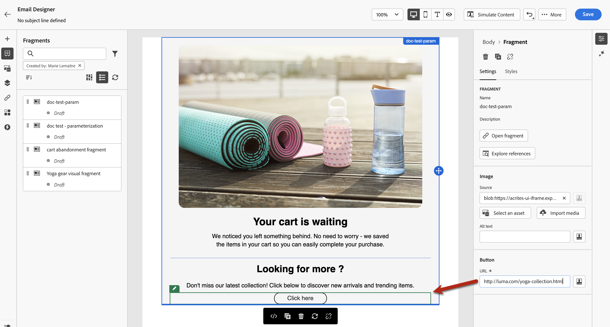

# Añadir fragmentos visuales a los correos electrónicos {#use-visual-fragments}

Un fragmento es un componente reutilizable al que se puede hacer referencia en uno o varios correos electrónicos en campañas de Journey Optimizer, recorridos o plantillas de contenido. Esta funcionalidad permite crear previamente varios bloques de contenido personalizados que los usuarios de marketing pueden utilizar para ensamblar rápidamente el contenido del correo electrónico en un proceso de diseño mejorado. [Aprenda a crear y administrar fragmentos](../content-management/fragments.md).

➡️ [Aprenda a administrar, crear y usar fragmentos en este vídeo](../content-management/fragments.md#video-fragments)

## Usar un fragmento {#use-fragment}

Para utilizar un fragmento en un correo electrónico, siga los pasos a continuación.

>[!NOTE]
>
>Puede añadir hasta 30 fragmentos en una entrega determinada. Los fragmentos solo se pueden anidar hasta 1 nivel.

1. Abra cualquier contenido de correo electrónico o plantilla con [Email Designer](get-started-email-design.md).

1. Seleccione el icono **[!UICONTROL Fragmentos]** del carril izquierdo.

   

1. Se muestra la lista de todos los fragmentos visuales creados en la zona protegida actual. Se ordenan por fecha de creación: los fragmentos visuales añadidos recientemente se muestran primero en la lista. Puede hacer lo siguiente:

   * Busque un fragmento específico escribiendo su etiqueta.
   * Ordene los fragmentos en orden ascendente o descendente.
   * Cambie la forma en que se muestran los fragmentos (tarjetas o vista de lista).
   * Actualice la lista.

   >[!NOTE]
   >
   >Si se han modificado o agregado fragmentos mientras edita el contenido, la lista se actualizará con los cambios más recientes.

1. Arrastre y suelte cualquier fragmento de la lista en el área en la que desee insertarlo.

   

   >[!CAUTION]
   >
   >Puede agregar cualquier fragmento de **Borrador** o **Activo** al contenido. Sin embargo, no podrá activar su recorrido o campaña si se está utilizando un fragmento con el estado Borrador. En el momento de la publicación del recorrido o de la campaña, los fragmentos de borrador mostrarán un error y deberá aprobarlos para poder publicarlos.

1. Al igual que cualquier otro componente, puede mover el fragmento por el contenido.

1. Seleccione el fragmento para mostrar el panel correspondiente a la derecha. Desde allí, puede eliminar el fragmento del contenido o duplicarlo. También puede realizar estas acciones directamente desde el menú contextual que se muestra sobre el fragmento.

   

1. En la ficha **[!UICONTROL Configuración]**, puede:

   * Elija los dispositivos en los que desea que se muestre el fragmento.
   * Abra el fragmento en una nueva pestaña para editarlo si es necesario. [Más información](../content-management/fragments.md#fragments)
   * Explore las referencias. [Más información](../content-management/fragments.md#visual-expression)

1. Puede personalizar aún más el fragmento mediante la ficha **[!UICONTROL Estilos]**.

1. Si es necesario, puede romper la herencia con el fragmento original. [Más información](#break-inheritance)

1. Agregue tantos fragmentos como desee y **[!UICONTROL guarde]** sus cambios.

## Uso de variables implícitas {#implicit-variables-in-fragments}

Las variables implícitas mejoran la funcionalidad de fragmento existente para mejorar la eficacia en los casos de uso de reutilización de contenido y scripts. Los fragmentos pueden utilizar variables de entrada y crear variables de salida utilizables en el contenido de la campaña y del recorrido.

Aprenda a utilizar variables implícitas en [esta sección](../personalization/use-expression-fragments.md#implicit-variables).

## Personalizar campos editables {#customize-fields}

Si algunas partes del fragmento seleccionado se han hecho editables, puede anular su valor predeterminado después de agregar el fragmento al contenido. [Aprenda a personalizar los fragmentos](../content-management/customizable-fragments.md)

Para personalizar los campos editables en un fragmento, siga estos pasos:

1. Añada el fragmento al contenido.

1. Selecciónelo para abrir el panel de propiedades en el lado derecho.

   Todos los campos editables del fragmento se muestran en la ficha **Configuración**, en la sección **Fragmento**.

1. Al seleccionar un campo editable en el panel derecho, se resalta en verde en el panel de vista previa central, lo que facilita la identificación de su ubicación en el contenido.

   En el ejemplo siguiente, se puede editar la imagen **source** y **texto alternativo**, así como el botón &quot;Hacer clic aquí&quot; **URL**.

   

## Romper herencia {#break-inheritance}

Al editar un fragmento visual, los cambios se sincronizan. Se propagan automáticamente a todos los recorridos o campañas en borrador o activos y a las plantillas de contenido que contengan ese fragmento.

Cuando se añaden a un correo electrónico o a una plantilla de contenido, los fragmentos se sincronizan de forma predeterminada. Sin embargo, puede romper la herencia del fragmento original. En ese caso, el contenido del fragmento se copia en el diseño actual y los cambios ya no se sincronizan.

Para interrumpir la herencia, siga los pasos a continuación:

1. Seleccione el fragmento.

1. Haga clic en el icono de desbloqueo de la barra de herramientas contextual.

   

1. Ese fragmento se convierte en un elemento independiente que ya no está vinculado al fragmento original. Edítela como cualquier otro componente de contenido en el contenido. [Más información](content-components.md)
