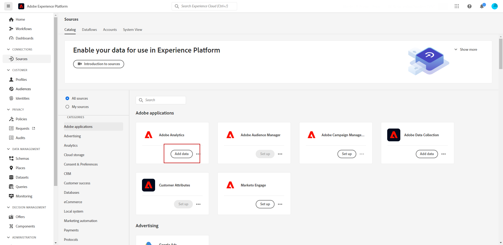
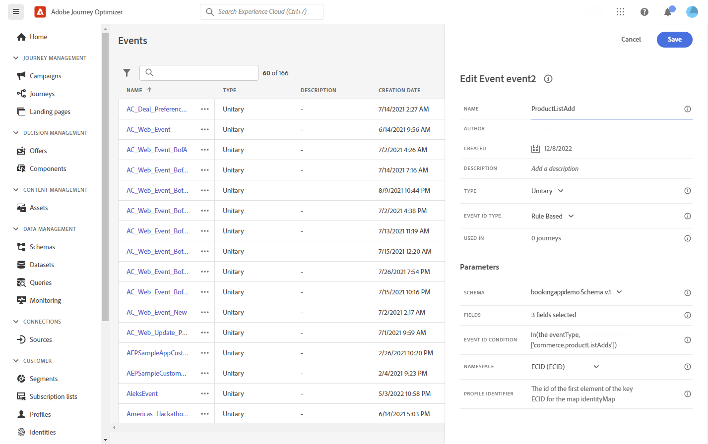

# Integración de Adobe Analytics {#analytics-data}

## Aprovechar los datos de Adobe Analytics o del SDK web {#leverage-analytics-data}

Puede aprovechar todos los datos de eventos de comportamiento web (a través de Adobe Analytics o SDK web) que ya está capturando y transmitiendo a Adobe Experience Platform para almacenar en déclencheur los recorridos y automatizar las experiencias para sus clientes.

>[!NOTE]
>
>Esta sección solo se aplica para eventos basados en reglas y clientes que necesitan utilizar datos de Adobe Analytics o WebSDK.

Para que esto funcione con Adobe Analytics, debe activar en Adobe Experience Platform el grupo de informes que desee utilizar. Para realizar esto, siga los pasos a continuación:

1. Conectarse a Adobe Experience Platform y navegar hasta **[!UICONTROL Fuentes]**.

1. En la sección Adobe Analytics , seleccione **[!UICONTROL Añadir datos]**

   

1. En la lista de grupos de informes de Adobe Analytics disponibles, seleccione la opción **[!UICONTROL Grupo de informes]** para habilitar. A continuación, haga clic en **[!UICONTROL Siguiente]**.

   

1. Elija si desea utilizar un esquema predeterminado o personalizado.

1. En el **[!UICONTROL Detalles de flujo de datos]** , elija un **[!UICONTROL Nombre de flujo de datos]**.

1. Una vez completada la configuración, haga clic en **[!UICONTROL Finalizar]**.

   

Esto habilita el conector de origen de Analytics para ese grupo de informes. Cada vez que entran los datos, estos se transforman en un evento de Experience y se envían a Adobe Experience Platform.

Obtenga más información sobre el conector de origen de Adobe Analytics en  [Documentación de Adobe Experience Platform](https://experienceleague.adobe.com/docs/experience-platform/sources/connectors/adobe-applications/analytics.html?lang=es){target=&quot;_blank&quot;} y [tutorial](https://experienceleague.adobe.com/docs/experience-platform/sources/ui-tutorials/create/adobe-applications/analytics.html?lang=es){target=&quot;_blank&quot;}.

## Creación de un recorrido con un evento mediante datos de Adobe Analytics o SDK web {#event-analytics}

Después de implementar la integración con Adobe Analytics con [Fuentes de Adobe Analytics](#leverage-analytics-data) o con la variable [SDK web de Adobe Experience Platform](https://experienceleague.adobe.com/docs/experience-platform/edge/home.html?lang=es), puede crear un evento que se pueda utilizar posteriormente en un recorrido.

En este ejemplo, nos dirigiremos a los usuarios que hayan agregado un producto al carro de compras:

* Si se completa el pedido, recibirán un correo electrónico de seguimiento dos días después para solicitar comentarios.
* Si el pedido no se completa, recibirá un mensaje de correo electrónico para recordarles que completen el pedido.

1. Desde Adobe Journey Optimizer, acceda a la **[!UICONTROL Configuración]** para abrir el Navegador.

1. A continuación, seleccione **[!UICONTROL Administrar]** de la variable **[!UICONTROL Eventos]** tarjeta.

   

1. Haga clic en **[!UICONTROL Crear evento]**. El panel de configuración de evento se abre en el lado derecho de la pantalla.

1. Complete la variable **[!UICONTROL Evento]** parámetros:

   * **[!UICONTROL Nombre]**: Personalice el nombre de su **[!UICONTROL Evento]**.
   * **[!UICONTROL Tipo]**: Elija la **[!UICONTROL Unitario]** Escriba. [Más información](../event/about-events.md)
   * **[!UICONTROL Tipo de ID de evento]**: Elija la **[!UICONTROL Basado en reglas]** Tipo de ID de evento. [Más información](../event/about-events.md#event-id-type)
   * **[!UICONTROL Esquema]**: Seleccione el esquema Analytics o WebSDK creado en la sección anterior.
   * **[!UICONTROL Campos]**: Seleccione los campos Carga útil . [Más información](../event/about-creating.md#define-the-payload-fields)
   * **[!UICONTROL Condición de ID de evento]**: Defina la condición que utilizará el sistema para identificar los eventos que déclencheur su recorrido.

      En este caso, el evento se activa cuando los clientes añaden un artículo al carro de compras.
   * **[!UICONTROL Identificador de perfil]**: Elija un campo de los campos de carga útil o defina una fórmula para identificar la persona asociada al evento.

   

1. Cuando esté configurado, seleccione **[!UICONTROL Guardar]**. El evento está listo para utilizarse en un recorrido.

1. En el **[!UICONTROL Recorridos]**, ahora puede empezar a crear su recorrido. Para obtener más información, consulte [esta sección](../building-journeys/journey-gs.md).

1. Añada los eventos de Analytics configurados anteriormente a su recorrido.

   

1. Añada un Evento que se activará si se completa un pedido.

1. Desde su **[!UICONTROL Menú Evento]**, seleccione **[!UICONTROL Definir el tiempo de espera del evento]** y **[!UICONTROL Establecer una ruta de tiempo de espera]** opciones.

   

1. Desde la ruta de tiempo de espera, agregue un **[!UICONTROL Correo electrónico]** acción. Esta ruta se utilizará para enviar un correo electrónico a los clientes que no hayan completado un pedido para recordarles que sus carros siguen disponibles.

1. Agregue un **[!UICONTROL Espera]** después de la ruta principal y configúrela en la duración necesaria.

   

1. A continuación, agregue un **[!UICONTROL Acción de correo electrónico]**. En este correo electrónico, se pedirá a los clientes que proporcionen comentarios sobre el pedido realizado.

Ahora puede publicar el recorrido después de probar su validez. [Más información](../building-journeys/publishing-the-journey.md)

