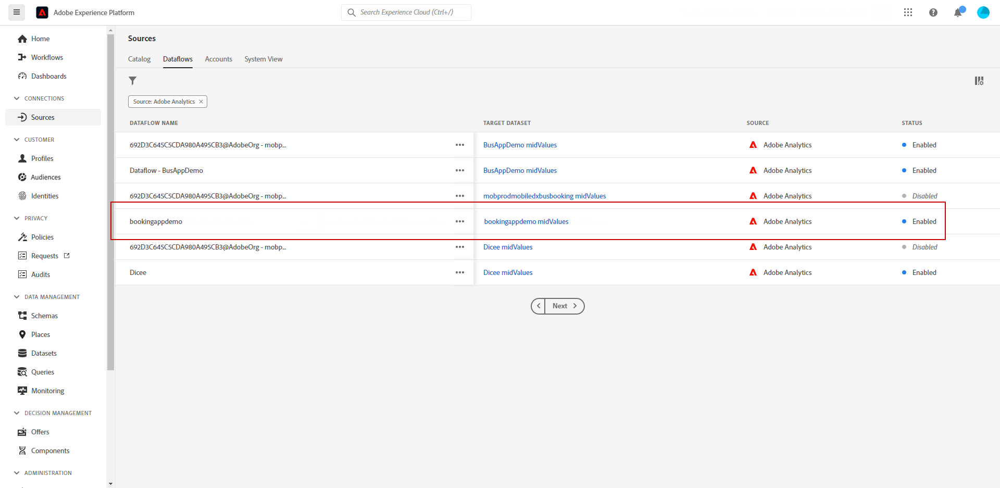

# Trabajar con datos de Adobe Analytics {#analytics-data}

Puede aprovechar todos los datos de evento de comportamiento web que ya está capturando a través de Adobe Analytics o Web SDK y transmitirlos a Adobe Experience Platform para almacenar en déclencheur los recorridos y automatizar las experiencias para sus clientes.

Para que esto funcione con Adobe Analytics, debe:

1. Active el grupo de informes que desee utilizar. [Más información](#leverage-analytics-data)
1. Habilite Journey Optimizer para utilizar la fuente de datos de Adobe Analytics. [Más información](#activate-analytics-data)
1. Añada un evento específico en el recorrido. [Más información](#event-analytic)

>[!NOTE]
>
>Esta sección solo se aplica a los eventos basados en reglas y a los clientes que necesitan utilizar datos de Adobe Analytics o Web SDK.
> 
>Si usa Adobe Customer Journey Analytics, consulte [esta página](../reports/cja-ajo.md).
>

## Configuración de datos de Adobe Analytics o Web SDK {#leverage-analytics-data}

Los datos procedentes de Adobe Analytics o Adobe Experience Platform Web SDK deben habilitarse para que se utilicen en los recorridos.

Para realizar esto, siga los pasos a continuación:

1. Vaya al menú **[!UICONTROL Orígenes]**.

1. En la sección Adobe Analytics, seleccione **[!UICONTROL Agregar datos]**

   

1. De la lista de grupos de informes de Adobe Analytics disponibles, seleccione el **[!UICONTROL grupo de informes]** que desea habilitar. A continuación, haga clic en **[!UICONTROL Siguiente]**.

   

1. Elija si desea utilizar un esquema predeterminado o personalizado.

1. En la pantalla **[!UICONTROL Detalles de flujo de datos]**, elija un **[!UICONTROL nombre de flujo de datos]**.

1. Una vez completada la configuración, haz clic en **[!UICONTROL Finalizar]**.

   

Esto habilita el conector de origen de Analytics para ese grupo de informes. Cada vez que llegan los datos, se transforman en un evento de Experience y se envían a Adobe Experience Platform.

Obtenga más información acerca del conector de origen de Adobe Analytics en [Documentación de Adobe Experience Platform](https://experienceleague.adobe.com/docs/experience-platform/sources/connectors/adobe-applications/analytics.html){target="_blank"} y [tutorial](https://experienceleague.adobe.com/docs/experience-platform/sources/ui-tutorials/create/adobe-applications/analytics.html){target="_blank"}.

## Activar esta configuración {#activate-analytics-data}

Una vez completada esta configuración, póngase en contacto con Adobe para permitir que su entorno de Journey Optimizer utilice esta fuente de datos. Este paso solo es necesario para las fuentes de datos de Adobe Analytics. Para realizar esto:

1. Obtenga el ID de la fuente de datos. Esta información está disponible en la interfaz de usuario: vaya a la fuente de datos que creó desde la ficha **Flujos de datos** del menú **Fuentes**. La forma más sencilla de encontrarlo es filtrar por fuentes de Adobe Analytics.
1. Póngase en contacto con el Servicio de atención al cliente de Adobe con los siguientes detalles:

   * Asunto: Habilitar eventos de Adobe Analytics para recorridos

   * Contenido: habilite mi entorno para utilizar eventos AA.

      * ID de organización: &quot;XXX@AdobeOrg&quot;

      * ID de fuente de datos: &quot;ID: xxxxx&quot;

1. Una vez que tenga la confirmación de que su entorno está listo, puede utilizar los datos de Adobe Analytics en sus recorridos.

## Creación de un recorrido con un evento mediante datos de Adobe Analytics o Web SDK {#event-analytics}

Ahora puede crear un evento basado en datos de Adobe Analytics o Adobe Experience Platform Web SDK para utilizarlo en un recorrido.

En el siguiente ejemplo, aprenda a segmentar usuarios que agregaron un producto a sus carros de compras:

* Si el pedido se completa, los usuarios reciben un correo electrónico de seguimiento dos días después para solicitar comentarios.
* Si el pedido no se ha completado, los usuarios recibirán un correo electrónico para recordarles que completen el pedido.

1. Desde Adobe Journey Optimizer, accede al menú **[!UICONTROL Configuración]**.

1. A continuación, selecciona **[!UICONTROL Administrar]** de la tarjeta **[!UICONTROL Eventos]**.

   

1. Haga clic en **[!UICONTROL Crear evento]**. El panel de configuración de evento se abre en el lado derecho de la pantalla.

1. Rellene los parámetros **[!UICONTROL Event]**:

   * **[!UICONTROL Nombre]**: Personaliza el nombre de tu **[!UICONTROL Evento]**.
   * **[!UICONTROL Tipo]**: elija el tipo **[!UICONTROL Unitario]**. [Más información](../event/about-events.md)
   * **[!UICONTROL Tipo de ID de evento]**: elija el tipo de ID de evento **[!UICONTROL basado en reglas]**. [Más información](../event/about-events.md#event-id-type)
   * **[!UICONTROL Esquema]**: seleccione el esquema de Analytics o WebSDK [creado antes de](#leverage-analytics-data).
   * **[!UICONTROL Campos]**: Seleccione los campos Carga útil. [Más información](../event/about-creating.md#define-the-payload-fields)
   * **[!UICONTROL Condición de ID de evento]**: defina la condición para identificar los eventos que almacenarán en déclencheur su recorrido.

     En este caso, el Evento se activa cuando los clientes agregan un artículo a sus carros de compras.
   * **[!UICONTROL Identificador de perfil]**: elige un campo de los campos de carga útil o define una fórmula para identificar a la persona asociada al evento.

   

1. Cuando esté configurado, seleccione **[!UICONTROL Guardar]**.

Ahora que el evento está listo, cree un recorrido para utilizarlo.

1. En el menú **[!UICONTROL Recorridos]**, abra o cree un recorrido. Para obtener más información, consulte [esta sección](../building-journeys/journey-gs.md).

1. Añada el evento de Analytics configurado anteriormente en el recorrido.

   

1. Añada un evento que se activará si se completa una solicitud.

1. En el **[!UICONTROL menú Evento]**, seleccione las opciones **[!UICONTROL Definir el tiempo de espera del evento]** y **[!UICONTROL Establecer una ruta de tiempo de espera]**.

   

1. En la ruta de tiempo de espera, agregue una acción **[!UICONTROL Correo electrónico]**. Esta ruta se utilizará para enviar un correo electrónico a los clientes que no hayan completado una solicitud para recordarles que sus carros de compras aún están disponibles.

1. Agregue una actividad **[!UICONTROL Wait]** después de la ruta principal y establézcala a la duración necesaria.

   

1. A continuación, agregue una **[!UICONTROL acción de correo electrónico]**. En este correo electrónico, se solicitará a los clientes que envíen comentarios sobre el pedido realizado.

Ahora puede probar y publicar el recorrido. [Más información](../building-journeys/publish-journey.md)

