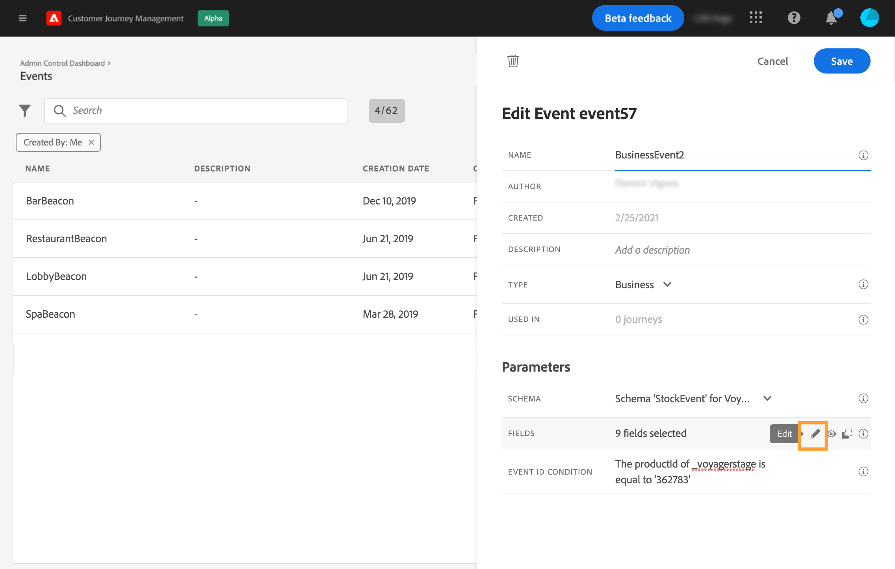
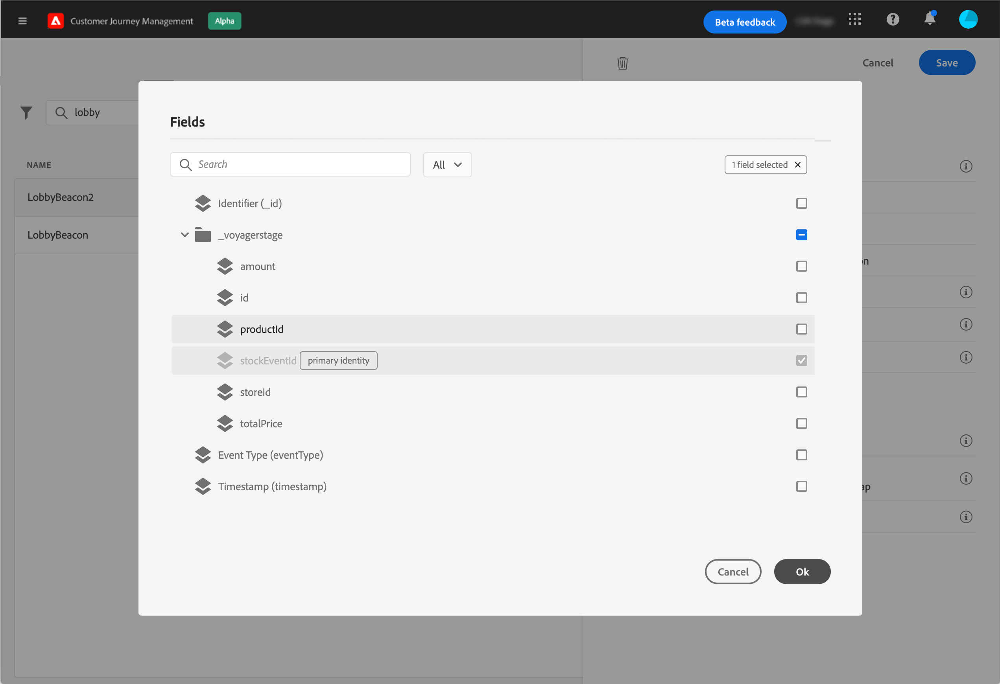

# Configuración de un evento empresarial {#configure-a-business-event}

A diferencia de los eventos unitarios, los eventos comerciales no están vinculados a un perfil específico. El tipo de ID de evento siempre se basa en reglas. Obtenga más información sobre los eventos empresariales en [esta sección](../event/about-events.md).

Los recorridos basados en segmentos de lectura se pueden activar en una sola toma, por un programador de forma regular o por un evento comercial, cuando se produce el evento.

Los eventos comerciales pueden ser &quot;un producto vuelve a estar en existencias&quot;, &quot;el precio de las acciones de una empresa alcanza cierto valor&quot;, etc.

>[!NOTE]
>
>También puede ver el caso de uso de evento empresarial [tutorial](https://experienceleague.adobe.com/docs/journey-optimizer-learn/tutorials/create-journeys/use-case-business-event.html).

## Notas importantes {#important-notes}

* Solo están disponibles los esquemas de series temporales. Los esquemas de eventos de experiencia, eventos de decisión y eventos de paso de Recorrido no están disponibles. El esquema de evento debe contener una identidad principal. Los campos siguientes deben definirse según sea necesario: `_id` y `timestamp`
* Los eventos comerciales solo se pueden eliminar como el primer paso de un recorrido.
* Al soltar un evento empresarial como el primer paso de un recorrido, el tipo de programador del recorrido será &quot;evento empresarial&quot;.
* Solo se puede perder una actividad de segmento de lectura después de un evento comercial. Se añade automáticamente como el siguiente paso.
* Para permitir varias ejecuciones de eventos empresariales, active la opción correspondiente en la **[!UICONTROL Execution]** de las propiedades del recorrido.
* Una vez activado un evento empresarial, se producirá un retraso para que el segmento se exporte de 15 minutos a una hora.
* Al probar un evento comercial, debe pasar los parámetros de evento y el identificador del perfil de prueba que va a introducir el recorrido en la prueba. Además, al probar un recorrido basado en eventos empresariales, solo puede almacenar en déclencheur la entrada de perfil único. Consulte [esta sección](../building-journeys/testing-the-journey.md#test-business). En el modo de prueba, no hay ningún modo &quot;Vista de código&quot; disponible.
* ¿Qué les sucede a las personas que están actualmente en el recorrido si llega un nuevo evento de negocios? Se comporta de la misma manera que cuando las personas siguen en un recorrido recurrente cuando ocurre una nueva recurrencia. Su camino ha terminado. Como resultado, los especialistas en marketing deben prestar atención para evitar generar recorridos demasiado largos si esperan eventos comerciales frecuentes.

## Varios eventos comerciales {#multiple-business-events}

Estas son algunas notas importantes que se aplican cuando se reciben varios eventos comerciales seguidos.

**¿Cuál es el comportamiento al recibir un evento comercial mientras el recorrido se está procesando?**

Los eventos comerciales siguen las reglas de reentrada de la misma manera que para los eventos unitarios. Si un recorrido permite la reentrada, se procesará el siguiente evento comercial.

**¿Cuáles son las barreras para evitar la sobrecarga de segmentos materializados?**

En el caso de los eventos empresariales sin conexión, para un recorrido determinado, los datos impulsados por el primer trabajo de evento se reutilizan durante un periodo de tiempo de 1 hora. No hay protección para los recorridos programados. Obtenga más información sobre los segmentos en la [Documentación del servicio de segmentación de Adobe Experience Platform](https://experienceleague.adobe.com/docs/experience-platform/segmentation/home.html).

## Introducción a los eventos empresariales {#gs-business-events}

Estos son los primeros pasos para configurar un evento empresarial:

1. En la sección del menú ADMINISTRACIÓN , seleccione **[!UICONTROL Configurations]**. En el  **[!UICONTROL Events]** , haga clic en **[!UICONTROL Manage]**. Se muestra la lista de eventos.

   

1. Haga clic en **[!UICONTROL Create Event]** para crear un nuevo evento. El panel de configuración de evento se abre en el lado derecho de la pantalla.

   

1. Introduzca el nombre del evento. También puede agregar una descripción.

   

   >[!NOTE]
   >
   >No utilice espacios ni caracteres especiales. No utilice más de 30 caracteres.

1. En el **[!UICONTROL Type]** , elija **Empresa**.

   

1. El número de recorridos que utiliza este evento se muestra en el campo **[!UICONTROL Used in]**. Puede hacer clic en el icono **[!UICONTROL View journeys]** para mostrar la lista de los recorridos con este evento.

1. Defina los campos esquema y carga útil: aquí es donde selecciona la información de evento (generalmente denominada carga útil) que los recorridos esperan recibir. Podrá utilizar esta información en su recorrido. Consulte [esta sección](../event/about-creating-business.md#define-the-payload-fields).

   

   Solo están disponibles los esquemas de series temporales. Los esquemas de eventos de experiencia, eventos de decisión y eventos de paso de Recorrido no están disponibles. El esquema de evento debe contener una identidad principal. Los campos siguientes deben definirse según sea necesario: `_id` y `timestamp`

   

1. Haga clic dentro del **[!UICONTROL Event ID condition]** campo . Con el editor de expresiones simple, defina la condición que utilizará el sistema para identificar los eventos que van a almacenar en déclencheur el recorrido.
   

   En nuestro ejemplo, escribimos una condición basada en el ID del producto. Esto significa que, cada vez que el sistema recibe un evento que coincide con esta condición, lo pasa a los recorridos.

   >[!NOTE]
   >
   >En el editor de expresiones simple, no todos los operadores están disponibles, dependen del tipo de datos. Por ejemplo, para un tipo de cadena de campo, puede utilizar &quot;contiene&quot; o &quot;igual a&quot;.

1. Haga clic en **[!UICONTROL Save]**.

   

   El evento está ahora configurado y listo para añadirse a un recorrido. Se requieren pasos de configuración adicionales para recibir eventos. Consulte [esta página](../event/additional-steps-to-send-events-to-journey-orchestration.md).

## Definición de los campos de carga útil {#define-the-payload-fields}

La definición de carga útil permite elegir la información que el sistema espera recibir del evento en el recorrido y la clave para identificar qué persona está asociada al evento. La carga útil se basa en la definición del campo XDM del Experience Cloud. Para obtener más información sobre XDM, consulte [Documentación de Adobe Experience Platform](https://experienceleague.adobe.com/docs/experience-platform/xdm/home.html){target=&quot;_blank&quot;}.

1. Seleccione un esquema XDM de la lista y haga clic en el **[!UICONTROL Fields]** o en el **[!UICONTROL Edit]** icono.

   

   Se muestran todos los campos definidos en el esquema . La lista de campos varía de un esquema a otro. Puede buscar un campo específico o utilizar los filtros para mostrar todos los nodos y campos o solo los campos seleccionados. Según la definición del esquema, algunos campos pueden ser obligatorios y estar preseleccionados. No puede desseleccionarlos. Todos los campos obligatorios para que los recorridos reciban el evento correctamente están seleccionados de forma predeterminada.

   

   >[!NOTE]
   >
   > Asegúrese de que los campos siguientes estén seleccionados: `_id` y `timestamp`

1. Seleccione los campos que espera recibir del evento. Estos son los campos que el usuario empresarial aprovechará en el recorrido.

1. Cuando haya terminado de seleccionar los campos necesarios, haga clic en **[!UICONTROL Save]** o presione **[!UICONTROL Enter]**.

   El número de campos seleccionados aparece en el **[!UICONTROL Fields]** campo .

   

## Vista previa de la carga útil {#preview-the-payload}

La previsualización de carga útil permite validar la definición de carga útil.

1. Haga clic en el **[!UICONTROL View Payload]** para obtener una vista previa de la carga útil esperada por el sistema.

   

   Puede observar que se muestran los campos seleccionados.

   

1. Compruebe la previsualización para validar la definición de carga útil.

1. A continuación, puede compartir la previsualización de la carga útil con la persona responsable del envío del evento. Esta carga útil puede ayudarles a diseñar la configuración de un evento que se esté insertando en [!DNL Journey Optimizer]. Consulte [esta página](../event/additional-steps-to-send-events-to-journey-orchestration.md).
