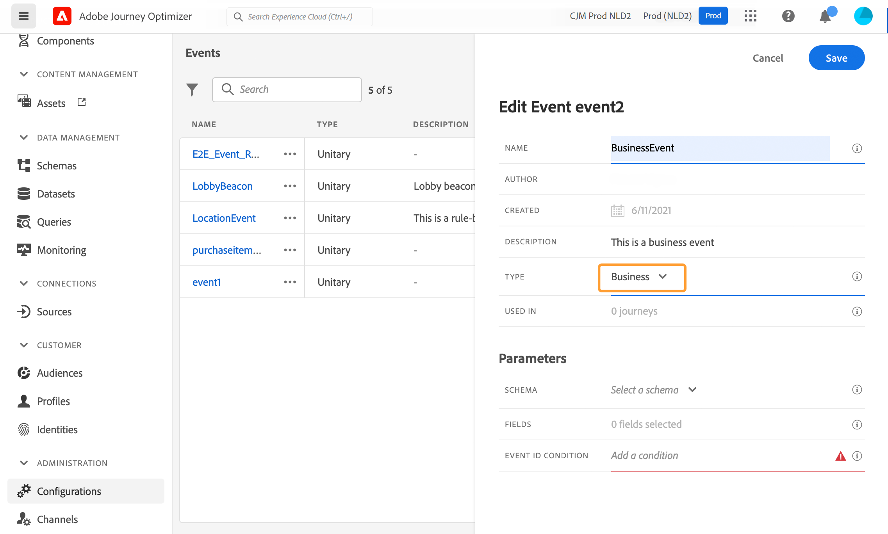
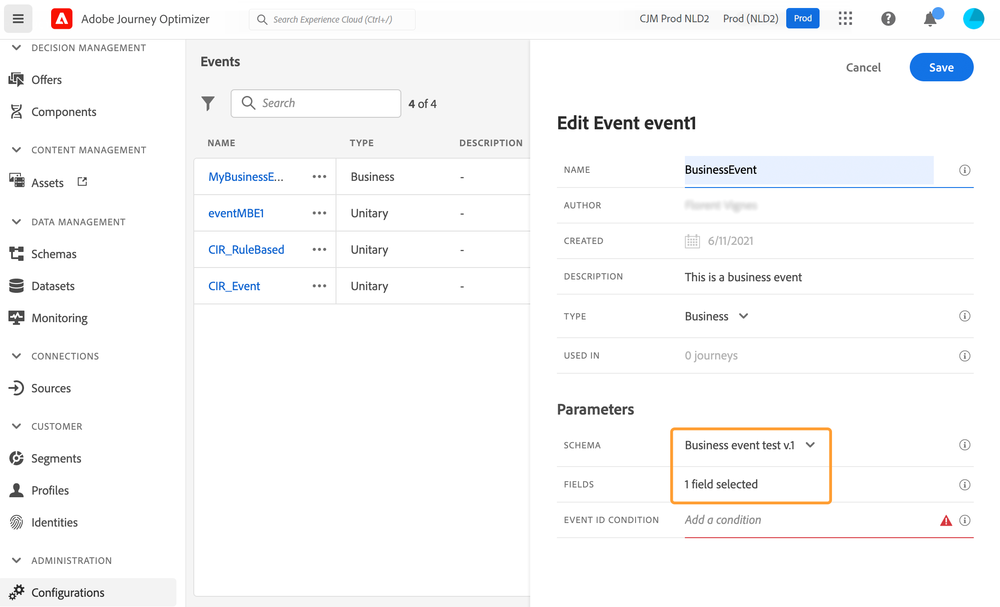

# Configuración de un evento empresarial {#configure-a-business-event}

>[!CONTEXTUALHELP]
>id="ajo_journey_event_business"
>title="Eventos empresariales"
>abstract="La configuración de evento permite definir la información que Journey Optimizer recibirá como eventos. Puede utilizar varios eventos (en diferentes pasos de un recorrido) y varios recorridos pueden utilizar el mismo evento. A diferencia de los eventos unitarios, los eventos empresariales no están vinculados a un perfil específico. El tipo de ID de evento siempre se basa en reglas."

A diferencia de los eventos unitarios, los eventos empresariales no están vinculados a un perfil específico. El tipo de ID de evento siempre se basa en reglas. Obtenga más información sobre los eventos empresariales en [esta sección](../event/about-events.md).

Los recorridos basados en audiencias de lectura se pueden activar de una sola vez, mediante un planificador de forma regular o mediante un evento empresarial, cuando se produce el evento.

Los eventos empresariales pueden ser &quot;un producto vuelve a estar en stock&quot;, &quot;el precio de las acciones de una empresa alcanza un determinado valor&quot;, etc.

>[!NOTE]
>
>También puede ver el caso de uso de evento empresarial [tutorial](https://experienceleague.adobe.com/docs/journey-optimizer-learn/tutorials/create-journeys/use-case-business-event.html). Tenga en cuenta que no es necesario habilitar el esquema para el perfil.

## Notas importantes {#important-notes}

* Solo están disponibles los esquemas de series temporales. Los esquemas Eventos de experiencia, Eventos de decisión y Eventos de paso de Recorrido no están disponibles.
* El esquema de evento debe contener una identidad principal no basada en personas. Se deben seleccionar los campos siguientes al definir el evento: `_id` y `timestamp`
* Los eventos empresariales solo se pueden eliminar como primer paso de un recorrido.
* Al eliminar un evento empresarial como primer paso de un recorrido, el tipo de programador del recorrido será &quot;evento empresarial&quot;.
* Solo se puede eliminar una actividad de audiencia de lectura después de un evento empresarial. Se añade automáticamente como el siguiente paso.
* Para permitir varias ejecuciones de eventos empresariales, active la opción correspondiente en la sección **[!UICONTROL Execution]** de las propiedades del recorrido.
* Después de activarse un evento empresarial, se producirá un retraso para exportar la audiencia de 15 minutos a hasta una hora.
* Al probar un evento empresarial, debe pasar los parámetros de evento y el identificador del perfil de prueba que va a introducir el recorrido en la prueba. Además, al probar un recorrido basado en eventos empresariales, solo puede almacenar en déclencheur una entrada de perfil única. Ver [esta sección](../building-journeys/testing-the-journey.md#test-business). En el modo de prueba, no hay disponible el modo &quot;Vista de código&quot;.
* ¿Qué les sucede a las personas que están actualmente en el recorrido si llega un nuevo evento empresarial? Se comporta de la misma manera que cuando los individuos siguen en un recorrido recurrente cuando ocurre una nueva recurrencia. Su camino ha terminado. Como resultado, los especialistas en marketing deben prestar atención para evitar crear recorridos demasiado largos si esperan eventos comerciales frecuentes.
* Los eventos empresariales no se pueden usar junto con eventos unitarios o actividades de calificación de público.

## Varios eventos empresariales {#multiple-business-events}

Estas son algunas notas importantes que se aplican cuando se reciben varios eventos empresariales seguidos.

**¿Cuál es el comportamiento al recibir un evento empresarial mientras se procesa el recorrido?**

Los eventos empresariales siguen las reglas de reentrada del mismo modo que para los eventos unitarios. Si un recorrido permite la reentrada, se procesará el siguiente evento empresarial.

**¿Cuáles son las protecciones para evitar la sobrecarga de audiencias materializadas?**

En el caso de eventos empresariales puntuales, para un recorrido determinado, los datos insertados por el primer trabajo de evento se reutilizan durante un periodo de tiempo de 1 hora. Para los recorridos programados, no hay ninguna protección. Obtenga más información acerca de las audiencias en la [documentación del servicio de segmentación de Adobe Experience Platform](https://experienceleague.adobe.com/docs/experience-platform/segmentation/home.html?lang=es).

## Introducción a los eventos empresariales {#gs-business-events}

Estos son los primeros pasos para configurar un evento empresarial:

1. En la sección del menú ADMINISTRACIÓN, seleccione **[!UICONTROL Configuraciones]**. En la sección **[!UICONTROL Eventos]**, haga clic en **[!UICONTROL Administrar]**. Se muestra la lista de eventos.

   

1. Haga clic en **[!UICONTROL Crear evento]** para crear un nuevo evento. El panel de configuración de evento se abre en el lado derecho de la pantalla.

   

1. Introduzca el nombre del evento. También puede añadir una descripción.

   

   >[!NOTE]
   >
   >Solo se permiten caracteres alfanuméricos y guiones bajos. La longitud máxima es de 30 caracteres.

1. En el campo **[!UICONTROL Tipo]**, elija **Empresa**.

   

1. El número de recorridos que usa este evento se muestra en el campo **[!UICONTROL Utilizado en]**. Puede hacer clic en el icono **[!UICONTROL Ver recorridos]** para mostrar la lista de recorridos con este evento.

1. Defina los campos esquema y carga útil: aquí es donde selecciona la información de evento (o carga útil) que recorrido espera recibir. Esta información se utilizará más adelante en el recorrido. Consulte [esta sección](../event/about-creating-business.md#define-the-payload-fields).

   

   Solo están disponibles los esquemas de series temporales. Los esquemas `Experience Events`, `Decision Events` y `Journey Step Events` no están disponibles. El esquema de evento debe contener una identidad principal no basada en personas. Se deben seleccionar los campos siguientes al definir el evento: `_id` y `timestamp`

   

1. Haga clic dentro del campo **[!UICONTROL ID de evento]**. Utilice el editor de expresiones simple para definir la condición que utiliza el sistema para identificar los eventos que almacenan en déclencheur el recorrido.

   

   En nuestro ejemplo, escribimos una condición basada en el ID del producto. Esto significa que, siempre que el sistema reciba un evento que coincida con esta condición, lo pasará a los recorridos.

   >[!NOTE]
   >
   >En el editor de expresiones simple, no todos los operadores están disponibles, sino que dependen del tipo de datos. Por ejemplo, para un tipo de cadena de campo, puede utilizar &quot;contiene&quot; o &quot;es igual a&quot;.

1. Haga clic en **[!UICONTROL Guardar]**.

   

   El evento está ahora configurado y listo para añadirse a un recorrido. Se requieren pasos de configuración adicionales para recibir eventos. Obtenga más información en [esta página](../event/additional-steps-to-send-events-to-journey.md).

## Definición de los campos de carga útil {#define-the-payload-fields}

La definición de carga útil permite elegir la información que el sistema espera recibir del evento en su recorrido y la clave para identificar a qué persona está asociada al evento. La carga útil se basa en la definición del campo XDM de Experience Cloud. Para obtener más información sobre XDM, consulte [Documentación de Adobe Experience Platform](https://experienceleague.adobe.com/docs/experience-platform/xdm/home.html?lang=es){target="_blank"}.

1. Seleccione un esquema XDM de la lista y haga clic en el campo **[!UICONTROL Campos]** o en el icono **[!UICONTROL Editar]**.

   

   Se muestran todos los campos definidos en el esquema. La lista de campos varía según el esquema. Puede buscar un campo específico o utilizar los filtros para mostrar todos los nodos y campos o solo los campos seleccionados. Según la definición del esquema, algunos campos pueden ser obligatorios y preseleccionados. No puede anular su selección. Todos los campos obligatorios para que los recorridos reciban el evento correctamente están seleccionados de forma predeterminada.

   

   >[!NOTE]
   >
   > Asegúrese de que los campos siguientes estén seleccionados: `_id` y `timestamp`

1. Seleccione los campos que espera recibir del evento. Estos son los campos que el usuario empresarial aprovechará en el recorrido.

1. Cuando termine de seleccionar los campos necesarios, haga clic en **[!UICONTROL Guardar]** o presione **[!UICONTROL Entrar]**.

   El número de campos seleccionados aparece en **[!UICONTROL Campos]**.

   

## Previsualización de la carga útil {#preview-the-payload}

Utilice la previsualización de carga útil para validar la definición de carga útil.

1. Haga clic en el icono **[!UICONTROL Ver carga útil]** para previsualizar la carga útil esperada por el sistema.

   

   Puede observar que se muestran los campos seleccionados.

   

1. Compruebe la previsualización para validar la definición de carga útil.

1. A continuación, puede compartir la previsualización de carga útil con la persona responsable del envío del evento. Esta carga útil puede ayudarles a diseñar la configuración de un evento que inserte [!DNL Journey Optimizer]. Consulte [esta página](../event/additional-steps-to-send-events-to-journey.md).
